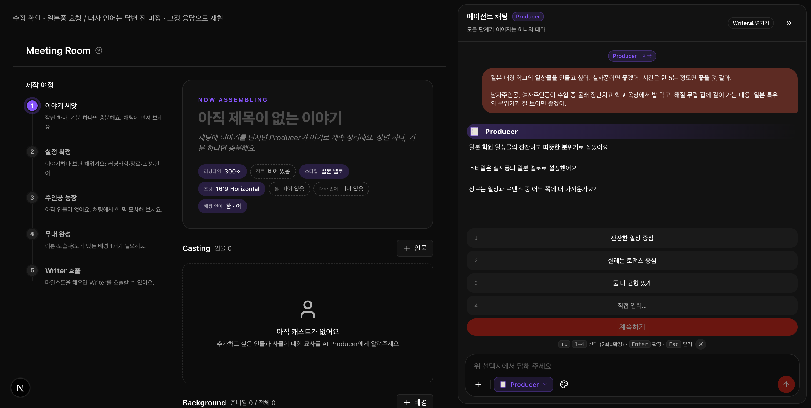

# Producer 채팅 수정 확인

## 바뀐 경험

- 채팅에서 장르를 묻는 중에는 별도의 스타일 확정 안내가 대화와 선택지를 가리지 않습니다.
- 일본풍·학교 배경·사용자가 쓴 언어만으로 대사 언어를 확정하지 않습니다. 미정으로 두고 채팅에서 확인합니다.
- 이미 정한 대사 언어는 유지하고, 명확한 요청이나 대사 언어 질문에 대한 답을 받아 바꿉니다.
- 거절·참고 작품 설명·간판이나 자막에 관한 말을 대사 언어 변경으로 처리하지 않습니다.
- 그림체 변경 위치는 “스타일 피커” 대신 “채팅 입력창 아래의 팔레트 아이콘”이라고 안내합니다.

## 원인과 수정

채팅이 스타일을 반영하면 화면의 스타일 변경 감시도 작동해 별도 안내를 띄웠습니다. 이 안내가 장르 선택지를 밀어냈습니다. 이제 직접 스타일을 고르는 행동에서만 남은 정보를 안내합니다.

대사 언어는 AI가 추측한 값이 그대로 저장됐습니다. 추정 기본값과 그 기본값을 보여주던 답변 예시를 제거했습니다. 사용자가 정하지 않은 언어는 AI가 출력하더라도 설정에 반영하지 않습니다.

## 화면 확인

실제 화면 구성과 설정 판정을 사용하되, 응답 문구는 고정한 로컬 재현입니다. 새 AI 응답의 품질을 평가한 화면은 아닙니다.

확인: 대사 언어 비어 있음, 장르 선택지 유지, 중복 스타일 확정 안내 없음, 별도 나중에 버튼 없음.

## 검증 범위

새 채팅의 설정 반영과 화면 안내를 검사했습니다. 제공된 운영 프로젝트는 화면과 해당 채팅 기록을 조회해 원인을 확인했습니다. 과거에 저장된 프로젝트 설정의 일괄 변경은 포함하지 않습니다.

## 약속과 필요한 이유

- 일본풍을 요청해도 대사 언어를 일본어로 임의 확정하지 않는다
  - 왜: 사용자가 고른 내용만 확정하고, 질문과 답변이 다른 안내에 가려지지 않도록 지키는 검사입니다.
- 이미 고른 대사 언어는 분위기 요청이나 채팅 언어 변경으로 덮어쓰지 않는다
  - 왜: 사용자가 고른 내용만 확정하고, 질문과 답변이 다른 안내에 가려지지 않도록 지키는 검사입니다.
- 대사를 일본어로 해 달라고 명시하면 한국어 채팅에서도 일본어 대사를 적용한다
  - 왜: 사용자가 고른 내용만 확정하고, 질문과 답변이 다른 안내에 가려지지 않도록 지키는 검사입니다.
- 일본풍을 요청해도 대사 언어를 일본어로 임의 확정하지 않는다
  - 왜: 사용자가 고른 내용만 확정하고, 질문과 답변이 다른 안내에 가려지지 않도록 지키는 검사입니다.
- 영어로 일본 배경을 요청해도 대사 언어를 임의 확정하지 않는다
  - 왜: 사용자가 고른 내용만 확정하고, 질문과 답변이 다른 안내에 가려지지 않도록 지키는 검사입니다.
- 언어를 고르지 않은 첫 답변은 대사 언어를 비워 둔다
  - 왜: 사용자가 고른 내용만 확정하고, 질문과 답변이 다른 안내에 가려지지 않도록 지키는 검사입니다.
- 이미 정한 대사 언어는 다른 언어로 기획해도 유지한다
  - 왜: 사용자가 고른 내용만 확정하고, 질문과 답변이 다른 안내에 가려지지 않도록 지키는 검사입니다.
- 대사 언어를 명시한 요청 “대사는 일본어로 해줘”이면 그 언어를 적용한다
  - 왜: 사용자가 고른 내용만 확정하고, 질문과 답변이 다른 안내에 가려지지 않도록 지키는 검사입니다.
- 대사 언어를 명시한 요청 “일본어 대사로 해줘”이면 그 언어를 적용한다
  - 왜: 사용자가 고른 내용만 확정하고, 질문과 답변이 다른 안내에 가려지지 않도록 지키는 검사입니다.
- 대사 언어를 명시한 요청 “대사 언어는 일본어”이면 그 언어를 적용한다
  - 왜: 사용자가 고른 내용만 확정하고, 질문과 답변이 다른 안내에 가려지지 않도록 지키는 검사입니다.
- 대사 언어를 명시한 요청 “등장인물들은 일본어로 말하게 해줘”이면 그 언어를 적용한다
  - 왜: 사용자가 고른 내용만 확정하고, 질문과 답변이 다른 안내에 가려지지 않도록 지키는 검사입니다.
- 대사 언어를 명시한 요청 “대사 언어를 한국어로 바꿔줘”이면 그 언어를 적용한다
  - 왜: 사용자가 고른 내용만 확정하고, 질문과 답변이 다른 안내에 가려지지 않도록 지키는 검사입니다.
- 대사 언어를 명시한 요청 “내레이션은 중국어로 부탁해”이면 그 언어를 적용한다
  - 왜: 사용자가 고른 내용만 확정하고, 질문과 답변이 다른 안내에 가려지지 않도록 지키는 검사입니다.
- 대사 언어를 명시한 요청 “Use English for the dialogue”이면 그 언어를 적용한다
  - 왜: 사용자가 고른 내용만 확정하고, 질문과 답변이 다른 안내에 가려지지 않도록 지키는 검사입니다.
- 대사 언어를 명시한 요청 “Make the dialogue Japanese”이면 그 언어를 적용한다
  - 왜: 사용자가 고른 내용만 확정하고, 질문과 답변이 다른 안내에 가려지지 않도록 지키는 검사입니다.
- 대사 언어를 묻는 직전 질문에는 짧게 언어만 답해도 적용한다
  - 왜: 사용자가 고른 내용만 확정하고, 질문과 답변이 다른 안내에 가려지지 않도록 지키는 검사입니다.
- 대사 언어 질문에 “한국어로 해줘”라고 답하면 사용자의 언어 선택을 적용한다
  - 왜: 사용자가 고른 내용만 확정하고, 질문과 답변이 다른 안내에 가려지지 않도록 지키는 검사입니다.
- 대사 언어 질문에 “일본어로 부탁해”라고 답하면 사용자의 언어 선택을 적용한다
  - 왜: 사용자가 고른 내용만 확정하고, 질문과 답변이 다른 안내에 가려지지 않도록 지키는 검사입니다.
- 대사 언어 변경 요청이 아닌 “일본어 간판이 보이는 학교에서 대화하는 장면”이면 기존 선택을 지킨다
  - 왜: 사용자가 고른 내용만 확정하고, 질문과 답변이 다른 안내에 가려지지 않도록 지키는 검사입니다.
- 대사 언어 변경 요청이 아닌 “대사에 일본어 표현이 있으면 좋겠어”이면 기존 선택을 지킨다
  - 왜: 사용자가 고른 내용만 확정하고, 질문과 답변이 다른 안내에 가려지지 않도록 지키는 검사입니다.
- 대사 언어 변경 요청이 아닌 “대사는 일본어로 하지 마”이면 기존 선택을 지킨다
  - 왜: 사용자가 고른 내용만 확정하고, 질문과 답변이 다른 안내에 가려지지 않도록 지키는 검사입니다.
- 대사 언어 변경 요청이 아닌 “대사는 일본어로는 하지 말아줘”이면 기존 선택을 지킨다
  - 왜: 사용자가 고른 내용만 확정하고, 질문과 답변이 다른 안내에 가려지지 않도록 지키는 검사입니다.
- 대사 언어 변경 요청이 아닌 “대사는 일본어로 하면 안 돼”이면 기존 선택을 지킨다
  - 왜: 사용자가 고른 내용만 확정하고, 질문과 답변이 다른 안내에 가려지지 않도록 지키는 검사입니다.
- 대사 언어 변경 요청이 아닌 “대사는 일본어로 할 필요 없어”이면 기존 선택을 지킨다
  - 왜: 사용자가 고른 내용만 확정하고, 질문과 답변이 다른 안내에 가려지지 않도록 지키는 검사입니다.
- 대사 언어 변경 요청이 아닌 “일본어 대사는 쓰지 마”이면 기존 선택을 지킨다
  - 왜: 사용자가 고른 내용만 확정하고, 질문과 답변이 다른 안내에 가려지지 않도록 지키는 검사입니다.
- 대사 언어 변경 요청이 아닌 “대사는 없고 학교 간판만 일본어로 해줘”이면 기존 선택을 지킨다
  - 왜: 사용자가 고른 내용만 확정하고, 질문과 답변이 다른 안내에 가려지지 않도록 지키는 검사입니다.
- 대사 언어 변경 요청이 아닌 “일본어 대사가 어울릴까?”이면 기존 선택을 지킨다
  - 왜: 사용자가 고른 내용만 확정하고, 질문과 답변이 다른 안내에 가려지지 않도록 지키는 검사입니다.
- 대사 언어 변경 요청이 아닌 “Would Japanese dialogue fit the setting?”이면 기존 선택을 지킨다
  - 왜: 사용자가 고른 내용만 확정하고, 질문과 답변이 다른 안내에 가려지지 않도록 지키는 검사입니다.
- 대사 언어 변경 요청이 아닌 “The reference film has Japanese dialogue”이면 기존 선택을 지킨다
  - 왜: 사용자가 고른 내용만 확정하고, 질문과 답변이 다른 안내에 가려지지 않도록 지키는 검사입니다.
- 대사 언어 변경 요청이 아닌 “Should I use Japanese dialogue?”이면 기존 선택을 지킨다
  - 왜: 사용자가 고른 내용만 확정하고, 질문과 답변이 다른 안내에 가려지지 않도록 지키는 검사입니다.
- 대사 언어 변경 요청이 아닌 “I want the visual style of a movie that has Japanese dialogue”이면 기존 선택을 지킨다
  - 왜: 사용자가 고른 내용만 확정하고, 질문과 답변이 다른 안내에 가려지지 않도록 지키는 검사입니다.
- 대사 언어 변경 요청이 아닌 “채팅은 영어로 말해줘”이면 기존 선택을 지킨다
  - 왜: 사용자가 고른 내용만 확정하고, 질문과 답변이 다른 안내에 가려지지 않도록 지키는 검사입니다.
- 대사 언어 변경 요청이 아닌 “Use Japanese subtitles with Korean dialogue”이면 기존 선택을 지킨다
  - 왜: 사용자가 고른 내용만 확정하고, 질문과 답변이 다른 안내에 가려지지 않도록 지키는 검사입니다.
- 일본어 대신 한국어 대사를 요청하면 거절한 언어를 적용하지 않는다
  - 왜: 사용자가 고른 내용만 확정하고, 질문과 답변이 다른 안내에 가려지지 않도록 지키는 검사입니다.
- 마지막 질문이 간판 언어를 물었으면 짧은 언어 답변으로 대사 언어를 바꾸지 않는다
  - 왜: 사용자가 고른 내용만 확정하고, 질문과 답변이 다른 안내에 가려지지 않도록 지키는 검사입니다.
- 대사 언어 제안 “대사는 한국어로 할까요?”에 “응”라고 동의하면 그 언어를 확정한다
  - 왜: 사용자가 고른 내용만 확정하고, 질문과 답변이 다른 안내에 가려지지 않도록 지키는 검사입니다.
- 대사 언어 제안 “대사는 일본어로 할까요?”에 “네”라고 동의하면 그 언어를 확정한다
  - 왜: 사용자가 고른 내용만 확정하고, 질문과 답변이 다른 안내에 가려지지 않도록 지키는 검사입니다.
- 대사 언어 제안 “Should we use English for the dialogue?”에 “yes”라고 동의하면 그 언어를 확정한다
  - 왜: 사용자가 고른 내용만 확정하고, 질문과 답변이 다른 안내에 가려지지 않도록 지키는 검사입니다.
- “대사는 한국어로 할까요, 일본어로 할까요?”에 동의만 했으면 대사 언어를 임의 확정하지 않는다
  - 왜: 사용자가 고른 내용만 확정하고, 질문과 답변이 다른 안내에 가려지지 않도록 지키는 검사입니다.
- “대사는 아직 미정이에요. 장르는 로맨스로 할까요?”에 동의만 했으면 대사 언어를 임의 확정하지 않는다
  - 왜: 사용자가 고른 내용만 확정하고, 질문과 답변이 다른 안내에 가려지지 않도록 지키는 검사입니다.
- 채팅에서 스타일 선택 위치를 설명할 때 입력창 아래 팔레트 아이콘으로 안내하도록 한다
  - 왜: 사용자가 고른 내용만 확정하고, 질문과 답변이 다른 안내에 가려지지 않도록 지키는 검사입니다.
- 요청한 스타일을 찾지 못하면 채팅 입력창 아래 팔레트 아이콘으로 안내한다
  - 왜: 사용자가 고른 내용만 확정하고, 질문과 답변이 다른 안내에 가려지지 않도록 지키는 검사입니다.
- 채팅에서 정보를 묻는 중에는 별도의 진행 안내를 중복해서 띄우지 않는다
  - 왜: 사용자가 고른 내용만 확정하고, 질문과 답변이 다른 안내에 가려지지 않도록 지키는 검사입니다.
- 프로젝트의 저장된 스타일을 불러오면 스타일 확정 안내를 새로 띄우지 않는다
  - 왜: 사용자가 고른 내용만 확정하고, 질문과 답변이 다른 안내에 가려지지 않도록 지키는 검사입니다.
- 스타일을 직접 고르고 필수 정보가 남아 있으면 남은 정보를 안내한다
  - 왜: 사용자가 고른 내용만 확정하고, 질문과 답변이 다른 안내에 가려지지 않도록 지키는 검사입니다.
- 장르 선택지가 떠 있으면 스타일 안내로 선택지를 가리지 않는다
  - 왜: 사용자가 고른 내용만 확정하고, 질문과 답변이 다른 안내에 가려지지 않도록 지키는 검사입니다.
- 스타일 저장에 실패하면 스타일을 확정했다고 안내하지 않는다
  - 왜: 사용자가 고른 내용만 확정하고, 질문과 답변이 다른 안내에 가려지지 않도록 지키는 검사입니다.
- 채팅 답변을 기다리는 중에 스타일을 골라도 추가 안내를 띄우지 않는다
  - 왜: 사용자가 고른 내용만 확정하고, 질문과 답변이 다른 안내에 가려지지 않도록 지키는 검사입니다.
- 스타일을 저장하는 동안 다른 프로젝트로 이동하면 이전 프로젝트 안내를 띄우지 않는다
  - 왜: 사용자가 고른 내용만 확정하고, 질문과 답변이 다른 안내에 가려지지 않도록 지키는 검사입니다.
