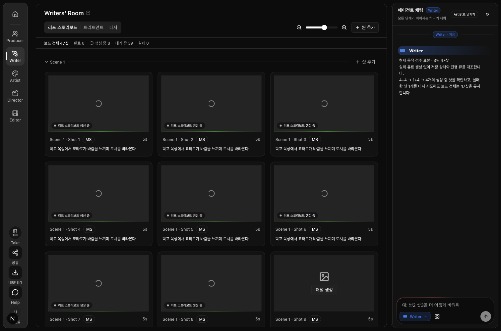
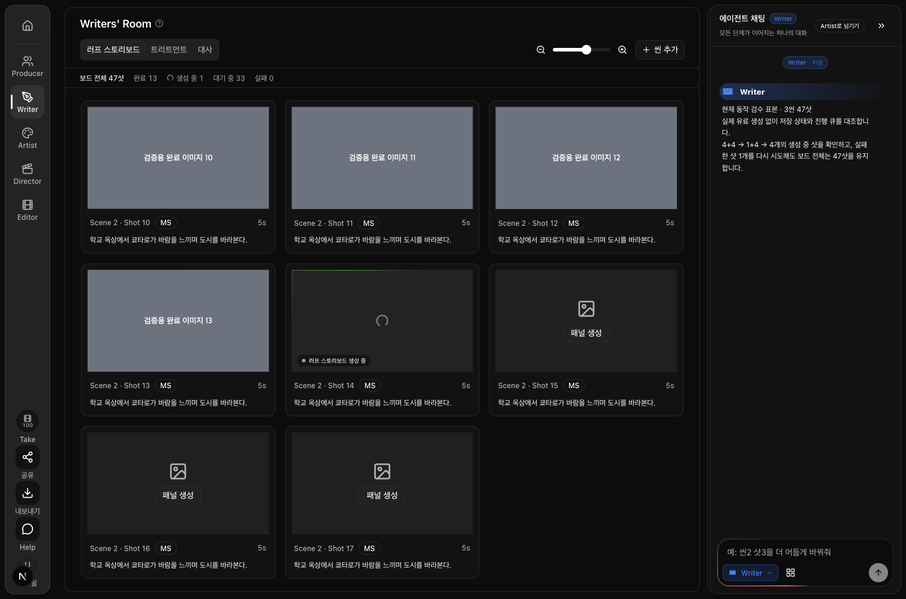

# MVP-18 · 러프 생성 숫자와 중복 접수 검수

**새 표본 기준으로 완료 판정 가능합니다.** 전체 47샷을 완료·생성 중·대기·실패로 구분한 실제 화면을 확인했습니다. 같은 샷을 동시에 예약한 두 요청은 작업 하나를 공유했고, 실패한 샷을 다시 시도해도 전체 목표는 47샷을 유지했습니다. 이번 검수에서 제품 코드를 추가로 수정하지 않았습니다.

2026-09-10, main 반영본 `39fe2081`을 기준으로 검수했습니다. 사용자가 승인한 현재 동작 확인 범위이며, 과거 프로젝트 복구는 수행하지 않았습니다.

| 확인 항목 | 결과 | 근거 |
|---|---|---|
| 전체·완료·생성 중·대기·실패 구분 | 여섯 상태 모두 합계 47, 숫자와 화면 일치 | [화면 검증 기록](18-browser-evidence.json) |
| 같은 샷 동시 접수 | 두 DB 세션이 실제 경합한 뒤 같은 작업 1개 반환; 중복 작업 추가 0개 | [개발 DB 10개 검사](18-db-verification.log) |
| 일부 샷이 겹치는 접수 | 겹친 샷은 기존 작업 공유, 겹치지 않은 샷만 별도 예약 | 같은 DB 기록 |
| 접수 응답 유실·삭제·재진입 | 예약 유지, 확인 중 상태 보존, 삭제 409, 무조건 재발주 없음 | 같은 DB 기록 및 [로컬 14개 검사](18-local-verification.log) |
| 실패 후 재시도 | 실제 카드 버튼 클릭 → 해당 샷 접수 1회 → 전체 47 유지 | [브라우저 검사 결과](18-browser-verification.log) |

아래는 **실제 RoughStoryboardView에 고정된 저장 상태와 큐 응답을 넣은 로컬 실험 화면**입니다. 총 3씬, 각각 9·8·30샷입니다. 회색 이미지는 검수용 표본이며 생성 이미지 품질의 증거가 아닙니다. 화면은 1511×1000에서 촬영했습니다.

| 표본 | 보드 전체 | 완료 | 생성 중 | 대기 | 실패 | 화면 확인 지점 |
|---|---:|---:|---:|---:|---:|---|
| 4+4샷 작업 진행 | 47 | 0 | 8 | 39 | 0 | [상단 요약과 생성 중 카드](18-eight.png) |
| 다음 4+1샷 작업 진행 | 47 | 8 | 5 | 34 | 0 | [전체 47과 생성 중 5 구분](18-five.png) |
| 1샷 완료, 4샷 진행 | 47 | 9 | 4 | 34 | 0 | [완료 증가와 생성 중 감소](18-four.png) |
| 14번 샷 실패 | 47 | 13 | 0 | 33 | 1 | [실패 1과 실제 재시도 대상](18-failed.png) |
| 14번 샷 재시도 | 47 | 13 | 1 | 33 | 0 | [실패에서 생성 중으로 이동](18-retry.png) |
| 재시도 완료 저장 표본 | 47 | 14 | 0 | 33 | 0 | [전체 47과 완료 14 구분](18-retry-complete.png) |

브라우저 검사는 실제 실패 카드의 ‘패널 생성’ 버튼을 클릭해 `rough-14`가 한 번 접수되는지 확인했습니다. 여섯 상태 모두 숫자 다섯 개의 실제 화면 노출, 이미지 로딩, 총합을 검사했고 미처리 브라우저 오류는 0개였습니다. 완료 상태는 고정 저장 응답을 공급했습니다.

실제 개발 DB 검사는 새 사용자·프로젝트·샷·작업만 있는 임시 스키마에서 수행했습니다. 예약 SQL을 스키마 이름만 치환해 실행하고 두 세션의 잠금 대기를 관찰했습니다. 같은 대상/부분 중첩, 롤백, 권한, 오래된 응답 유실 예약, 완료 재사용/명시 재생성, 실패 후 늦은 접수 기록, 함수 실행 권한, 실제 삭제 API 거절까지 **10/10 통과**했습니다. 임시 스키마 삭제 후 잔여 0개, 기존 public 함수 지문 변경 0건, 앱 데이터 조회·변경 0건, public 마이그레이션 적용 0건입니다. 운영 설치 여부는 기존 배포 기록을 따릅니다.

추가 로컬 검사 14/14, 타입 검사 통과, fixture lint 오류 0개입니다. 로컬 검사는 실제 숫자 집계·예약 도메인과 HTTP 제출 경계를 실행하며, 외부 응답은 대체했습니다. 유료 FAL 호출은 0회입니다.

**남기는 한계:** 과거 운영 화면에 나타난 ‘14’가 당시 어느 수치를 뜻했는지는 원본 화면·기록 연결이 부족해 확정하지 못했습니다. 이번 표본의 ‘완료 14’가 과거 숫자의 출처라는 주장은 하지 않습니다. 실제 운영 프로젝트에서 47샷을 유료 생성하며 끝까지 관찰한 검증도 아닙니다. 추가로 시도한 755px 화면은 실험용 고정 채팅 래퍼가 중앙을 가려 승인 증거에서 제외했습니다. 제품의 좁은 화면 레이아웃 검증으로 주장하지 않습니다.

재현 자료: [브라우저 검사 스크립트](18-browser-check.mjs), [DB 검사 실행 파일](../../../../scripts/test-rough-reservation-dev-db.mjs), [실제 DB 검사](../../../../tests/manual/rough-reservation-dev-db.manual.test.ts). DB 실행 명령은 `node scripts/test-rough-reservation-dev-db.mjs`입니다. 브라우저는 fixture를 임시 localhost 페이지에 복사하고 `node .claude/docs/2026-09-10/mvp-closeout/18-browser-check.mjs <Orca page ID>`로 실행합니다. 사용한 Orca 프로필은 `826948c4-4618-4ff7-86ae-4a28a6bcf02a`입니다.

이번 변경은 검수 fixture의 러프 표본, 검사 스크립트, 증거 파일뿐입니다. 검수에 사용한 임시 `/playground/mvp-feedback` 제품 경로는 촬영 후 제거했습니다.
