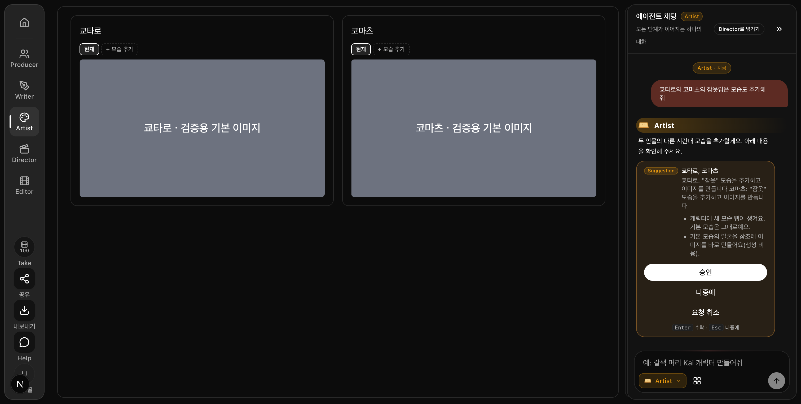
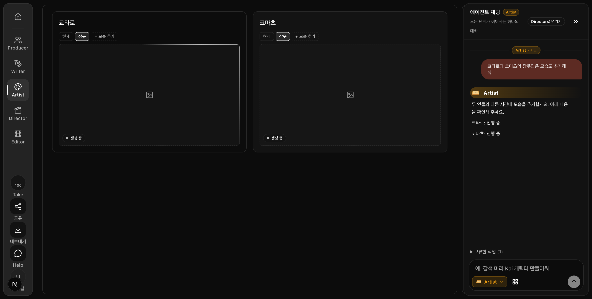
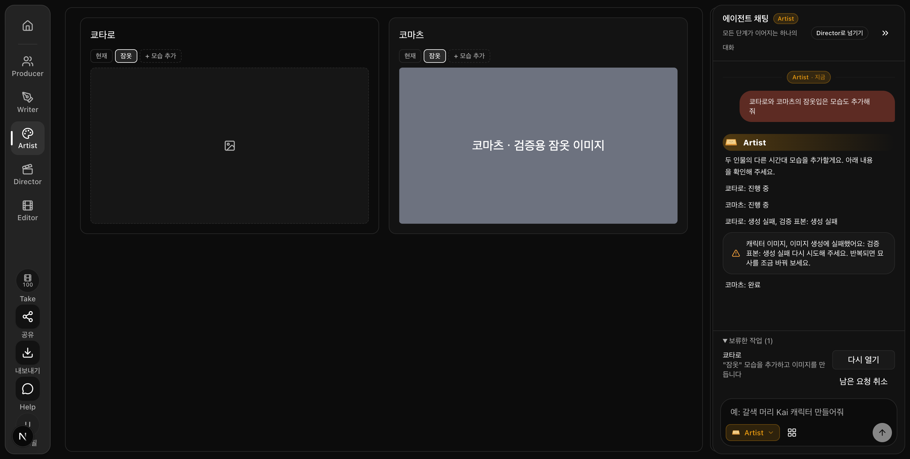
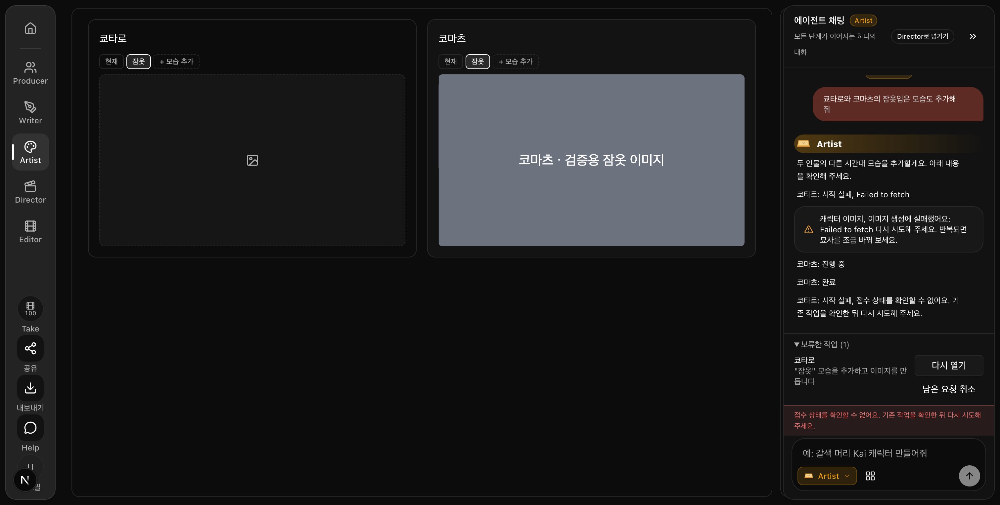

# MVP-27 검수 결과

**두 인물의 새 모습은 한 번 승인하면 각각 시작하며, 한쪽이 실패해도 다른 인물의 결과를 유지합니다. 네트워크 응답이 끊긴 인물을 완료로 지우던 추가 결함도 수정했습니다. 현재 요청의 재질문·누락 방지 범위에서 27번을 닫을 수 있습니다.**

2026-09-10, main `39fe2081` 기반 release 체크아웃에서 검증했습니다. 배포 완료 여부는 루트의 최종 배포 보고를 따릅니다.

## 실제 확인 결과

| 재현 상황 | 확인한 결과 |
|---|---|
| 두 인물의 잠옷 모습 한 번 요청·승인 | 승인 전 접수 0건. 첫 이미지가 끝나기 전에 두 인물 각각 접수, 총 2건. |
| 두 번째 인물이 먼저 완성 | 해당 인물에 완료 안내와 결과가 붙고, 첫 인물만 남음. |
| 첫 인물 생성 실패 | 둘째는 재질문 없이 완성. 실패한 첫 인물만 보류 목록에 남고 이유가 보임. |
| 첫 인물 접수 거절 | 둘째는 접수·완성. 첫 인물을 다시 승인해도 새 모습 행이 중복되지 않음. |
| 첫 인물의 접수 응답 유실 | 둘째는 완성. 첫 인물은 접수 확인 필요로 남으며, 재승인해도 추가 발주 0건. |
| 이미 접수한 첫 인물의 완료 조회가 끊김 | 기존 작업 번호를 유지. 다시 확인하면 기존 작업만 조회하고 추가 발주 0건. |
| 승인 연타·취소 | 중복 접수 방지 및 취소 후 남은 대상 시작 방지 유지. |

## 원인과 수정

기존 두 인물 순차 대기 문제는 앞서 수정된 상태였습니다. 이번 실제 경로 회귀에서 별도 결함 2건을 확인했습니다. 이미지 접수 또는 완료 조회 중 네트워크 예외가 나면 Artist는 실패 값을 반환했지만, 채팅의 승인 처리에 실패를 알리지 않았습니다. 새 모습 저장 함수가 그 반환 값을 사용하지 않아 전체 요청을 성공으로 판정하고 미확인 인물을 지웠습니다.

Artist의 캐릭터 이미지 생성 함수가 마지막 상태를 기록하고, 네트워크 예외도 채팅에 전달하도록 수정했습니다. 이미 전달한 실패·시간 초과 상태는 중복으로 덮지 않습니다. 배경 이미지에서 이미 사용하던 방식과 같습니다. 제품 변경은 `src/stores/artist-store.ts`의 이 부분뿐입니다. 새 과거 작업 복구 엔진이나 자동 재발주를 추가하지 않았습니다.

## 약속과 검증

- “두 인물의 다른 시간대 모습을 함께 요청하고 승인하면 두 인물의 새 모습 이미지가 각각 큐에 등록된다.” 왜: 정상 경로 고정. 첫 인물 완료를 기다리느라 둘째를 다시 요청하는 상황을 막습니다.
- “첫 인물의 접수 응답이 유실되어도 둘째는 완성하고 접수 여부가 불확실한 첫 인물은 완료 처리하거나 다시 발주하지 않는다.” 왜: 이미 접수됐을 수 있는 인물을 잃거나 중복 생성하는 상황을 막습니다.
- “첫 인물의 완료 확인이 끊겨도 둘째 결과를 유지하고 다시 확인할 때 기존 첫 작업만 조회한다.” 왜: 일시적인 네트워크 끊김으로 완료한 인물까지 다시 생성하는 상황을 막습니다.

새 2개 회귀는 수정 전 실패, 수정 후 통과했습니다. 첫 초록 검사에서는 제가 기존 안내 문구를 잘못 적은 마지막 검사 한 줄이 실패했습니다. 제품 문구·약속은 바꾸지 않고 기존 문구인 “접수 상태를 확인할 수 없어요. 기존 작업을 확인한 뒤 다시 시도해 주세요.”를 정확히 검사하도록 정정했습니다.

- Artist 전체 + 요청 보존: **46파일, 405통과, 기존 1 skipped**. 새로운 skip 없음.
- 변경 제품·회귀·fixture ESLint: 통과.
- `pnpm typecheck`: 통과.
- 자동 검사 경로: 실제 Artist chat POST → 파싱 → 승인 → 실제 새 모습 저장 → 이미지 생성 POST → 실제 큐 접수 저장 함수. 모델·DB 네트워크·유료 생성 제공자는 메모리/가짜 HTTP로 대체했습니다.
- 브라우저: 실제 GlobalChat, 승인 처리, Artist store, CharacterPanel 사용. API 응답과 결과 이미지는 고정 검수 표본입니다. 새 유료 생성 호출 없음.
- 브라우저 콘솔: 의도적으로 주입한 생성 실패·응답 유실 경고 2개 외 오류 없음. 수집된 네트워크 HTTP 실패 0건. 기본 Sentry/개발 분석 스크립트 통신은 있었으며, 제품 생성 API·DB 쓰기는 fixture 응답으로 대체했습니다.

## 화면 증거

아래 이미지의 회색 결과는 동작 검증용 표본이며 실제 생성 품질의 증거가 아닙니다.

승인 카드에 두 인물과 새 모습 작업이 함께 표시됩니다.

한 번 승인한 뒤 두 인물이 모두 생성 중입니다.

쿄타로가 실패해도 코마츠는 완료되며, 남은 요청에는 쿄타로만 표시됩니다.

접수 응답이 유실된 인물은 재승인해도 중복으로 시작하지 않고 접수 확인이 필요하다고 표시합니다.

## 다시 실행하는 방법

`tests/fixtures/mvp-feedback-page.tsx`를 로컬 임시 playground route에 복사합니다. `window.__mvp.prepareArtist()` 후 실제 입력창에 “쿄타로와 코마츠의 잠옷입은 모습도 추가해줘”를 입력·전송하고 승인합니다. `artistSample.submissions`가 두 이름, jobs가 각각 queued인지 확인합니다. `finishArtist('kyotaro','검증 표본: 생성 실패')`, `finishArtist('komatsu')`로 첫 실패·둘째 완료를 전달합니다.

응답 유실은 `prepareArtist(true)`로 준비하고 같은 요청·승인을 실행합니다. `finishArtist('komatsu')` 후 보류한 쿄타로를 다시 열어 승인해도 submissions는 2건 그대로이며 확인 필요 안내가 남습니다. 캡처 당시 fixture 응답의 빈 updates 배열을 브라우저 wrapper로 보충했으며, 최종 fixture에도 동일하게 반영했습니다.

브라우저 임시 경로 `/playground/mvp-artist`는 검수 후 삭제했습니다. 기존 18번 fixture 변경을 보존했습니다. 원본 dev 제품 파일 수정, 운영 DB 쓰기, 커밋·push는 하지 않았습니다.

## 확인 범위

과거 프로젝트 복구는 최신 사용자 지시에 따라 수행하지 않았습니다. 접수 번호 자체가 유실된 작업의 자동 탐색·무조건 재발주와 모든 실패의 무인 재시도는 이번 완료 주장에 포함하지 않습니다. 확인할 수 없는 대상을 완료로 지우지 않고 이유와 남은 요청을 보존하는 동작까지 증명했습니다. 과거 사건의 모델 원본 응답은 이번 검수 자료가 아니므로 최초 사건 원인을 이 테스트만으로 단정하지 않습니다.

원본 증거: `.claude/docs/2026-09-10/mvp-closeout/27-red.txt`, `27-green.txt`, `27-lint.txt`, `27-typecheck.txt`, `27-partial-evidence.json`, `27-lost-response-evidence.json`, `27-console.json`, `27-network.json`, PNG 4장.
