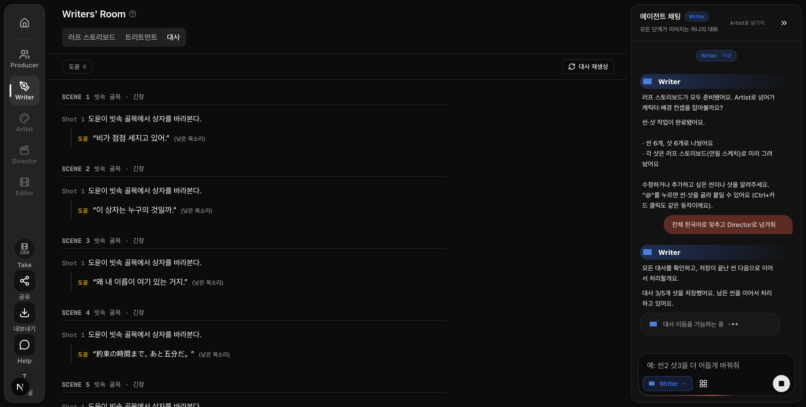
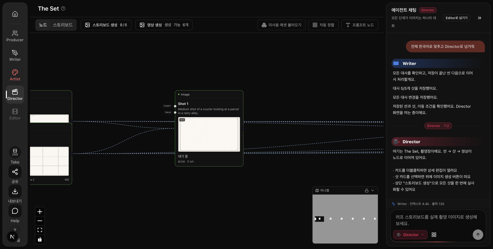
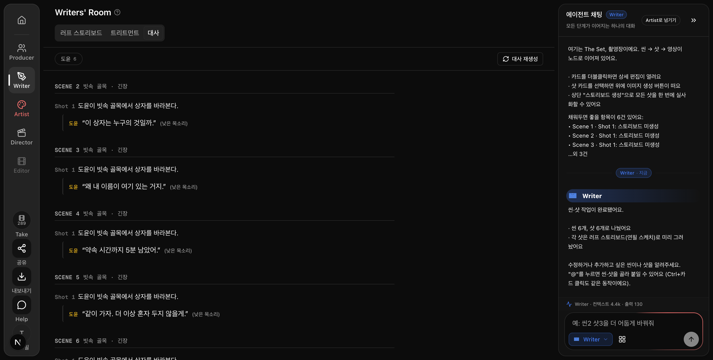
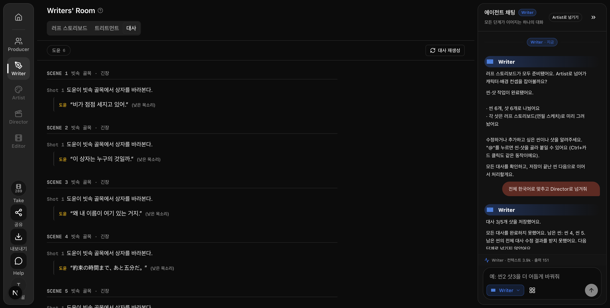

# MVP-29 검증 결과 — 부분 처리 예고에서 끝나는 문제 종료

**현재 main에서 한 번 요청하면 남은 씬을 이어서 번역·저장하고 Director 화면까지 이동하는 것을 확인했습니다. 29번은 사용자 최신 지시의 ‘현재 동작과 검증 화면을 남기면 닫기’ 범위로 종료할 수 있습니다. 이번 검증에서 제품 코드는 추가 수정하지 않았습니다.**

검증일은 2026-09-10, 기준은 main `39fe2081`의 배포 체크아웃과 개발 서버 `127.0.0.1:3073`입니다. 실제 사용자 프로젝트 대신 새 검증 프로젝트에 6씬·6샷을 만들었습니다. 1~5씬은 일본어 각 한 줄, 6씬은 기존 한국어 한 줄입니다. 캐릭터·배경 이미지는 저장소 템플릿을 재사용했으며, Writer 완료 표시는 준비 조건 검증용 데이터입니다. 이미지·영상 생성 결과를 검증한 자료가 아닙니다.

## 확인한 결과

입력은 **“전체 한국어로 맞추고 Director로 넘겨줘”**입니다. 원래 문제와 같은 분할 상황을 만들기 위해 첫 응답만 “Scene 1~3 먼저 처리할게요”와 세 샷의 수정 결과로 통제했습니다. 이후 4씬과 5씬은 현재 제품의 실제 Writer 채팅 API와 모델 응답을 사용했습니다. DB 저장과 Director 이동 확인은 모두 실제 제품 경로를 사용했습니다.

| 단계 | 확인 결과 |
|---|---|
| 1~3씬 반환 | 세 샷을 실제 DB에 저장한 뒤 3/5 진행 안내를 표시했습니다. |
| 남은 4씬 | 별도 재촉 없이 실제 Writer API를 호출해 한국어 대사를 저장했습니다. |
| 남은 5씬 | 4씬 저장 응답 이후 다음 API를 호출하고 저장했습니다. |
| 6씬 | 원래 한국어 대사와 화자·말투를 유지했고 재저장하지 않았습니다. |
| 완료 | 5/5 저장 안내 → 모든 대사 변경 저장 안내 → 서버의 이동 조건 확인 → 실제 Director 화면 도착을 확인했습니다. |
| 새로고침 | 저장 완료 후 화면을 다시 불러와 여섯 씬의 한국어 대사가 유지되는 것을 확인했습니다. |

## 최초 실험의 실패도 보존

첫 실험에서는 실제 모델 응답 두 번이 실행할 수정 결과를 하나도 반환하지 않았습니다. 서버 관측 기록은 모두 `raw_update_count=0`, `valid_update_count=0`, `parse_status=none`입니다. 앱은 **“남은 씬: 씬 4, 씬 5 … 다음 단계로 넘기지 않았어요”**를 남기고 실제 이동을 막았습니다. 성공했다고 처리하거나 예고만 남긴 채 침묵하지 않았습니다.

이 과정에서 개발 서버의 전체 새로고침이 겹쳐 응답 본문 계측이 사라졌습니다. 따라서 원인을 새로고침 때문이라고 단정하지 않습니다. DB에 남은 수정 0건 기록과 실패 화면을 보존했습니다. 같은 요청을 다시 보내자 이미 저장한 1~3씬을 제외하고 4~5씬만 실제 API로 저장하여 이동했습니다. 이후 검증 표본의 대사만 처음 상태로 돌린 최종 실험에서는 **한 번의 요청으로 1~3 → 4 → 5 → Director 이동**이 끝났습니다.

모델이 항상 유효한 번역을 반환한다는 보장은 이번 검증 결과에 포함하지 않습니다. 번역 실행 자체는 열린 브라우저에서 이어집니다. **작업 중 새로고침하거나 브라우저를 닫은 뒤 자동으로 다시 시작하는 기능은 없습니다.** 먼저 저장된 대사는 DB에 남으며 같은 요청을 다시 보내면 남은 외국어 대사를 대상으로 처리합니다. 종료된 브라우저를 대신해 작업하는 별도 서버 엔진이나 과거 프로젝트 복구는 이번 범위에 추가하지 않았습니다.

## 원문과 최종 저장 문장

| 씬 | 원문 | 최종 저장 | 출처 |
|---|---|---|---|
| 1 | 雨が強くなってきた。 | 비가 점점 세지고 있어. | 첫 부분 응답 통제 |
| 2 | この箱は誰のものだろう。 | 이 상자는 누구의 것일까. | 첫 부분 응답 통제 |
| 3 | どうして僕の名前がここにあるんだ。 | 왜 내 이름이 여기 있는 거지. | 첫 부분 응답 통제 |
| 4 | 約束の時間まで、あと五分だ。 | 약속 시간까지 5분 남았어. | 실제 Writer API |
| 5 | 一緒に行こう。もう一人にはしない。 | 같이 가자. 더 이상 혼자 두지 않을게. | 실제 Writer API |
| 6 | 모두 준비됐어. 이제 출발하자. | 모두 준비됐어. 이제 출발하자. | 기존 한국어 유지 |

화자 `char_doyun`, 감정 ‘차분함’, 말투 ‘낮은 목소리’, 발화 길이 힌트 2는 여섯 줄 모두 유지됐습니다. 이 표는 소수 의미 표본과 저장 결과이며 전체 번역 품질에 대한 오너 판정을 대신하지 않습니다.

## 회귀·증거·정리

관련 4개 테스트 파일의 **51개 테스트가 통과**했습니다. 47샷 분할 처리, 앞선 저장 완료 전 다음 요청 금지, 저장 실패·저장 행 누락 시 이동 금지, 번역 외 삭제 작업 제외, 중단 후 남은 작업 미실행, 실제 Director 준비 조건 확인을 포함합니다. 이미 통과한 제품을 확인하는 작업으로 새 테스트나 기대값 변경은 하지 않았습니다.

주요 기존 약속은 다음과 같습니다.

- “전체 한국어로 맞추고 넘겨 달라고 하면 일부 씬 저장 뒤 남은 씬을 자동 처리하고 모두 저장된 뒤 Director로 넘긴다” — 왜: 1~3씬만 처리하고 전체 요청을 끝내던 원래 상황입니다.
- “앞선 씬의 저장 응답이 오기 전에는 다음 씬을 요청하거나 넘기지 않는다” — 왜: 화면의 변경과 실제 저장 완료를 혼동하지 않도록 합니다.
- “모델이 앞으로 하겠다는 말만 해도 남은 씬을 실제로 다시 요청하고 끝내지 못한 이유를 알린다” — 왜: 실행 없는 예고를 완료로 취급하지 않도록 합니다.

증거: [최종 브라우저 요청·응답](29-complete.json), [DB 저장본](29-readback.json), [원문·최종 대사 전량](29-dialogues.json), [모델 호출 관측 기록](29-traces.json), [검증 프로젝트 정리 확인](29-cleanup.json). 화면 PNG는 원본 3022×1528을 보존했습니다. 최종 실행 계측의 브라우저 오류는 0건이고 관련 API·DB 저장·이동 응답은 모두 200이었습니다.

실제 Writer 모델 호출은 실험 전체 5회였습니다(첫 실패 2회, 재요청 1회, 최종 분할 이어가기 2회). 이미지·영상 생성 작업은 검증 프로젝트에서 끝까지 0개였습니다. 검증 프로젝트 `f48923c5-c98d-40ca-a30a-000446af6ea9`는 증거 보존 후 소유권·제목·ID를 대조하여 삭제했고, DB에서 부재를 다시 확인했습니다. 전용 브라우저 탭도 닫았습니다. **제품 파일 편집은 없었으며 29번의 검증·증거 파일 편집을 종료합니다.**
