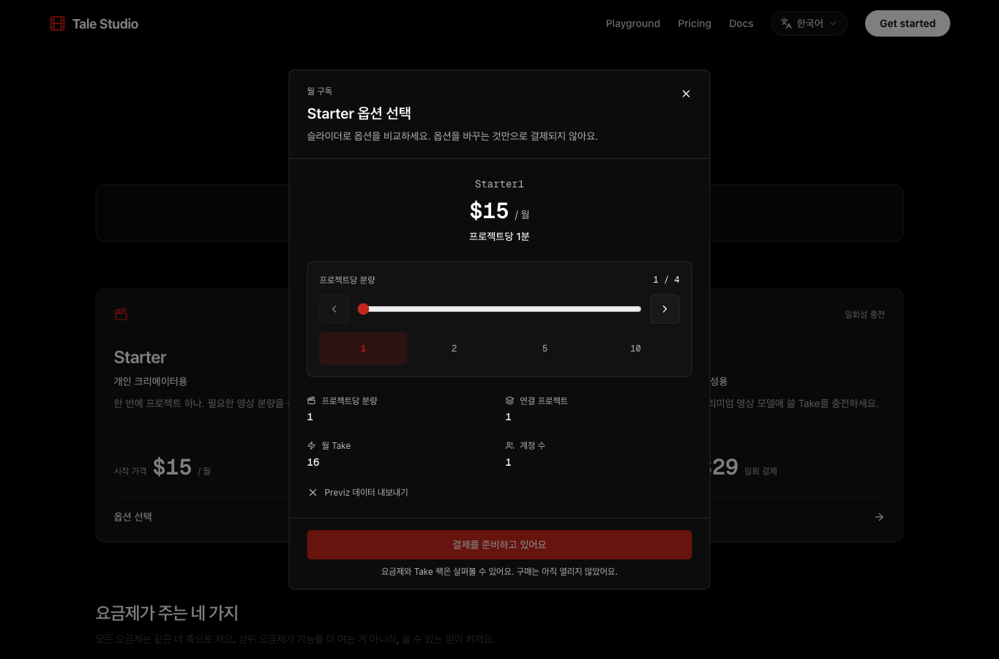
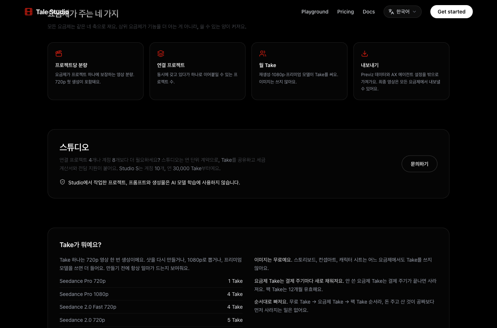

# 첫 프로젝트 생성과 요금제 문구 배포 확인

2026-09-10 · 운영 https://talestudio.art · 메인 a5d8dc18

- 처음 가입한 무료 계정도 작업 공간이 자동 준비되고 첫 프로젝트를 만들 수 있습니다.
  - 왜: 첫 프로젝트 화면으로 바로 온 신규 계정에 작업 공간이 없어 생성이 막혔습니다.
- 고객에게는 Starter1·Producer10 형식의 이름을 표시하고 내부 코드와 월 가격은 유지합니다.
  - 왜: 고객 화면에 내부 약칭이 그대로 노출되고 있었습니다.
- Studio에서 작업한 프로젝트, 프롬프트와 생성물은 AI 모델 학습에 사용하지 않습니다.
  - 요금제 페이지의 Studio 소개에 한국어·영어 안내를 반영했습니다.

검증: 로컬 테스트 2,551개 통과·기존 27개 제외, 타입·디자인 검사 통과, GitHub CI 성공, Vercel 운영 배포 READY.
운영에서 임시 무료 계정의 첫 생성과 동시 요청을 확인했습니다. 응답은 성공 200·무료 한도 차단 403이었고 작업 공간과 프로젝트는 각 1개였습니다. 검증용 계정·프로젝트·작업 공간은 모두 삭제했습니다.

## 운영 화면

