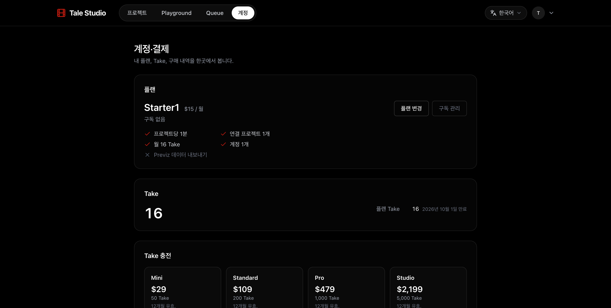
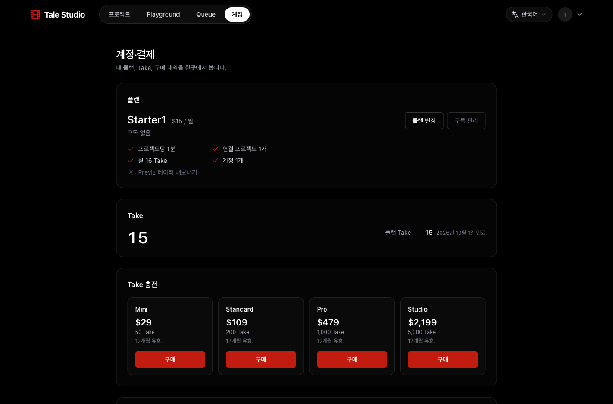

# 테스트 계정 요금제 적용 · Take 실사용 검증

2026-09-10 운영 환경(talestudio.art)에 적용했습니다.

- 이메일이 test-로 시작하는 기존 계정 105개를 확인했습니다.
- Starter1 104개, Producer10 1개로 적용하고 운영 DB를 다시 조회해 일치를 확인했습니다.
- Producer10 대상은 test-223bdf01@tale.studio입니다.
- 작업 공간이 없던 96개 계정에는 내부 계정 기록을 만들었습니다.
- 이번 달 기본 Take를 Starter1에는 16개, Producer10에는 150개씩 총 1,814개 지급했습니다. 기존 소비 내역은 유지합니다. 지급분은 2026-10-01 09:00 KST에 만료됩니다.
- 실결제 구독을 생성하지 않은 수동 테스트 권한입니다. 자동 결제·월별 자동 재지급은 설정하지 않았습니다.

## 실제 생성 검증

- 대상: test-1c9dfc14@tale.studio
- 브라우저 로그인 후 계정 화면에서 Starter1·16 Take를 확인했습니다.
- 기존 테스트 프로젝트의 Scene 2 · Shot 4(sh_02_04), 5초 러프 영상 1회를 실제 생성 요청했습니다.
- 영상 생성 완료를 확인했습니다. 생성 전 16 Take에서 완료 후 15 Take로 정확히 1개 차감됐습니다.
- 실제 작업 ID: a7bdc4f0-b520-4515-a43a-48673afd441d
- 작업 원장의 차감은 -1이며 반환 행은 없습니다. 생성된 MP4 파일의 정상 응답(206)과 파일 헤더도 확인했습니다.
- [생성된 영상](https://qnjnrihfpqkdhjuzvepy.supabase.co/storage/v1/object/public/media/f44a846b-1e9f-4c2a-b1a1-264ca193ff43/aa2aaf98-2a2a-4e36-9781-6be7ac56a71c/shots/v1-dc6927abed00d2b304ef8dc6d93cb442ba165d29280463866d6d8fdd37cc3189_previz.mp4?v=1789018327796)
- 로그인과 최종 잔액은 운영 브라우저에서 확인했고, 생성 요청과 완료 조회는 같은 로그인 세션으로 실제 운영 API를 호출했습니다.
- 검증 시각: 2026-09-10T05:32:10.819Z

## 확인된 운영 설정

운영 Take 설정은 shadow입니다. 영상 생성 시 Take를 실제로 차감하지만 잔액 부족으로 생성을 차단하지는 않습니다. 이 설정은 변경하지 않았습니다.
