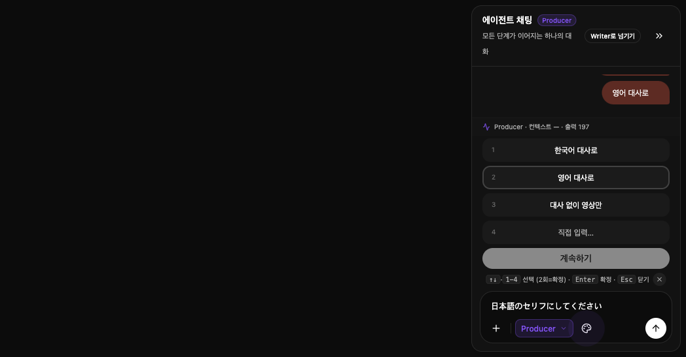
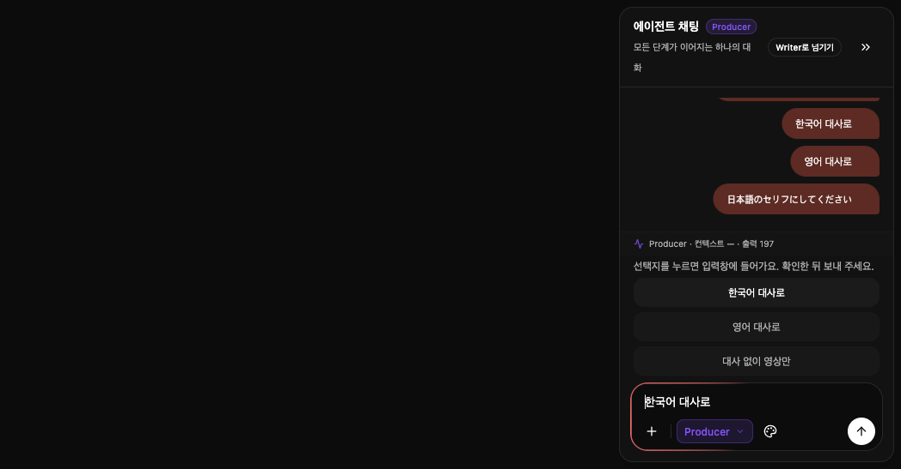
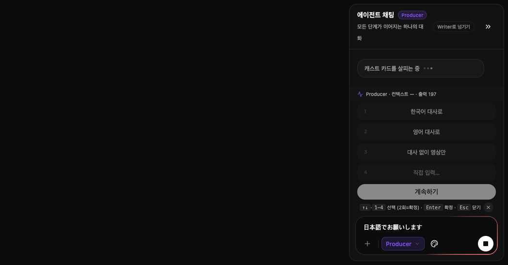

# Producer 선택지·채팅 복구

## 범위와 승인

2026-09-14 오너가 아래 수정과 검증 후 main 직접 배포를 승인했다.
최신 main `867cda835195315e6a73cb4f8d262ef736302ff9`에서 분리해 작업한다.
무대사 영상 지원은 별도 변경이다.

## 같이 정한 것

- 이전 대화를 늦게 불러오면 그사이에 새로 나눈 대화와 선택지를 유지한다.
  - 왜: 이전 기록의 로딩이 새 응답보다 늦게 끝나면 방금 나눈 대화가 사라졌기 때문이다.
- 응답 통계 조회가 늦으면 대화부터 표시한다.
  - 왜: 통계를 기다리느라 이전 대화 표시까지 지연되면 새 대화와 뒤섞이기 때문이다.
- 선택지가 떠 있으면 일반 채팅창에서도 직접 답할 수 있다.
  - 왜: 선택지에 원하는 답이 없거나 버튼을 사용하기 어려워도 대화를 이어가야 하기 때문이다.
- 복원된 선택지를 누르면 답변을 입력창에 넣고 전송은 사용자가 한다.
  - 왜: 새로고침 뒤 버튼처럼 보이는 선택지를 눌러도 아무 반응이 없었기 때문이다.

## 혼자 정한 것

| 동작 | 왜 | 버린 선택지 | 되돌리기 |
| --- | --- | --- | --- |
| 이전 기록 조회가 실패하면 그사이에 새로 나눈 대화를 유지한다. | 실패 처리에서도 현재 대화를 빈 목록으로 지울 수 있었다. | 실패하면 전체 대화를 비움 | 쉬움 |
| 이전 통계 조회가 늦게 끝나면 새 응답의 통계를 유지한다. | 답변과 다른 요청의 통계가 표시될 수 있다. | 마지막에 도착한 통계를 표시 | 쉬움 |
| 프로젝트를 바꾸면 이전 프로젝트의 늦은 기록을 표시하지 않는다. | 프로젝트별 대화가 섞이지 않아야 한다. | 도착한 기록을 현재 화면에 표시 | 쉬움 |
| 응답을 기다리는 중이면 글은 입력할 수 있고 중복 전송은 하지 않는다. | 입력 통로를 열어도 같은 요청을 겹쳐 보내지 않아야 한다. | 응답 중 입력까지 잠금 | 쉬움 |
| 복원된 선택지에서 Enter를 누르면 다른 제안을 승인하지 않고 답변만 입력한다. | 독립 검토에서 선택지와 승인 카드가 함께 복원되면 Enter가 다른 제안을 승인하는 문제를 발견했다. | 선택지에 포커스가 있어도 다른 제안을 승인 | 쉬움 |

## 검증 계획

1. 한국어 동작 이름의 회귀 테스트를 먼저 작성하고 수정 전 실패를 확인한다.
2. 기록 로딩과 선택지 입력 처리를 필요한 파일 안에서 수정한다.
3. 관련 회귀 테스트, 타입 검사, 디자인 검사, 전체 테스트를 실행한다.
4. 실제 화면에서 활성 선택지·복원 선택지·직접 입력·전송을 확인하고 스크린샷을 남긴다.
5. 변경 검토 후 main에 반영하고 배포 성공과 운영 페이지 응답을 확인한다.

## 결과

### 원인과 수정

- 복원된 선택지는 버튼처럼 보이지만 누를 수 없는 표시였다. 이제 누르면 답변을 입력창에 넣는다.
- 활성 선택지가 있을 때 일반 입력창을 잠그던 조건을 제거했다. 원하는 답이 선택지에 없어도 직접 적어서 보낼 수 있다.
- 오래 걸린 이전 기록 조회가 그사이에 도착한 새 대화와 선택지를 덮어쓰는 경합을 회귀 테스트로 재현하고 차단했다. 응답 통계는 별도로 불러온다.
- 복원된 선택지의 Enter를 다른 승인 카드가 가로채는 경로도 재현하고 차단했다.
- 원래 프로젝트가 삭제되어 캡처 당시 입력 불가의 정확한 경로까지 확정할 수는 없다. 현재 main의 복원 선택지만으로는 일반 입력창 잠금이 재현되지 않았고, 위 경합과 비활성 선택지는 각각 재현했다.

### 검증

- 새 회귀 테스트 12개: 수정 전 실패를 확인한 뒤 통과. 기록 경합 8개, 입력·선택·키보드 4개.
- 전체 테스트: 348개 파일, 2,768개 통과. 기존 2개 파일·27개 테스트는 건너뜀.
- 타입 검사, 디자인 검사, 변경한 저장소·테스트 파일의 ESLint, 공백 오류 검사 통과.
- 프로덕션 빌드 통과. 로컬 빌드는 테스트용 Supabase 주소·키를 사용했고 운영 데이터에 접속하지 않았다.
- 독립 코드 검토: Enter 오승인 1건을 수정한 뒤 재검토 승인.
- 실제 화면 검증 9개 통과. 실제 채팅 UI와 한국어 번역을 사용해 1048×547 화면에서 입력·전송과 복원 버튼의 Enter·Space를 확인했다. 전송·저장소는 로컬 모의 처리했으므로 운영 AI 응답까지 검증한 것은 아니다. 상세 결과와 키 입력 도구의 한계는 [검증 기록](browser-check.json)에 남긴다.
- main 반영 커밋과 GitHub CI·Vercel Production 배포 확인 결과는 최종 대화에 기록한다.

### 화면

### 남는 범위

- 처음 기록을 불러오는 중 새 대화를 시작하면 늦게 도착한 이전 기록은 화면에 합치지 않는다. 이전 기록은 다음 새로고침 때 표시된다. 저장된 대화는 삭제하지 않는다.
- 무대사 영상 지원은 이번 변경에 포함하지 않는다.
