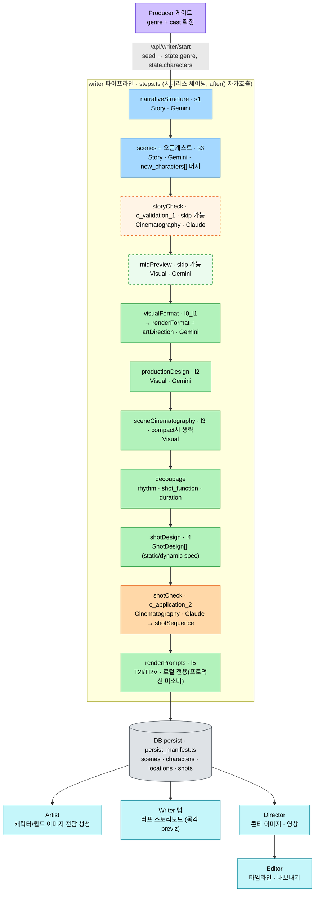

# Writer 파이프라인 도식 (2026-06-13, producer-story-gate 반영)

> s0/s2 스테이지 삭제 후 현재 구조. 진실: `src/lib/writer/pipeline/steps.ts` (WRITER_STEPS).
> 축: **Story**(Gemini) · **Visual**(Gemini) · **Cinematography**(Claude).
> Excalidraw 버전: `dev/writer-pipeline.excalidraw`

## 메모

- **producer-story-gate 변경(협업자)**: 옛 `s0_genre`·`s2_characters` 스테이지 **삭제**. producer가 genre/cast를 게이트로 확정해 `createRun`이 `state.genre`/`state.characters`로 seed → writer는 s1부터 시작.
- **오픈 캐스트**: s3(scenes)가 기존 cast 외 `new_characters[]`를 분리 반환 → `state.characters`에 머지(origin='writer').
- **이미지 생성 제거**: 옛 `assetImages` step 삭제 — 캐릭터/로케이션 이미지 초기 생성은 **Artist 전담**(writer는 행만 채움). 샷 콘티/영상은 Director.
- **점선 = skip 가능**: `storyCheck`/`midPreview`는 프로덕션 기본 skip(`resolveSkip`).
- **`renderPrompts(l5)`는 로컬 전용**: 산출물(T2I/TI2V)을 프로덕션에서 읽는 경로가 없음(파일 기반 loadStage가 Vercel에서 null). 실제 콘티/영상은 `shots.action_description` 기반. (OPEN_ISSUES T2 참조)
- **l6 images / l7 videos**: WRITER_STEPS 밖 — `/api/writer/generate/*` 별도 트리거(주로 Artist/Director 경유).
