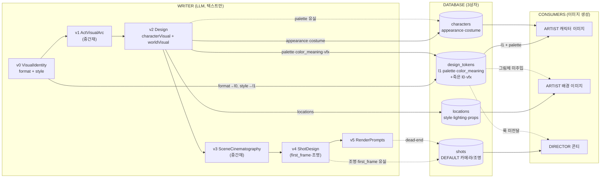

# design_tokens · 이미지/룩 계보 정리

> 작성: 2026-07-13 · source-of-truth: `src/lib/writer/`·`src/lib/artist/`·`src/stores/` 코드 (이 문서는 코드 미러, 다르면 코드가 진실)
> 성격: 현황 audit + 개선 리스트 (캐넌 아님). 방향 확정 시 `specs/decisions.md`로 승격.

## 한 줄 요약

작품의 "룩(그림체·색·외형·배경)"은 **한 곳이 아니라 3개 상자로 쪼개져** 저장된다 —
`projects.design_tokens`(전역) + `characters` 행(인물별) + `locations` 행(장소별).
`design_tokens`는 그중 **전역 스타일 층 하나**일 뿐, 외형/배경룩은 그 밖에 있다.
이미지 생성 시 artist가 이 상자들을 **다시 합쳐서** 프롬프트를 만든다. 여기에 죽은 데이터·유실·버그가 섞여 있다.

---

## 1. 큰 그림 (3단계)

writer는 **텍스트만** 만든다. 실제 이미지는 전부 하류(artist/director)가 나중에 생성한다.
(`v6_images`/`v7_videos` 스테이지는 존재하지만 **핸드오프에서 실행 안 됨** — writer는 `renderPrompts`까지.)

```
[생성] writer 비주얼 축 (v0~v5, LLM)  →  [저장] DB 3상자  →  [소비] artist/director가 이미지 생성
```

---

## 2. 생성 — writer가 만드는 비주얼 요소

| 스테이지 | 산출 타입 | 내용 | 저장? |
|---|---|---|---|
| `v0_visual` | `VisualIdentity` = `format`(RenderFormat) + `style`(ArtDirection) | 전역 출력스펙 + 전역 그림체 | ✅ → `design_tokens.l0/l1` |
| `v1_act_arc` | `ActVisualArc` | 막별 팔레트·조명 무드 변화 | ❌ 저장 안 함 (v2 설계에 녹아듦 = 중간재) |
| `v2_design` | `CharacterVisual` | 인물별 `appearance`·`costume[]`·`palette[]` | 일부 → `characters` 행 (**palette 유실**) |
| `v2_design` | `WorldVisual` | 전역 `global_palette`·`color_meaning`·`vfx_approach` + 로케별 `style_description`·`lighting_sources`·`props` | ✅ 전역→`design_tokens`, 로케→`locations` 행 |
| `v3_scene_plan` | `SceneCinematography[]` | 씬별 커버리지·렌즈·`lighting_arc`·`palette_emphasis`·리듬 | ❌ (decoupage/v4에 녹아듦 = 중간재) |
| `decoupage` | `DecoupagePlan` | 비트→샷 N:M 분해 | ❌ (v4에 녹아듦 = 중간재) |
| `v4_shots` | `ShotDesign` | 샷별 `static_spec`(조명·구도·`first_frame_prompt`)·`dynamic_spec` | 일부 → `shots` 행 (**조명/구도/first_frame 유실**) |
| `v5_prompts` | `RenderPromptsOutput` | 샷별 최종 T2I/I2V 프롬프트 | ❌ 핸드오프에서 미소비 (dead-end) |

> **중간재 vs 유실 구분:** `v1`/`v3`/`decoupage`는 저장은 안 되지만 **다음 LLM 단계에 반영된 뒤 사라진다** — 정상. 문제는 **DB 소비자가 필요한데 저장 직전에 버려지는 것**(인물 palette, 샷 조명).

**용어 (몰라도 됐던 이유 = 이미지에 안 쓰임):**
- **출력스펙 (l0)** = 그림 내용이 아니라 출력 그릇 규격 (화면비·해상도·fps·매체).
- **vfx_approach** = 특수효과 톤 한 줄 (예: "미니멀 실사 합성").

---

## 3. 저장 — 룩이 담기는 3상자

기준: **작품 전체 공통이면 `design_tokens`(1개), 인물/장소마다 다르면 각자 행(N개).**

| 상자 | 개수 | 담기는 것 | 소스 |
|---|---|---|---|
| `projects.design_tokens` (JSONB) | 프로젝트당 1 | `l1`(그림체) · `palette`(대표색) · `color_meaning` · ~~`l0`~~ · ~~`vfx`~~ | v0 + v2.worldVisual |
| `characters` 행 | 캐릭터당 1 | `appearance`(외형) · `costume`(의상) | v2.characterVisual |
| `locations` 행 | 장소당 1 | `style_description` · `lighting_sources` · `props` | v2.worldVisual.locations |

`design_tokens` 내부 상세:

| 키 | = 원본 | 내용 | 이미지에 쓰임? |
|---|---|---|---|
| `l0` | VisualIdentity.format | 매체·해상도·fps·비율·렌더 | ❌ 아무도 안 읽음 |
| `l1` | VisualIdentity.style | art_style·shape_language·line_quality·texture_philosophy·character_proportion | ✅ 캐릭터 이미지 |
| `palette` | worldVisual.global_palette | primary·secondary·accent·forbidden[] | ✅ 앞 3색만 (forbidden ❌) |
| `color_meaning` | worldVisual.color_meaning | 색→의미 | △ 온보딩 문구만 |
| `vfx_approach` | worldVisual.vfx_approach | 특수효과 톤 | ❌ 아무도 안 읽음 |

---

## 4. 소비 — 이미지 생성이 실제로 읽는 것

**캐릭터 이미지** (`api/artist/generate-sheet/route.ts` → `lib/artist/turnaround.ts`):

| 출처 | 읽는 것 ✅ | 안 읽는 것 ❌ |
|---|---|---|
| `characters` 행 | 이름·외형·역할·의상 | (인물 palette는 애초에 저장 안 됨) |
| `design_tokens` | `l1` 5개 + `palette` 3색 | `color_meaning`·`vfx`·`l0`·`forbidden` |

**배경(로케이션) 이미지** (`stores/artist-store.ts:buildWorldShotPromptForLocation` → `lib/prompts.ts:buildWorldPrompt`):

| 출처 | 읽는 것 ✅ | 안 읽는 것 ❌ |
|---|---|---|
| `locations` 행 | style·lighting·props·purpose·name | — |
| `scene` | mood·narrative 맥락 | — |
| `design_tokens` | — | **전역 그림체(art_style) 통째로 미주입** ⚠️ 갭 |

**기타 소비:**
- 온보딩 문구 (`lib/artist/onboarding-message.ts`): `color_meaning` 1~2개.
- 룩 변경 감지 (`lib/image-provenance.ts:computeLookFingerprint`): `l1.art_style`·`l1.shape_language`·`palette`만 (**5개 중 3개 — 버그**).
- director 콘티 (`stores/director-store.ts`): `shots.shot_type`·`storyboard_image`. **`design_tokens` 미소비** → 전역 룩이 콘티까지 안 내려감.

---

## 5. 판정표 (✅ 그대로 / ⚠️ 살려·고쳐 / ❌ 죽음·삭제)

| 판정 | 요소 | 한 줄 |
|---|---|---|
| ✅ | 그림체 (l1) | 캐릭터 이미지의 핵심. 잘 쓰임 |
| ✅ | 인물 외형·의상 | characters 행 → 잘 쓰임 |
| ✅ | 전역 대표 3색 | design_tokens → 잘 쓰임 |
| ✅ | 배경룩 (로케 필드) | locations 행 필드는 다 쓰임 |
| ✅ | 막별 무드·씬 촬영법·샷 분해 | 저장 안 되나 다음 단계에 녹아듦 (중간재 정상) |
| ✅ | artist 캐릭터 이미지 경로 | 메인 경로 정상 |
| ⚠️ | 인물 강조색 (CharacterVisual.palette) | 만들고 저장 안 함 → 회수하면 캐릭터 색 일관성 ↑ |
| ⚠️ | 배경 이미지 전역 그림체 | 배경에 art_style 미주입 → 캐릭터↔배경 화풍 통일 안 걸림 |
| ⚠️ | design_tokens 타입 | 같은 형태가 코드 4곳에 따로 선언 → 어긋남 위험 |
| ⚠️ | 룩 변경 감지 (지문) | 그림체 5개 중 3개만 감시 → 선/질감/등신비만 바꾸면 못 잡음 |
| ⚠️ | 샷 조명·구도·first_frame (ShotDesign→shots) | shots 저장 때 DEFAULT로 덮여 유실 → 콘티 품질 ↓ |
| ⚠️ | 최종 샷 프롬프트 (RenderPrompts) | 완성 프롬프트인데 핸드오프서 미소비 (dead-end) |
| ⚠️ | director 콘티 | 전역 그림체 미수신 → 캐릭터와 룩 따로 놈 |
| ❌ | 출력스펙 (l0) | DB 저장만·미소비 (죽은 데이터) |
| ❌ | vfx_approach | 미소비 (죽은 데이터) |
| ❌ | 금지색 (palette.forbidden) | 저장돼도 어떤 프롬프트에도 안 들어감 |
| — | color_meaning | LLM 생성·이미지 미주입. 온보딩 UI용으로만 유지 (낮은 우선순위, 그냥 둬) |

집계: **✅ 6 · ⚠️ 7 · ❌ 3 · 보류 1**

---

## 6. 당장 개선 리스트 (우선순위)

### 지금 바로 (무위험·공짜)
1. **design_tokens 타입 단일화** — 형태를 export 타입(또는 zod) 1개로 통일하고 소비 4곳(`persist_design_tokens.ts`·`generate-sheet/route.ts`·`image-provenance.ts:LookTokens`·`artist-store.ts` 인라인)이 전부 import. 동작 무변경. 지문 커버리지 갭도 타입에서 드러남.
2. **죽은 데이터 청소** — `l0`·`vfx_approach` 기록 중단, `palette.forbidden`은 사용하거나 드롭. 무해.

### 결정 필요 (정합성·품질)
3. **지문 커버리지 버그** — `computeLookFingerprint`에 `line_quality`·`texture_philosophy`·`character_proportion` 추가.
   - ⚠️ 켜면 **기존 이미지 전부 1회 restale → fal 재생성 비용 스파이크.**
   - 롤아웃 선택: (A) 즉시 정합 / (B) 구 지문 폴백으로 무비용 마이그레이션. **← 결정 대기.**
4. **배경 이미지에 전역 그림체 주입** — `buildWorldShotPromptForLocation`에 `design_tokens.l1.art_style`(+shape) 추가. 캐릭터↔배경 화풍 통일. (월드 이미지 restale 유발.)

### 다음 단계 (범위 큼)
5. **인물 강조색 회수** — CharacterVisual.palette → characters 행 저장 + 캐릭터 프롬프트 주입.
6. **샷 룩 유실 수리** — `persistShotsToDb`가 DEFAULT 대신 v4 `static_spec`(조명/구도) 기록 → director 콘티 품질.
7. **director에 전역 룩 연결** — 콘티 생성에 design_tokens 주입.

---

## 7. 다이어그램 (mermaid = 진실원)



---

## 참조 파일

- 생성: `src/lib/writer/pipeline/stages/v0_visual.ts`·`v1_act_arc.ts`·`v2_design.ts`·`v3_scene_plan.ts`·`v4_shots.ts`·`v5_prompts.ts`
- 타입: `src/lib/writer/types/pipeline.ts` (RenderFormat·ArtDirection·VisualIdentity·CharacterVisual·WorldVisual·SceneCinematography·ShotDesign)
- 저장: `src/lib/writer/pipeline/util/persist_design_tokens.ts`·`persist_manifest.ts` / 마이그레이션 `databases/migrations/008_svc_design_tokens.sql`
- 소비: `src/app/api/artist/generate-sheet/route.ts`·`src/lib/artist/turnaround.ts`·`src/lib/artist/draft-trigger.ts`·`src/lib/prompts.ts`·`src/stores/artist-store.ts`·`src/lib/artist/onboarding-message.ts`·`src/lib/image-provenance.ts`
