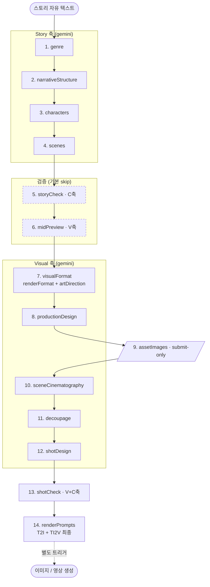
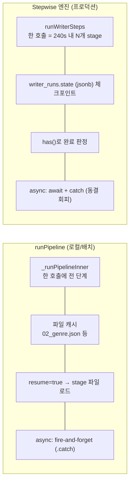
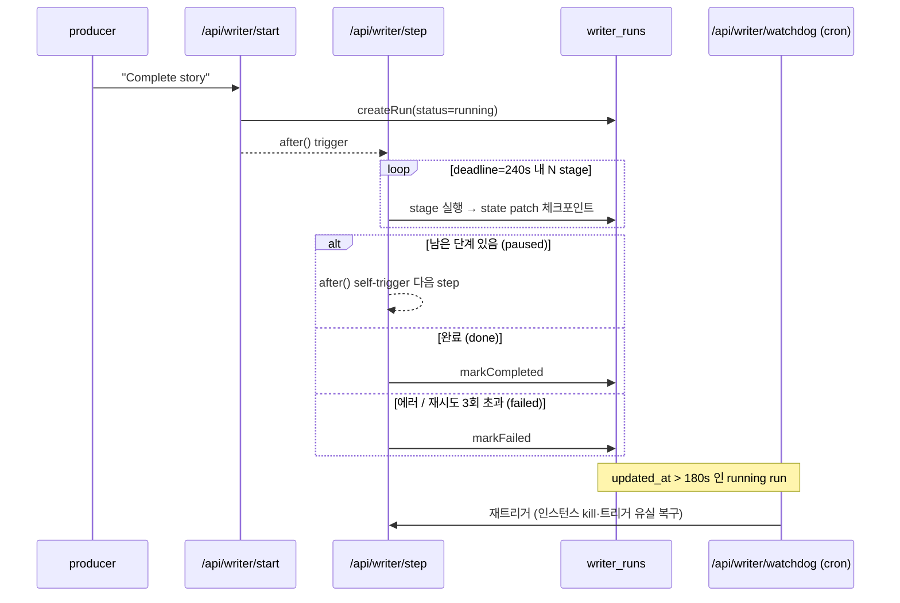
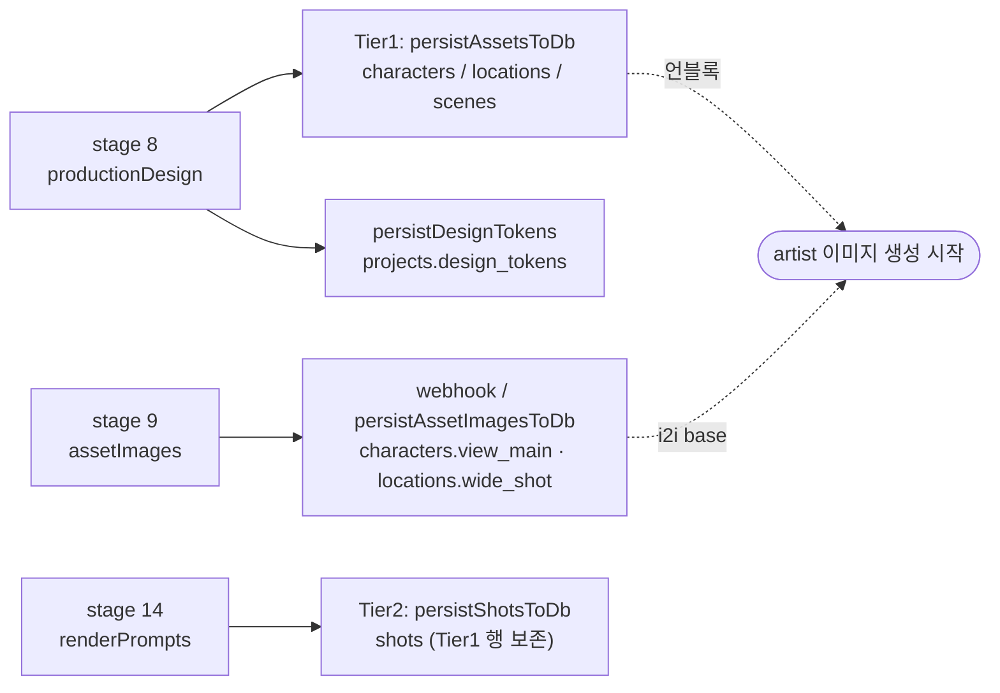
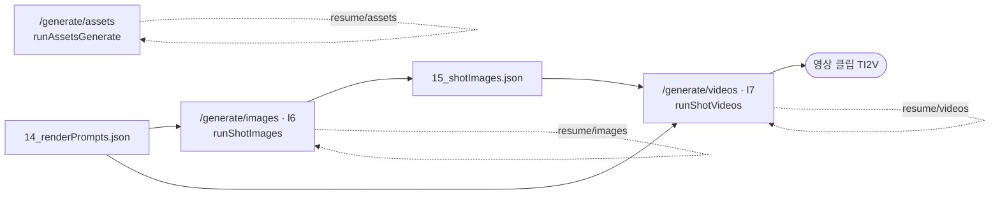

# Writer 파이프라인 구조

> 작성: 2026-06-08 · source-of-truth: `src/lib/writer/` 코드 (이 문서는 코드 미러, 다르면 코드가 진실)
> 짝 파일: [`writer-pipeline.yaml`](./writer-pipeline.yaml) (기계 판독용 단계 명세)

스토리 자유 텍스트 → 장르/구조/캐릭터/씬 → 비주얼 디렉션 → 데쿠파주/샷 → 최종 T2I·TI2V 프롬프트.
**UI 없는 백엔드 전용** (decision #38). producer 핸드오프(`/api/writer/start`)에서 백그라운드 실행되어
DB(`characters`/`locations`/`scenes`/`shots`)를 채우고 artist로 직행한다.

---

## 1. 전체 데이터 흐름

> **축 모델 기본값** (`dispatch.ts DEFAULT_MODELS`): S=`gemini-3-flash-preview`, V=`gemini-3-flash-preview`, C=`claude-sonnet-4-6`. `input.models.{S,V,C}`로 override.
> 자동 체이닝되는 텍스트/프롬프트 단계는 `genre`~`renderPrompts` 14스텝. 이미지/영상은 **별도 트리거**(§5).

---

## 2. 두 개의 실행 경로 (동일 데이터 흐름, 다른 캐리어)

`steps.ts`는 `index.ts`의 데이터 흐름을 **그대로 미러링**한다. 두 경로의 stage 순서·입출력은 동일.

| | `runPipeline` (로컬/배치) | Stepwise 엔진 (프로덕션) |
|---|---|---|
| 코드 | `pipeline/index.ts` `_runPipelineInner` | `pipeline/steps.ts` `WRITER_STEPS` / `runWriterSteps` |
| 캐리어 | 파일 캐시 (`02_genre.json` 등) | `writer_runs.state` (jsonb) 체크포인트 |
| 재개 | `resume=true` → stage 파일 로드 | step 마다 `state` 저장, `has()`로 완료 판정 |
| 실행 단위 | 한 호출에 전 단계 | 한 호출 = 시간예산(`STEP_BUDGET_MS=240s`) 내 N개 stage |
| 체이닝 | 단일 프로세스, 백그라운드 task는 fire-and-forget | `/api/writer/step` self-trigger (`after()`) |
| 비동기 작업 | `.catch()` non-blocking | 서버리스 동결 → `await + catch`로 흡수 |

---

## 3. 서버리스 체이닝 (프로덕션 경로)

복구 장치:
- **재시도 가드**: 같은 stage `MAX_STAGE_ATTEMPTS=3`회 진입 시 `markFailed`.
- **watchdog** (Vercel Cron, `GET /api/writer/watchdog`): `status=running` & `updated_at` > `STALE_MS=180s`인 run 재트리거.
- 실시간 복구는 클라이언트 keepalive 담당 (Hobby cron 주기가 분 단위라 느림).

---

## 4. 단계 (stage) 상세

| # | step key | LLM축 | 산출물 | 비고 |
|---|----------|-------|--------|------|
| 1 | `genre` | **S** | `Genre` (장르·톤·runtime·depth_level·format) | |
| 2 | `narrativeStructure` | **S** | `NarrativeStructure` (구조·POV·테마·CDQ) | |
| 3 | `characters` | **S** | `Characters` (인물·관계·서브텍스트) | |
| 4 | `scenes` | **S** | `Scenes` (씬·감정비트·scene_actions) | |
| 5 | `storyCheck` | **C** | `StoryCheckReport` | **기본 skip** → `emptyC1Report()` |
| 6 | `midPreview` | **V** | `MidPreview` (색 스크립트·시각 추천) | **기본 skip** → `emptyMidPreview()` |
| 7 | `visualFormat` | **V** | `RenderFormat` + `ArtDirection` | 합본 저장 (`08_...json`) |
| 8 | `productionDesign` | **V** | `ProductionDesign` (팔레트·로케이션·의상·VFX) | 직후 **Tier1 persist**(§5) |
| 9 | `assetImages` | — | (submit-only) | 캐릭터 view_main + 로케이션 wide_shot fal 큐 제출, webhook이 DB 채움 |
| 10 | `sceneCinematography` | **V** | `SceneCinematography[]` (씬 비주얼 플랜) | compact면 skip 후 shotDesign에서 역추론 |
| 11 | `decoupage` | **V** | `DecoupagePlan` (감독 beat→shot 분해) | |
| 12 | `shotDesign` | **V** | `ShotDesign[]` (intent+static+dynamic 3분할) | |
| 13 | `shotCheck` | **V+C** | `ShotSequence` + `ShotCheckReport` | action_budget 검증·샷 split |
| 14 | `renderPrompts` | **V** | `RenderPromptsOutput` (T2I+TI2V 최종) | 직후 **Tier2 persist**(§5) |

### Compact Mode
`genre.depth_level` 기반. **현재 `COMPACT_DEPTH_LEVELS=[]` → 어떤 depth도 compact 아님** —
모든 depth가 풀 `sceneCinematography`(L3)를 거친다 (씬 단위 연출 규율 강화, `types/pipeline.ts:6`).
compact 재활성 시: L3 스킵 → shotDesign 후 `inferSceneCinematographyFromShots`로 역추론.

### Skip 플래그 (비용 절감)
`resolveSkip()` 기본 둘 다 `true`. 피드백이 다운스트림에 실질 반영 안 되는 단계를 건너뛴다.
- `validation1` → storyCheck 통째 skip
- `midPreview` → midPreview 통째 skip (L0L1/L2/L3이 S·L 기반 자체 결정)

---

## 5. DB persist 타이밍 (3단계)

artist가 샷/director 단계를 안 기다리고 ~절반 시점에 언블록되어 이미지 생성을 시작하도록 분할 기록.

모든 persist는 **non-blocking** — 실패해도 파이프라인은 계속. 로컬은 fire-and-forget,
서버리스는 동결 회피 위해 `await + catch`.

---

## 6. 이미지 / 영상 생성 (별도 트리거 — 자동 체인 아님)

텍스트 파이프라인(`renderPrompts`)이 끝난 뒤 `14_renderPrompts.json`을 입력으로 별도 호출.
모두 `maxDuration=300`, 점진 저장 + resume으로 초과분 이어받기.

> 로컬 `runPipeline`에서는 assets 생성(`runAssetsGenerate`)이 stage 8 직후 인라인 non-blocking으로 돈다.
> 서버리스에서는 `assetImages` step이 submit만 하고 fal webhook이 완료를 DB에 채운다.

---

## 7. 관측 / 상태

- `GET /api/writer/status/[projectId]` — run 상태·진행 유닛 (`WRITER_TOTAL_UNITS` = step 수).
- `GET /api/writer/logs/[projectId]` — stage 로그 파일.
- `PipelineLogger` — stage 파일(`NN_<name>.json`) + `_progress.jsonl`(markStage 타임스탬프) + raw LLM 로그(`flushRawLlm`).
- LLM 호출 카운트는 `metadata.llm_calls`에 provider별 집계.

---

## 8. 핵심 파일 포인터

| 무엇 | 어디 |
|------|------|
| 오케스트레이터 (로컬) | `src/lib/writer/pipeline/index.ts` |
| Stepwise 엔진 (서버리스) | `src/lib/writer/pipeline/steps.ts` |
| 단계 구현 | `src/lib/writer/pipeline/stages/*.ts` |
| 데이터 타입 | `src/lib/writer/types/pipeline.ts` |
| LLM dispatch (S/V/C 축) | `src/lib/writer/llm/dispatch.ts` |
| DB 기록 | `src/lib/writer/pipeline/util/persist_manifest.ts`, `persist_design_tokens.ts`, `submit_asset_images.ts` |
| run 상태 store | `src/lib/writer/run-store.ts` |
| API 진입/체이닝 | `src/app/api/writer/{start,step,watchdog,status,logs}/` |
| 이미지/영상 트리거 | `src/app/api/writer/generate/{assets,images,videos}/`, `resume/*` |
</content>
