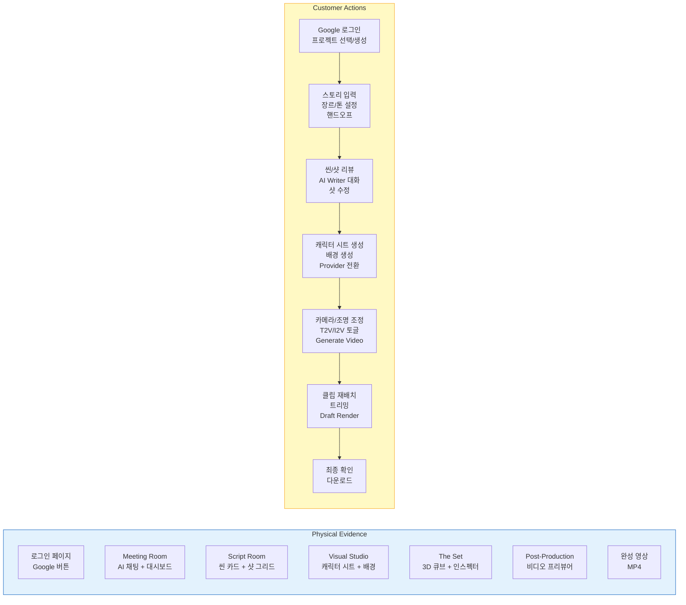
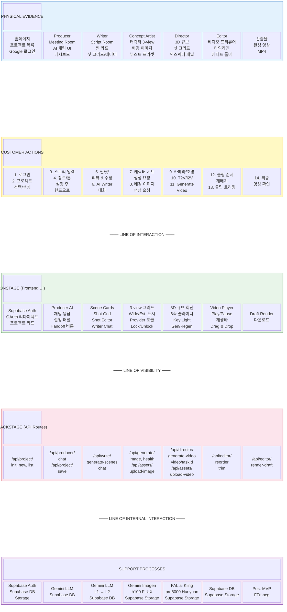
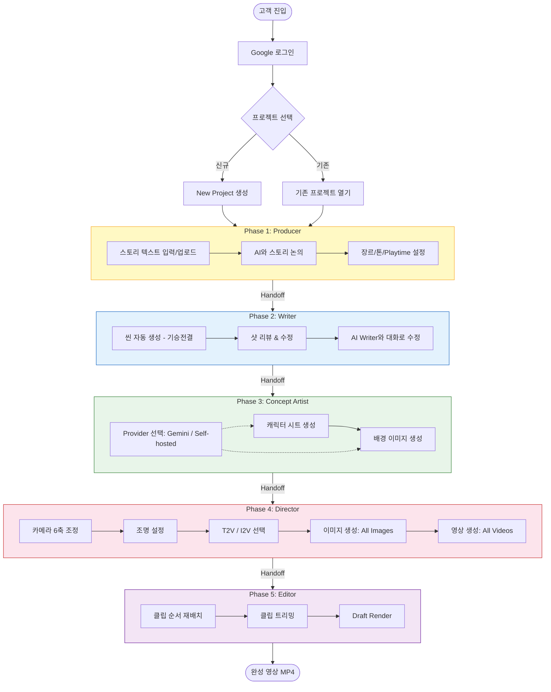
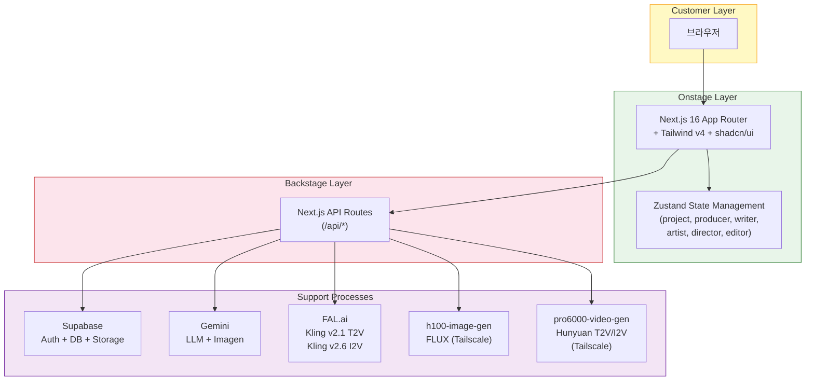
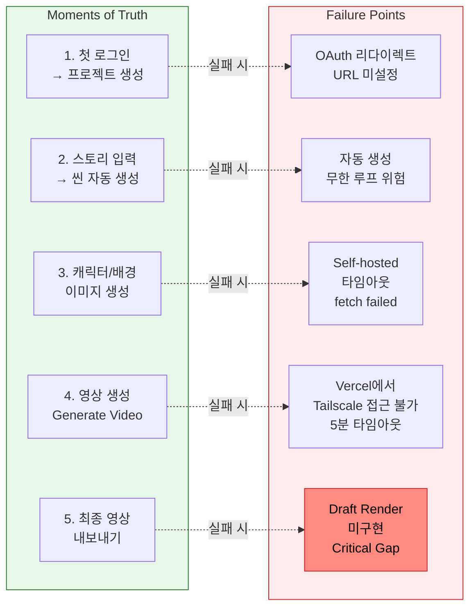

# Tale Studio — Service Blueprint

**서비스:** AI 영상 제작 파이프라인 (텍스트 → AI 비디오)
**고객 세그먼트:** B2B 영상 제작자 (마케팅 팀, 콘텐츠 크리에이터, 광고 에이전시)
**작성일:** 2026-04-06

---

## Blueprint 다이어그램

### 전체 서비스 흐름



### 5-Layer Blueprint (Mermaid Block Diagram)



### 고객 여정 흐름 (Customer Journey Flow)



### 기술 스택 레이어 (Support Process Map)



### Failure Points & Moments of Truth



---

## 단계별 상세 설명

### Phase 1: 진입 & 프로젝트 관리

| 구분 | 내용 |
|------|------|
| **Physical Evidence** | 로그인 페이지 (Google 버튼), 프로젝트 목록 페이지 (카드 그리드) |
| **Customer Action** | Google 로그인 → 프로젝트 선택 또는 "New Project" 생성 |
| **Onstage** | OAuth 리다이렉트, 프로젝트 카드 (제목, 현재 stage, 최종 수정일) 렌더링 |
| **Backstage** | `/api/project/init` — workspace 조회/생성, 최신 프로젝트 로드 |
| **Support** | Supabase Auth (세션 관리), Supabase DB (workspaces, projects 테이블) |
| **Fail Point** | OAuth 실패 시 에러 메시지 없음, Supabase 리다이렉트 URL 미설정 시 외부로 이동 |

### Phase 2: Producer (The Meeting Room)

| 구분 | 내용 |
|------|------|
| **Physical Evidence** | 좌: AI 채팅 인터페이스, 우: 프로젝트 대시보드 (장르/톤/playtime 설정) |
| **Customer Action** | 스토리 텍스트 입력 또는 파일 업로드 → 장르/톤 설정 → "Ask Writer" 핸드오프 |
| **Onstage** | Producer AI 응답 표시, 스토리 분석 결과, 설정 폼, Handoff 버튼 활성화 |
| **Backstage** | `/api/producer/chat` — Gemini LLM 호출, `saveAndHandoff()` — DB 저장 + stage 업데이트 |
| **Support** | Gemini LLM (스토리 분석/확장), Supabase DB (story_text, settings 저장) |
| **Fail Point** | 핸드오프 DB 저장 실패 시 사용자 피드백 없음 (silent fail) |

### Phase 3: Writer (The Script Room)

| 구분 | 내용 |
|------|------|
| **Physical Evidence** | 씬 카드 (기승전결), 샷 그리드, 샷 디테일 에디터, AI Writer 채팅 |
| **Customer Action** | 자동 생성된 씬/샷 리뷰 → 샷 상세 수정 (설명, 캐릭터, 시간, T2V/I2V) → AI Writer와 대화로 수정 요청 |
| **Onstage** | Scene Cards 렌더링, Shot Grid, Shot Editor 폼, Writer Chat 응답 |
| **Backstage** | `/api/write/generate-scenes` — LLM으로 씬/샷 자동 생성, `/api/write/chat` — AI Writer 대화 |
| **Support** | Gemini LLM (3-Level Pipeline: L1 Scene Architect → L2 Shot Composer), Supabase DB |
| **Fail Point** | 자동 생성 루프 위험 (Critical #2), 좌측 영역 스크롤 불가 시 내용 잘림 |

### Phase 4: Concept Artist (Visual Studio)

| 구분 | 내용 |
|------|------|
| **Physical Evidence** | 좌: 캐릭터 3-view 시트 (정면/측면/후면), 우: 배경 이미지 (Wide/Establishing) |
| **Customer Action** | "Generate Sheet" → 캐릭터 이미지 생성, "Generate Background" → 배경 생성, Provider 전환 (Gemini/Self-hosted) |
| **Onstage** | 이미지 생성 스피너, 3-view 그리드, 부스트 프리셋 칩, Provider 토글 (상태 표시등), Lock/Unlock |
| **Backstage** | `/api/generate/image` — Gemini Imagen 또는 Self-hosted FLUX 호출, `/api/assets/upload-image` — Storage 업로드 + DB 저장 |
| **Support** | Gemini Imagen (클라우드), h100-image-gen (Tailscale Self-hosted FLUX), Supabase Storage (media 버킷) |
| **Fail Point** | Self-hosted 타임아웃 (fetch failed), blob URL 메모리 누수, 이미지 영속화 실패 시 탭 이동 후 소실 |

### Phase 5: Director (The Set)

| 구분 | 내용 |
|------|------|
| **Physical Evidence** | 좌: 씬 네비게이션 (기승전결), 중: 샷 그리드 (썸네일+상태), 우: Cinematographic Inspector (3D 큐브, 슬라이더, Generate Video) |
| **Customer Action** | 카메라 6축 조정 → 조명 설정 → T2V/I2V 토글 → Generate Video (개별) 또는 All Images / All Videos (일괄) |
| **Onstage** | 3D 큐브 회전, 6축 슬라이더, Key Light 원형 UI, 상태 인디케이터 (초록/노랑/빨강), Gen/Regen 버튼, Provider 토글 (Img/Vid) |
| **Backstage** | `/api/director/generate-video` — FAL.ai Kling 또는 Self-hosted Hunyuan 호출, `/api/director/generate-video/[taskId]` — 폴링, `/api/assets/upload-video` — Supabase Storage 업로드 |
| **Support** | FAL.ai (Kling v2.1 T2V, v2.6 I2V), pro6000-video-gen (Hunyuan T2V/I2V, Tailscale), Supabase Storage + DB |
| **Fail Point** | Vercel에서 Self-hosted 접근 불가 (Tailscale 사설망), fetch 타임아웃, 영상 생성 5분 초과 시 타임아웃 |

### Phase 6: Editor (Post-Production)

| 구분 | 내용 |
|------|------|
| **Physical Evidence** | 상: 비디오 프리뷰어 (커스텀 플레이어), 하: 씬 탭 + 샷 타임라인 + 에디트 툴바 |
| **Customer Action** | 클립 선택 → 재생/일시정지 → 타임라인 드래그앤드롭으로 순서 변경 → 트리밍 → Draft Render |
| **Onstage** | 커스텀 비디오 플레이어 (Play/Pause, 재생바, 시간 표시), 타임라인 카드, Draft Render 버튼 |
| **Backstage** | `/api/editor/reorder` — 클립 순서 DB 저장, `/api/editor/trim` — 트림 포인트 DB 저장, `/api/editor/render-draft` — 플레이리스트 메타데이터 반환 (MVP) |
| **Support** | Supabase DB (sort_order, trim_start, trim_end), (Post-MVP: FFmpeg 영상 합치기) |
| **Fail Point** | Draft Render 미구현 (플레이스홀더), 삭제 확인 없음, 드래그 인덱스 검증 없음 |

---

## Moments of Truth (핵심 접점)

| # | 접점 | 고객 기대 | 현재 상태 | 개선 필요 |
|---|------|----------|----------|----------|
| 1 | **첫 로그인 → 프로젝트 생성** | 즉시 시작 가능 | Google OAuth + 자동 프로젝트 생성 | OK |
| 2 | **스토리 입력 → 씬 자동 생성** | 30초 내 결과 확인 | Gemini LLM 호출, 보통 10-20초 | OK |
| 3 | **캐릭터 이미지 생성** | 일관된 캐릭터, 빠른 생성 | Gemini: ~10초, Self-hosted: ~50초 | Self-hosted 타임아웃 위험 |
| 4 | **배경 이미지 생성** | 한 번에 2장 빠르게 | 순차 생성 (각 ~50초) | 긴 대기 시간 |
| 5 | **영상 생성 (Generate Video)** | 프로그레스 바, 예상 시간 | 5초 폴링, 상태 인디케이터만 | 프로그레스 % 표시 부재 |
| 6 | **영상 재생** | 네이티브급 플레이어 | 커스텀 Play/Pause + 재생바 | OK |
| 7 | **최종 영상 내보내기** | 하나의 합쳐진 MP4 | 미구현 (플레이스홀더) | **Critical Gap** |

---

## Failure Points & 개선 방향

| 실패 지점 | 현재 | 개선 |
|-----------|------|------|
| Self-hosted 서버 오프라인 | 버튼 무반응 | 토스트 알림 "서버 오프라인" |
| 이미지 생성 타임아웃 | "fetch failed" 에러 | 순차 생성 (완료) + 재시도 버튼 |
| 영상 Supabase 저장 실패 | 새로고침 시 영상 소실 | 저장 실패 시 사용자 알림 + 재시도 |
| 탭 이동 시 데이터 소실 | blob URL만 저장 | 영구 URL 저장 후 state 갱신 (완료) |
| Draft Render 미구현 | 버튼만 존재 | FFmpeg 서버 연동 또는 클라이언트 합치기 |
| 뒤로가기 네비게이션 | 잠긴 스테이지 접근 가능 | beforeunload + 서버 검증 |

---

## 기술 스택 매핑

```
Customer Layer:  Next.js 16 (App Router) + Tailwind v4 + shadcn/ui + Zustand
                         ↓
Onstage Layer:   React Components (features/*, components/*)
                         ↓
Backstage Layer: Next.js API Routes (/api/*)
                         ↓
Support Layer:   ┌─ Supabase (Auth + DB + Storage)
                 ├─ Gemini LLM (스토리/씬/샷 생성)
                 ├─ Gemini Imagen (이미지 생성)
                 ├─ FAL.ai Kling (클라우드 영상 생성)
                 ├─ h100 FLUX (Self-hosted 이미지, Tailscale)
                 └─ pro6000 Hunyuan (Self-hosted 영상, Tailscale)
```
