# BASE 팔 — writer 백엔드 자생 실행 결과

> 실행 경로: `node_modules/.bin/vitest run` → `tools/run-writer-base.test.ts` → `runPipeline()` (src/lib/writer/pipeline/index.ts, 제품 코드 그대로) → `runShotImages()` (v6_images.ts, fal.ts DEFAULT_IMAGE_MODEL) → 실패분은 `tools/retry-base-frames.test.ts`(동일 프롬프트 재시도)로 회수 → `research/experiments/utils/tools/gen/dispatch.mjs --mode higgsfield`(공용 디스패처, jobs.base.json 그대로)로 Seedance 2.0 영상까지 생성. 입력은 시나리오 원문 + 장르 태그(스릴러) + 캐스트 외형(신원 seed)뿐 — 카메라/연출 텍스트는 사람이 한 글자도 쓰지 않았다. 아래 프롬프트는 result.renderPrompts.shots[].t2i.prompt / ti2v.motion_prompt를 그대로 옮긴 것이다.

- project_id: `2026-07-23_14-25-51_bzb8`
- 장르: thriller/psychological_thriller · tone: quiet_dread, uncanny_stillness, retro_pastel · depth: D3 · format: horizontal_16:9
- LLM 호출 수: {"gemini":15,"claude":9,"openai":0,"local":0} — s1_structure(narrativeStructure, S축)가 gemini PROHIBITED_CONTENT로 25회 연속 차단(실측 — content-safety-hint.ts의 "소녀"+위해 조합 경고와 일치) → S축만 claude로 전환해 통과. V축은 gemini 그대로.
- 샷 수: 20 · 총 길이: 74s
- 시작 프레임: 최종 성공 19/20 (모델: openai/gpt-image-2). 최초 16/20 → fal 자체 content_policy_violation(422, 확률적 — FRAME_FAILURES.md 이전 버전 참조)을 동일 프롬프트 재시도로 3/4 추가 회수. shot_2 1건은 4회 연속 차단으로 Ⓑ(입력 문제) 확정, jobs.base.json/영상에서 제외.
- 영상 생성: `dispatch.mjs --mode higgsfield` — 19/19 클립 확보. base_09 1건이 최초 시도에서 higgsfield "nsfw"로 차단(확률적, 에러 독트린 Ⓐ) → 동일 입력 재시도 1회로 통과. → `assets/clips/arm-base/*.mp4`

## 샷별 (writer 산출 원문)

### 샷 01 — shot_1 (5s)

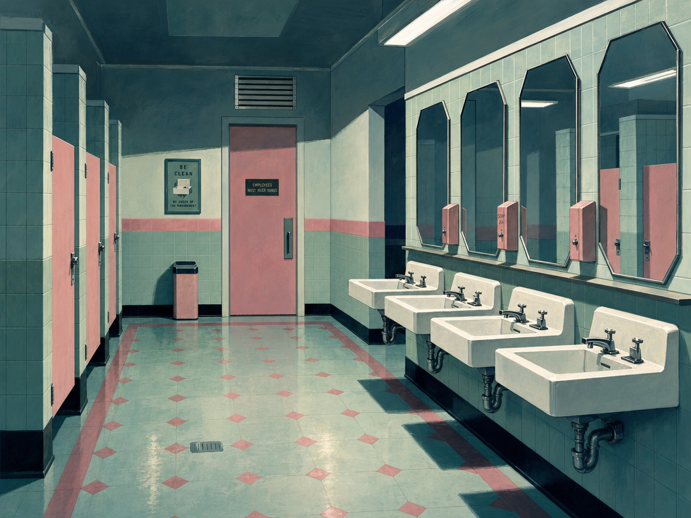

- **행동**: Establish the clinical, eerie atmosphere of the retro-pastel restroom at dawn.
- **카메라(writer 산출)**: {"type":"WS","angle":"eye_level","movement":"static"} · 구도: The vanishing point at the center of the restroom corridor. · 무드: Desaturated pastels with a cold, clinical blue undertone.

<details><summary>이미지 프롬프트 (T2I, writer 산출 원문)</summary>

```
A wide shot of an empty retro restroom with mint-green tiles and pink accents. Angular porcelain sinks line the wall under sharp-edged mirrors. Hard overhead fluorescent lighting creates sharp shadows. The art style is painterly retro-noir with clean lines and a palette of light steel blue and cherry blossom pink.
```
</details>

<details><summary>영상 프롬프트 (TI2V, writer 산출 원문)</summary>

```
The overhead fluorescent lights flicker subtly in the empty, silent restroom.
```
</details>

### 샷 02 — shot_2 (4s)


- **행동**: Introduce the protagonist into the sterile environment, emphasizing her isolation.
- **카메라(writer 산출)**: {"type":"MFS","angle":"eye_level","movement":"static"} · 구도: The girl as she enters the frame. · 무드: Maintain the cold dawn light, highlighting the pale blue of the dress.

<details><summary>이미지 프롬프트 (T2I, writer 산출 원문)</summary>

```
A medium full shot of a young woman with a black bob entering a mint-tiled restroom. She wears a pale blue satin slip dress and white socks. The lighting is hard and top-down, casting sharp shadows on the angular floor tiles. Her expression is calm and indifferent.
```
</details>

<details><summary>영상 프롬프트 (TI2V, writer 산출 원문)</summary>

```
The girl walks steadily across the tile floor toward the sinks.
```
</details>

### 샷 03 — shot_3 (7s)


- **행동**: Create suspense by showing the girl's ignorance of the ghostly whisper coming from below.
- **카메라(writer 산출)**: {"type":"MCU","angle":"eye_level","movement":"static"} · 구도: The girl's eyes in the mirror reflection. · 무드: Focus on the pink of the lip gloss and the pale blue of her dress reflection.

<details><summary>이미지 프롬프트 (T2I, writer 산출 원문)</summary>

```
A medium close-up of the girl's reflection in a rectangular mirror. She is applying pink lip gloss. Her black bob is neat, and she wears a silver choker. The background reflection shows the mint-tiled wall. The lighting is harsh, highlighting her pale skin and the satin texture of her dress.
```
</details>

<details><summary>영상 프롬프트 (TI2V, writer 산출 원문)</summary>

```
The girl slowly applies lip gloss to her lips while staring blankly at her reflection.
```
</details>

### 샷 04 — shot_4 (3s)

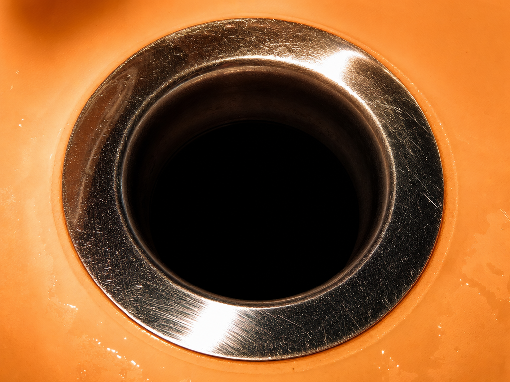

- **행동**: Identify the source of the whisper, grounding the horror in a physical object.
- **카메라(writer 산출)**: {"type":"ECU","angle":"high_angle","movement":"static"} · 구도: The center of the drain hole. · 무드: High contrast between the bright sink and the absolute black of the drain.

<details><summary>이미지 프롬프트 (T2I, writer 산출 원문)</summary>

```
An extreme close-up of a circular chrome sink drain set in an orange-tinted porcelain basin. The dark hole of the drain is at the center, appearing as an abyss. Harsh light reflects off the metallic rim, creating a stark contrast with the shadow inside.
```
</details>

<details><summary>영상 프롬프트 (TI2V, writer 산출 원문)</summary>

```
The camera remains perfectly still on the dark, yawning hole of the drain.
```
</details>

### 샷 05 — shot_5 (4s)


- **행동**: Conclude the scene with the girl's unsettling normalcy, leaving the audience in dread.
- **카메라(writer 산출)**: {"type":"MS","angle":"eye_level","movement":"static"} · 구도: The girl's face. · 무드: A slightly colder, more clinical blue tone to end the scene.

<details><summary>이미지 프롬프트 (T2I, writer 산출 원문)</summary>

```
A medium shot of the girl in the mint-tiled restroom. She has finished applying her lip gloss and is now calmly adjusting her hair in the mirror. Her expression is vacant and serene. The hard overhead light casts a cold glow over her pale blue satin dress.
```
</details>

<details><summary>영상 프롬프트 (TI2V, writer 산출 원문)</summary>

```
The girl adjusts her hair with a blank expression before the scene fades.
```
</details>

### 샷 06 — shot_6 (4s)

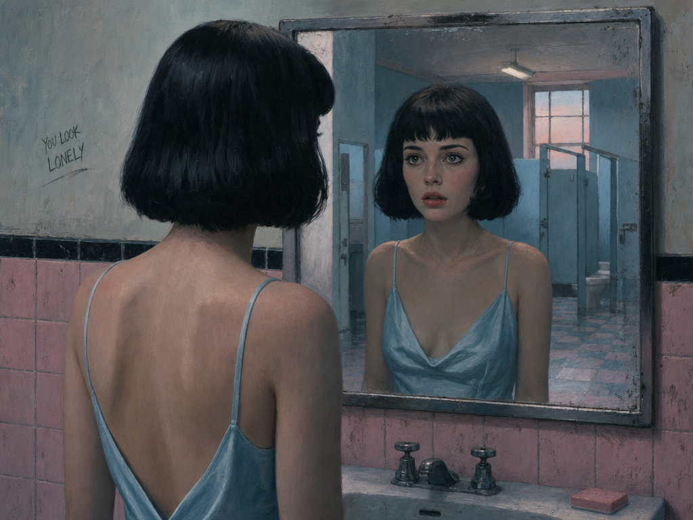

- **행동**: Visualize the girl's sudden isolation and the eerie realization of an uncanny presence in the empty space.
- **카메라(writer 산출)**: {"type":"MCU","angle":"eye_level","movement":"static"} · 구도: The girl's eyes in the mirror reflection. · 무드: Cool dawn tones with a hint of retro pastel blue to enhance the quiet dread.

<details><summary>이미지 프롬프트 (T2I, writer 산출 원문)</summary>

```
A medium close-up of a young woman with a sharp black bob, frozen in front of a rectangular mirror in a retro-noir restroom. She wears a pale blue satin slip dress. Her reflection shows a startled, still expression. In the background, empty ceramic stalls are bathed in soft, cool dawn light. The texture is painterly with subtle grime on the tiles. Palette of pale blue and soft pink.
```
</details>

<details><summary>영상 프롬프트 (TI2V, writer 산출 원문)</summary>

```
The girl remains completely frozen, her eyes subtly shifting to scan the reflection of the empty stalls.
```
</details>

### 샷 07 — shot_7 (3s)

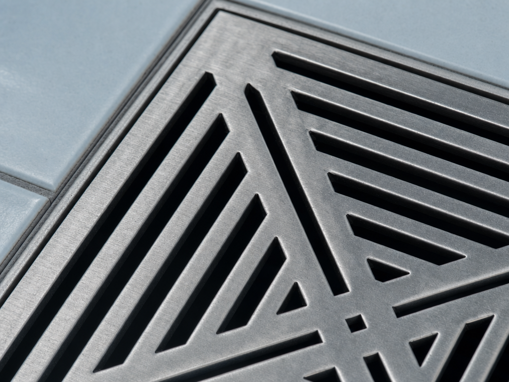

- **행동**: Clearly identify the source of the whisper, transforming a vague feeling into a specific, localized threat.
- **카메라(writer 산출)**: {"type":"ECU","angle":"high_angle","movement":"static"} · 구도: The center of the drain grating. · 무드: High contrast to emphasize the darkness within the drain.

<details><summary>이미지 프롬프트 (T2I, writer 산출 원문)</summary>

```
An extreme close-up of an angular, geometric floor drain grating. Dark shadows lurk within the holes of the metal. The surrounding ceramic tiles are a muted pale blue with sharp edges. Soft, cool lighting emphasizes the metallic texture and the dark void beneath the grate.
```
</details>

<details><summary>영상 프롬프트 (TI2V, writer 산출 원문)</summary>

```
A static shot focusing on the dark void of the drain as the shadows within seem to pulse.
```
</details>

### 샷 08 — shot_8 (5s)

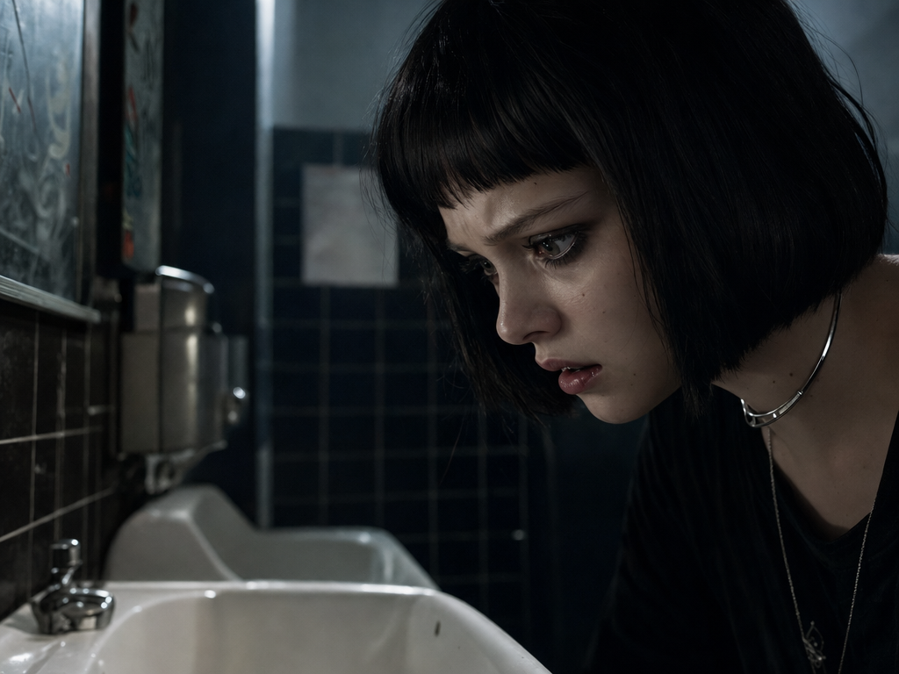

- **행동**: Escalate suspense by showing the character's fatal curiosity as she draws closer to the source of the voice.
- **카메라(writer 산출)**: {"type":"CU","angle":"low_angle","movement":"dolly_in"} · 구도: The girl's ear and her wide, anxious eye. · 무드: Deepen the cool blues while introducing a faint magenta glow in the shadows.

<details><summary>이미지 프롬프트 (T2I, writer 산출 원문)</summary>

```
A close-up of the girl's face, her expression one of intense focus and dread. She is positioned in the right third of the frame, leaning toward a porcelain sink. The background shows the angular lines of the restroom. Soft light hits the side of her face, highlighting her silver choker and black bob.
```
</details>

<details><summary>영상 프롬프트 (TI2V, writer 산출 원문)</summary>

```
The camera slowly dollys in as the girl leans her head down toward the sink, bringing her ear closer to the drain.
```
</details>

### 샷 09 — shot_9 (3s)


- **행동**: Capture the peak of the girl's curiosity and tension as she investigates the source of the sound.
- **카메라(writer 산출)**: {"type":"MS","angle":"low_angle","movement":"handheld_drift"} · 구도: The girl's hands near the pipes · 무드: Cold dawn blue tones with high contrast shadows.

<details><summary>이미지 프롬프트 (T2I, writer 산출 원문)</summary>

```
A medium shot of a young woman with a black bob, wearing a pale blue satin slip dress, leaning down toward the dark plumbing under a rectangular porcelain sink. Retro-noir public restroom with angular steel blue tiles. Hard lighting from above creates sharp shadows. Painterly texture philosophy with subtle grime on the walls.
```
</details>

<details><summary>영상 프롬프트 (TI2V, writer 산출 원문)</summary>

```
The girl leans deeper into the shadows while the camera drifts slightly forward.
```
</details>

### 샷 10 — shot_10 (2s)

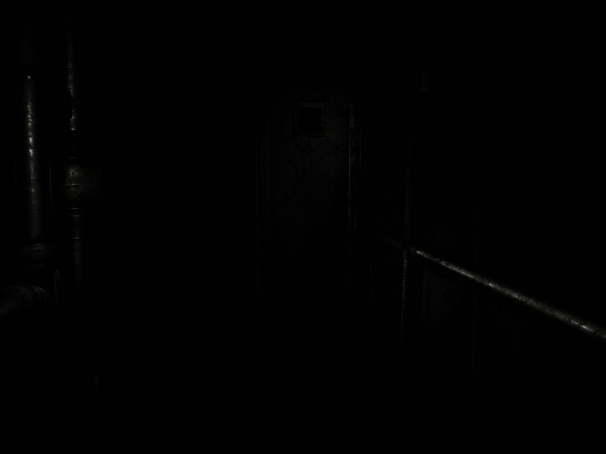

- **행동**: Shock the audience with a sensory blackout and a brief flash of violence.
- **카메라(writer 산출)**: {"type":"POV","angle":"eye_level","movement":"static"} · 구도: The center of the frame · 무드: Pitch black interrupted by an aggressive, saturated magenta burst.

<details><summary>이미지 프롬프트 (T2I, writer 산출 원문)</summary>

```
A POV shot in total darkness. The frame is pitch black with faint metallic textures. The atmosphere is heavy and silent before the scream. Retro-noir aesthetic with sharp-edged shadow logic.
```
</details>

<details><summary>영상 프롬프트 (TI2V, writer 산출 원문)</summary>

```
A sharp magenta flash bursts across the screen then fades into darkness.
```
</details>

### 샷 11 — shot_11 (4s)

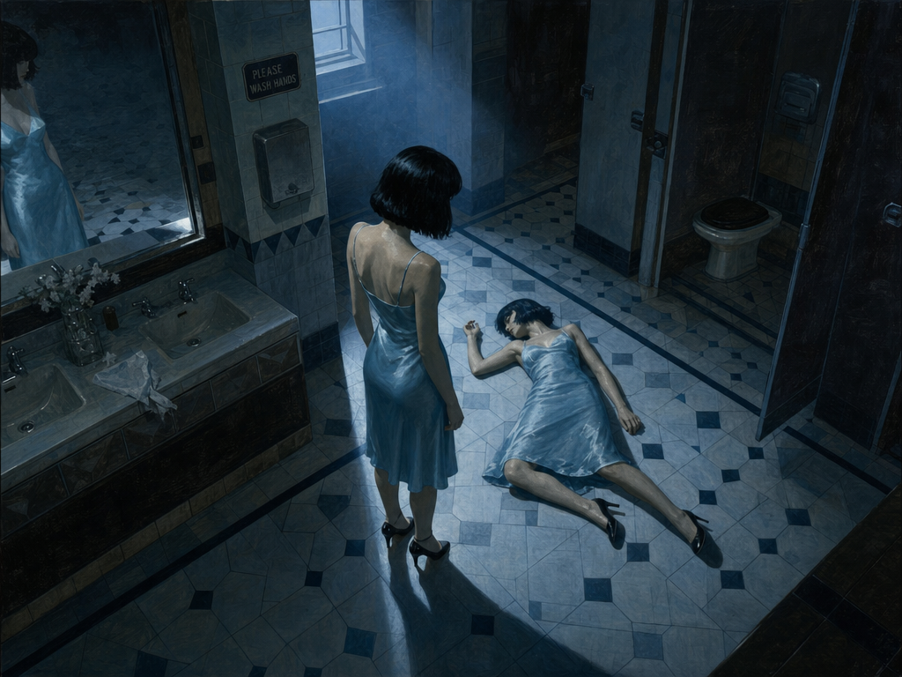

- **행동**: Establish the uncanny presence of the doppelganger and the girl's defeat.
- **카메라(writer 산출)**: {"type":"WS","angle":"high_angle","movement":"handheld_drift"} · 구도: The doppelganger's standing figure · 무드: Desaturated, clinical dawn light with deep blue shadows.

<details><summary>이미지 프롬프트 (T2I, writer 산출 원문)</summary>

```
A high-angle wide shot of a public restroom with angular ceramic tiles. A girl in a pale blue satin slip dress lies unconscious on the floor. Standing over her is an identical doppelganger in the same dress and black bob. The lighting is cold dawn blue, casting long, hard shadows. Retro-noir painterly texture.
```
</details>

<details><summary>영상 프롬프트 (TI2V, writer 산출 원문)</summary>

```
The doppelganger stands perfectly still while the camera breathes with a handheld drift.
```
</details>

### 샷 12 — shot_12 (5s)

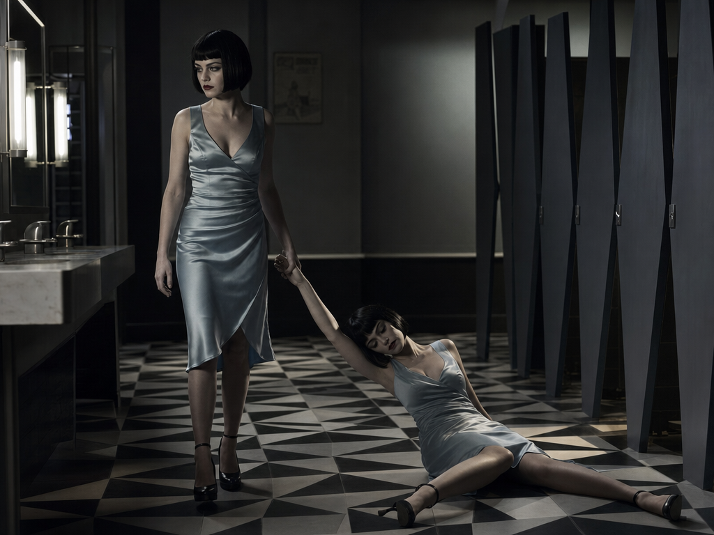

- **행동**: Demonstrate the doppelganger's cold, mechanical efficiency in disposing of the original.
- **카메라(writer 산출)**: {"type":"MFS","angle":"eye_level","movement":"handheld_drift"} · 구도: The doppelganger's hand on the girl's arm · 무드: Clinical, muted tones to match the emotionless action.

<details><summary>이미지 프롬프트 (T2I, writer 산출 원문)</summary>

```
A medium full shot of the doppelganger dragging the unconscious girl by the arm across a geometric tile floor. Both wear pale blue satin dresses and black bobs. The background features angular bathroom stalls in a retro-noir style. Harsh, cold lighting from the side creates deep shadows.
```
</details>

<details><summary>영상 프롬프트 (TI2V, writer 산출 원문)</summary>

```
The doppelganger slowly drags the limp body across the floor toward the left.
```
</details>

### 샷 13 — shot_13 (4s)

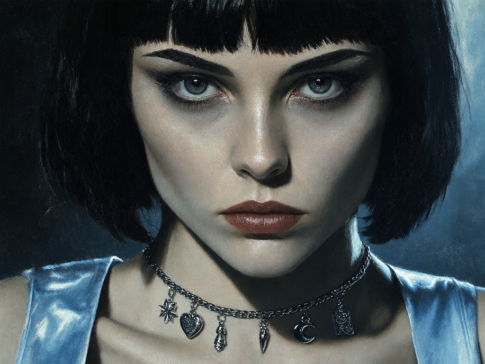

- **행동**: Final reveal of the doppelganger's perfect, terrifying lack of emotion.
- **카메라(writer 산출)**: {"type":"CU","angle":"eye_level","movement":"handheld_drift"} · 구도: Doppelganger's eyes · 무드: High contrast, emphasizing the pale skin and dark hair.

<details><summary>이미지 프롬프트 (T2I, writer 산출 원문)</summary>

```
An extreme close-up of the doppelganger’s face. She has a black bob and wears a silver charm choker. Her expression is completely blank and emotionless, staring directly into the lens. Hard lighting highlights the angular jaw and the pale blue satin of her dress. Retro-noir painterly style.
```
</details>

<details><summary>영상 프롬프트 (TI2V, writer 산출 원문)</summary>

```
The doppelganger stares into the camera with absolute stillness and no blinking.
```
</details>

### 샷 14 — shot_14 (3s)

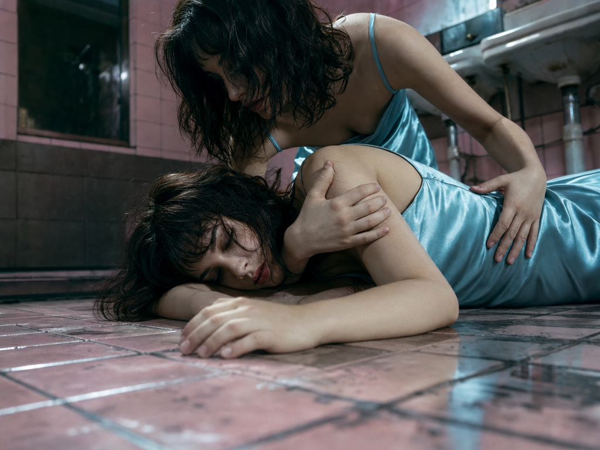

- **행동**: To emphasize the physical weight and total lack of life in the victim's body through a grounding floor-level perspective.
- **카메라(writer 산출)**: {"type":"FS","angle":"low_angle","movement":"handheld_drift"} · 구도: The point of contact between the girl's shoulder and the floor. · 무드: Cold, clinical dawn light with harsh magenta shadows in the corners.

<details><summary>이미지 프롬프트 (T2I, writer 산출 원문)</summary>

```
Low angle floor level shot in a retro-noir restroom. A doppelganger in a pale blue satin slip dress is laying a limp, identical girl onto cold, angular pink ceramic tiles. The lighting is harsh and clinical 6500K. Painterly textures of water stains and grime on the floor. 50mm lens, sharp focus on the contact point.
```
</details>

<details><summary>영상 프롬프트 (TI2V, writer 산출 원문)</summary>

```
The doppelganger slowly lowers the limp body of the girl onto the tiles with a heavy, physical weight.
```
</details>

### 샷 15 — shot_15 (2s)

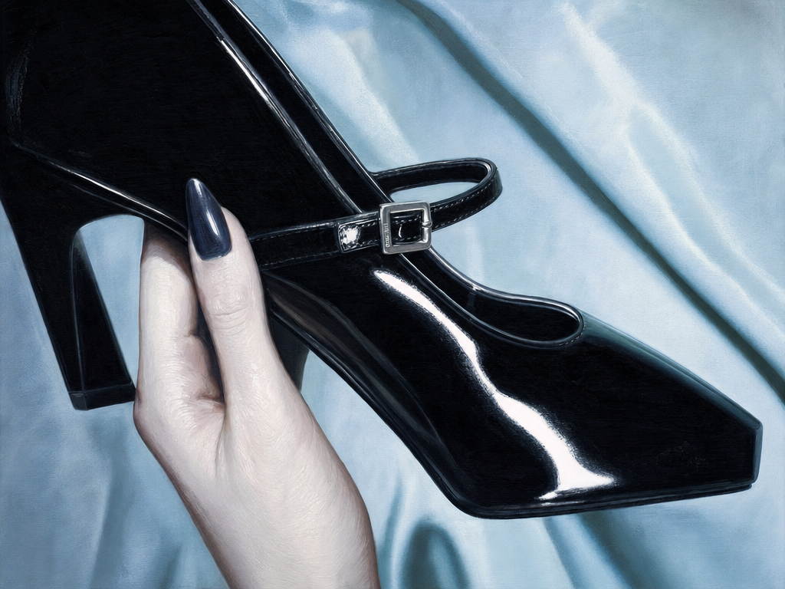

- **행동**: Highlight the uncanny and fetishistic detachment of the antagonist through a close-up of a stolen personal item.
- **카메라(writer 산출)**: {"type":"ECU","angle":"eye_level","movement":"handheld_drift"} · 구도: The angular toe of the black Mary Jane heel. · 무드: High contrast with magenta highlights reflecting off the black leather.

<details><summary>이미지 프롬프트 (T2I, writer 산출 원문)</summary>

```
Extreme close-up of a pale hand holding a black patent leather Mary Jane heel with an angular toe. Harsh fluorescent light creates sharp highlights on the leather. The background is a blurred pale blue satin. Retro-pastel noir aesthetic with painterly textures.
```
</details>

<details><summary>영상 프롬프트 (TI2V, writer 산출 원문)</summary>

```
The hand subtly tightens its grip on the shoe while the camera drifts slightly forward.
```
</details>

### 샷 16 — shot_16 (4s)

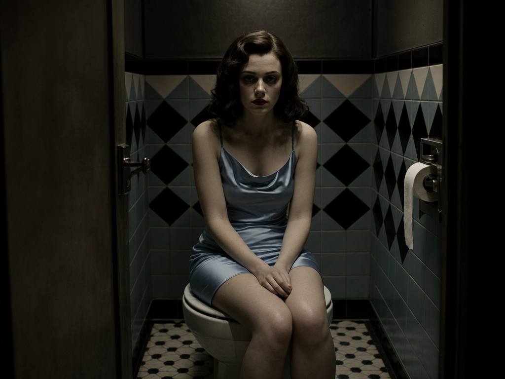

- **행동**: To build dread through a prolonged moment of unnatural stillness and psychological void.
- **카메라(writer 산출)**: {"type":"MS","angle":"eye_level","movement":"handheld_drift"} · 구도: The doppelganger's eyes. · 무드: Desaturated blues and pinks with deep, oppressive shadows.

<details><summary>이미지 프롬프트 (T2I, writer 산출 원문)</summary>

```
Medium shot of the doppelganger sitting motionless on a closed toilet lid in a dim restroom stall. She wears a pale blue satin slip dress and has a vacant expression. Harsh top-down lighting creates deep shadows under her eyes. Retro-noir style with angular tiles in the background.
```
</details>

<details><summary>영상 프롬프트 (TI2V, writer 산출 원문)</summary>

```
The doppelganger remains unnervingly still, staring blankly as the camera drifts with a subtle handheld breathing.
```
</details>

### 샷 17 — shot_17 (3s)

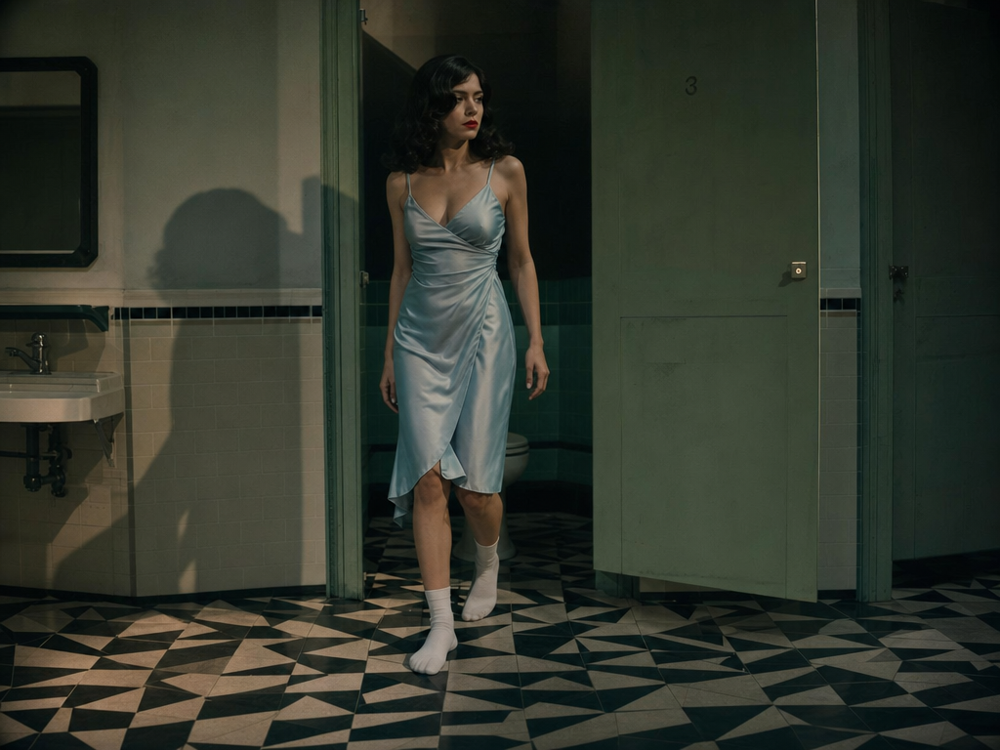

- **행동**: To signify the completion of the 'replacement' and the abandonment of the original girl.
- **카메라(writer 산출)**: {"type":"MFS","angle":"eye_level","movement":"tracking"} · 구도: The doppelganger's back as she walks away. · 무드: Cold blue dominance with a final flash of magenta from the overhead lights.

<details><summary>이미지 프롬프트 (T2I, writer 산출 원문)</summary>

```
Medium full shot in a retro-noir restroom. The doppelganger stands up from the toilet and walks out of the stall. She is wearing a pale blue satin dress and white socks. The stall door swings slowly. Harsh lighting creates long shadows on the angular tiled floor. 50mm lens.
```
</details>

<details><summary>영상 프롬프트 (TI2V, writer 산출 원문)</summary>

```
The doppelganger walks away with a cold, steady pace as the stall door swings shut behind her.
```
</details>

### 샷 18 — shot_18 (2.5s)

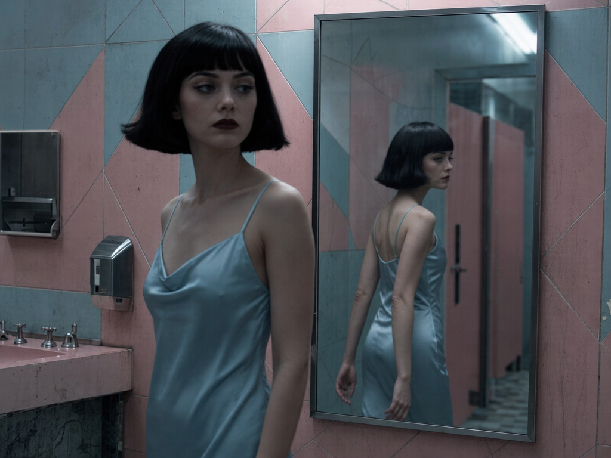

- **행동**: To convey a sense of uncanny detachment by showing the doppelganger's mechanical and indifferent movement as she replaces the original girl.
- **카메라(writer 산출)**: {"type":"MS","angle":"eye_level","movement":"static"} · 구도: The doppelganger's face · 무드: Cool and clinical, emphasizing the pale blue tones to match the dawn light.

<details><summary>이미지 프롬프트 (T2I, writer 산출 원문)</summary>

```
Medium shot in a retro-noir restroom. The doppelganger, a girl with a black bob and pale blue satin slip dress, walks past a sharp-edged rectangular mirror. Her expression is perfectly void of emotion. The walls are covered in angular ceramic tiles with subtle painterly grime. Soft 6500K light from above creates a cool, clinical atmosphere. Palette of pale blue and soft pink dominates.
```
</details>

<details><summary>영상 프롬프트 (TI2V, writer 산출 원문)</summary>

```
The doppelganger walks steadily across the frame with mechanical indifference, exiting the shot.
```
</details>

### 샷 19 — shot_19 (2.5s)

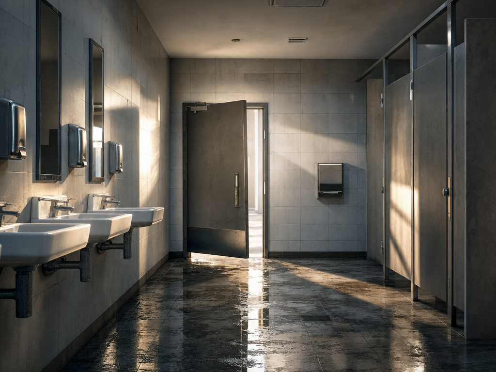

- **행동**: To create a vacuum of sound and presence, heightening the dread through the sudden emptiness of the space.
- **카메라(writer 산출)**: {"type":"WS","angle":"eye_level","movement":"static"} · 구도: The closing door · 무드: Desaturated and hollow, emphasizing the lack of life in the room.

<details><summary>이미지 프롬프트 (T2I, writer 산출 원문)</summary>

```
Wide shot of the empty, angular restroom. A heavy door is in the process of swinging shut. The space is filled with hollow silence and sharp shadows. Porcelain sinks and silver soap dispensers reflect the cool dawn light. The color temperature is slightly warmer at 6000K. The floor tiles are wet with a painterly texture.
```
</details>

<details><summary>영상 프롬프트 (TI2V, writer 산출 원문)</summary>

```
The restroom door swings shut slowly, clicking into place, leaving the room completely still.
```
</details>

### 샷 20 — shot_20 (4s)

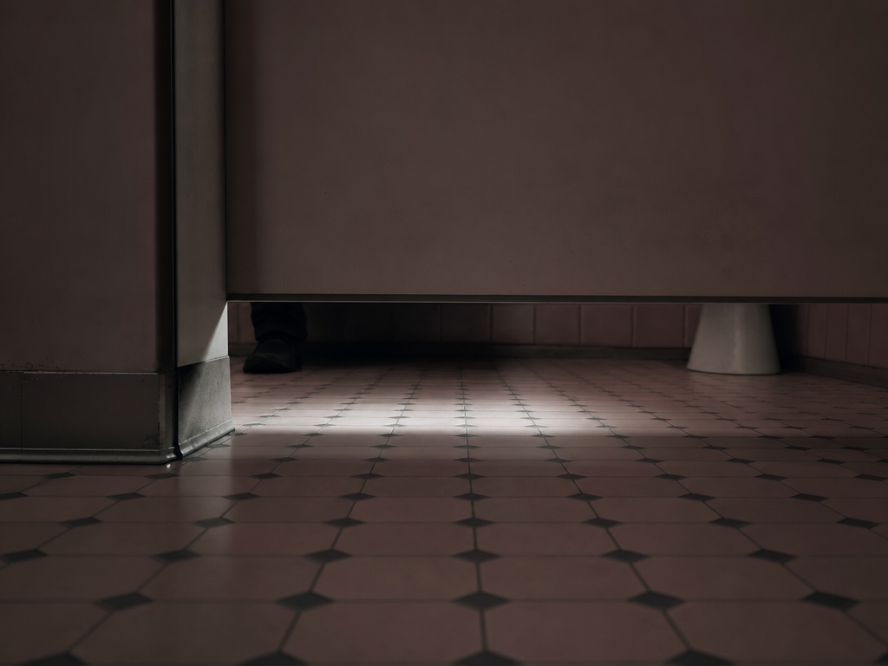

- **행동**: To deliver the final chilling revelation that the original girl is still there, discarded and forgotten.
- **카메라(writer 산출)**: {"type":"CU","angle":"low_angle","movement":"dolly_in"} · 구도: The white crew socks and black Mary Jane heels · 무드: The warmest but most ominous tone, with deep shadows creeping from the stall.

<details><summary>이미지 프롬프트 (T2I, writer 산출 원문)</summary>

```
Close-up, low-angle shot focusing on the narrow gap beneath a bathroom stall door. The floor is tiled in a geometric pattern with a subtle pinkish hue. The lighting is soft and dim at 5600K, casting long shadows. The edges of the stall door are sharp and clean. The atmosphere is thick with dread.
```
</details>

<details><summary>영상 프롬프트 (TI2V, writer 산출 원문)</summary>

```
The camera slowly dollies forward toward the stall gap, revealing the motionless white-socked feet of the original girl.
```
</details>
