# BKM 테이크 리뷰 — 입력 이미지 + 프롬프트 한눈 보기 (영상 생성 직전 상태)

> 테이크 27개 × [시작|끝] 프레임 + 영상 프롬프트. 이 문서가 **QC 게이트 검수 대상**이다 —
> 신원(정본과 같은 인물인가) · 시선 방향 · 소품 접촉 · 카메라 구도(원본 컷과 대응하는가)를 보고,
> 불합격 테이크를 짚으면 재생성한다. 발사 준비물: [`../../jobs.bkm.json`](../../jobs.bkm.json)
> · 컷 대응/원본 프레임: [`../../conti_full.md`](../../conti_full.md) · 시나리오: [`../../scenario.md`](../../scenario.md)

공통 계약(전 테이크 프롬프트 뒤에 붙음): 연속성 바이블 · 네거티브 배터리 — 원문은 문서 말미.

## T01 — 컷 s01·s04 · 5초

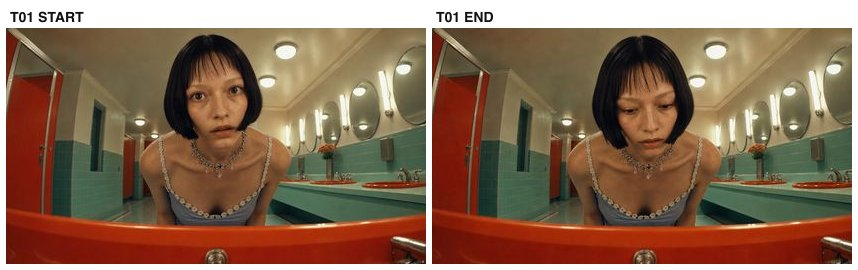

- **요약(한국어)**: 광각 세면대 안에서 올려다본 얼굴 CU, 고정 — 림 너머로 숙이며 배수구를 살핀다. 희미한 목소리의 근원을 찾는 중.
- **페이로드**: `arm-bkm/frames/T01_start.jpg` + `arm-bkm/frames/T01_end.jpg` → `clips/arm-bkm/T01.mp4` (5s)

<details><summary>영상 프롬프트 원문 (카메라 4요소 + 동작 + 사건 + 공통 계약)</summary>

```
She leans over the sink rim, peering down into it, head tilting slowly a few degrees. Ultra-wide lens (14mm feel, mild fisheye distortion), extreme close-up from inside the orange sink looking up over the rim, her face large in frame. Camera locked, no movement. Warm fluorescent glow from the ceiling behind her head.
Context: She is searching for the source of a faint voice that seemed to come from the drain.
Continuity bible (LOCKED): the same young woman (black lip-length bob with wispy bangs, layered silver charm choker, pale blue satin slip dress with white daisy lace trim, white crew socks, black mary-jane heels); wardrobe and hairstyle never change. Location: retro pastel public restroom — mint-green tiles, orange-red round sinks on a mint counter, large round mirrors with vertical tube lights, red-orange stall doors. Light: warm fluorescent from above the mirrors, constant, same time of day. Signature props: small lip-gloss wand; chrome drain. Genre mood: quiet thriller — calm, uncanny stillness.
Never: any camera movement beyond what is specified, wardrobe or hairstyle change, shadow direction flip, day/night jump, extra people beyond those specified, duplicate faces beyond those specified, plastic skin, morphing hands, on-screen text, watermark.
```
</details>

## T02 — 컷 s02 · 4초

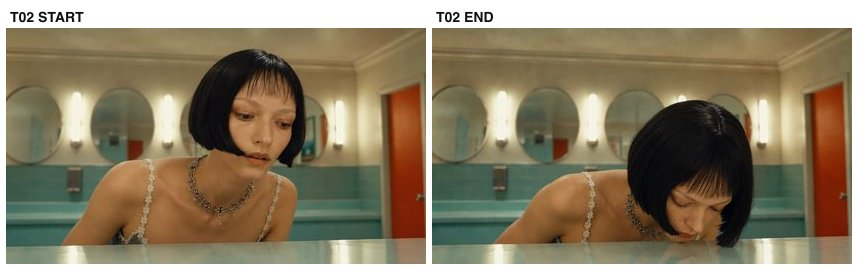

- **요약(한국어)**: 로우앵글 얼굴 CU, 고정 — 몸을 숙이며 시선 아래로. 세면대 쪽에 신경이 쏠려 있다.
- **페이로드**: `arm-bkm/frames/T02_start.jpg` + `arm-bkm/frames/T02_end.jpg` → `clips/arm-bkm/T02.mp4` (4s)

<details><summary>영상 프롬프트 원문 (카메라 4요소 + 동작 + 사건 + 공통 계약)</summary>

```
She bends down slowly, eyes scanning downward, lips slightly parted in concentration. 35mm, low-angle close-up rising toward her face as she bends forward over the counter. Camera locked. Shallow depth of field, tube lights soft in background.
Context: She is leaning in to listen — something in the sink area caught her attention.
Continuity bible (LOCKED): the same young woman (black lip-length bob with wispy bangs, layered silver charm choker, pale blue satin slip dress with white daisy lace trim, white crew socks, black mary-jane heels); wardrobe and hairstyle never change. Location: retro pastel public restroom — mint-green tiles, orange-red round sinks on a mint counter, large round mirrors with vertical tube lights, red-orange stall doors. Light: warm fluorescent from above the mirrors, constant, same time of day. Signature props: small lip-gloss wand; chrome drain. Genre mood: quiet thriller — calm, uncanny stillness.
Never: any camera movement beyond what is specified, wardrobe or hairstyle change, shadow direction flip, day/night jump, extra people beyond those specified, duplicate faces beyond those specified, plastic skin, morphing hands, on-screen text, watermark.
```
</details>

## T03 — 컷 s03 · 4초

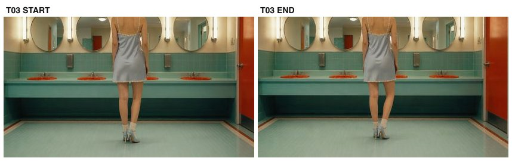

- **요약(한국어)**: 거울벽 앞 하반신 미디엄, 고정 — 거의 정지, 체중 이동 한 번. 조용한 순간.
- **페이로드**: `arm-bkm/frames/T03_start.jpg` + `arm-bkm/frames/T03_end.jpg` → `clips/arm-bkm/T03.mp4` (4s)

<details><summary>영상 프롬프트 원문 (카메라 4요소 + 동작 + 사건 + 공통 계약)</summary>

```
She stands nearly still, weight shifting once from one leg to the other. 35mm, medium shot of her lower body — skirt hem, bare legs, socks and heels — in front of the mirror wall, tube lights flanking. Camera locked at hip height.
Context: A quiet moment; the restroom is silent around her.
Continuity bible (LOCKED): the same young woman (black lip-length bob with wispy bangs, layered silver charm choker, pale blue satin slip dress with white daisy lace trim, white crew socks, black mary-jane heels); wardrobe and hairstyle never change. Location: retro pastel public restroom — mint-green tiles, orange-red round sinks on a mint counter, large round mirrors with vertical tube lights, red-orange stall doors. Light: warm fluorescent from above the mirrors, constant, same time of day. Signature props: small lip-gloss wand; chrome drain. Genre mood: quiet thriller — calm, uncanny stillness.
Never: any camera movement beyond what is specified, wardrobe or hairstyle change, shadow direction flip, day/night jump, extra people beyond those specified, duplicate faces beyond those specified, plastic skin, morphing hands, on-screen text, watermark.
```
</details>

## T04 — 컷 s06 · 4초

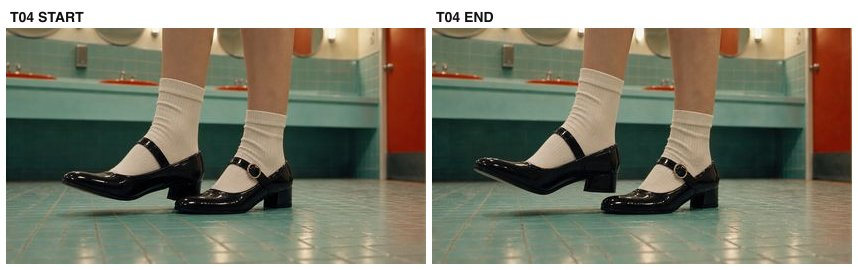

- **요약(한국어)**: 바닥 구두 매크로, 고정 — 발 거의 정지. 디테일 쉼표.
- **페이로드**: `arm-bkm/frames/T04_start.jpg` + `arm-bkm/frames/T04_end.jpg` → `clips/arm-bkm/T04.mp4` (4s)

<details><summary>영상 프롬프트 원문 (카메라 4요소 + 동작 + 사건 + 공통 계약)</summary>

```
Feet nearly still; one heel lifts a centimeter and settles. Macro close-up, 60mm, of her black mary-jane heels and white crew socks on the mint tile floor. Camera locked at floor level. Crisp focus on the shoes.
Context: Detail beat — her shoes on the spotless tile, the room utterly quiet.
Continuity bible (LOCKED): the same young woman (black lip-length bob with wispy bangs, layered silver charm choker, pale blue satin slip dress with white daisy lace trim, white crew socks, black mary-jane heels); wardrobe and hairstyle never change. Location: retro pastel public restroom — mint-green tiles, orange-red round sinks on a mint counter, large round mirrors with vertical tube lights, red-orange stall doors. Light: warm fluorescent from above the mirrors, constant, same time of day. Signature props: small lip-gloss wand; chrome drain. Genre mood: quiet thriller — calm, uncanny stillness.
Never: any camera movement beyond what is specified, wardrobe or hairstyle change, shadow direction flip, day/night jump, extra people beyond those specified, duplicate faces beyond those specified, plastic skin, morphing hands, on-screen text, watermark.
```
</details>

## T05 — 컷 s07 · 4초

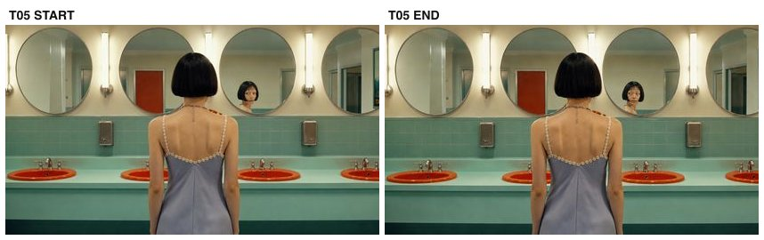

- **요약(한국어)**: 거울벽 뒷모습 미디엄(거울에 문 반사), 고정 — 거울로 빈 화장실을 살핀다. 입장 직후.
- **페이로드**: `arm-bkm/frames/T05_start.jpg` + `arm-bkm/frames/T05_end.jpg` → `clips/arm-bkm/T05.mp4` (4s)

<details><summary>영상 프롬프트 원문 (카메라 4요소 + 동작 + 사건 + 공통 계약)</summary>

```
She stands facing the mirrors, head turning a few degrees as she checks the room in the reflection. 35mm, medium back view: she faces the mirror wall, her back to camera, red door visible in the mirror reflection. Camera locked at shoulder height.
Context: She has just walked in; she surveys the empty restroom through the mirror.
Continuity bible (LOCKED): the same young woman (black lip-length bob with wispy bangs, layered silver charm choker, pale blue satin slip dress with white daisy lace trim, white crew socks, black mary-jane heels); wardrobe and hairstyle never change. Location: retro pastel public restroom — mint-green tiles, orange-red round sinks on a mint counter, large round mirrors with vertical tube lights, red-orange stall doors. Light: warm fluorescent from above the mirrors, constant, same time of day. Signature props: small lip-gloss wand; chrome drain. Genre mood: quiet thriller — calm, uncanny stillness.
Never: any camera movement beyond what is specified, wardrobe or hairstyle change, shadow direction flip, day/night jump, extra people beyond those specified, duplicate faces beyond those specified, plastic skin, morphing hands, on-screen text, watermark.
```
</details>

## T06 — 컷 s08 · 4초

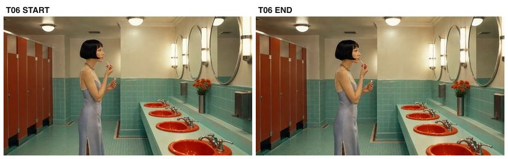

- **요약(한국어)**: 카운터 옆 전신 프로필, 고정 — 립글로스를 꺼내 든다. 루틴 시작.
- **페이로드**: `arm-bkm/frames/T06_start.jpg` + `arm-bkm/frames/T06_end.jpg` → `clips/arm-bkm/T06.mp4` (4s)

<details><summary>영상 프롬프트 원문 (카메라 4요소 + 동작 + 사건 + 공통 계약)</summary>

```
She stands at the counter and takes out a small lip-gloss wand from her hand, raising it. 35mm, full-body left profile at the counter, mirrors and sinks receding to the right. Camera locked at chest height.
Context: She begins her makeup routine, unhurried.
Continuity bible (LOCKED): the same young woman (black lip-length bob with wispy bangs, layered silver charm choker, pale blue satin slip dress with white daisy lace trim, white crew socks, black mary-jane heels); wardrobe and hairstyle never change. Location: retro pastel public restroom — mint-green tiles, orange-red round sinks on a mint counter, large round mirrors with vertical tube lights, red-orange stall doors. Light: warm fluorescent from above the mirrors, constant, same time of day. Signature props: small lip-gloss wand; chrome drain. Genre mood: quiet thriller — calm, uncanny stillness.
Never: any camera movement beyond what is specified, wardrobe or hairstyle change, shadow direction flip, day/night jump, extra people beyond those specified, duplicate faces beyond those specified, plastic skin, morphing hands, on-screen text, watermark.
```
</details>

## T07 — 컷 s09 · 6초

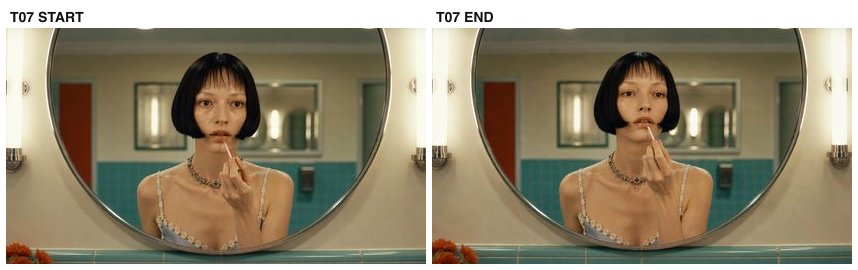

- **요약(한국어)**: 거울 정면 CU(50mm), 고정 — 립을 천천히 바른다. 희미한 "somebody help me"가 스치지만 거의 못 알아챈다. 끝에서 손이 한 박자 멈칫.
- **페이로드**: `arm-bkm/frames/T07_start.jpg` + `arm-bkm/frames/T07_end.jpg` → `clips/arm-bkm/T07.mp4` (6s)

<details><summary>영상 프롬프트 원문 (카메라 4요소 + 동작 + 사건 + 공통 계약)</summary>

```
She slowly applies lip gloss; only her hand and lips move. Near the end her hand hesitates for one beat, then continues. 50mm, straight-on eye-level close-up framed inside the round mirror, chest-up composition, tube lights at both edges. Camera locked on tripod, no movement.
Context: A faint female whisper — "somebody… help me…" — drifts in, almost inaudible, like ASMR. She barely registers it and keeps applying.
Continuity bible (LOCKED): the same young woman (black lip-length bob with wispy bangs, layered silver charm choker, pale blue satin slip dress with white daisy lace trim, white crew socks, black mary-jane heels); wardrobe and hairstyle never change. Location: retro pastel public restroom — mint-green tiles, orange-red round sinks on a mint counter, large round mirrors with vertical tube lights, red-orange stall doors. Light: warm fluorescent from above the mirrors, constant, same time of day. Signature props: small lip-gloss wand; chrome drain. Genre mood: quiet thriller — calm, uncanny stillness.
Never: any camera movement beyond what is specified, wardrobe or hairstyle change, shadow direction flip, day/night jump, extra people beyond those specified, duplicate faces beyond those specified, plastic skin, morphing hands, on-screen text, watermark.
```
</details>

## T08 — 컷 s10 · 4초

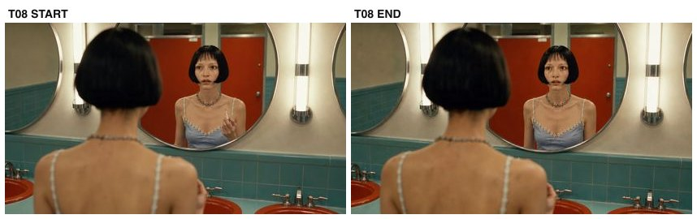

- **요약(한국어)**: 오버숄더 거울 반사, 고정 — 립 마무리, 반사 확인. 목소리는 사라졌고 미묘하게 불안.
- **페이로드**: `arm-bkm/frames/T08_start.jpg` + `arm-bkm/frames/T08_end.jpg` → `clips/arm-bkm/T08.mp4` (4s)

<details><summary>영상 프롬프트 원문 (카메라 4요소 + 동작 + 사건 + 공통 계약)</summary>

```
She finishes the gloss, lowers the wand, studies her reflection. 50mm, over-shoulder from behind her head, her face visible in the round mirror reflection. Camera locked.
Context: The whisper is gone; she returns to her routine, faintly uneasy.
Continuity bible (LOCKED): the same young woman (black lip-length bob with wispy bangs, layered silver charm choker, pale blue satin slip dress with white daisy lace trim, white crew socks, black mary-jane heels); wardrobe and hairstyle never change. Location: retro pastel public restroom — mint-green tiles, orange-red round sinks on a mint counter, large round mirrors with vertical tube lights, red-orange stall doors. Light: warm fluorescent from above the mirrors, constant, same time of day. Signature props: small lip-gloss wand; chrome drain. Genre mood: quiet thriller — calm, uncanny stillness.
Never: any camera movement beyond what is specified, wardrobe or hairstyle change, shadow direction flip, day/night jump, extra people beyond those specified, duplicate faces beyond those specified, plastic skin, morphing hands, on-screen text, watermark.
```
</details>

## T09 — 컷 s11 · 4초

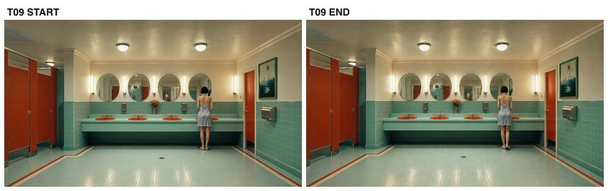

- **요약(한국어)**: 마스터 와이드(대칭·1점 투시), 고정 — 카운터에 거의 정지. 넓은 쉼표.
- **페이로드**: `arm-bkm/frames/T09_start.jpg` + `arm-bkm/frames/T09_end.jpg` → `clips/arm-bkm/T09.mp4` (4s)

<details><summary>영상 프롬프트 원문 (카메라 4요소 + 동작 + 사건 + 공통 계약)</summary>

```
She stands almost still at the counter. 24mm, symmetrical master wide of the whole restroom, she stands small right of center facing the mirror wall. Camera locked, perfectly level, one-point perspective.
Context: Wide pause — the room is large, symmetrical, and empty around her.
Continuity bible (LOCKED): the same young woman (black lip-length bob with wispy bangs, layered silver charm choker, pale blue satin slip dress with white daisy lace trim, white crew socks, black mary-jane heels); wardrobe and hairstyle never change. Location: retro pastel public restroom — mint-green tiles, orange-red round sinks on a mint counter, large round mirrors with vertical tube lights, red-orange stall doors. Light: warm fluorescent from above the mirrors, constant, same time of day. Signature props: small lip-gloss wand; chrome drain. Genre mood: quiet thriller — calm, uncanny stillness.
Never: any camera movement beyond what is specified, wardrobe or hairstyle change, shadow direction flip, day/night jump, extra people beyond those specified, duplicate faces beyond those specified, plastic skin, morphing hands, on-screen text, watermark.
```
</details>

## T10 — 컷 s12 · 4초

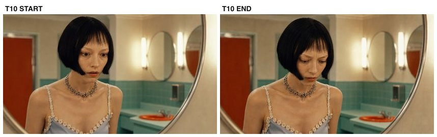

- **요약(한국어)**: 3/4 얼굴 CU, 고정 — 더 또렷한 "help me"에 놀람 → 거울 훑고 → 시선이 세면대로 떨어진다. (17s 비트)
- **페이로드**: `arm-bkm/frames/T10_start.jpg` + `arm-bkm/frames/T10_end.jpg` → `clips/arm-bkm/T10.mp4` (4s)

<details><summary>영상 프롬프트 원문 (카메라 4요소 + 동작 + 사건 + 공통 계약)</summary>

```
She startles — a small jolt — glances up at the mirror, scans it, then her gaze drops down toward the sink below. 50mm, three-quarter face close-up, her head and shoulders, mirror edge soft behind. Camera locked.
Context: The voice comes again, clearer this time — "help me." It seems to come from below, from the sink.
Continuity bible (LOCKED): the same young woman (black lip-length bob with wispy bangs, layered silver charm choker, pale blue satin slip dress with white daisy lace trim, white crew socks, black mary-jane heels); wardrobe and hairstyle never change. Location: retro pastel public restroom — mint-green tiles, orange-red round sinks on a mint counter, large round mirrors with vertical tube lights, red-orange stall doors. Light: warm fluorescent from above the mirrors, constant, same time of day. Signature props: small lip-gloss wand; chrome drain. Genre mood: quiet thriller — calm, uncanny stillness.
Never: any camera movement beyond what is specified, wardrobe or hairstyle change, shadow direction flip, day/night jump, extra people beyond those specified, duplicate faces beyond those specified, plastic skin, morphing hands, on-screen text, watermark.
```
</details>

## T11 — 컷 s13 · 4초

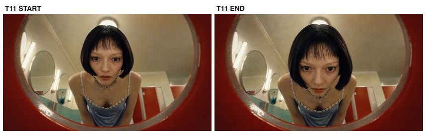

- **요약(한국어)**: 세면대 안 광각 POV, 고정 — 림 위로 천천히 숙이며 귀 기울인다. 배수구 확신.
- **페이로드**: `arm-bkm/frames/T11_start.jpg` + `arm-bkm/frames/T11_end.jpg` → `clips/arm-bkm/T11.mp4` (4s)

<details><summary>영상 프롬프트 원문 (카메라 4요소 + 동작 + 사건 + 공통 계약)</summary>

```
She leans in slowly over the sink, face lowering toward the rim, eyes fixed downward, listening. Ultra-wide from inside the sink basin looking straight up, orange rim framing the edges, her face above looking down, ceiling lamp behind her head. Camera locked.
Context: She is certain now the voice came from the drain; she searches it.
Continuity bible (LOCKED): the same young woman (black lip-length bob with wispy bangs, layered silver charm choker, pale blue satin slip dress with white daisy lace trim, white crew socks, black mary-jane heels); wardrobe and hairstyle never change. Location: retro pastel public restroom — mint-green tiles, orange-red round sinks on a mint counter, large round mirrors with vertical tube lights, red-orange stall doors. Light: warm fluorescent from above the mirrors, constant, same time of day. Signature props: small lip-gloss wand; chrome drain. Genre mood: quiet thriller — calm, uncanny stillness.
Never: any camera movement beyond what is specified, wardrobe or hairstyle change, shadow direction flip, day/night jump, extra people beyond those specified, duplicate faces beyond those specified, plastic skin, morphing hands, on-screen text, watermark.
```
</details>

## T12 — 컷 s14 · 4초

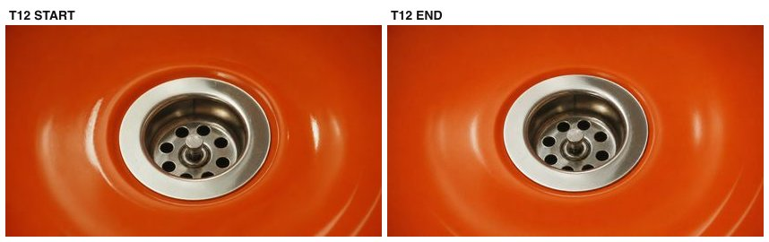

- **요약(한국어)**: 배수구 매크로(무인물), 고정·정지 — 마른 배수구, 크롬에 빛 일렁임만.
- **페이로드**: `arm-bkm/frames/T12_start.jpg` + `arm-bkm/frames/T12_end.jpg` → `clips/arm-bkm/T12.mp4` (4s)

<details><summary>영상 프롬프트 원문 (카메라 4요소 + 동작 + 사건 + 공통 계약)</summary>

```
Static insert; only a faint shimmer of light on the chrome. Macro, 90mm, extreme close-up of the chrome drain in the orange basin. Camera locked. Completely static; the basin dry and empty.
Context: The drain — silent, ordinary, and somehow wrong.
Continuity bible (LOCKED): the same young woman (black lip-length bob with wispy bangs, layered silver charm choker, pale blue satin slip dress with white daisy lace trim, white crew socks, black mary-jane heels); wardrobe and hairstyle never change. Location: retro pastel public restroom — mint-green tiles, orange-red round sinks on a mint counter, large round mirrors with vertical tube lights, red-orange stall doors. Light: warm fluorescent from above the mirrors, constant, same time of day. Signature props: small lip-gloss wand; chrome drain. Genre mood: quiet thriller — calm, uncanny stillness.
Never: any camera movement beyond what is specified, wardrobe or hairstyle change, shadow direction flip, day/night jump, extra people beyond those specified, duplicate faces beyond those specified, plastic skin, morphing hands, on-screen text, watermark.
```
</details>

## T13 — 컷 s15 · 4초

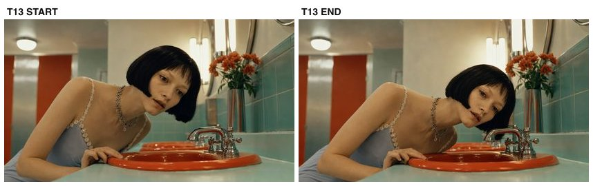

- **요약(한국어)**: 수전 옆 프로필 CU, 고정 — 귀를 수전 쪽으로 기울여 살핀다. 대답 없음.
- **페이로드**: `arm-bkm/frames/T13_start.jpg` + `arm-bkm/frames/T13_end.jpg` → `clips/arm-bkm/T13.mp4` (4s)

<details><summary>영상 프롬프트 원문 (카메라 4요소 + 동작 + 사건 + 공통 계약)</summary>

```
She leans down, ear tilting toward the faucet and drain, hand resting on the rim, examining. 50mm, close left profile at the faucet, flowers and mirror soft behind. Camera locked.
Context: She listens for the voice at the fixture itself. Nothing answers.
Continuity bible (LOCKED): the same young woman (black lip-length bob with wispy bangs, layered silver charm choker, pale blue satin slip dress with white daisy lace trim, white crew socks, black mary-jane heels); wardrobe and hairstyle never change. Location: retro pastel public restroom — mint-green tiles, orange-red round sinks on a mint counter, large round mirrors with vertical tube lights, red-orange stall doors. Light: warm fluorescent from above the mirrors, constant, same time of day. Signature props: small lip-gloss wand; chrome drain. Genre mood: quiet thriller — calm, uncanny stillness.
Never: any camera movement beyond what is specified, wardrobe or hairstyle change, shadow direction flip, day/night jump, extra people beyond those specified, duplicate faces beyond those specified, plastic skin, morphing hands, on-screen text, watermark.
```
</details>

## T14 — 컷 s16 · 4초

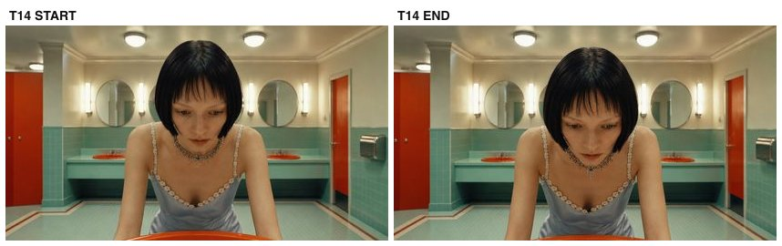

- **요약(한국어)**: 림 너머 정면 하이앵글, 고정 — 세면대 안을 훑는다. 평정이 금 가기 시작.
- **페이로드**: `arm-bkm/frames/T14_start.jpg` + `arm-bkm/frames/T14_end.jpg` → `clips/arm-bkm/T14.mp4` (4s)

<details><summary>영상 프롬프트 원문 (카메라 4요소 + 동작 + 사건 + 공통 계약)</summary>

```
She peers down into the basin, eyes scanning slowly. 35mm, front high angle over the sink rim, her face looking down into the basin, orange rim bottom of frame. Camera locked.
Context: Still searching — her calm is starting to crack.
Continuity bible (LOCKED): the same young woman (black lip-length bob with wispy bangs, layered silver charm choker, pale blue satin slip dress with white daisy lace trim, white crew socks, black mary-jane heels); wardrobe and hairstyle never change. Location: retro pastel public restroom — mint-green tiles, orange-red round sinks on a mint counter, large round mirrors with vertical tube lights, red-orange stall doors. Light: warm fluorescent from above the mirrors, constant, same time of day. Signature props: small lip-gloss wand; chrome drain. Genre mood: quiet thriller — calm, uncanny stillness.
Never: any camera movement beyond what is specified, wardrobe or hairstyle change, shadow direction flip, day/night jump, extra people beyond those specified, duplicate faces beyond those specified, plastic skin, morphing hands, on-screen text, watermark.
```
</details>

## T15 — 컷 s17 · 4초

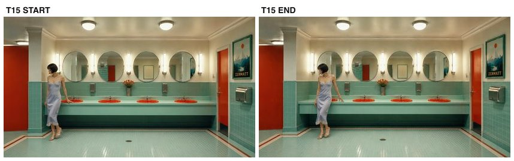

- **요약(한국어)**: 마스터 와이드(동일 구도), 고정 — 카운터를 따라 천천히 왼쪽으로 이동하며 세면대들을 확인.
- **페이로드**: `arm-bkm/frames/T15_start.jpg` + `arm-bkm/frames/T15_end.jpg` → `clips/arm-bkm/T15.mp4` (4s)

<details><summary>영상 프롬프트 원문 (카메라 4요소 + 동작 + 사건 + 공통 계약)</summary>

```
She walks slowly leftward along the counter, trailing her hand near the rim, checking each sink. 24mm, symmetrical master wide, same framing as the earlier master. Camera locked.
Context: She checks the other sinks one by one — was it this one? Or that one?
Continuity bible (LOCKED): the same young woman (black lip-length bob with wispy bangs, layered silver charm choker, pale blue satin slip dress with white daisy lace trim, white crew socks, black mary-jane heels); wardrobe and hairstyle never change. Location: retro pastel public restroom — mint-green tiles, orange-red round sinks on a mint counter, large round mirrors with vertical tube lights, red-orange stall doors. Light: warm fluorescent from above the mirrors, constant, same time of day. Signature props: small lip-gloss wand; chrome drain. Genre mood: quiet thriller — calm, uncanny stillness.
Never: any camera movement beyond what is specified, wardrobe or hairstyle change, shadow direction flip, day/night jump, extra people beyond those specified, duplicate faces beyond those specified, plastic skin, morphing hands, on-screen text, watermark.
```
</details>

## T16a — 컷 s18 · 4초

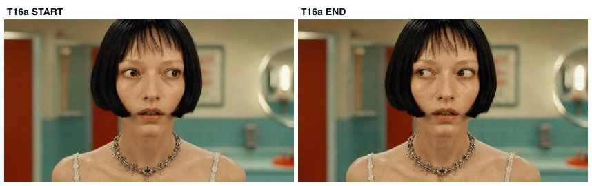

- **요약(한국어)**: 85mm 정면 타이트 CU, 고정 — 숨죽이고 듣는다, 눈만 움직임. 완전한 정적.
- **페이로드**: `arm-bkm/frames/T16a_start.jpg` + `arm-bkm/frames/T16a_end.jpg` → `clips/arm-bkm/T16a.mp4` (4s)

<details><summary>영상 프롬프트 원문 (카메라 4요소 + 동작 + 사건 + 공통 계약)</summary>

```
She holds still, listening hard; only her eyes move. 85mm, tight front close-up of her face, eyes large, background melted to soft color. Camera locked.
Context: Total silence — which is somehow worse than the voice.
Continuity bible (LOCKED): the same young woman (black lip-length bob with wispy bangs, layered silver charm choker, pale blue satin slip dress with white daisy lace trim, white crew socks, black mary-jane heels); wardrobe and hairstyle never change. Location: retro pastel public restroom — mint-green tiles, orange-red round sinks on a mint counter, large round mirrors with vertical tube lights, red-orange stall doors. Light: warm fluorescent from above the mirrors, constant, same time of day. Signature props: small lip-gloss wand; chrome drain. Genre mood: quiet thriller — calm, uncanny stillness.
Never: any camera movement beyond what is specified, wardrobe or hairstyle change, shadow direction flip, day/night jump, extra people beyond those specified, duplicate faces beyond those specified, plastic skin, morphing hands, on-screen text, watermark.
```
</details>

## T16b — 컷 s20 · 4초

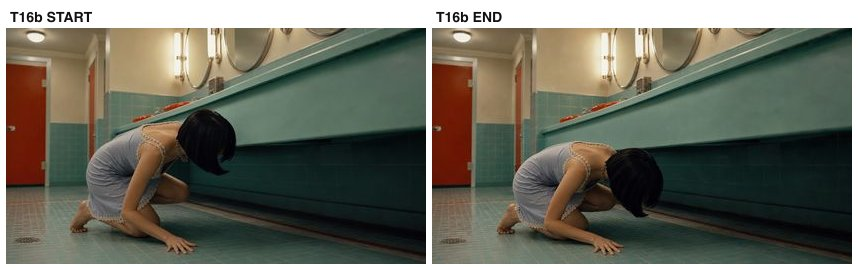

- **요약(한국어)**: 무릎 높이 프로필, 고정 — 쪼그려 카운터 아래를 본다. 마지막 남은 곳.
- **페이로드**: `arm-bkm/frames/T16b_start.jpg` + `arm-bkm/frames/T16b_end.jpg` → `clips/arm-bkm/T16b.mp4` (4s)

<details><summary>영상 프롬프트 원문 (카메라 4요소 + 동작 + 사건 + 공통 계약)</summary>

```
She crouches, head dipping to look under the counter, hair falling forward. 35mm, close profile at knee height: she crouches down beside the counter. Camera locked low.
Context: She checks under the counter — the last place the voice could hide.
Continuity bible (LOCKED): the same young woman (black lip-length bob with wispy bangs, layered silver charm choker, pale blue satin slip dress with white daisy lace trim, white crew socks, black mary-jane heels); wardrobe and hairstyle never change. Location: retro pastel public restroom — mint-green tiles, orange-red round sinks on a mint counter, large round mirrors with vertical tube lights, red-orange stall doors. Light: warm fluorescent from above the mirrors, constant, same time of day. Signature props: small lip-gloss wand; chrome drain. Genre mood: quiet thriller — calm, uncanny stillness.
Never: any camera movement beyond what is specified, wardrobe or hairstyle change, shadow direction flip, day/night jump, extra people beyond those specified, duplicate faces beyond those specified, plastic skin, morphing hands, on-screen text, watermark.
```
</details>

## T17 — 컷 s19 · 4초

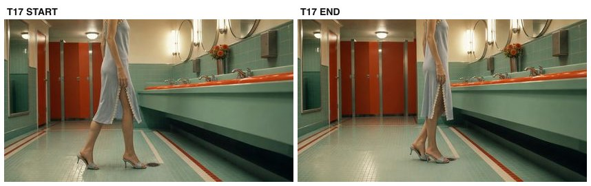

- **요약(한국어)**: 카운터 앞 하반신, 고정 — 한 걸음 이동 후 정지. 조심스러워졌다.
- **페이로드**: `arm-bkm/frames/T17_start.jpg` + `arm-bkm/frames/T17_end.jpg` → `clips/arm-bkm/T17.mp4` (4s)

<details><summary>영상 프롬프트 원문 (카메라 4요소 + 동작 + 사건 + 공통 계약)</summary>

```
She takes one slow step along the counter, then stops. 35mm, medium of her lower body at the counter, legs and skirt, tile floor. Camera locked at knee height.
Context: Moving along the counter, cautious now.
Continuity bible (LOCKED): the same young woman (black lip-length bob with wispy bangs, layered silver charm choker, pale blue satin slip dress with white daisy lace trim, white crew socks, black mary-jane heels); wardrobe and hairstyle never change. Location: retro pastel public restroom — mint-green tiles, orange-red round sinks on a mint counter, large round mirrors with vertical tube lights, red-orange stall doors. Light: warm fluorescent from above the mirrors, constant, same time of day. Signature props: small lip-gloss wand; chrome drain. Genre mood: quiet thriller — calm, uncanny stillness.
Never: any camera movement beyond what is specified, wardrobe or hairstyle change, shadow direction flip, day/night jump, extra people beyond those specified, duplicate faces beyond those specified, plastic skin, morphing hands, on-screen text, watermark.
```
</details>

## T18 — 컷 s21 · 4초

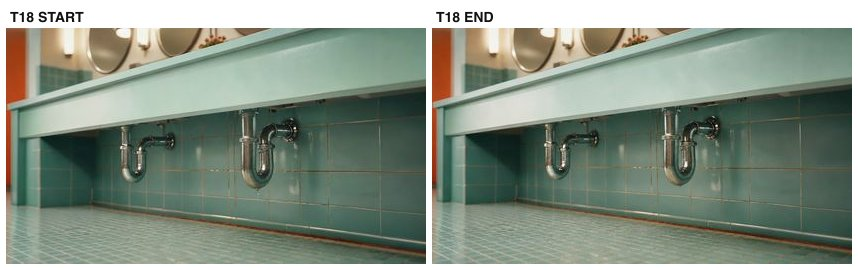

- **요약(한국어)**: 세면대 하부 배관 인서트(무인물), 고정·정지 — 목소리가 살 만한 곳.
- **페이로드**: `arm-bkm/frames/T18_start.jpg` + `arm-bkm/frames/T18_end.jpg` → `clips/arm-bkm/T18.mp4` (4s)

<details><summary>영상 프롬프트 원문 (카메라 4요소 + 동작 + 사건 + 공통 계약)</summary>

```
Static insert; the pipes sit silent, one faint drip glint. 50mm, insert of the chrome pipes under the sink against mint tiles, no person. Camera locked. Static.
Context: Under the sink — where the voice would have to live.
Continuity bible (LOCKED): the same young woman (black lip-length bob with wispy bangs, layered silver charm choker, pale blue satin slip dress with white daisy lace trim, white crew socks, black mary-jane heels); wardrobe and hairstyle never change. Location: retro pastel public restroom — mint-green tiles, orange-red round sinks on a mint counter, large round mirrors with vertical tube lights, red-orange stall doors. Light: warm fluorescent from above the mirrors, constant, same time of day. Signature props: small lip-gloss wand; chrome drain. Genre mood: quiet thriller — calm, uncanny stillness.
Never: any camera movement beyond what is specified, wardrobe or hairstyle change, shadow direction flip, day/night jump, extra people beyond those specified, duplicate faces beyond those specified, plastic skin, morphing hands, on-screen text, watermark.
```
</details>

## T19a — 컷 s22 · 4초

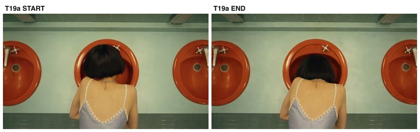

- **요약(한국어)**: 림 위 정수리/목덜미 탑 CU, 고정 — 세면대 깊이 숙임, 머리카락이 커튼처럼. 귀가 배수구 직전.
- **페이로드**: `arm-bkm/frames/T19a_start.jpg` + `arm-bkm/frames/T19a_end.jpg` → `clips/arm-bkm/T19a.mp4` (4s)

<details><summary>영상 프롬프트 원문 (카메라 4요소 + 동작 + 사건 + 공통 계약)</summary>

```
She bends deeper over the basin, hair curtaining forward, holding still. 35mm, top close-up over the rim: the crown of her head and nape as she bends deep over the basin. Camera locked above the sink.
Context: Ear almost to the drain now — she is fully committed to finding it.
Continuity bible (LOCKED): the same young woman (black lip-length bob with wispy bangs, layered silver charm choker, pale blue satin slip dress with white daisy lace trim, white crew socks, black mary-jane heels); wardrobe and hairstyle never change. Location: retro pastel public restroom — mint-green tiles, orange-red round sinks on a mint counter, large round mirrors with vertical tube lights, red-orange stall doors. Light: warm fluorescent from above the mirrors, constant, same time of day. Signature props: small lip-gloss wand; chrome drain. Genre mood: quiet thriller — calm, uncanny stillness.
Never: any camera movement beyond what is specified, wardrobe or hairstyle change, shadow direction flip, day/night jump, extra people beyond those specified, duplicate faces beyond those specified, plastic skin, morphing hands, on-screen text, watermark.
```
</details>

## T19b — 컷 s23 · 6초

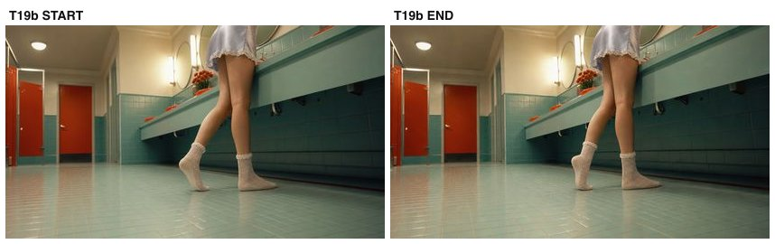

- **요약(한국어)**: 바닥 로우 광각(양말/다리 전경), 고정 — 정적이 길어지다… 여자 비명과 함께 암전 직전 프리즈. (47s 비트)
- **페이로드**: `arm-bkm/frames/T19b_start.jpg` + `arm-bkm/frames/T19b_end.jpg` → `clips/arm-bkm/T19b.mp4` (6s)

<details><summary>영상 프롬프트 원문 (카메라 4요소 + 동작 + 사건 + 공통 계약)</summary>

```
She stands at the sink above, shifting her weight; the room holds still around her legs. In the last beat everything freezes. Ultra-wide low angle from the floor under the counter line, her socks and legs large in foreground, room stretching behind. Camera locked at floor level.
Context: The quiet stretches too long — and then a woman's scream tears through the room as everything cuts to black.
Continuity bible (LOCKED): the same young woman (black lip-length bob with wispy bangs, layered silver charm choker, pale blue satin slip dress with white daisy lace trim, white crew socks, black mary-jane heels); wardrobe and hairstyle never change. Location: retro pastel public restroom — mint-green tiles, orange-red round sinks on a mint counter, large round mirrors with vertical tube lights, red-orange stall doors. Light: warm fluorescent from above the mirrors, constant, same time of day. Signature props: small lip-gloss wand; chrome drain. Genre mood: quiet thriller — calm, uncanny stillness.
Never: any camera movement beyond what is specified, wardrobe or hairstyle change, shadow direction flip, day/night jump, extra people beyond those specified, duplicate faces beyond those specified, plastic skin, morphing hands, on-screen text, watermark.
```
</details>

## T20a — 컷 s25 · 4초

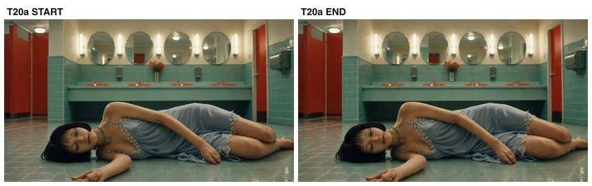

- **요약(한국어)**: 바닥 레벨 CU, 고정 — 타일 위에 쓰러져 눈 감고 미동 없음. 암전 이후.
- **페이로드**: `arm-bkm/frames/T20a_start.jpg` + `arm-bkm/frames/T20a_end.jpg` → `clips/arm-bkm/T20a.mp4` (4s)

<details><summary>영상 프롬프트 원문 (카메라 4요소 + 동작 + 사건 + 공통 계약)</summary>

```
She lies on the floor, motionless except the faintest breath. 35mm, floor-level close-up of her body lying on the mint tile, skirt and limbs foreground. Camera locked at floor level.
Context: After the blackout — she is down, unconscious on the tile.
Continuity bible (LOCKED): the same young woman (black lip-length bob with wispy bangs, layered silver charm choker, pale blue satin slip dress with white daisy lace trim, white crew socks, black mary-jane heels); wardrobe and hairstyle never change. Location: retro pastel public restroom — mint-green tiles, orange-red round sinks on a mint counter, large round mirrors with vertical tube lights, red-orange stall doors. Light: warm fluorescent from above the mirrors, constant, same time of day. Signature props: small lip-gloss wand; chrome drain. Genre mood: quiet thriller — calm, uncanny stillness.
Never: any camera movement beyond what is specified, wardrobe or hairstyle change, shadow direction flip, day/night jump, extra people beyond those specified, duplicate faces beyond those specified, plastic skin, morphing hands, on-screen text, watermark.
```
</details>

## T20b — 컷 s26 · 5초 · **2인(도플갱어)**

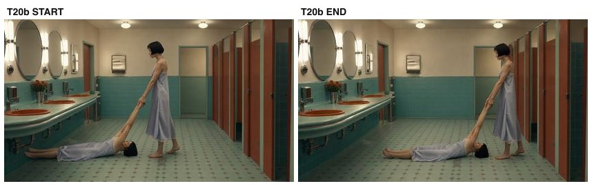

- **요약(한국어)**: 와이드(2인!), 고정 — 똑같이 생긴 소녀가 쓰러진 소녀의 팔을 잡고 칸막이 쪽으로 끌고 간다. 도플갱어.
- **페이로드**: `arm-bkm/frames/T20b_start.jpg` + `arm-bkm/frames/T20b_end.jpg` → `clips/arm-bkm/T20b.mp4` (5s)

<details><summary>영상 프롬프트 원문 (카메라 4요소 + 동작 + 사건 + 공통 계약)</summary>

```
The standing girl grips the lying girl's arms and drags her slowly across the tile toward the stalls. The lying girl does not move. 24mm, wide shot of the restroom: one girl lies on the floor, an IDENTICAL girl stands over her. Camera locked.
Context: Her doppelganger — same face, same dress — has her, and is taking her away.
Continuity bible (LOCKED): TWO identical young women (the girl and her doppelganger — identical face, hair, dress) (black lip-length bob with wispy bangs, layered silver charm choker, pale blue satin slip dress with white daisy lace trim, white crew socks, black mary-jane heels); wardrobe and hairstyle never change. Location: retro pastel public restroom — mint-green tiles, orange-red round sinks on a mint counter, large round mirrors with vertical tube lights, red-orange stall doors. Light: warm fluorescent from above the mirrors, constant, same time of day. Signature props: small lip-gloss wand; chrome drain. Genre mood: quiet thriller — calm, uncanny stillness.
Never: any camera movement beyond what is specified, wardrobe or hairstyle change, shadow direction flip, day/night jump, extra people beyond those specified, duplicate faces beyond those specified, plastic skin, morphing hands, on-screen text, watermark.
```
</details>

## T21 — 컷 s05·s28 · 6초

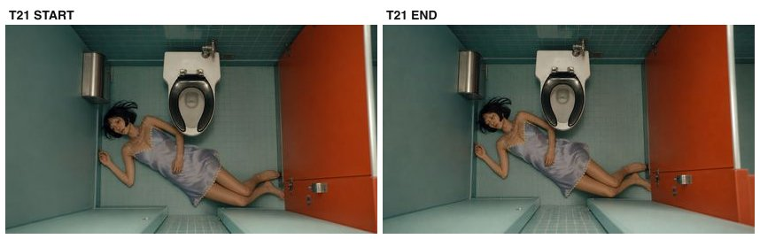

- **요약(한국어)**: 변기 칸 탑다운, 고정 — 변기 옆에 미동 없이 누워 있음. (s05 플래시+s28 겸용)
- **페이로드**: `arm-bkm/frames/T21_start.jpg` + `arm-bkm/frames/T21_end.jpg` → `clips/arm-bkm/T21.mp4` (6s)

<details><summary>영상 프롬프트 원문 (카메라 4요소 + 동작 + 사건 + 공통 계약)</summary>

```
She lies beside the toilet, completely motionless. Top-down overhead shot of the toilet stall: the girl lies on the floor beside the toilet, seen from directly above. Camera locked, perpendicular.
Context: Where the doppelganger left her — arranged, almost peaceful, beside the toilet.
Continuity bible (LOCKED): the same young woman (black lip-length bob with wispy bangs, layered silver charm choker, pale blue satin slip dress with white daisy lace trim, white crew socks, black mary-jane heels); wardrobe and hairstyle never change. Location: retro pastel public restroom — mint-green tiles, orange-red round sinks on a mint counter, large round mirrors with vertical tube lights, red-orange stall doors. Light: warm fluorescent from above the mirrors, constant, same time of day. Signature props: small lip-gloss wand; chrome drain. Genre mood: quiet thriller — calm, uncanny stillness.
Never: any camera movement beyond what is specified, wardrobe or hairstyle change, shadow direction flip, day/night jump, extra people beyond those specified, duplicate faces beyond those specified, plastic skin, morphing hands, on-screen text, watermark.
```
</details>

## T22 — 컷 s27 · 4초

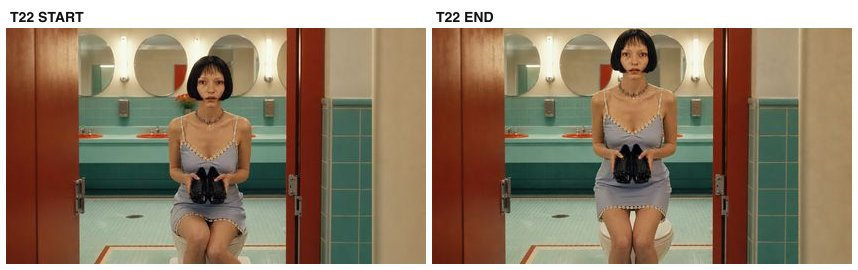

- **요약(한국어)**: 칸 내부 정면 미디엄, 고정 — 도플갱어가 구두를 들고 변기 뚜껑에 앉아 있다. 서두름 없음.
- **페이로드**: `arm-bkm/frames/T22_start.jpg` + `arm-bkm/frames/T22_end.jpg` → `clips/arm-bkm/T22.mp4` (4s)

<details><summary>영상 프롬프트 원문 (카메라 4요소 + 동작 + 사건 + 공통 계약)</summary>

```
She sits calmly holding the shoes, unhurried, gaze steady ahead. 35mm, front medium inside the stall: she sits on the closed toilet lid holding the black heels in both hands, stall walls framing. Camera locked.
Context: The doppelganger rests a moment with the shoes — no rush, no feeling.
Continuity bible (LOCKED): the same young woman (black lip-length bob with wispy bangs, layered silver charm choker, pale blue satin slip dress with white daisy lace trim, white crew socks, black mary-jane heels); wardrobe and hairstyle never change. Location: retro pastel public restroom — mint-green tiles, orange-red round sinks on a mint counter, large round mirrors with vertical tube lights, red-orange stall doors. Light: warm fluorescent from above the mirrors, constant, same time of day. Signature props: small lip-gloss wand; chrome drain. Genre mood: quiet thriller — calm, uncanny stillness.
Never: any camera movement beyond what is specified, wardrobe or hairstyle change, shadow direction flip, day/night jump, extra people beyond those specified, duplicate faces beyond those specified, plastic skin, morphing hands, on-screen text, watermark.
```
</details>

## T23 — 컷 s29 · 4초

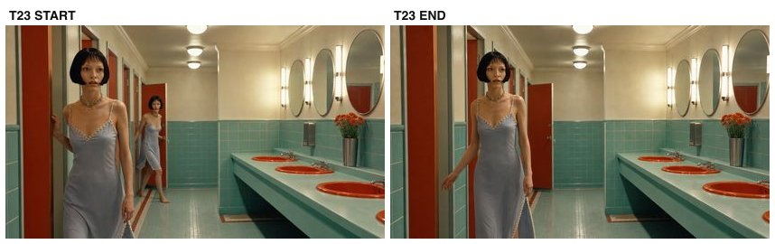

- **요약(한국어)**: 칸막이 복도, 고정 — 칸에서 나와 멈칫. 도플갱어 퇴장 시작.
- **페이로드**: `arm-bkm/frames/T23_start.jpg` + `arm-bkm/frames/T23_end.jpg` → `clips/arm-bkm/T23.mp4` (4s)

<details><summary>영상 프롬프트 원문 (카메라 4요소 + 동작 + 사건 + 공통 계약)</summary>

```
She steps out of the stall and pauses, one hand leaving the door. 35mm, corridor view along the stall doors, she stands at an open stall door. Camera locked.
Context: The doppelganger leaves the stall behind.
Continuity bible (LOCKED): the same young woman (black lip-length bob with wispy bangs, layered silver charm choker, pale blue satin slip dress with white daisy lace trim, white crew socks, black mary-jane heels); wardrobe and hairstyle never change. Location: retro pastel public restroom — mint-green tiles, orange-red round sinks on a mint counter, large round mirrors with vertical tube lights, red-orange stall doors. Light: warm fluorescent from above the mirrors, constant, same time of day. Signature props: small lip-gloss wand; chrome drain. Genre mood: quiet thriller — calm, uncanny stillness.
Never: any camera movement beyond what is specified, wardrobe or hairstyle change, shadow direction flip, day/night jump, extra people beyond those specified, duplicate faces beyond those specified, plastic skin, morphing hands, on-screen text, watermark.
```
</details>

## T24 — 컷 s30 · 5초

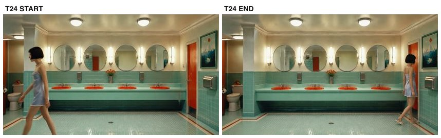

- **요약(한국어)**: 마스터 와이드, 고정 — 화장실을 가로질러 퇴장, 방은 다시 빈다. 칸에 남은 것만 빼고.
- **페이로드**: `arm-bkm/frames/T24_start.jpg` + `arm-bkm/frames/T24_end.jpg` → `clips/arm-bkm/T24.mp4` (5s)

<details><summary>영상 프롬프트 원문 (카메라 4요소 + 동작 + 사건 + 공통 계약)</summary>

```
She walks unhurried across the restroom toward the exit and passes out of frame; the room stands empty. 24mm, symmetrical master wide, same master framing. Camera locked.
Context: She leaves the way the first girl came in. The restroom is empty again — except for what is left in the stall.
Continuity bible (LOCKED): the same young woman (black lip-length bob with wispy bangs, layered silver charm choker, pale blue satin slip dress with white daisy lace trim, white crew socks, black mary-jane heels); wardrobe and hairstyle never change. Location: retro pastel public restroom — mint-green tiles, orange-red round sinks on a mint counter, large round mirrors with vertical tube lights, red-orange stall doors. Light: warm fluorescent from above the mirrors, constant, same time of day. Signature props: small lip-gloss wand; chrome drain. Genre mood: quiet thriller — calm, uncanny stillness.
Never: any camera movement beyond what is specified, wardrobe or hairstyle change, shadow direction flip, day/night jump, extra people beyond those specified, duplicate faces beyond those specified, plastic skin, morphing hands, on-screen text, watermark.
```
</details>

## 공통 계약 원문

```
Continuity bible (LOCKED): the same young woman (black lip-length bob with wispy bangs, layered silver charm choker, pale blue satin slip dress with white daisy lace trim, white crew socks, black mary-jane heels); wardrobe and hairstyle never change. Location: retro pastel public restroom — mint-green tiles, orange-red round sinks on a mint counter, large round mirrors with vertical tube lights, red-orange stall doors. Light: warm fluorescent from above the mirrors, constant, same time of day. Signature props: small lip-gloss wand; chrome drain. Genre mood: quiet thriller — calm, uncanny stillness.

--- (2인 테이크용 변형) ---
Continuity bible (LOCKED): TWO identical young women (the girl and her doppelganger — identical face, hair, dress) (black lip-length bob with wispy bangs, layered silver charm choker, pale blue satin slip dress with white daisy lace trim, white crew socks, black mary-jane heels); wardrobe and hairstyle never change. Location: retro pastel public restroom — mint-green tiles, orange-red round sinks on a mint counter, large round mirrors with vertical tube lights, red-orange stall doors. Light: warm fluorescent from above the mirrors, constant, same time of day. Signature props: small lip-gloss wand; chrome drain. Genre mood: quiet thriller — calm, uncanny stillness.

Never: any camera movement beyond what is specified, wardrobe or hairstyle change, shadow direction flip, day/night jump, extra people beyond those specified, duplicate faces beyond those specified, plastic skin, morphing hands, on-screen text, watermark.
```