# BKM 입력↔출력 대조 — 테이크마다 "넣은 것 vs 나온 것" 한눈 보기

> 테이크 27개. 각 스트립의 **윗줄이 넣은 것**(시작·끝 프레임), **아랫줄이 나온 것**(생성 영상의
> 첫·중간·끝 프레임). 세로로 대조하면 된다 — 왼쪽 기둥(IN start ↕ OUT first)이 맞고
> 오른쪽 기둥(IN end ↕ OUT last)이 맞으면 시작·끝 프레임 계약이 지켜진 것이고, 가운데(OUT mid)가
> 그 사이 실제 궤적이다. 움직임·리듬은 정지 화면으로 판단 불가 — 수상한 테이크만 재생 경로의
> 클립을 연다. 프롬프트 원문·QC 게이트는 [`README.md`](README.md), 원본 컷 대응은
> [`../../conti_full.md`](../../conti_full.md), 실행 보고는 [`../bkm_run_report.md`](../bkm_run_report.md).

## T01 — 컷 s01·s04 · 5초

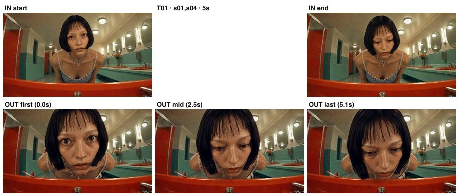

- **재생**: `assets/clips/arm-bkm/T01.mp4` · 입력 원본: `arm-bkm/frames/T01_start.jpg` + `arm-bkm/frames/T01_end.jpg`

## T02 — 컷 s02 · 4초

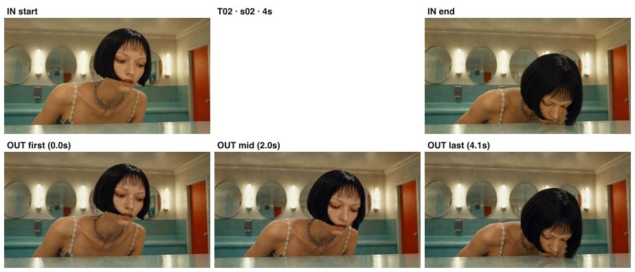

- **재생**: `assets/clips/arm-bkm/T02.mp4` · 입력 원본: `arm-bkm/frames/T02_start.jpg` + `arm-bkm/frames/T02_end.jpg`

## T03 — 컷 s03 · 4초

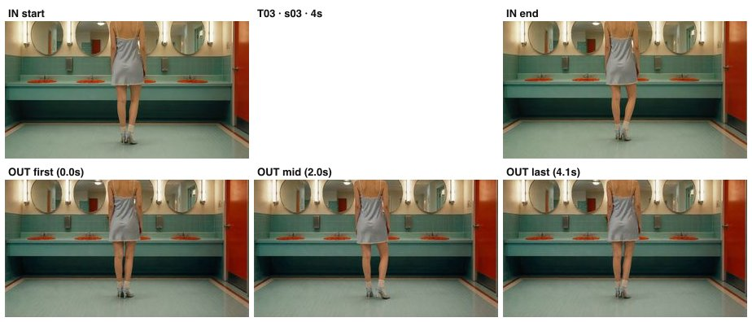

- **재생**: `assets/clips/arm-bkm/T03.mp4` · 입력 원본: `arm-bkm/frames/T03_start.jpg` + `arm-bkm/frames/T03_end.jpg`

## T04 — 컷 s06 · 4초

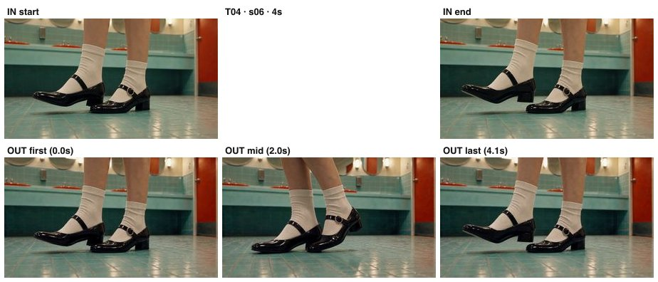

- **재생**: `assets/clips/arm-bkm/T04.mp4` · 입력 원본: `arm-bkm/frames/T04_start.jpg` + `arm-bkm/frames/T04_end.jpg`

## T05 — 컷 s07 · 4초

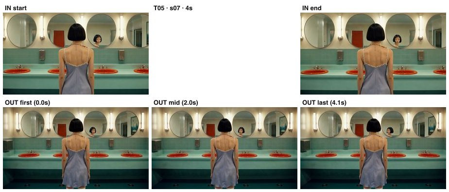

- **재생**: `assets/clips/arm-bkm/T05.mp4` · 입력 원본: `arm-bkm/frames/T05_start.jpg` + `arm-bkm/frames/T05_end.jpg`

## T06 — 컷 s08 · 4초

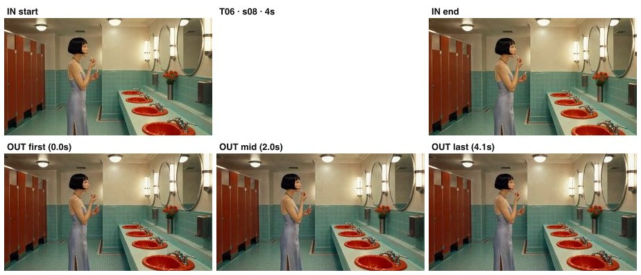

- **재생**: `assets/clips/arm-bkm/T06.mp4` · 입력 원본: `arm-bkm/frames/T06_start.jpg` + `arm-bkm/frames/T06_end.jpg`

## T07 — 컷 s09 · 6초

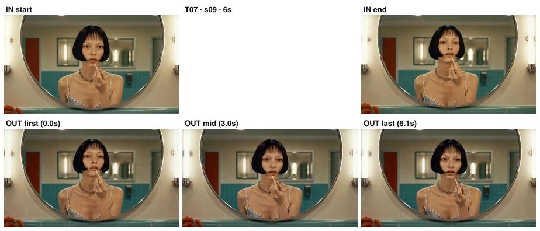

- **재생**: `assets/clips/arm-bkm/T07.mp4` · 입력 원본: `arm-bkm/frames/T07_start.jpg` + `arm-bkm/frames/T07_end.jpg`

## T08 — 컷 s10 · 4초

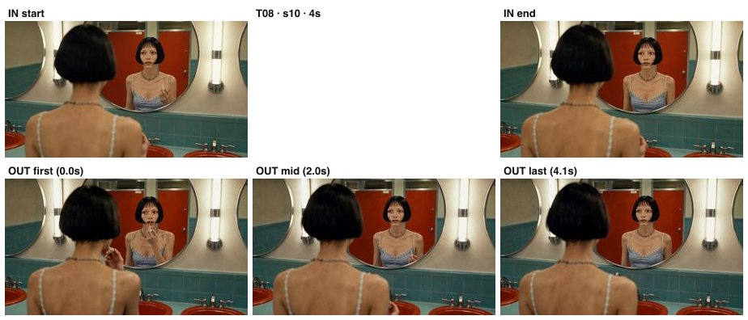

- **재생**: `assets/clips/arm-bkm/T08.mp4` · 입력 원본: `arm-bkm/frames/T08_start.jpg` + `arm-bkm/frames/T08_end.jpg`

## T09 — 컷 s11 · 4초

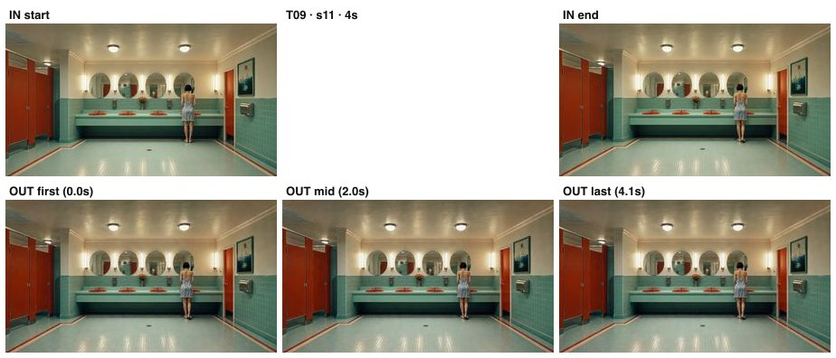

- **재생**: `assets/clips/arm-bkm/T09.mp4` · 입력 원본: `arm-bkm/frames/T09_start.jpg` + `arm-bkm/frames/T09_end.jpg`

## T10 — 컷 s12 · 4초

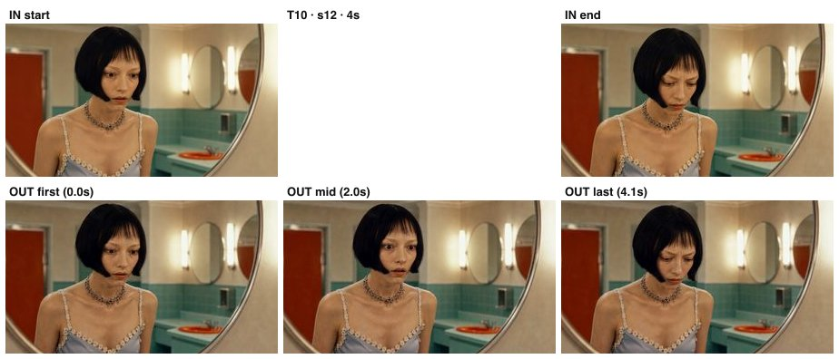

- **재생**: `assets/clips/arm-bkm/T10.mp4` · 입력 원본: `arm-bkm/frames/T10_start.jpg` + `arm-bkm/frames/T10_end.jpg`

## T11 — 컷 s13 · 4초

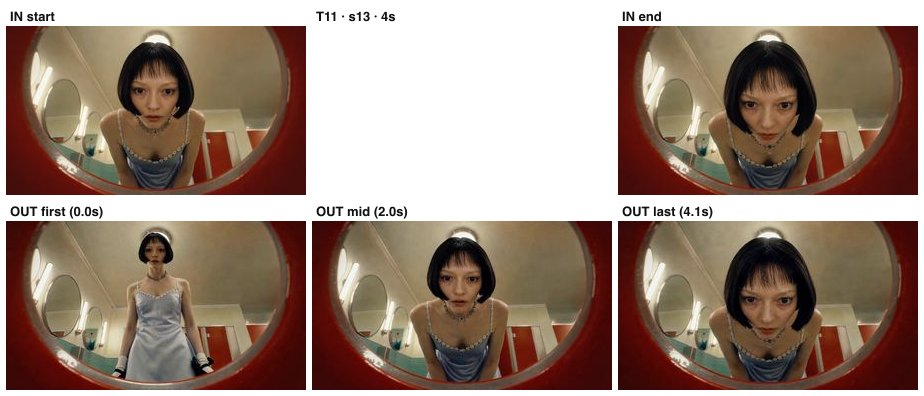

- **재생**: `assets/clips/arm-bkm/T11.mp4` · 입력 원본: `arm-bkm/frames/T11_start.jpg` + `arm-bkm/frames/T11_end.jpg`

## T12 — 컷 s14 · 4초

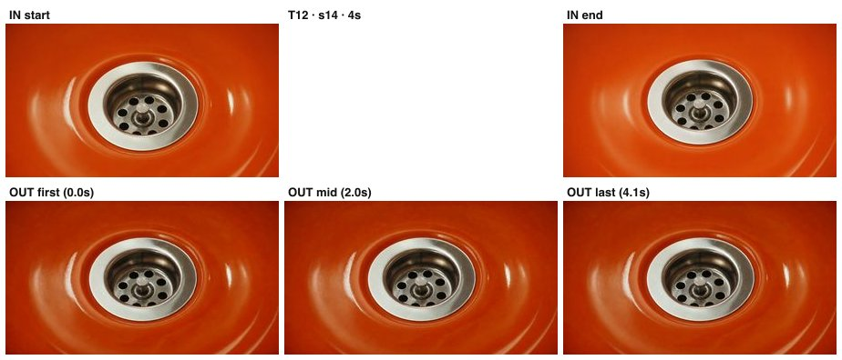

- **재생**: `assets/clips/arm-bkm/T12.mp4` · 입력 원본: `arm-bkm/frames/T12_start.jpg` + `arm-bkm/frames/T12_end.jpg`

## T13 — 컷 s15 · 4초

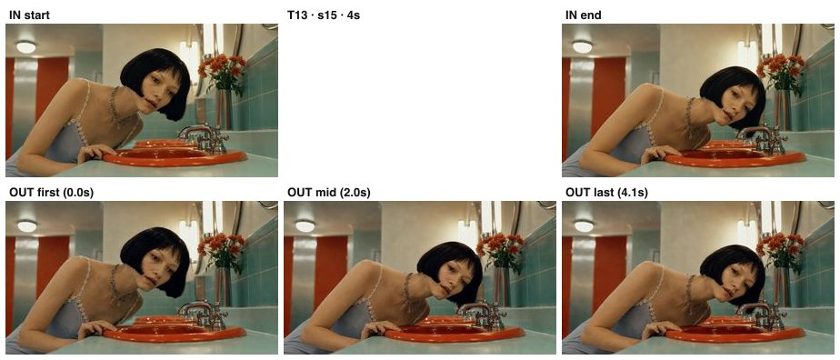

- **재생**: `assets/clips/arm-bkm/T13.mp4` · 입력 원본: `arm-bkm/frames/T13_start.jpg` + `arm-bkm/frames/T13_end.jpg`

## T14 — 컷 s16 · 4초

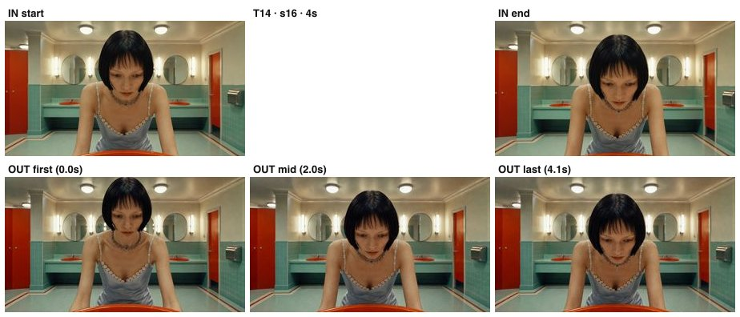

- **재생**: `assets/clips/arm-bkm/T14.mp4` · 입력 원본: `arm-bkm/frames/T14_start.jpg` + `arm-bkm/frames/T14_end.jpg`

## T15 — 컷 s17 · 4초

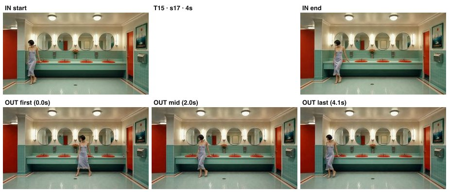

- **재생**: `assets/clips/arm-bkm/T15.mp4` · 입력 원본: `arm-bkm/frames/T15_start.jpg` + `arm-bkm/frames/T15_end.jpg`

## T16a — 컷 s18 · 4초

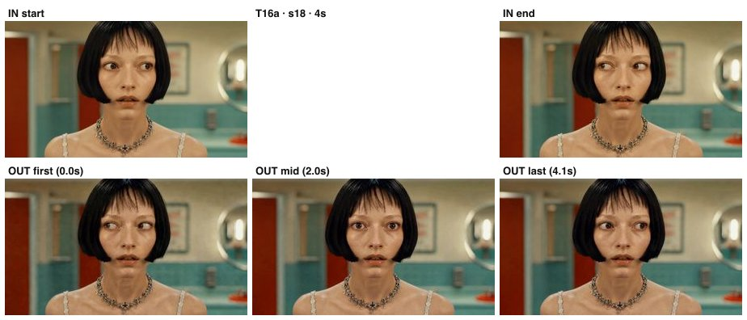

- **재생**: `assets/clips/arm-bkm/T16a.mp4` · 입력 원본: `arm-bkm/frames/T16a_start.jpg` + `arm-bkm/frames/T16a_end.jpg`

## T16b — 컷 s20 · 4초

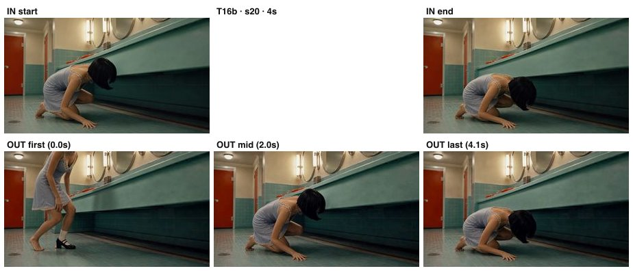

- **재생**: `assets/clips/arm-bkm/T16b.mp4` · 입력 원본: `arm-bkm/frames/T16b_start.jpg` + `arm-bkm/frames/T16b_end.jpg`

## T17 — 컷 s19 · 4초

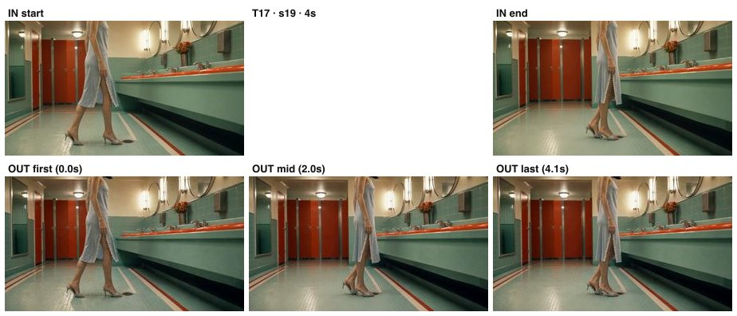

- **재생**: `assets/clips/arm-bkm/T17.mp4` · 입력 원본: `arm-bkm/frames/T17_start.jpg` + `arm-bkm/frames/T17_end.jpg`

## T18 — 컷 s21 · 4초

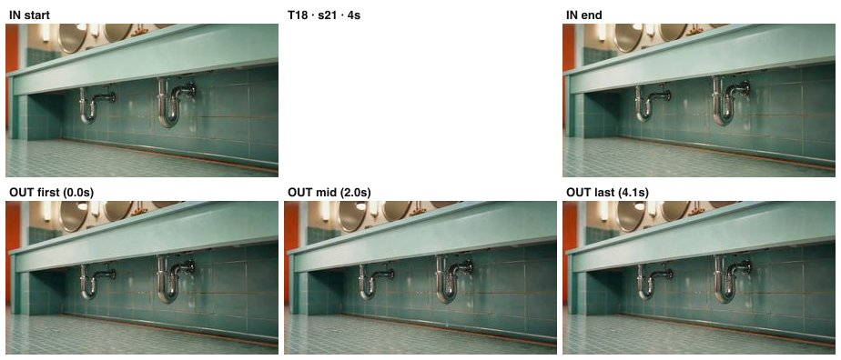

- **재생**: `assets/clips/arm-bkm/T18.mp4` · 입력 원본: `arm-bkm/frames/T18_start.jpg` + `arm-bkm/frames/T18_end.jpg`

## T19a — 컷 s22 · 4초

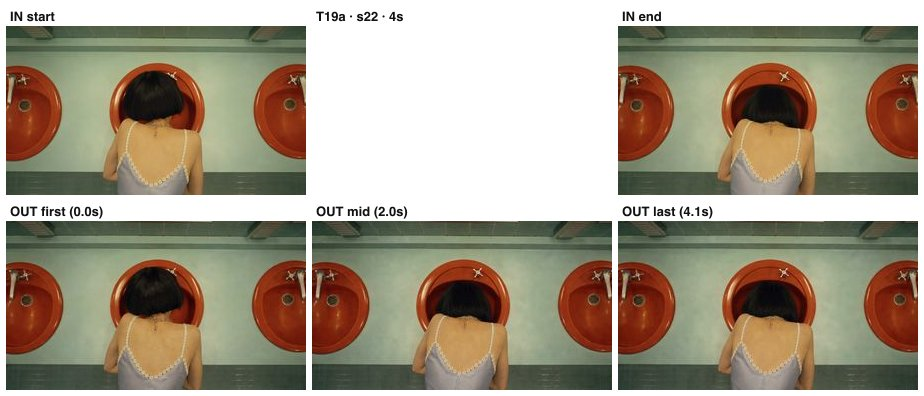

- **재생**: `assets/clips/arm-bkm/T19a.mp4` · 입력 원본: `arm-bkm/frames/T19a_start.jpg` + `arm-bkm/frames/T19a_end.jpg`

## T19b — 컷 s23 · 6초

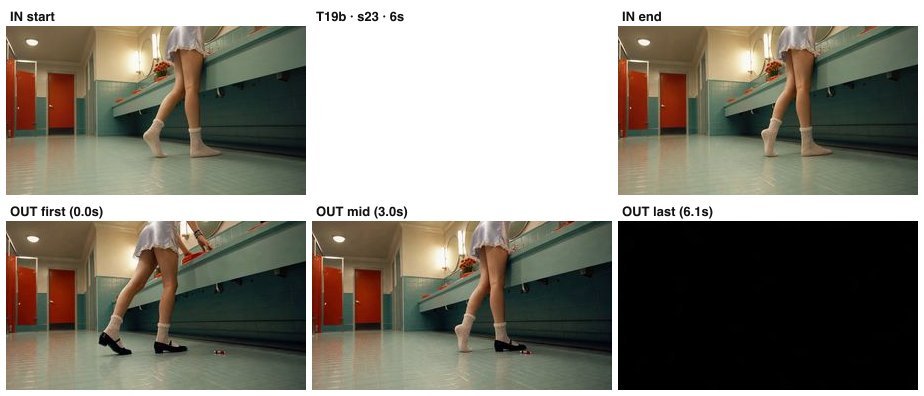

- **재생**: `assets/clips/arm-bkm/T19b.mp4` · 입력 원본: `arm-bkm/frames/T19b_start.jpg` + `arm-bkm/frames/T19b_end.jpg`

## T20a — 컷 s25 · 4초

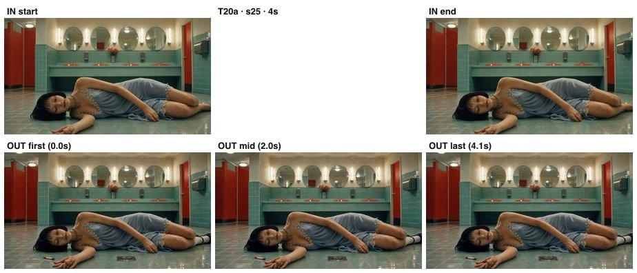

- **재생**: `assets/clips/arm-bkm/T20a.mp4` · 입력 원본: `arm-bkm/frames/T20a_start.jpg` + `arm-bkm/frames/T20a_end.jpg`

## T20b — 컷 s26 · 5초 · **2인(도플갱어)**

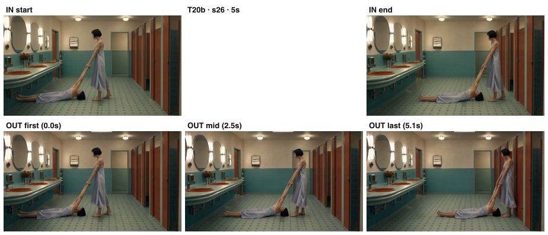

- **재생**: `assets/clips/arm-bkm/T20b.mp4` · 입력 원본: `arm-bkm/frames/T20b_start.jpg` + `arm-bkm/frames/T20b_end.jpg`

## T21 — 컷 s05·s28 · 6초

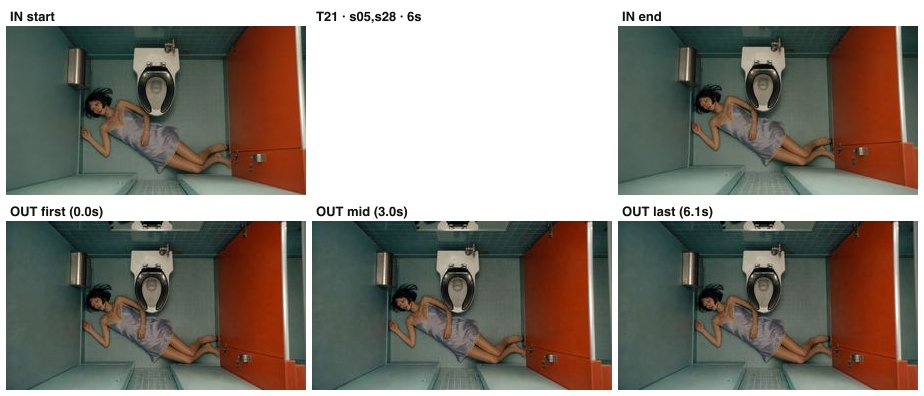

- **재생**: `assets/clips/arm-bkm/T21.mp4` · 입력 원본: `arm-bkm/frames/T21_start.jpg` + `arm-bkm/frames/T21_end.jpg`

## T22 — 컷 s27 · 4초

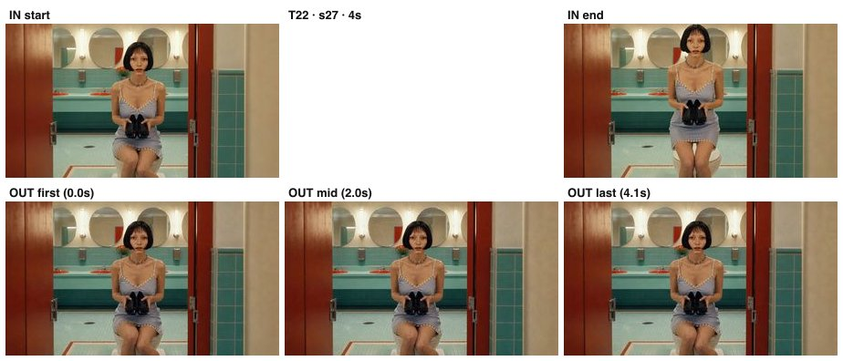

- **재생**: `assets/clips/arm-bkm/T22.mp4` · 입력 원본: `arm-bkm/frames/T22_start.jpg` + `arm-bkm/frames/T22_end.jpg`

## T23 — 컷 s29 · 4초

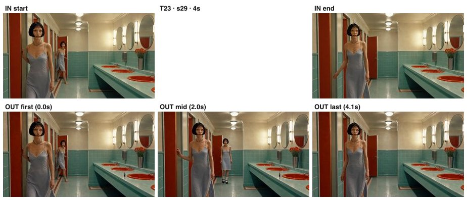

- **재생**: `assets/clips/arm-bkm/T23.mp4` · 입력 원본: `arm-bkm/frames/T23_start.jpg` + `arm-bkm/frames/T23_end.jpg`

## T24 — 컷 s30 · 5초

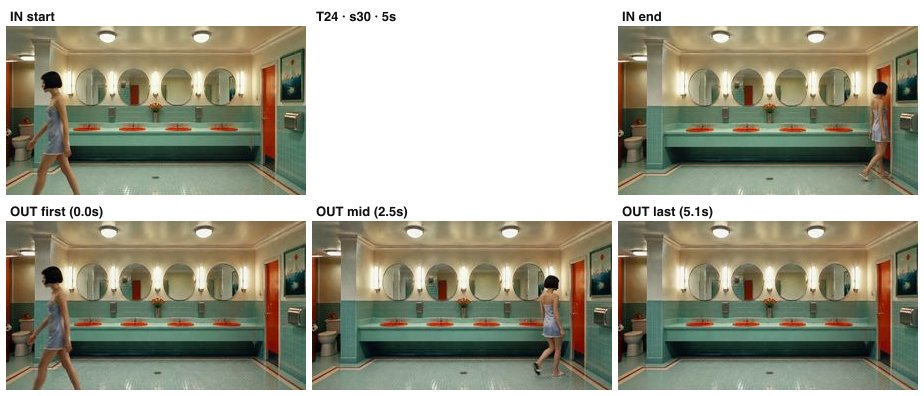

- **재생**: `assets/clips/arm-bkm/T24.mp4` · 입력 원본: `arm-bkm/frames/T24_start.jpg` + `arm-bkm/frames/T24_end.jpg`
