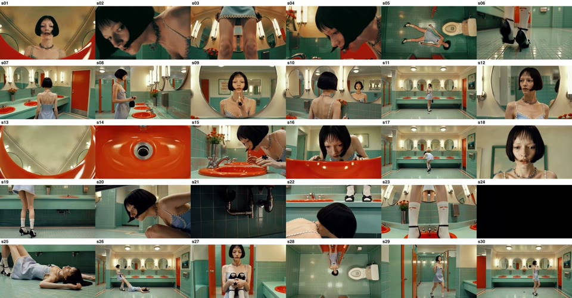
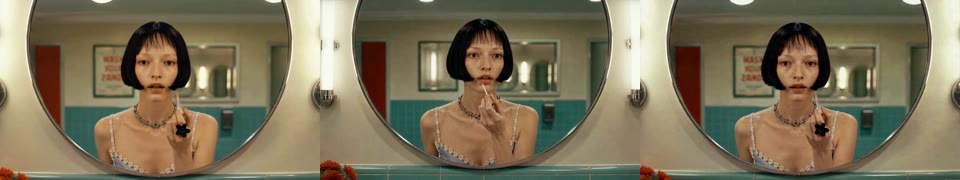
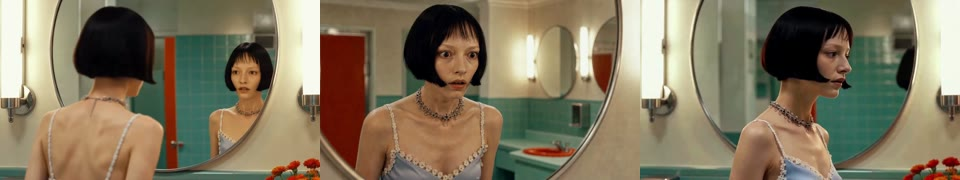
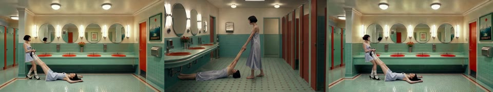
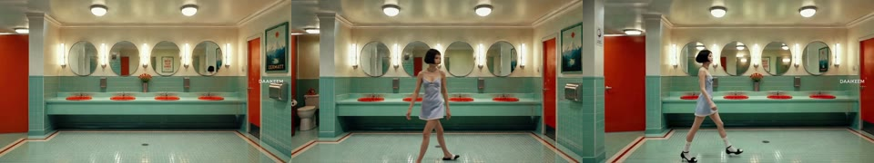
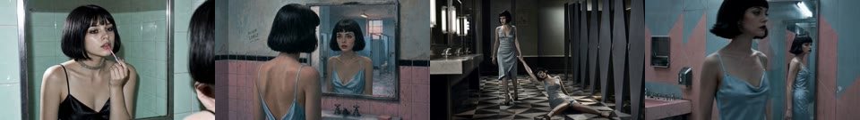

# 「거울 앞의 소녀들」 한 편 통째로 다시 만들기 — 결과 보고

> **한 줄**: 사람이 만든 67초짜리 영상 한 편을 **세 가지 서로 다른 방식**으로 다시 만들었다.
> 영상 75편이 나왔고 네 편(원본 포함)으로 조립해 라벨 없이 2×2로 붙여놨다.
> **만드는 일은 끝났다. 남은 건 사람이 눈으로 보고 순위를 매기는 것뿐이다.**
>
> 작성 2026-07-23 · 상태: **판정 대기** · 설계 문서: [`design.md`](design.md) · 원본 컷 분석: [`conti_full.md`](conti_full.md)

이 문서는 이 실험을 처음 보는 사람도 읽을 수 있게 썼다. 줄임말과 코드 이름은 본문에서 전부 걷어냈고,
꼭 필요한 것만 마지막 §8 기술 부록에 모아뒀다.

**읽는 순서 주의**: §6까지 읽고 → 영상을 먼저 보고 순위를 매긴 다음 → §7을 열어라.
§7부터는 **어느 화면이 어떤 방식으로 만든 것인지 드러난다**(블라인드가 깨진다).

---

## 1. 이 실험은 무엇을 묻는가

우리가 만드는 제품은 **글(시나리오)을 넣으면 짧은 영상을 자동으로 만들어주는 도구**다.
지금까지의 문제는 화질이 아니라 **연출**이었다. 카메라가 지시하지 않은 방향으로 제멋대로 돌고,
컷과 컷이 서로 이어지지 않아 "장면"이 아니라 "따로 노는 클립 묶음"으로 보였다.

그래서 **정답지를 하나 정했다** — 사람이 실제로 만들어 공개한 67초짜리 영상 한 편.
"이걸 우리 도구로 얼마나 따라 만들 수 있나"를 재면, 연출력의 현재 위치가 눈금으로 나온다.

이번에 재는 것은 세 지점이다.

| 재는 지점 | 질문 | 이 문서에서 부르는 이름 |
|---|---|---|
| 지금 제품의 실력 | 줄거리와 장르만 주면, 제품이 **스스로** 어디까지 연출하나 | **제품판** |
| 사람이 붙었을 때의 최고점 | 원본을 뜯어본 사람이 **손으로 최대한** 짜주면 어디까지 가나 | **사람판** |
| 도구 자체의 천장 | 원본 화면 자체를 넣어주면(=그림 문제를 전부 해결해주면) 어디까지 가나 | **상한판** |

**핵심은 「사람판 − 제품판」의 격차**다. 이 격차가 곧 *제품의 연출 부분을 고쳐서 얻을 수 있는 몫*이다.
격차가 크면 → 사람이 쓴 방식을 제품에 그대로 배선하면 된다.
격차가 없으면 → 병목은 우리 쪽이 아니라 영상 생성 모델 자체이고, 모델·기능을 바꿔야 한다는 뜻이다.

> 앞선 실험(같은 트랙, [`../2026-07-23_input-format/result.md`](../2026-07-23_input-format/result.md))에서
> "시작·끝 그림을 못 박아두면 카메라가 통제될 것"이라는 가설이 기각됐다. 그때 원인 네 가지가 나왔다 —
> ① 카메라 지시를 아무도 안 쓰고 있었다 ② "왜 이 행동을 하는가"(사건) 설명이 프롬프트에 없었다
> ③ 생성된 그림을 눈으로 검수하는 관문이 없었다 ④ 비교 대상이 실제 제품 코드가 아니었다.
> 이번 실험은 그 넷을 **한꺼번에 다 고친 묶음**이 현행 제품을 이기는지 본다. 원인별로 쪼개지 않은 건
> 조합이 폭발하기 때문이고, 이기면 그때 하나씩 빼보며 기여도를 가린다.

## 2. 따라 만든 원본은 어떤 영상인가

새벽의 레트로풍 공중화장실. 민트색 타일, 주황색 둥근 세면대, 둥근 거울들. 검은 단발 소녀가 들어와
거울 앞에서 립글로스를 바른다. 어디선가 아주 희미한 여자 목소리가 섞여 든다 — *"somebody… help me…"*.
소녀는 못 알아챈다. 잠시 뒤 같은 목소리가 더 또렷하게 — *"help me."* 소녀가 놀라 거울을 보고,
소리를 따라 시선을 세면대로 내린다. 배수구, 수전, 카운터 아래 배관까지 뒤진다. 아무 대답이 없다.
그 순간 **여자 비명과 함께 화면이 완전히 검게 꺼진다.** 어둠이 걷히면 소녀는 바닥에 쓰러져 있고,
**똑같이 생긴 또 한 명의 소녀**가 그 옆에 서 있다. 서 있는 소녀는 쓰러진 소녀를 끌고 가 변기 옆에 눕히고,
구두를 든 채 잠시 앉았다가, 처음 소녀가 그랬듯 화장실을 가로질러 걸어 나간다.

영상은 **65.9초**이고 **컷 30개**로 잘려 있다. 원본의 컷 30개 첫 화면을 한 장에 모은 것:



사건이 일어나는 시각(이 타이밍이 세 방식 모두의 기준이 된다):

| 사건 | 원본 시각 |
|---|---|
| 화장실에 들어와 립글로스를 바르기 시작 | 5.8초 |
| 희미한 "somebody help me" | 8~9초 |
| 또렷한 "help me" → 놀람 → 시선이 세면대로 | 17초 |
| 세면대·수전·배관 조사 | 19~47초 |
| 비명 + 완전 암전 (이 1.8초는 원본도 검은 화면) | 47.0초 |
| 쓰러진 소녀 + 똑같이 생긴 소녀 등장, 끌고 감 | 48~53초 |
| 변기 옆에 눕힘 · 앉음 · 퇴장 | 53~66초 |

## 3. 세 가지 방식은 각각 무엇이 다른가

**딱 하나만 다르다: "영상 모델에게 줄 지시와 그림을 누가 만들었나."**
영상을 실제로 뽑아내는 모델과 서비스는 세 방식 전부 동일하다(같은 모델, 같은 회선, 같은 화면비).
그래야 나온 차이가 "누가 지시를 썼나"의 차이가 된다.

| | **제품판** | **사람판** | **상한판** |
|---|---|---|---|
| 사람이 준 것 | 시나리오 글 + 장르 태그(스릴러) + 등장인물 외모, **그게 전부** | 촬영 단위 27개마다 카메라·동작·상황 설명을 손으로 작성 | **원본 영상에서 뜯어낸 화면 사진**뿐 |
| 기계가 정한 것 | 샷을 몇 개로 나눌지, 각 샷 길이, 카메라 렌즈·앵글·움직임, 구도, 색감, 그림 지시문, 움직임 지시문 — **전부** | 없음 (사람이 다 지정) | 없음 |
| 영상 모델에 넣은 것 | 시작 그림 1장 + 움직임 문장 1줄 | 시작 그림 + 끝 그림 2장 + 사람이 쓴 긴 지시문 | 원본의 첫 화면 + 끝 화면 사진 2장, **문장 0글자** |
| 편집 | 없음 — 기계가 정한 순서·길이 그대로 이어붙임 | 원본 30컷 타이밍에 맞춰 오려 붙임 | 원본 30컷 타이밍에 맞춰 오려 붙임 |
| 나온 영상 | 19편 | 27편 | 29편 |

세 방식에 대해 조금 더 풀면:

- **제품판** — "지금 서비스에 시나리오를 넣으면 뭐가 나오나"를 그대로 재현한 것이다. 사람이 카메라에
  대해 쓴 문장은 **한 글자도 없다**. 제품이 스스로 20개 샷·총 74초짜리 구성을 만들어냈고,
  카메라 렌즈·앵글·움직임까지 스스로 정했다.
- **사람판** — 원본을 컷 단위로 분석한 사람이 **27개 촬영 단위**로 다시 짰다. 여기서 촬영 단위란
  "완성본의 컷 하나"가 아니라 **실제 촬영처럼 넉넉히 찍어두는 한 테이크**다(전부 4초 이상).
  1초짜리 컷은 이 테이크에서 오려서 쓴다. 그래서 컷 30개를 만드는 데 생성은 27번만 했다.
  각 테이크마다 사람이 쓴 것: ① 카메라(렌즈·앵글·구도·움직임·빛) ② 인물의 동작
  ③ **왜 이 행동을 하는가**(들리는 소리, 놀람 같은 사건 맥락) ④ 인물·장소·조명을 고정하는 공통 문구
  ⑤ 하지 말아야 할 것 목록(지시 외 카메라 이동 금지, 의상 변경 금지 등).
- **상한판** — 문장을 하나도 주지 않고 **원본 화면 사진만** 준 것이다. "그림을 완벽하게 줬을 때
  이 영상 모델이 낼 수 있는 최대치"를 재는 눈금이다. 원본 30컷 중 검은 화면인 1컷은 만들 필요가
  없어서 29편이 됐다.

## 4. 실제로 넣은 글 (원문 그대로)

### 4-1. 세 방식 중 둘이 공유한 출발점 — 시나리오

제품판과 사람판은 **같은 시나리오**에서 출발했다. 이 글에는 **카메라·앵글·컷 지시가 의도적으로 0글자**다
(연출 지시가 섞이면 "제품이 스스로 연출한 것"을 잴 수 없게 된다). 소리는 연출이 아니라 사건이므로 넣었다.
전문은 [`scenario.md`](scenario.md), 문제의 대목만 옮기면:

> 립을 바르는 사이, 어디선가 아주 희미한 여자 목소리가 들린다. ASMR처럼 속삭이는, 거의 공기에
> 섞여 사라지는 소리 — **"somebody… help me…"**. 소녀는 알아채지 못한 채 계속 바른다.
>
> 잠시 후, 같은 목소리가 조금 더 또렷하게 들린다 — **"help me."** 소녀가 멈칫하며 놀란다.
> 거울 속 자신과 그 뒤의 빈 화장실을 확인하고, 이내 소리의 방향을 따라 시선이 세면대로 내려간다.

### 4-2. 같은 장면(립 바르기)을 두 방식이 어떻게 지시했나

**사람이 쓴 지시** (촬영 단위 T07 — 원본 5.8~11.3초 구간에 대응):

> She slowly applies lip gloss; only her hand and lips move. Near the end her hand hesitates for one beat,
> then continues. 50mm, straight-on eye-level close-up framed inside the round mirror, chest-up composition,
> tube lights at both edges. Camera locked on tripod, no movement.
> **Context**: A faint female whisper — "somebody… help me…" — drifts in, almost inaudible, like ASMR.
> She barely registers it and keeps applying.

한국어로 풀면: *천천히 립글로스를 바른다, 움직이는 건 손과 입술뿐. 끝 무렵 손이 한 박자 멈칫했다가
다시 이어간다. 50mm 렌즈, 눈높이 정면, 둥근 거울 안에 가슴 위까지 담기는 구도, 양쪽 가장자리에 튜브 조명.
**카메라는 삼각대에 고정, 움직이지 않는다.** 상황: 거의 안 들릴 만큼 희미한 여자 속삭임이 스민다 —
그녀는 거의 알아채지 못한 채 계속 바른다.*
뒤에는 모든 촬영 단위에 똑같이 붙는 공통 문구(인물 외모·장소·조명 고정 + 금지 목록)가 이어진다.

**제품이 스스로 쓴 지시** (같은 대목에 해당하는 샷 3 — 사람 개입 0):

> **그림 지시문**: A medium close-up of the girl's reflection in a rectangular mirror. She is applying pink
> lip gloss. Her black bob is neat, and she wears a silver choker. The background reflection shows the
> mint-tiled wall. The lighting is harsh, highlighting her pale skin and the satin texture of her dress.
>
> **움직임 지시문**: The girl slowly applies lip gloss to her lips while staring blankly at her reflection.
>
> **카메라(제품이 정한 값)**: 미디엄 클로즈업 · 눈높이 · **움직임 없음** · 구도 "거울에 비친 그녀의 눈"

즉 제품도 카메라 종류·앵글·움직임을 **스스로** 채워 넣었다. 차이는 지시의 **밀도와 근거**다 —
사람판은 렌즈 mm·고정 여부·조명 위치까지 못 박고 "왜 이 행동을 하는가"를 붙였고,
제품판은 한 줄짜리 움직임 문장과 값 세 개로 끝냈다. 어느 쪽이 화면에서 이기는지가 이 실험의 질문이다.

**상한판이 받은 것**: 문장 없음. 원본에서 뜯은 사진 두 장(예: 컷 9의 첫 화면과 끝 화면)뿐.

## 5. 실제로 나온 것

### 5-1. 숫자

| | 만든 영상 | 생성된 총 길이 | 최종 조립 길이 | 컷 구조 |
|---|---|---|---|---|
| 원본 | — | — | 65.9초 | 30컷 (사람이 편집) |
| 제품판 | 19편 | 83.2초 | **82.8초** | 제품이 정한 20샷 구조 그대로(1샷 제외) |
| 사람판 | 27편 | 118.7초 | **66.5초** | 원본 30컷 타이밍에 맞춰 오려 붙임 |
| 상한판 | 29편 | 123.8초 | **66.5초** | 원본 30컷 타이밍에 맞춰 오려 붙임 |

제품판만 길이가 다른 이유: 제품판은 **원본 타이밍을 강제하지 않는 것이 정의**이기 때문이다.
"시나리오만 주면 제품이 알아서 몇 개 샷, 몇 초로 만드나"가 측정 대상이라 손을 대지 않았다.
사람판과 상한판은 넉넉히 찍은 뒤 원본 컷 길이대로 잘라 썼기 때문에, 만든 길이보다 최종본이 짧다.

### 5-2. 만드는 중에 일어난 사고 (전부 기록, 숨김 없음)

| 무엇이 | 어떻게 됐나 | 해소 |
|---|---|---|
| 제품판 이야기 구조 생성 | 사용 중인 언어모델(gemini)이 "소녀 + 위해" 조합을 **25회 연속 안전 차단** | 그 단계만 다른 언어모델(claude)로 바꿔 통과 ✅ |
| 제품판 시작 그림 20장 | 4장이 그림 생성 서비스의 콘텐츠 정책에 걸림 | 같은 문장으로 재시도해 3장 회수. 1장(화장실에 들어서는 샷)은 4회 연속 차단 → **그 샷 통째 제외**(그래서 19편) ⚠️ |
| 제품판 영상 1편 | 첫 시도에서 부적절 판정으로 차단 | 같은 입력 재시도 1회로 통과 ✅ |
| 사람판 그림 54장 | 3장이 걸림 / 1장(T11 끝 화면)은 5회 연속 차단 | 3장은 문구 손봐 재생성. 1장은 모델 대신 **시작 화면을 6% 확대한 이미지로 대체** ⚠️ |
| 사람판 영상 27편 | 1차 실행에서 13편 성공, 14편이 도구 오류로 실패 | 같은 명령 재실행으로 **27/27 완주**, 이미 성공한 13편은 건너뛰어 **재과금 없음** ✅ |
| 멀티샷 정찰(영상 모델이 컷 편집을 자체적으로 하는지 보는 곁가지) | **실행하지 않음** | 이번 판정과 무관, 기록만 ⏸ |

즉 **최종 비교에 영향을 주는 결함은 하나**다: 제품판에서 "소녀가 화장실에 들어서는 샷"이 통째로 빠졌다.

## 6. 지금 할 일 — 눈으로 순위 매기기

### 볼 파일

```
assets/compare/mosaic_blind_full.mp4
```

화면이 4칸으로 나뉘어 있고 **어느 칸이 무엇인지 표시가 없다.** 넷 중 하나는 **원본**이다.
(원본이 몇 등으로 뽑히는지가 "얼마나 따라잡았나"의 가장 솔직한 눈금이 된다.)

### 보기 전 알아둘 것

- **소리가 없다.** 네 편 모두 음성을 제거해 붙였다. 판단은 화면만으로 한다.
- **0~66초 구간만 비교 구간이다.** 그 뒤 82초까지는 세 칸이 마지막 화면에서 멈춰 있고 한 칸만 계속
  재생된다. 그 칸이 길이가 다른 방식이라는 뜻이므로, **66초 이후는 순위 판단에서 빼라.**
- 화면 크기는 한 칸당 640×360이다. 세부 화질이 궁금하면 판정 후 개별 전편(§7)을 크게 열어보면 된다.

### 채울 것

구간별 1~4위 + 전체 1~4위. (구간 경계는 원본 기준)

| 구간 | 1위 | 2위 | 3위 | 4위 |
|---|---|---|---|---|
| 도입 0~6초 (플래시 몽타주·입장) | | | | |
| 립 바르기 6~19초 (희미한 목소리 → 놀람) | | | | |
| 조사 19~47초 (세면대·배관 뒤지기 → 암전) | | | | |
| 결말 48~66초 (쓰러짐·도플갱어·퇴장) | | | | |
| **전체** | | | | |

### 미리 정해둔 판정 규칙 (실험 시작 전에 고정한 것)

- **사람판이 제품판을 네 구간 중 과반(3구간 이상)에서 이기면** → 사람판이 쓴 방식 묶음을
  제품에 그대로 배선하는 안건으로 올린다. 그다음 실험에서 요소를 하나씩 빼며 기여도를 가린다.
- **못 이기면** → 묶음을 해체하고 병목을 다시 쪼갠다. "아는 걸 다 넣어도 안 된다"는 결과는
  병목이 영상 모델 계층에 있다는 강한 신호다.
- 상한판의 순위는 별도 정보다. 상한판이 원본에 크게 못 미치면, 그 격차는 **입력이나 프롬프트로는
  넘을 수 없는 모델 한계**라는 뜻이 된다.

순위를 다 적었으면 `assets/compare/mosaic_key_full.txt`를 열어 정답을 확인하고, 아래 §7로 내려온다.

---

## 7. ⚠️ 여기부터는 정답이 드러난다 — 순위를 매긴 뒤에 읽어라

### 7-1. 어느 파일이 어느 방식인가

| 방식 | 개별 전편 파일 | 폴더 안에서 쓰는 코드 이름 |
|---|---|---|
| 원본 | `assets/compare/original_full.mp4` | original |
| 제품판 (제품이 스스로) | `assets/compare/arm-base_full.mp4` | BASE |
| 사람판 (사람이 최대한) | `assets/compare/arm-bkm_full.mp4` | BKM |
| 상한판 (원본 화면 그대로) | `assets/compare/arm-r_full.mp4` | R |

2×2 화면에서 어느 칸이 무엇인지는 `assets/compare/mosaic_key_full.txt`에 적혀 있다.

### 7-2. 정지 화면으로 나란히 놓고 본 것

아래는 판정 결과가 아니라, **같은 순간을 정지 화면으로 세워 대조한 관찰**이다.
움직임·리듬은 정지 화면으로 판단할 수 없으므로 최종 판단은 영상으로 해야 한다.

**립 바르기 (8.5초)** — 왼쪽부터 **원본 · 사람판 · 상한판**



**놀라서 시선을 옮기는 순간 (17.5초)** — 왼쪽부터 **원본 · 사람판 · 상한판**



**도플갱어가 끌고 가는 장면 (52초)** — 왼쪽부터 **원본 · 사람판 · 상한판**



**퇴장 (63.5초)** — 왼쪽부터 **원본 · 사람판 · 상한판**



**제품판** — 원본과 시간이 맞지 않으므로 같은 시각으로 비교할 수 없다. 대신 대응하는 장면 넷을
제품판 자체 순서에서 뽑았다. 왼쪽부터 **립 바르기 · 거울 앞 정지 · 끌고 감 · 퇴장**



정지 화면에서 눈에 보이는 사실만 적으면:

- **상한판**은 원본 화면에서 출발하므로 구도가 원본과 거의 겹친다. 예상된 결과이고, 그래서 눈금 역할을 한다.
- **사람판**은 같은 사건을 다루면서도 방 배치와 구도가 원본과 다르게 재구성됐다. 예를 들어 끌고 가는
  장면에서 원본은 인물이 화면 왼쪽 아래에 작게 놓이는데, 사람판은 인물이 화면 가운데에 크게 선다.
- **제품판**은 **자기 나름의 세계**를 만들었다. 색은 옅은 파랑·분홍 계열, 거울은 사각형, 타일 배치도
  다르다. 원본의 민트+주황 둥근 세면대와는 다른 화장실이다. 시나리오에 색·구도 지시가 없었으므로
  이건 실패가 아니라 **"줄거리만 주면 제품이 이렇게 상상한다"의 실측값**이다.

### 7-3. 이 실험이 답해주지 못하는 것 (한계)

- **소리가 빠져 있다.** 원본에서 목소리와 비명은 편집의 동기 그 자체였는데, 비교본은 무음이다.
  소리까지 포함한 완성도는 이 실험 밖이다.
- **판정은 주관이다.** 정량 지표(구도 일치, 인물 일관성 등)는 보조로만 쓰기로 미리 정해뒀고,
  이번 문서에는 아직 측정값이 없다.
- **블라인드가 완전하지는 않다.** 두 가지 새는 구멍이 있다. ① 제품판만 길이가 82.8초라 66초 이후
  혼자 재생된다(그 구간을 판단에서 빼야 하는 이유). ② 원본 영상에는 제작자 워터마크(화면 오른쪽
  가장자리의 작은 흰 글씨)가 박혀 있고, **상한판은 원본 화면을 그대로 입력으로 썼기 때문에 그
  워터마크를 물려받았다** — 넓은 구도 컷에서 유심히 보면 원본과 상한판 두 칸을 식별할 수 있다.
  다만 이번 실험의 주 가설은 사람판 vs 제품판의 비교이고, 그 두 칸에는 워터마크가 없다.
- **제품판에 샷 하나가 빠졌다** (화장실에 들어서는 샷 — 그림 생성이 4회 연속 차단됨).

## 8. 기술 부록

### 8-1. 파일 지도

```
2026-07-23_full-copy-bundle/
  design.md          실험 설계와 사전 판정 기준
  scenario.md        제품판·사람판 공통 입력 시나리오 (카메라 지시 0글자)
  conti_full.md      원본 30컷 분해 + 촬영 단위 계획 + 예산
  takes.json         사람판 촬영 단위 27개의 지시문 원본
  jobs.{r,bkm,base}.json   영상 생성 요청 페이로드 (실제 전송값)
  assets/
    conti/           원본에서 뜯은 컷별 첫·끝 화면 (60장) + 컷 시트
    arm-bkm/         사람판 시작·끝 그림 54장 + 검수용 문서(README.md)
    arm-base/        제품판 시작 그림 19장 + 제품이 산출한 샷별 원문(README.md)
    clips/arm-{r,bkm,base}/   생성된 영상 원본 75편
    compare/         조립된 전편 4편 + 블라인드 2×2 + 정답 키 + 대조 썸네일
    bkm_run_report.md        사람판 영상 생성 실행 보고
```

### 8-2. 사용한 모델·서비스

| 용도 | 모델 | 경유 |
|---|---|---|
| 영상 생성 (세 방식 전부 동일) | Seedance 2.0, 시작+끝 그림 입력 방식 | 힉스필드 |
| 사람판 그림 생성 | openai/gpt-image-2/edit — 인물 정본 + 빈 방 사진 + 카메라 지시로 편집 생성 | fal |
| 제품판 그림 생성 | 제품 기본 이미지 모델(openai/gpt-image-2) | fal (제품 코드 경로 그대로) |
| 제품판 글 생성 | gemini 15회 + claude 9회 — 구조 단계만 claude로 우회 | 제품 파이프라인 |

세 방식 모두 힉스필드 회선을 쓴 이유: fal 쪽 Seedance는 사진처럼 사실적인 사람 얼굴을 파트너 정책으로
차단한다는 것이 8케이스 격자 실험으로 확인됐다(프롬프트와 무관, 이미지가 원인).

### 8-3. 재현 커맨드

```bash
# 사람판 그림 스테이징 (27테이크 × 시작·끝)
node research/experiments/continuity-copy/2026-07-23_full-copy-bundle/tools/stage_bkm.mjs

# 영상 생성 (공용 디스패처, 팔별 jobs 파일 교체)
node research/experiments/utils/tools/gen/dispatch.mjs \
  --jobs research/experiments/continuity-copy/2026-07-23_full-copy-bundle/jobs.bkm.json \
  --assets research/experiments/continuity-copy/2026-07-23_full-copy-bundle/assets \
  --mode higgsfield --hf-concurrency 4 --hf-cap 80

# 제품판 (실제 제품 파이프라인 그대로 실행)
node_modules/.bin/vitest run --config .../tools/vitest.config.mjs .../tools/run-writer-base.test.ts

# 조립 + 블라인드 모자이크
node research/experiments/continuity-copy/2026-07-23_full-copy-bundle/tools/assemble_full.mjs
```

이어붙이기 규격: 1280×720 · 24fps · 무음 · H.264(crf 18). 2×2 모자이크는 각 칸 640×360.

### 8-4. 생성량과 비용

| 방식 | 영상 호출 | 생성 초 | 그림 호출 |
|---|---|---|---|
| 상한판 | 29 | 122초(요청 기준) | 0 (원본 화면 사용) |
| 사람판 | 27 (재시도 14 포함, 재과금 없음) | 117초 | 54장 + 재시도 4 |
| 제품판 | 19 (재시도 1 포함) | 70초 | 20장 + 재시도 4 (1장 최종 차단) |

영상 생성 요청 합계 **309초**. 견적 단가(720p 기준 약 4.6크레딧/초)로 환산하면 **1,400크레딧대 추정**이며,
설계 시 잡은 예산 1,700~2,200 안에 들어온다. 실제 청구액은 서비스 대시보드 기준으로 확인해야 한다.
그림 생성은 별도 과금(fal)이고 여기 포함되지 않았다.

### 8-5. 진행 상태 기록

- 실행 완료일: 2026-07-23
- 상태: **판정 대기** — 상태판은 [`../../INDEX.md`](../../INDEX.md) 한 곳에서만 관리한다.
- 판정 결과가 나오면 이 문서 머리말에 판정 한 줄을 추가하고 INDEX 상태를 갱신한다.
