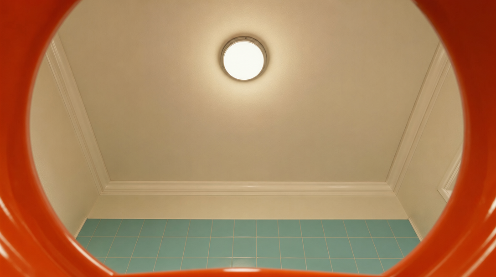
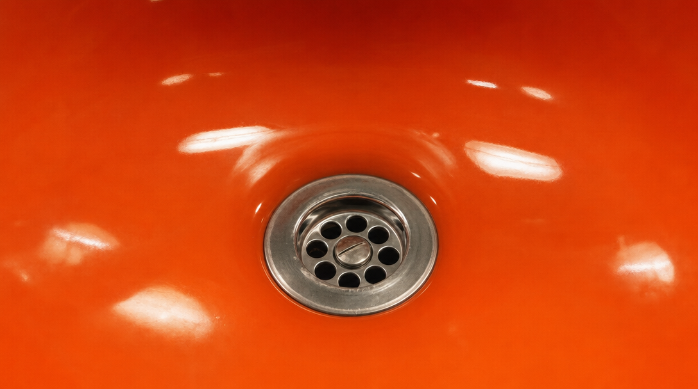
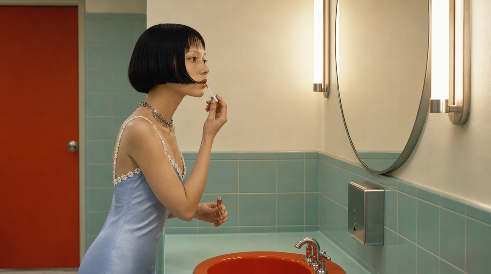
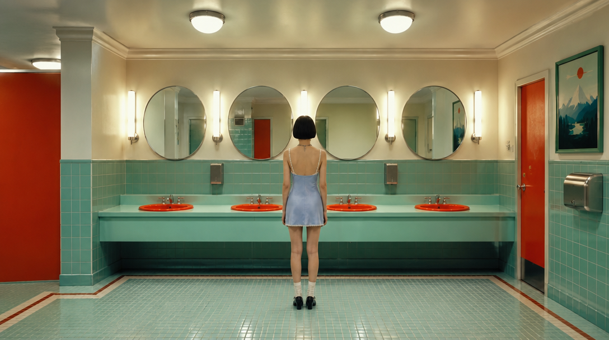
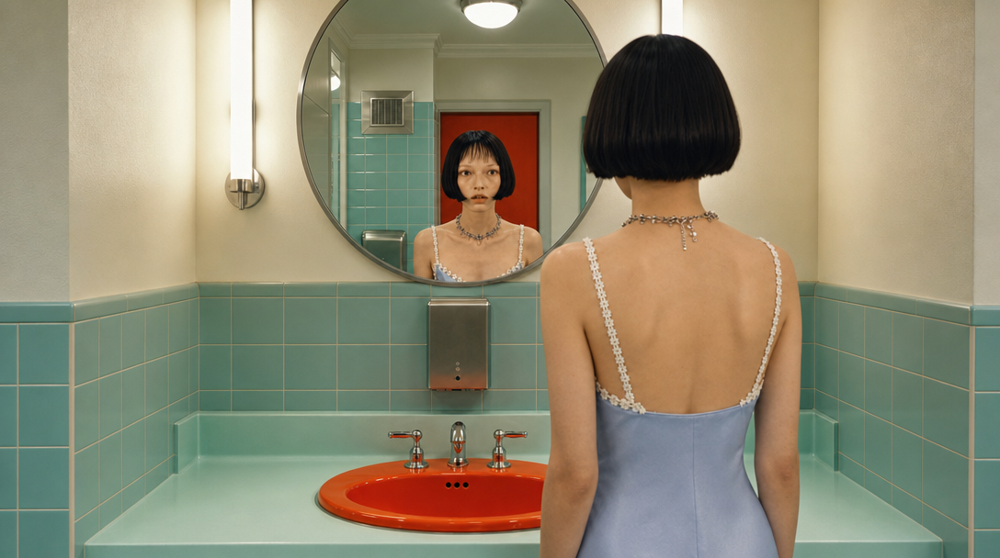
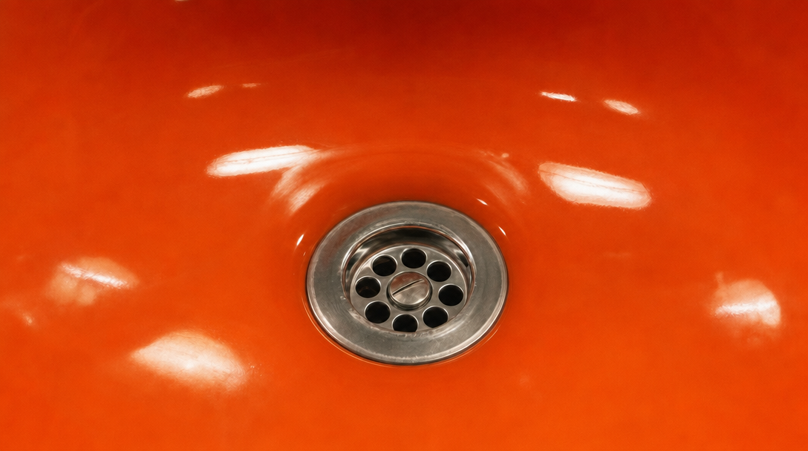

# Ⓐ 자산 + 연출 텍스트 — 무엇을 넣어서 무엇을 만들었나

> 설계: [`../../blueprint-a.md`](../../blueprint-a.md) · 현행 워크플로우 강화판.
> **요체: 영상 모델에 시작 프레임 1장 + 움직임 텍스트만 준다. 끝 프레임을 주지 않는다** —
> "Camera locked" 텍스트를 모델이 무시하면 막을 방법이 없다는 약점 가설을 검증하는 팔이다.

## 제작 계보 (편집 모델 11콜)

```
캐릭터 정본(identity_ref.jpg) ──1콜──▶ sheet_character.jpg          (4면 캐릭터 시트)
원본 65.5초 빈 와이드(../plates/src_empty_wide.jpg)
  ├──3콜──▶ plates/plate_mirror·plate_sinkpov·plate_drain.jpg      (앵글별 빈 배경)
  └──복사──▶ plates/plate_wide.jpg                                  (원본 프레임 승격, 0콜)
[시트 + 해당 앵글 플레이트] + 구도 지시문 ──6콜──▶ frames/s1~s6_start.jpg
```

## 파일 목록

| 파일 | 무엇 | 어떻게 만들었나 |
|---|---|---|
| `sheet_character.jpg` | 캐릭터 시트 — 정면·프로필·후면·전신 4면 한 장 | 정본 1장 참조 + "4 views side by side" 프롬프트, 1콜 |
| `plates/plate_mirror.jpg` | 거울벽 빈 배경 (샷 1·2·4용) | src_empty_wide 참조 + "closer straight-on view of one round mirror… no people, remove watermark", 1콜 |
| `plates/plate_wide.jpg` | 와이드 빈 배경 (샷 3용) | **원본 65.5초 프레임 그대로 복사** — 손실 0이 더 유리해서 생성 안 함 |
| `plates/plate_sinkpov.jpg` | 세면대 안에서 올려다본 빈 배경 (샷 5용) | src_empty_wide 참조 + "from inside one sink basin looking straight up", 1콜 |
| `plates/plate_drain.jpg` | 배수구 매크로 빈 배경 (샷 6용) | src_empty_wide 참조 + "extreme close-up of one basin interior with chrome drain", 1콜 |
| `frames/s{1..6}_start.jpg` | 샷별 시작 프레임 | [시트, 플레이트] 2장 참조 + 공통 앵커 + 샷별 구도 지시문(blueprint-a §2 표), 샷당 1콜 |

   

시작 프레임 6장 (샷 1→6):

  
  

## 영상 모델에 실제로 넘어가는 것 (payloads.json `arms.a`)

- 이미지: `frames/sN_start.jpg` **1장만** (시트·플레이트는 시작 프레임 제작 재료였을 뿐, I2V에는 안 감)
- 텍스트: 샷별 움직임 문장("… **Camera locked.**") + 결말 상태 + 연속성 바이블 + 네거티브 배터리
- 요구 모델: 엄격 I2V (픽셀 단위 첫 프레임 고정 — 참조형 금지)

관전 포인트: 인물·공간 깨짐은 잡혀야 정상(자산을 이미지로 줬으므로), **임의 카메라 무브가
재현되는지**가 이 팔의 존재 이유다. B1이 이걸 얼마나 이기는지가 실험의 핵심 대조.
