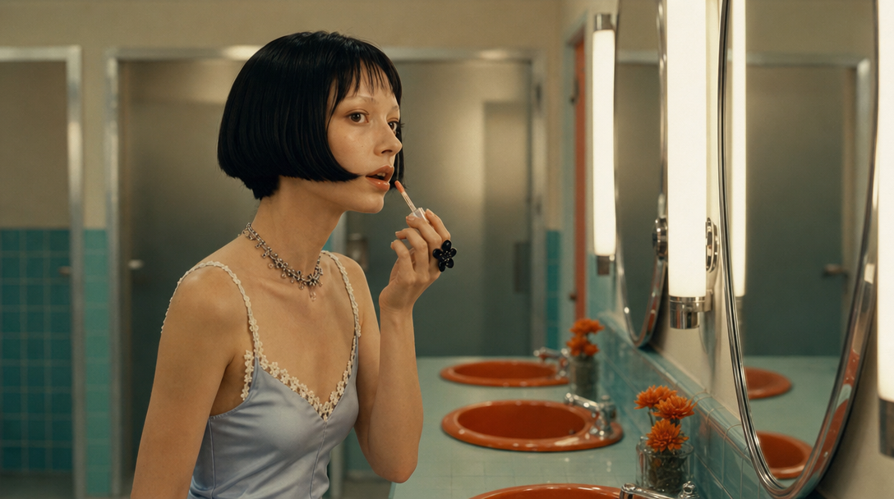
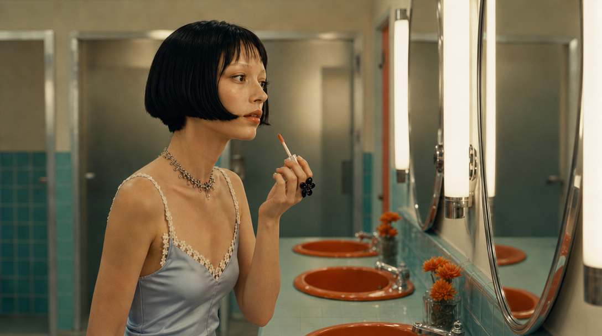
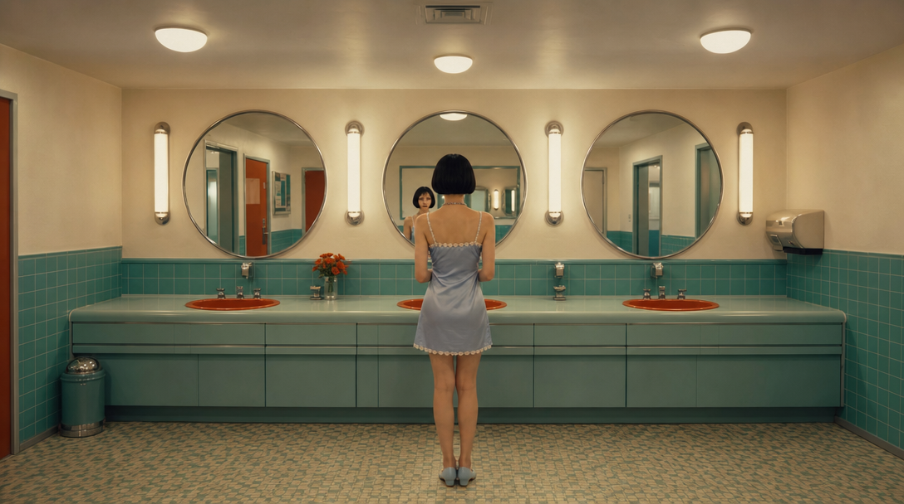
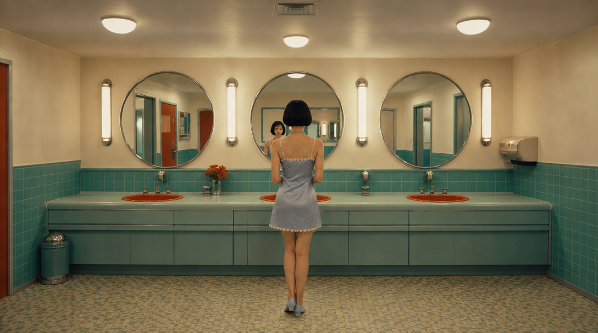
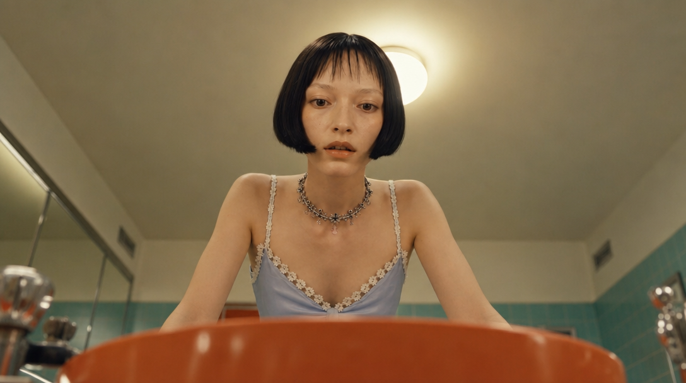
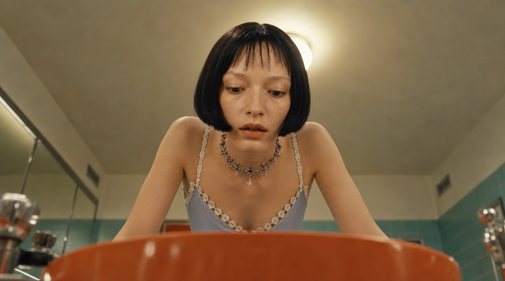
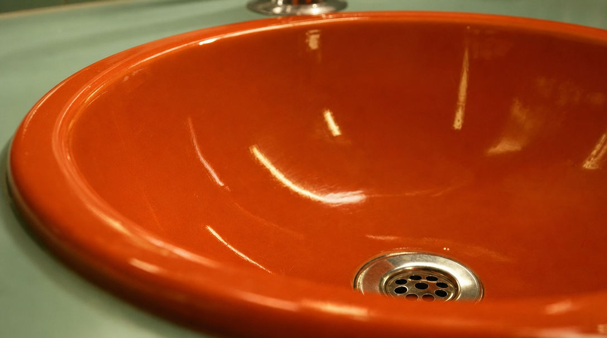
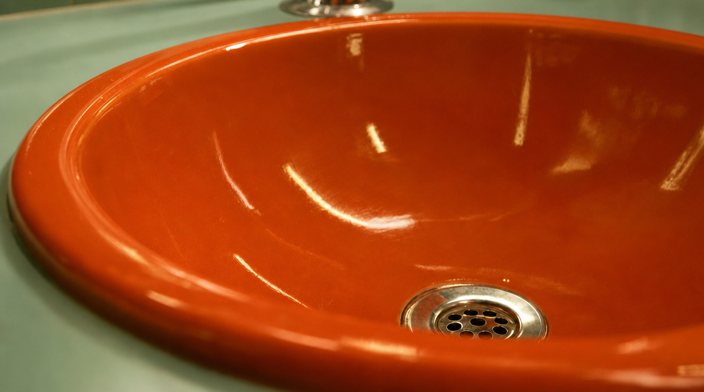

# Ⓑ1 시작 + 끝 프레임 쌍 — 무엇을 넣어서 무엇을 만들었나

> 설계: [`../../blueprint-b1.md`](../../blueprint-b1.md) · 이 실험의 **유력 승자 후보**.
> **요체: 샷마다 시작·끝 프레임 2장을 그림으로 먼저 확정하고, 영상 모델에게 "이 두 그림 사이를
> 메워라"만 시킨다.** 카메라·동작의 도착점이 그림으로 못박히므로 AI가 임의로 카메라를 움직일
> 자유 자체가 사라진다는 가설.

## 제작 계보 (편집 모델 12콜 — A와 달리 시트·플레이트 없이 정본 직행)

```
캐릭터 정본(identity_ref.jpg) + 공통 앵커 + 샷별 구도 지시문 ──6콜──▶ frames/s1~s6_start.jpg
각 시작 프레임을 참조로 + "같은 장면·같은 카메라, 동작만 끝 상태" ──6콜──▶ frames/s1~s6_end.jpg
```

끝 프레임 프롬프트는 전부 이 접두로 시작한다 (카메라 이동 여지 제거):

> *"Using the reference image as the start frame: keep the identical scene, identical camera
> position and framing, identical person, wardrobe and lighting. Change only the action state."*

## 파일 목록

| 파일 | 무엇 | 끝 상태 지시 (blueprint-b1 §2 표) |
|---|---|---|
| `frames/s1_start/end.jpg` | 거울 정면, 립글로스 들어올림 → 바름 | 완드가 입술에 닿고 턱이 살짝 들림 |
| `frames/s2_start/end.jpg` | 프로필로 동작 이어받기 | 완드를 입술에서 몇 cm 내리고 거울 확인 |
| `frames/s3_start/end.jpg` | 마스터 와이드 쉼표 | 거의 동일, 체중만 반대 다리로 |
| `frames/s4_start/end.jpg` | 뒤통수 너머 거울 반사 | 고개 몇 도 회전, 자기 반사와 시선 마주침 |
| `frames/s5_start/end.jpg` | 세면대 안 POV | 얼굴이 림에 조금 더 가까이, 시선 아래 고정 |
| `frames/s6_start/end.jpg` | 배수구 인서트 (인물 없음) | 변화 없음 — **"dry and empty, no water" 명시** (아래 관찰 2) |

쌍 대조 (왼쪽=시작, 오른쪽=끝):

  ·  
  ·  
  ·  

## 영상 모델에 실제로 넘어가는 것 (payloads.json `arms.b1`)

- 이미지: `sN_start.jpg` + `sN_end.jpg` **2장** (start_image / end_image)
- 텍스트: 짧은 동작 문장(예: "She applies the gloss from start pose to end pose.") + 결말 상태 +
  연속성 바이블 + 네거티브 배터리
- 요구 모델: **시작+끝 프레임 동시 입력 지원** (Seedance 계열 등 — 선행 스크리닝 §4-가에서 확정 필요.
  현행 제품 배선 3종에는 없음)

## 스테이징 중 관찰

1. 12장 전부 시작↔끝이 같은 카메라를 유지하는지 눈 검수 통과 (blueprint-b1 리스크 2의 품질 관문).
2. **s6_end 1차 생성 실패 사례**: "faint shimmer"를 모델이 물줄기로 확대해석 → 물이 생기면 영상
   모델이 "물 등장"을 보간해버린다. "The basin stays dry and empty — no water" 명시로 재생성해
   해결. 끝 프레임은 생성 후 검수가 필수라는 리스크의 실증.
3. 이 폴더의 프레임은 **C 팔(샷 1·3·4 시작 + 끝 6장 전부)과 B2 β 시트**에도 재사용된다.
