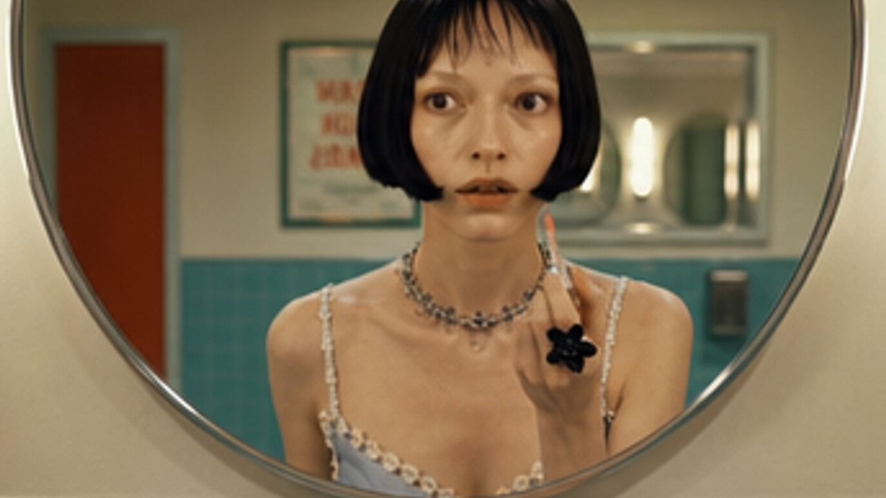
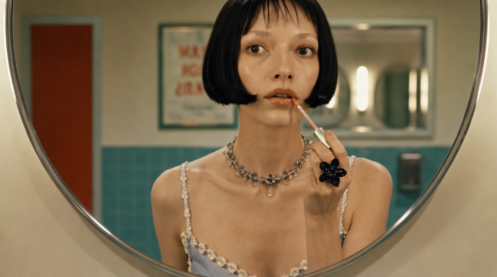
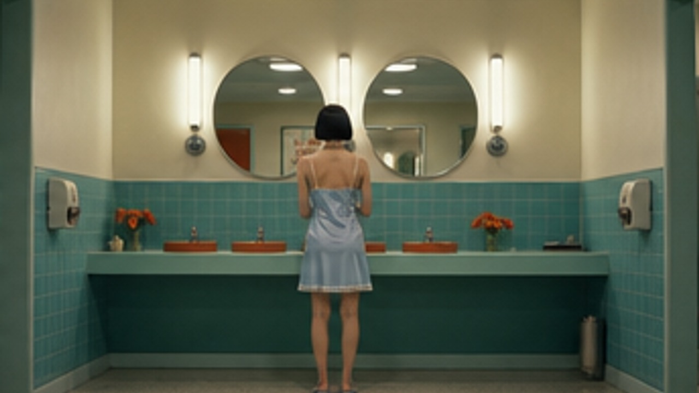
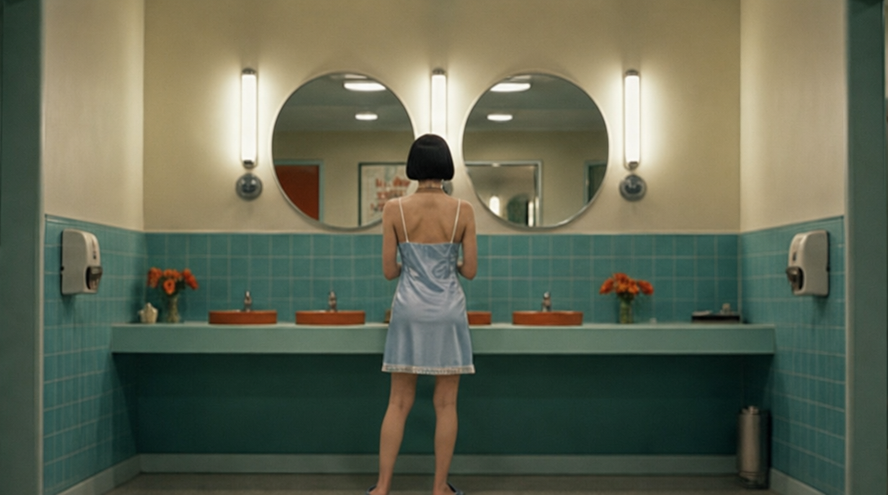
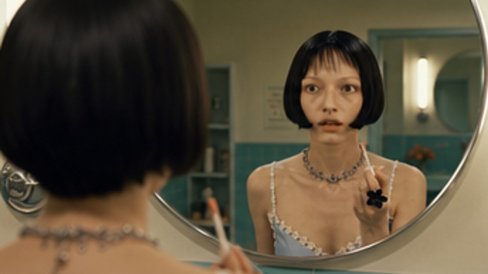
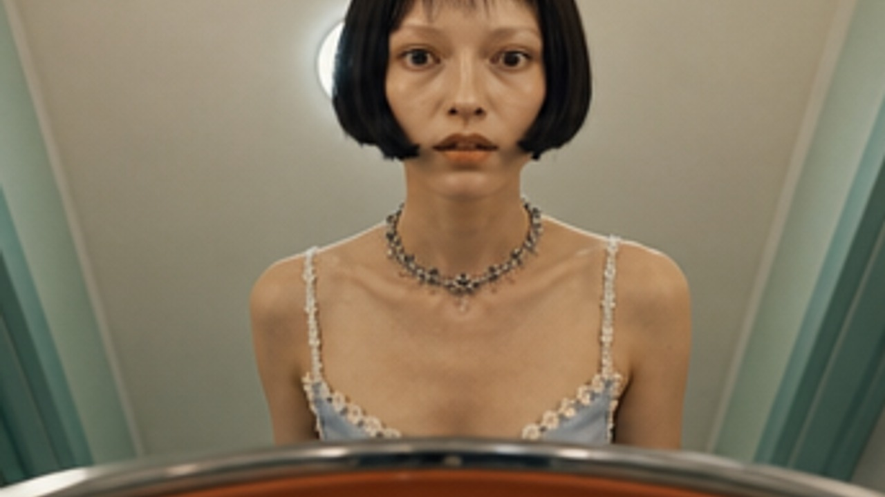
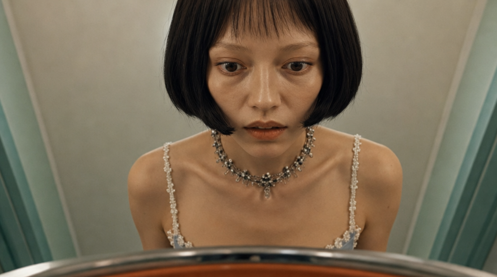
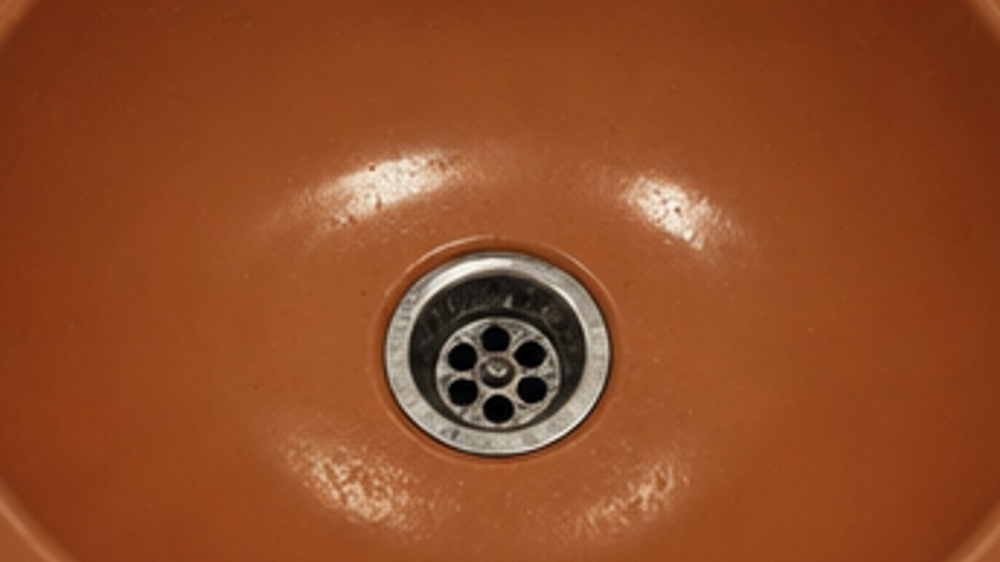
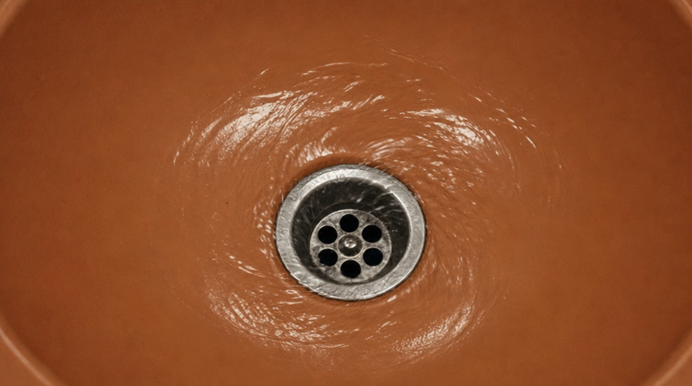

# Ⓑ2 콘티 시트 셀 수확 — 무엇을 넣어서 무엇을 만들었나

> 설계: [`../../blueprint-b2.md`](../../blueprint-b2.md) · SNS 실물 분석 후 v2로 재정의된 팔.
> **요체: 6샷의 시작 프레임을 "한 번의 이미지 생성" 안에 3×2 격자로 그리게 한 뒤 셀을 잘라 쓴다.**
> 한 생성 안에서 그려진 6컷은 인물·세계 일관성이 공짜로 유지된다는 가설 — B1(샷별 개별 생성)과의
> 비교가 "이미지 계층의 일관성 제작법" 대결이 된다. 이후(끝 프레임·영상)는 B1과 동일.

## 제작 계보 (편집 모델 7콜 + 코드 수확/합성 0콜)

```
캐릭터 정본(identity_ref.jpg) + "3×2 격자 6패널, 패널별 구도 지시" ──1콜──▶ conti_sheet.jpg
conti_sheet.jpg ──sharp 셀 크롭(거터 3% 트림 → 16:9 cover → 1280×720)──▶ frames/s1~s6_start.jpg (0콜)
각 수확 셀을 참조로 + "같은 장면·같은 카메라, 동작만 끝 상태" ──6콜──▶ frames/s1~s6_end.jpg
../arm-b1/frames/ 12장 ──sharp 코드 합성──▶ beta_sheet.jpg (0콜, β 실험용)
```

## 파일 목록

| 파일 | 무엇 | 어떻게 만들었나 |
|---|---|---|
| `conti_sheet.jpg` | 6샷 시작 프레임이 한 장에 담긴 3×2 콘티 시트 | 정본 참조 1콜. 패널 배치: 1행=샷1·2·3, 2행=샷4·5·6 (구도 지시는 blueprint-a §2와 동일 문장) |
| `frames/s{1..6}_start.jpg` | 샷별 시작 프레임 — **시트에서 잘라낸 셀** | 코드 수확 0콜. 셀 경계 = 시트 W/3 × H/2, 거터 3% 인셋 후 16:9 중앙 크롭 |
| `frames/s2_start.jpg` (예외) | 〃 | **중앙 크롭이 아니라 얼굴 중심(attention) 크롭** — 아래 관찰 1 |
| `frames/s{1..6}_end.jpg` | 샷별 끝 프레임 | 수확 셀 참조 + B1과 동일한 끝 상태 프롬프트, 샷당 1콜 |
| `beta_sheet.jpg` | β(원안 "시트 통째 입력") 실험용 연출 시트 — 행마다 [SHOT N · 시작 · 끝 · 연출 노트] | **B1 프레임 12장**을 sharp로 합성, 0콜. 원안 blueprint-b2 §1 레이아웃 |


수확 셀 → 끝 프레임 쌍 (왼쪽=수확 시작, 오른쪽=생성 끝):

  ·  
  ·  
  ·  

## 영상 모델에 실제로 넘어가는 것 (payloads.json `arms.b2`)

- **본체 (α, 판정 대상)**: B1과 완전 동일한 형태 — `sN_start.jpg` + `sN_end.jpg` 2장 + 동작 텍스트 +
  3층 계약. B1과의 유일한 차이는 **시작 프레임의 출신**(개별 생성 vs 시트 수확)이다.
- **β (판정 제외, 오작동 기록용 1회)**: `beta_sheet.jpg` 1장 통째 + 프롬프트
  ("Follow row SHOT N… / Do not show the sheet itself."). 격자가 화면에 그대로 나오는지만 기록.

## 스테이징 중 관찰

1. **콘텐츠 체커 차단 (샷 2)**: 중앙 크롭한 s2 셀(프로필+슬립 드레스)이 gpt-image-2/edit 콘텐츠
   체커에 2회 차단됨 — 프롬프트 재작성으로는 안 풀렸고, 셀을 얼굴 중심(attention) 크롭으로
   재수확하니 통과. **I2V 단계에서도 이 팔 샷 2는 재발 가능성 있음.**
2. 시트 셀 해상도는 개별 생성보다 낮다 — 시트 실측 1088×608이라 셀 원본은 ~344×286이고, 이걸
   1280×720으로 업스케일했다. blueprint-b2 리스크 ②("얼굴 디테일 뭉개짐")의 관찰 지점 —
   판정 시 B1과의 화질 차이를 이미지 계층 손실로 읽을 것.
3. beta_sheet의 연출 노트 텍스트 일부가 라벨 폭에 잘림 — β는 판정 제외 팔이라 방치.
