# 샷비디오 ↔ 입력 연결 리뷰 (자동 생성 — tools/build_review_doc.mjs)

> 샷마다 **무엇을 넣어서(입력 시작/끝 + 프롬프트) 무엇이 나왔나(산출 첫/끝 프레임 + 클립)** 를 한 줄에 묶었다.
> 스트립 읽는 법: `IN-start`(모델에 넣은 시작 그림) → `OUT-first`(클립 실제 첫 프레임) → `OUT-last`(클립 실제 끝 프레임) → `IN-end`(모델에 넣은 끝 그림).
> IN↔OUT이 다를수록 모델이 재렌더/이탈한 것. 수치는 SSIM(1.0=동일). 판정 문서: [`../../result.md`](../../result.md)

## 공통 텍스트 계약 — 전 샷 동일 (샷 프롬프트 = 동작·결말 문장 + 아래 두 층)

- **연속성 바이블(번역)**: 연속성 바이블(LOCKED): 모든 샷에 같은 젊은 여자 — 입술길이 검은 단발+잔머리 앞머리, 은색 참 초커 레이어드, 흰 데이지 레이스 트림 페일블루 새틴 슬립 드레스; 의상·헤어 절대 불변. 장소: 레트로 파스텔 공중화장실 — 민트 타일, 민트 카운터 위 주황 원형 세면대, 세로 튜브 조명 달린 큰 원형 거울. 빛: 거울 위쪽 웜 형광, 일정, 같은 시각. 그녀는 180도 라인의 같은 쪽에서 거울 벽을 향한다. 시그니처 소품: 작은 립글로스 완드, 크롬 배수구.
- **네거티브 배터리(번역)**: 금지: 지시 외 카메라 움직임 일체, 의상·헤어 변경, 그림자 방향 반전, 낮밤 점프, 인물 추가, 얼굴 중복, 플라스틱 피부, 손 모핑, 화면 내 텍스트, 워터마크.

<details><summary>공통 계약 영어 원문</summary>

```
Continuity bible (LOCKED): the same young woman in every shot — black lip-length bob with wispy bangs, layered silver charm choker, pale blue satin slip dress with white daisy lace trim; wardrobe and hairstyle never change. Location: retro pastel public restroom — mint-green tiles, orange-red round sinks on a mint counter, large round mirrors with vertical tube lights. Light: warm fluorescent from above the mirrors, constant, same time of day. She stays on the same side of the 180-degree line, facing the mirror wall. Signature props: small lip-gloss wand; chrome drain.

Never: any camera movement beyond what is specified, wardrobe or hairstyle change, shadow direction flip, day/night jump, extra people, duplicate faces, plastic skin, morphing hands, on-screen text, watermark.
```
</details>

## R — 상한 대조군 (원본 프레임 직입력)

> **방식이 아니라 눈금이다.** 원본 영상의 진짜 프레임을 시작·끝으로 그대로 넣어, 이 영상 모델이 낼 수 있는 **최고치**를 잰다. 다른 팔이 R보다 나쁜 만큼이 "우리 이미지 제작 계층에서 온 손실"이고, 원본과 R의 격차가 "영상 모델 자체의 한계"다. (원본 프레임이라 DAAIKEEM 워터마크가 보여도 결함으로 세지 말 것.)

### r 샷 1

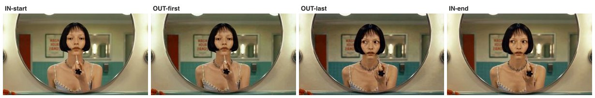


- **프롬프트(번역)**: 시작 자세에서 끝 자세까지 립글로스를 바른다. — 시작 프레임과 같은 장면·같은 고정 카메라. 끝 상태: 글로스 완드가 입술에 닿고, 턱이 살짝 들리고, 입술엔 갓 바른 광. *(+ 공통 계약 2층, 문서 상단)*
- **SSIM**: 첫 프레임 0.922 · 끝 도달 0.878
- **입력 이미지**: `assets/conti/s1_start.jpg` + `assets/conti/s1_end.jpg`
- **프로버넌스**: higgsfield · job `95b9b246` · 생성 6.06s → 목표 5.53s (리타임)

<details><summary>영상 프롬프트 원문</summary>

```
She applies the gloss from start pose to end pose. Ending state: Same scene, same locked camera as the start frame. End state: the gloss wand touches her lips, her chin tilted slightly up, lips freshly glossed.
Continuity bible (LOCKED): the same young woman in every shot — black lip-length bob with wispy bangs, layered silver charm choker, pale blue satin slip dress with white daisy lace trim; wardrobe and hairstyle never change. Location: retro pastel public restroom — mint-green tiles, orange-red round sinks on a mint counter, large round mirrors with vertical tube lights. Light: warm fluorescent from above the mirrors, constant, same time of day. She stays on the same side of the 180-degree line, facing the mirror wall. Signature props: small lip-gloss wand; chrome drain.
Never: any camera movement beyond what is specified, wardrobe or hairstyle change, shadow direction flip, day/night jump, extra people, duplicate faces, plastic skin, morphing hands, on-screen text, watermark.
```
</details>

### r 샷 2

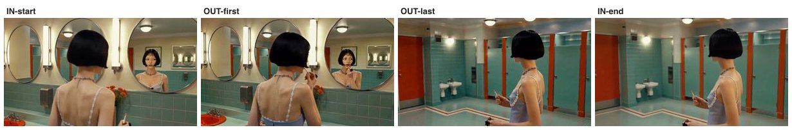


- **프롬프트(번역)**: 바르던 동작을 마치고 완드를 살짝 내린다. — 같은 프로필 프레이밍. 끝 상태: 완드를 입술에서 몇 cm 내리고, 눈은 거울을 확인. *(+ 공통 계약 2층, 문서 상단)*
- **SSIM**: 첫 프레임 0.673 · 끝 도달 0.773
- **입력 이미지**: `assets/conti/s2_start.jpg` + `assets/conti/s2_end.jpg`
- **프로버넌스**: higgsfield · job `0a0fcf65` · 생성 4.06s → 목표 3.43s (리타임)

<details><summary>영상 프롬프트 원문</summary>

```
She finishes the stroke and lowers the wand slightly. Ending state: Same profile framing. End state: wand lowered a few centimeters from her lips, her eyes checking the mirror.
Continuity bible (LOCKED): the same young woman in every shot — black lip-length bob with wispy bangs, layered silver charm choker, pale blue satin slip dress with white daisy lace trim; wardrobe and hairstyle never change. Location: retro pastel public restroom — mint-green tiles, orange-red round sinks on a mint counter, large round mirrors with vertical tube lights. Light: warm fluorescent from above the mirrors, constant, same time of day. She stays on the same side of the 180-degree line, facing the mirror wall. Signature props: small lip-gloss wand; chrome drain.
Never: any camera movement beyond what is specified, wardrobe or hairstyle change, shadow direction flip, day/night jump, extra people, duplicate faces, plastic skin, morphing hands, on-screen text, watermark.
```
</details>

### r 샷 3

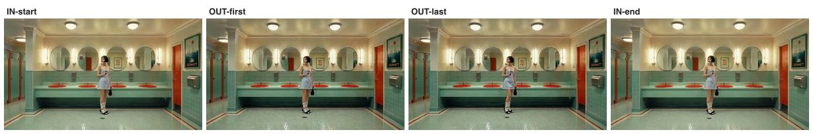


- **프롬프트(번역)**: 거의 정지한 채 서 있다. — 같은 와이드 마스터 프레이밍. 끝 상태: 거의 동일, 체중만 반대 다리로. *(+ 공통 계약 2층, 문서 상단)*
- **SSIM**: 첫 프레임 0.763 · 끝 도달 0.751
- **입력 이미지**: `assets/conti/s3_start.jpg` + `assets/conti/s3_end.jpg`
- **프로버넌스**: higgsfield · job `b216236a` · 생성 4.06s → 목표 1.44s (리타임)

<details><summary>영상 프롬프트 원문</summary>

```
She stands almost still. Ending state: Same wide master framing. End state: nearly identical, her weight shifted to the other leg.
Continuity bible (LOCKED): the same young woman in every shot — black lip-length bob with wispy bangs, layered silver charm choker, pale blue satin slip dress with white daisy lace trim; wardrobe and hairstyle never change. Location: retro pastel public restroom — mint-green tiles, orange-red round sinks on a mint counter, large round mirrors with vertical tube lights. Light: warm fluorescent from above the mirrors, constant, same time of day. She stays on the same side of the 180-degree line, facing the mirror wall. Signature props: small lip-gloss wand; chrome drain.
Never: any camera movement beyond what is specified, wardrobe or hairstyle change, shadow direction flip, day/night jump, extra people, duplicate faces, plastic skin, morphing hands, on-screen text, watermark.
```
</details>

### r 샷 4

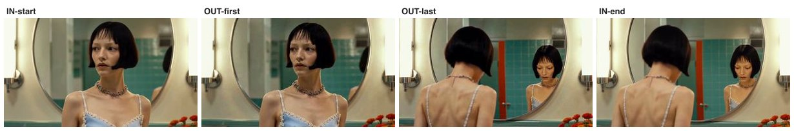


- **프롬프트(번역)**: 고개가 거울 쪽으로 살짝 돌아간다. — 같은 오버숄더 프레이밍. 끝 상태: 고개가 몇 도 돌아가 거울 속 자신과 시선이 마주침. *(+ 공통 계약 2층, 문서 상단)*
- **SSIM**: 첫 프레임 0.852 · 끝 도달 0.859
- **입력 이미지**: `assets/conti/s4_start.jpg` + `assets/conti/s4_end.jpg`
- **프로버넌스**: higgsfield · job `4ec31416` · 생성 4.06s → 목표 3.3s (리타임)

<details><summary>영상 프롬프트 원문</summary>

```
Her head turns slightly toward the mirror. Ending state: Same over-the-shoulder framing. End state: her head turned a few degrees, eyes meeting her own reflection.
Continuity bible (LOCKED): the same young woman in every shot — black lip-length bob with wispy bangs, layered silver charm choker, pale blue satin slip dress with white daisy lace trim; wardrobe and hairstyle never change. Location: retro pastel public restroom — mint-green tiles, orange-red round sinks on a mint counter, large round mirrors with vertical tube lights. Light: warm fluorescent from above the mirrors, constant, same time of day. She stays on the same side of the 180-degree line, facing the mirror wall. Signature props: small lip-gloss wand; chrome drain.
Never: any camera movement beyond what is specified, wardrobe or hairstyle change, shadow direction flip, day/night jump, extra people, duplicate faces, plastic skin, morphing hands, on-screen text, watermark.
```
</details>

### r 샷 5

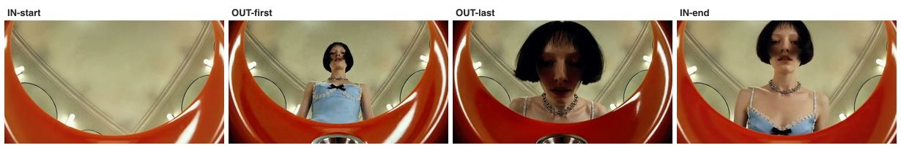


- **프롬프트(번역)**: 세면대 위로 천천히 몸을 기울인다. — 같은 세면대 탑다운 POV. 끝 상태: 얼굴이 림에 조금 더 가까이, 시선은 아래에 고정. *(+ 공통 계약 2층, 문서 상단)*
- **SSIM**: 첫 프레임 0.690 · 끝 도달 0.611
- **입력 이미지**: `assets/conti/s5_start.jpg` + `assets/conti/s5_end.jpg`
- **프로버넌스**: higgsfield · job `ff906e56` · 생성 4.06s → 목표 3.63s (리타임)

<details><summary>영상 프롬프트 원문</summary>

```
She leans in slowly over the sink. Ending state: Same top-down sink POV. End state: her face a little closer to the rim, gaze fixed downward.
Continuity bible (LOCKED): the same young woman in every shot — black lip-length bob with wispy bangs, layered silver charm choker, pale blue satin slip dress with white daisy lace trim; wardrobe and hairstyle never change. Location: retro pastel public restroom — mint-green tiles, orange-red round sinks on a mint counter, large round mirrors with vertical tube lights. Light: warm fluorescent from above the mirrors, constant, same time of day. She stays on the same side of the 180-degree line, facing the mirror wall. Signature props: small lip-gloss wand; chrome drain.
Never: any camera movement beyond what is specified, wardrobe or hairstyle change, shadow direction flip, day/night jump, extra people, duplicate faces, plastic skin, morphing hands, on-screen text, watermark.
```
</details>

### r 샷 6

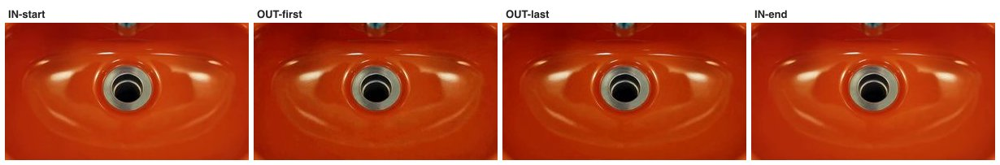


- **프롬프트(번역)**: 정지 샷, 희미한 빛 일렁임만. — 같은 배수구 매크로 프레이밍, 변화 없음(정지 인서트). 세면대는 마른 채 비어 있음 — 물·수도 틀기 금지. *(+ 공통 계약 2층, 문서 상단)*
- **SSIM**: 첫 프레임 0.957 · 끝 도달 0.957
- **입력 이미지**: `assets/conti/s6_start.jpg` + `assets/conti/s6_end.jpg`
- **프로버넌스**: higgsfield · job `96d30474` · 생성 4.06s → 목표 1.57s (리타임)

<details><summary>영상 프롬프트 원문</summary>

```
Static shot, faint shimmer. Ending state: Same macro framing of the drain, unchanged (static insert). The basin stays dry and empty — no water, no running faucet, nothing added.
Continuity bible (LOCKED): the same young woman in every shot — black lip-length bob with wispy bangs, layered silver charm choker, pale blue satin slip dress with white daisy lace trim; wardrobe and hairstyle never change. Location: retro pastel public restroom — mint-green tiles, orange-red round sinks on a mint counter, large round mirrors with vertical tube lights. Light: warm fluorescent from above the mirrors, constant, same time of day. She stays on the same side of the 180-degree line, facing the mirror wall. Signature props: small lip-gloss wand; chrome drain.
Never: any camera movement beyond what is specified, wardrobe or hairstyle change, shadow direction flip, day/night jump, extra people, duplicate faces, plastic skin, morphing hands, on-screen text, watermark.
```
</details>

## B1 — 시작+끝 프레임 쌍

> 샷마다 **시작·끝 그림 2장을 먼저 확정**하고, 모델에게 "이 두 그림 사이만 메워라"고 시킨다. 카메라·동작의 도착점이 그림으로 못박히면 AI가 멋대로 카메라를 움직일 자유가 사라진다는 가설 — 설계 시점의 **유력 승자 후보**.

### b1 샷 1

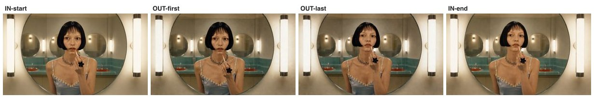


- **프롬프트(번역)**: 시작 자세에서 끝 자세까지 립글로스를 바른다. — 시작 프레임과 같은 장면·같은 고정 카메라. 끝 상태: 글로스 완드가 입술에 닿고, 턱이 살짝 들리고, 입술엔 갓 바른 광. *(+ 공통 계약 2층, 문서 상단)*
- **SSIM**: 첫 프레임 0.864 · 끝 도달 0.884
- **입력 이미지**: `assets/arm-b1/frames/s1_start.jpg` + `assets/arm-b1/frames/s1_end.jpg`
- **프로버넌스**: higgsfield · job `e787867c` · 생성 6.06s → 목표 5.53s (리타임)

<details><summary>영상 프롬프트 원문</summary>

```
She applies the gloss from start pose to end pose. Ending state: Same scene, same locked camera as the start frame. End state: the gloss wand touches her lips, her chin tilted slightly up, lips freshly glossed.
Continuity bible (LOCKED): the same young woman in every shot — black lip-length bob with wispy bangs, layered silver charm choker, pale blue satin slip dress with white daisy lace trim; wardrobe and hairstyle never change. Location: retro pastel public restroom — mint-green tiles, orange-red round sinks on a mint counter, large round mirrors with vertical tube lights. Light: warm fluorescent from above the mirrors, constant, same time of day. She stays on the same side of the 180-degree line, facing the mirror wall. Signature props: small lip-gloss wand; chrome drain.
Never: any camera movement beyond what is specified, wardrobe or hairstyle change, shadow direction flip, day/night jump, extra people, duplicate faces, plastic skin, morphing hands, on-screen text, watermark.
```
</details>

### b1 샷 2

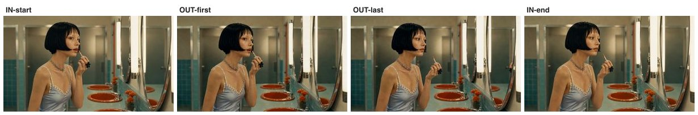


- **프롬프트(번역)**: 바르던 동작을 마치고 완드를 살짝 내린다. — 같은 프로필 프레이밍. 끝 상태: 완드를 입술에서 몇 cm 내리고, 눈은 거울을 확인. *(+ 공통 계약 2층, 문서 상단)*
- **SSIM**: 첫 프레임 0.729 · 끝 도달 0.818
- **입력 이미지**: `assets/arm-b1/frames/s2_start.jpg` + `assets/arm-b1/frames/s2_end.jpg`
- **프로버넌스**: higgsfield · job `018388e5` · 생성 4.06s → 목표 3.43s (리타임)

<details><summary>영상 프롬프트 원문</summary>

```
She finishes the stroke and lowers the wand slightly. Ending state: Same profile framing. End state: wand lowered a few centimeters from her lips, her eyes checking the mirror.
Continuity bible (LOCKED): the same young woman in every shot — black lip-length bob with wispy bangs, layered silver charm choker, pale blue satin slip dress with white daisy lace trim; wardrobe and hairstyle never change. Location: retro pastel public restroom — mint-green tiles, orange-red round sinks on a mint counter, large round mirrors with vertical tube lights. Light: warm fluorescent from above the mirrors, constant, same time of day. She stays on the same side of the 180-degree line, facing the mirror wall. Signature props: small lip-gloss wand; chrome drain.
Never: any camera movement beyond what is specified, wardrobe or hairstyle change, shadow direction flip, day/night jump, extra people, duplicate faces, plastic skin, morphing hands, on-screen text, watermark.
```
</details>

### b1 샷 3

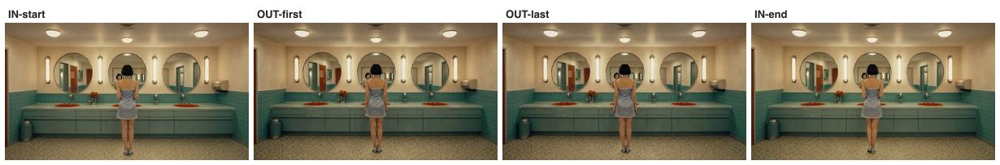


- **프롬프트(번역)**: 거의 정지한 채 서 있다. — 같은 와이드 마스터 프레이밍. 끝 상태: 거의 동일, 체중만 반대 다리로. *(+ 공통 계약 2층, 문서 상단)*
- **SSIM**: 첫 프레임 0.697 · 끝 도달 0.705
- **입력 이미지**: `assets/arm-b1/frames/s3_start.jpg` + `assets/arm-b1/frames/s3_end.jpg`
- **프로버넌스**: higgsfield · job `c50cda78` · 생성 4.06s → 목표 1.44s (리타임)

<details><summary>영상 프롬프트 원문</summary>

```
She stands almost still. Ending state: Same wide master framing. End state: nearly identical, her weight shifted to the other leg.
Continuity bible (LOCKED): the same young woman in every shot — black lip-length bob with wispy bangs, layered silver charm choker, pale blue satin slip dress with white daisy lace trim; wardrobe and hairstyle never change. Location: retro pastel public restroom — mint-green tiles, orange-red round sinks on a mint counter, large round mirrors with vertical tube lights. Light: warm fluorescent from above the mirrors, constant, same time of day. She stays on the same side of the 180-degree line, facing the mirror wall. Signature props: small lip-gloss wand; chrome drain.
Never: any camera movement beyond what is specified, wardrobe or hairstyle change, shadow direction flip, day/night jump, extra people, duplicate faces, plastic skin, morphing hands, on-screen text, watermark.
```
</details>

### b1 샷 4


- **프롬프트(번역)**: 고개가 거울 쪽으로 살짝 돌아간다. — 같은 오버숄더 프레이밍. 끝 상태: 고개가 몇 도 돌아가 거울 속 자신과 시선이 마주침. *(+ 공통 계약 2층, 문서 상단)*
- **SSIM**: 첫 프레임 0.814 · 끝 도달 0.849
- **입력 이미지**: `assets/arm-b1/frames/s4_start.jpg` + `assets/arm-b1/frames/s4_end.jpg`
- **프로버넌스**: higgsfield · job `8dad5fde` · 생성 4.06s → 목표 3.3s (리타임)

<details><summary>영상 프롬프트 원문</summary>

```
Her head turns slightly toward the mirror. Ending state: Same over-the-shoulder framing. End state: her head turned a few degrees, eyes meeting her own reflection.
Continuity bible (LOCKED): the same young woman in every shot — black lip-length bob with wispy bangs, layered silver charm choker, pale blue satin slip dress with white daisy lace trim; wardrobe and hairstyle never change. Location: retro pastel public restroom — mint-green tiles, orange-red round sinks on a mint counter, large round mirrors with vertical tube lights. Light: warm fluorescent from above the mirrors, constant, same time of day. She stays on the same side of the 180-degree line, facing the mirror wall. Signature props: small lip-gloss wand; chrome drain.
Never: any camera movement beyond what is specified, wardrobe or hairstyle change, shadow direction flip, day/night jump, extra people, duplicate faces, plastic skin, morphing hands, on-screen text, watermark.
```
</details>

### b1 샷 5

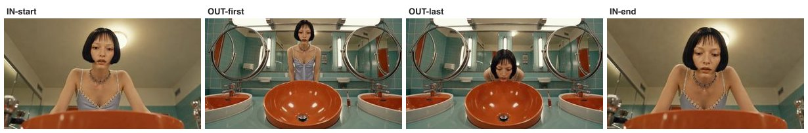


- **프롬프트(번역)**: 세면대 위로 천천히 몸을 기울인다. — 같은 세면대 탑다운 POV. 끝 상태: 얼굴이 림에 조금 더 가까이, 시선은 아래에 고정. *(+ 공통 계약 2층, 문서 상단)*
- **SSIM**: 첫 프레임 0.621 · 끝 도달 0.620
- **입력 이미지**: `assets/arm-b1/frames/s5_start.jpg` + `assets/arm-b1/frames/s5_end.jpg`
- **프로버넌스**: higgsfield · job `3199be14` · 생성 4.06s → 목표 3.63s (리타임)

<details><summary>영상 프롬프트 원문</summary>

```
She leans in slowly over the sink. Ending state: Same top-down sink POV. End state: her face a little closer to the rim, gaze fixed downward.
Continuity bible (LOCKED): the same young woman in every shot — black lip-length bob with wispy bangs, layered silver charm choker, pale blue satin slip dress with white daisy lace trim; wardrobe and hairstyle never change. Location: retro pastel public restroom — mint-green tiles, orange-red round sinks on a mint counter, large round mirrors with vertical tube lights. Light: warm fluorescent from above the mirrors, constant, same time of day. She stays on the same side of the 180-degree line, facing the mirror wall. Signature props: small lip-gloss wand; chrome drain.
Never: any camera movement beyond what is specified, wardrobe or hairstyle change, shadow direction flip, day/night jump, extra people, duplicate faces, plastic skin, morphing hands, on-screen text, watermark.
```
</details>

### b1 샷 6

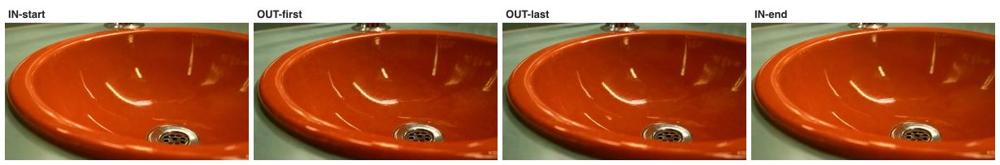


- **프롬프트(번역)**: 정지 샷, 희미한 빛 일렁임만. — 같은 배수구 매크로 프레이밍, 변화 없음(정지 인서트). 세면대는 마른 채 비어 있음 — 물·수도 틀기 금지. *(+ 공통 계약 2층, 문서 상단)*
- **SSIM**: 첫 프레임 0.796 · 끝 도달 0.848
- **입력 이미지**: `assets/arm-b1/frames/s6_start.jpg` + `assets/arm-b1/frames/s6_end.jpg`
- **프로버넌스**: higgsfield · job `b20e9cd6` · 생성 4.06s → 목표 1.57s (리타임)

<details><summary>영상 프롬프트 원문</summary>

```
Static shot, faint shimmer. Ending state: Same macro framing of the drain, unchanged (static insert). The basin stays dry and empty — no water, no running faucet, nothing added.
Continuity bible (LOCKED): the same young woman in every shot — black lip-length bob with wispy bangs, layered silver charm choker, pale blue satin slip dress with white daisy lace trim; wardrobe and hairstyle never change. Location: retro pastel public restroom — mint-green tiles, orange-red round sinks on a mint counter, large round mirrors with vertical tube lights. Light: warm fluorescent from above the mirrors, constant, same time of day. She stays on the same side of the 180-degree line, facing the mirror wall. Signature props: small lip-gloss wand; chrome drain.
Never: any camera movement beyond what is specified, wardrobe or hairstyle change, shadow direction flip, day/night jump, extra people, duplicate faces, plastic skin, morphing hands, on-screen text, watermark.
```
</details>

## B2 — 콘티 시트 셀 수확

> 6샷의 시작 그림을 **한 번의 이미지 생성 안에 격자(콘티 시트)로** 그리게 한 뒤 셀을 잘라 쓴다. "한 생성 안 6컷"은 인물·공간 일관성이 공짜라는 가설. 끝 그림·영상 단계는 B1과 완전 동일 — **B1과의 유일한 차이는 시작 그림의 출신**(개별 생성 vs 시트 수확)이다. 대가: 셀 해상도 손실(~344×286→720p 업스케일).

### b2 샷 1

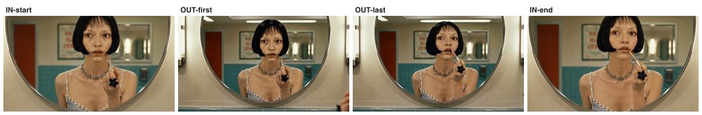


- **프롬프트(번역)**: 시작 자세에서 끝 자세까지 립글로스를 바른다. — 시작 프레임과 같은 장면·같은 고정 카메라. 끝 상태: 글로스 완드가 입술에 닿고, 턱이 살짝 들리고, 입술엔 갓 바른 광. *(+ 공통 계약 2층, 문서 상단)*
- **SSIM**: 첫 프레임 0.624 · 끝 도달 0.614
- **입력 이미지**: `assets/arm-b2/frames/s1_start.jpg` + `assets/arm-b2/frames/s1_end.jpg`
- **프로버넌스**: higgsfield · job `83a2a3aa` · 생성 6.06s → 목표 5.53s (리타임)

<details><summary>영상 프롬프트 원문</summary>

```
She applies the gloss from start pose to end pose. Ending state: Same scene, same locked camera as the start frame. End state: the gloss wand touches her lips, her chin tilted slightly up, lips freshly glossed.
Continuity bible (LOCKED): the same young woman in every shot — black lip-length bob with wispy bangs, layered silver charm choker, pale blue satin slip dress with white daisy lace trim; wardrobe and hairstyle never change. Location: retro pastel public restroom — mint-green tiles, orange-red round sinks on a mint counter, large round mirrors with vertical tube lights. Light: warm fluorescent from above the mirrors, constant, same time of day. She stays on the same side of the 180-degree line, facing the mirror wall. Signature props: small lip-gloss wand; chrome drain.
Never: any camera movement beyond what is specified, wardrobe or hairstyle change, shadow direction flip, day/night jump, extra people, duplicate faces, plastic skin, morphing hands, on-screen text, watermark.
```
</details>

### b2 샷 2

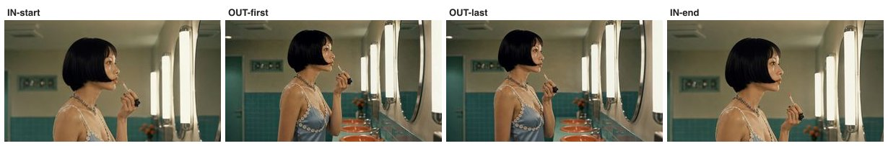


- **프롬프트(번역)**: 바르던 동작을 마치고 완드를 살짝 내린다. — 같은 프로필 프레이밍. 끝 상태: 완드를 입술에서 몇 cm 내리고, 눈은 거울을 확인. *(+ 공통 계약 2층, 문서 상단)*
- **SSIM**: 첫 프레임 0.665 · 끝 도달 0.654
- **입력 이미지**: `assets/arm-b2/frames/s2_start.jpg` + `assets/arm-b2/frames/s2_end.jpg`
- **프로버넌스**: higgsfield · job `1a33d57c` · 생성 4.06s → 목표 3.43s (리타임)

<details><summary>영상 프롬프트 원문</summary>

```
She finishes the stroke and lowers the wand slightly. Ending state: Same profile framing. End state: wand lowered a few centimeters from her lips, her eyes checking the mirror.
Continuity bible (LOCKED): the same young woman in every shot — black lip-length bob with wispy bangs, layered silver charm choker, pale blue satin slip dress with white daisy lace trim; wardrobe and hairstyle never change. Location: retro pastel public restroom — mint-green tiles, orange-red round sinks on a mint counter, large round mirrors with vertical tube lights. Light: warm fluorescent from above the mirrors, constant, same time of day. She stays on the same side of the 180-degree line, facing the mirror wall. Signature props: small lip-gloss wand; chrome drain.
Never: any camera movement beyond what is specified, wardrobe or hairstyle change, shadow direction flip, day/night jump, extra people, duplicate faces, plastic skin, morphing hands, on-screen text, watermark.
```
</details>

### b2 샷 3

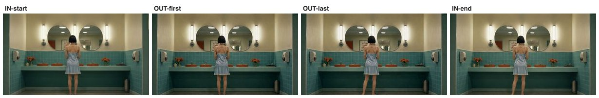


- **프롬프트(번역)**: 거의 정지한 채 서 있다. — 같은 와이드 마스터 프레이밍. 끝 상태: 거의 동일, 체중만 반대 다리로. *(+ 공통 계약 2층, 문서 상단)*
- **SSIM**: 첫 프레임 0.787 · 끝 도달 0.847
- **입력 이미지**: `assets/arm-b2/frames/s3_start.jpg` + `assets/arm-b2/frames/s3_end.jpg`
- **프로버넌스**: higgsfield · job `36fe4de5` · 생성 4.06s → 목표 1.44s (리타임)

<details><summary>영상 프롬프트 원문</summary>

```
She stands almost still. Ending state: Same wide master framing. End state: nearly identical, her weight shifted to the other leg.
Continuity bible (LOCKED): the same young woman in every shot — black lip-length bob with wispy bangs, layered silver charm choker, pale blue satin slip dress with white daisy lace trim; wardrobe and hairstyle never change. Location: retro pastel public restroom — mint-green tiles, orange-red round sinks on a mint counter, large round mirrors with vertical tube lights. Light: warm fluorescent from above the mirrors, constant, same time of day. She stays on the same side of the 180-degree line, facing the mirror wall. Signature props: small lip-gloss wand; chrome drain.
Never: any camera movement beyond what is specified, wardrobe or hairstyle change, shadow direction flip, day/night jump, extra people, duplicate faces, plastic skin, morphing hands, on-screen text, watermark.
```
</details>

### b2 샷 4

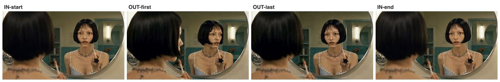


- **프롬프트(번역)**: 고개가 거울 쪽으로 살짝 돌아간다. — 같은 오버숄더 프레이밍. 끝 상태: 고개가 몇 도 돌아가 거울 속 자신과 시선이 마주침. *(+ 공통 계약 2층, 문서 상단)*
- **SSIM**: 첫 프레임 0.793 · 끝 도달 0.854
- **입력 이미지**: `assets/arm-b2/frames/s4_start.jpg` + `assets/arm-b2/frames/s4_end.jpg`
- **프로버넌스**: higgsfield · job `797534ef` · 생성 4.06s → 목표 3.3s (리타임)

<details><summary>영상 프롬프트 원문</summary>

```
Her head turns slightly toward the mirror. Ending state: Same over-the-shoulder framing. End state: her head turned a few degrees, eyes meeting her own reflection.
Continuity bible (LOCKED): the same young woman in every shot — black lip-length bob with wispy bangs, layered silver charm choker, pale blue satin slip dress with white daisy lace trim; wardrobe and hairstyle never change. Location: retro pastel public restroom — mint-green tiles, orange-red round sinks on a mint counter, large round mirrors with vertical tube lights. Light: warm fluorescent from above the mirrors, constant, same time of day. She stays on the same side of the 180-degree line, facing the mirror wall. Signature props: small lip-gloss wand; chrome drain.
Never: any camera movement beyond what is specified, wardrobe or hairstyle change, shadow direction flip, day/night jump, extra people, duplicate faces, plastic skin, morphing hands, on-screen text, watermark.
```
</details>

### b2 샷 5

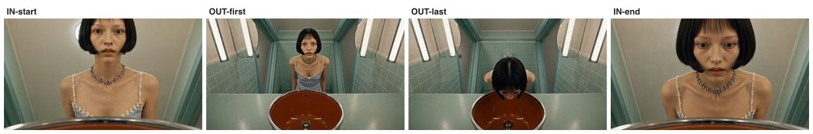


- **프롬프트(번역)**: 세면대 위로 천천히 몸을 기울인다. — 같은 세면대 탑다운 POV. 끝 상태: 얼굴이 림에 조금 더 가까이, 시선은 아래에 고정. *(+ 공통 계약 2층, 문서 상단)*
- **SSIM**: 첫 프레임 0.684 · 끝 도달 0.659
- **입력 이미지**: `assets/arm-b2/frames/s5_start.jpg` + `assets/arm-b2/frames/s5_end.jpg`
- **프로버넌스**: higgsfield · job `ad2f67f4` · 생성 4.06s → 목표 3.63s (리타임)

<details><summary>영상 프롬프트 원문</summary>

```
She leans in slowly over the sink. Ending state: Same top-down sink POV. End state: her face a little closer to the rim, gaze fixed downward.
Continuity bible (LOCKED): the same young woman in every shot — black lip-length bob with wispy bangs, layered silver charm choker, pale blue satin slip dress with white daisy lace trim; wardrobe and hairstyle never change. Location: retro pastel public restroom — mint-green tiles, orange-red round sinks on a mint counter, large round mirrors with vertical tube lights. Light: warm fluorescent from above the mirrors, constant, same time of day. She stays on the same side of the 180-degree line, facing the mirror wall. Signature props: small lip-gloss wand; chrome drain.
Never: any camera movement beyond what is specified, wardrobe or hairstyle change, shadow direction flip, day/night jump, extra people, duplicate faces, plastic skin, morphing hands, on-screen text, watermark.
```
</details>

### b2 샷 6

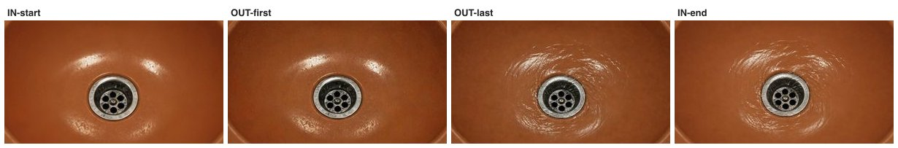


- **프롬프트(번역)**: 정지 샷, 희미한 빛 일렁임만. — 같은 배수구 매크로 프레이밍, 변화 없음(정지 인서트). 세면대는 마른 채 비어 있음 — 물·수도 틀기 금지. *(+ 공통 계약 2층, 문서 상단)*
- **SSIM**: 첫 프레임 0.889 · 끝 도달 0.805
- **입력 이미지**: `assets/arm-b2/frames/s6_start.jpg` + `assets/arm-b2/frames/s6_end.jpg`
- **프로버넌스**: higgsfield · job `5e3ebfc9` · 생성 4.06s → 목표 1.57s (리타임)

<details><summary>영상 프롬프트 원문</summary>

```
Static shot, faint shimmer. Ending state: Same macro framing of the drain, unchanged (static insert). The basin stays dry and empty — no water, no running faucet, nothing added.
Continuity bible (LOCKED): the same young woman in every shot — black lip-length bob with wispy bangs, layered silver charm choker, pale blue satin slip dress with white daisy lace trim; wardrobe and hairstyle never change. Location: retro pastel public restroom — mint-green tiles, orange-red round sinks on a mint counter, large round mirrors with vertical tube lights. Light: warm fluorescent from above the mirrors, constant, same time of day. She stays on the same side of the 180-degree line, facing the mirror wall. Signature props: small lip-gloss wand; chrome drain.
Never: any camera movement beyond what is specified, wardrobe or hairstyle change, shadow direction flip, day/night jump, extra people, duplicate faces, plastic skin, morphing hands, on-screen text, watermark.
```
</details>

## C — 클러스터 체이닝 (1·3·4는 B1 클립 재사용)

> B1과 같되, 같은 사건 묶음에서는 **앞 샷 클립의 "실제 마지막 화면"을 뽑아** 다음 샷 시작 그림을 만든다(샷 2·5·6). 설계값이 아니라 실물로 잇는 것 — 동작이 컷을 관통하는 느낌이 가장 충실하리라는 가설. 대가: 순차 실행 + 앞 샷 오류가 뒤로 전파. 샷 1·3·4는 B1과 입력이 동일해 **B1 클립을 그대로 재사용**(B1 vs C 비교가 체이닝 효과만 격리하도록).

### c 샷 1


- **프롬프트(번역)**: 시작 자세에서 끝 자세까지 립글로스를 바른다. — 시작 프레임과 같은 장면·같은 고정 카메라. 끝 상태: 글로스 완드가 입술에 닿고, 턱이 살짝 들리고, 입술엔 갓 바른 광. *(+ 공통 계약 2층, 문서 상단)*
- **SSIM**: 첫 프레임 0.864 · 끝 도달 0.884
- **입력 이미지**: `assets/arm-b1/frames/s1_start.jpg` + `assets/arm-b1/frames/s1_end.jpg`
- **프로버넌스**: **B1 클립 재사용** · 생성 6.06s → 목표 5.53s (리타임)

<details><summary>영상 프롬프트 원문</summary>

```
She applies the gloss from start pose to end pose. Ending state: Same scene, same locked camera as the start frame. End state: the gloss wand touches her lips, her chin tilted slightly up, lips freshly glossed.
Continuity bible (LOCKED): the same young woman in every shot — black lip-length bob with wispy bangs, layered silver charm choker, pale blue satin slip dress with white daisy lace trim; wardrobe and hairstyle never change. Location: retro pastel public restroom — mint-green tiles, orange-red round sinks on a mint counter, large round mirrors with vertical tube lights. Light: warm fluorescent from above the mirrors, constant, same time of day. She stays on the same side of the 180-degree line, facing the mirror wall. Signature props: small lip-gloss wand; chrome drain.
Never: any camera movement beyond what is specified, wardrobe or hairstyle change, shadow direction flip, day/night jump, extra people, duplicate faces, plastic skin, morphing hands, on-screen text, watermark.
```
</details>

### c 샷 2

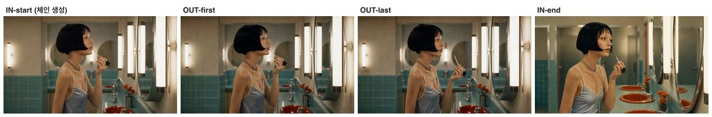


- **프롬프트(번역)**: 바르던 동작을 마치고 완드를 살짝 내린다. — 같은 프로필 프레이밍. 끝 상태: 완드를 입술에서 몇 cm 내리고, 눈은 거울을 확인. *(+ 공통 계약 2층, 문서 상단)*
- **SSIM**: 첫 프레임 0.867 · 끝 도달 0.590
- **입력 이미지**: `assets/arm-c/frames/s2_start.jpg (런타임 체인 생성)` + `assets/arm-b1/frames/s2_end.jpg`
- **프로버넌스**: higgsfield · job `f0960dfb` · 생성 4.06s → 목표 3.43s (리타임)
- **체인**: 클립 s1의 마지막 프레임 → 편집 모델 → 시작 프레임
  - 체인 프롬프트(번역): 이 순간을 정확히 이어서: 같은 여자, 완드도 입술에 같은 위치 — 단, 카운터 왼쪽 프로필에서 본 모습으로. 같은 조명, 같은 방.
  - 체인 프롬프트(원문): "Continue this exact moment: the same woman, same wand position at her lips, but seen from a left side profile at the counter. Same lighting, same room."

<details><summary>영상 프롬프트 원문</summary>

```
She finishes the stroke and lowers the wand slightly. Ending state: Same profile framing. End state: wand lowered a few centimeters from her lips, her eyes checking the mirror.
Continuity bible (LOCKED): the same young woman in every shot — black lip-length bob with wispy bangs, layered silver charm choker, pale blue satin slip dress with white daisy lace trim; wardrobe and hairstyle never change. Location: retro pastel public restroom — mint-green tiles, orange-red round sinks on a mint counter, large round mirrors with vertical tube lights. Light: warm fluorescent from above the mirrors, constant, same time of day. She stays on the same side of the 180-degree line, facing the mirror wall. Signature props: small lip-gloss wand; chrome drain.
Never: any camera movement beyond what is specified, wardrobe or hairstyle change, shadow direction flip, day/night jump, extra people, duplicate faces, plastic skin, morphing hands, on-screen text, watermark.
```
</details>

### c 샷 3


- **프롬프트(번역)**: 거의 정지한 채 서 있다. — 같은 와이드 마스터 프레이밍. 끝 상태: 거의 동일, 체중만 반대 다리로. *(+ 공통 계약 2층, 문서 상단)*
- **SSIM**: 첫 프레임 0.697 · 끝 도달 0.705
- **입력 이미지**: `assets/arm-b1/frames/s3_start.jpg` + `assets/arm-b1/frames/s3_end.jpg`
- **프로버넌스**: **B1 클립 재사용** · 생성 4.06s → 목표 1.44s (리타임)

<details><summary>영상 프롬프트 원문</summary>

```
She stands almost still. Ending state: Same wide master framing. End state: nearly identical, her weight shifted to the other leg.
Continuity bible (LOCKED): the same young woman in every shot — black lip-length bob with wispy bangs, layered silver charm choker, pale blue satin slip dress with white daisy lace trim; wardrobe and hairstyle never change. Location: retro pastel public restroom — mint-green tiles, orange-red round sinks on a mint counter, large round mirrors with vertical tube lights. Light: warm fluorescent from above the mirrors, constant, same time of day. She stays on the same side of the 180-degree line, facing the mirror wall. Signature props: small lip-gloss wand; chrome drain.
Never: any camera movement beyond what is specified, wardrobe or hairstyle change, shadow direction flip, day/night jump, extra people, duplicate faces, plastic skin, morphing hands, on-screen text, watermark.
```
</details>

### c 샷 4

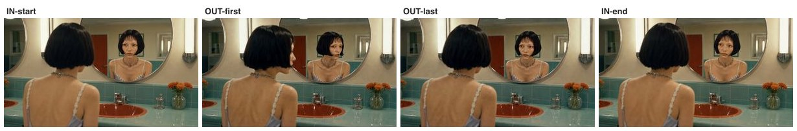


- **프롬프트(번역)**: 고개가 거울 쪽으로 살짝 돌아간다. — 같은 오버숄더 프레이밍. 끝 상태: 고개가 몇 도 돌아가 거울 속 자신과 시선이 마주침. *(+ 공통 계약 2층, 문서 상단)*
- **SSIM**: 첫 프레임 0.814 · 끝 도달 0.849
- **입력 이미지**: `assets/arm-b1/frames/s4_start.jpg` + `assets/arm-b1/frames/s4_end.jpg`
- **프로버넌스**: **B1 클립 재사용** · 생성 4.06s → 목표 3.3s (리타임)

<details><summary>영상 프롬프트 원문</summary>

```
Her head turns slightly toward the mirror. Ending state: Same over-the-shoulder framing. End state: her head turned a few degrees, eyes meeting her own reflection.
Continuity bible (LOCKED): the same young woman in every shot — black lip-length bob with wispy bangs, layered silver charm choker, pale blue satin slip dress with white daisy lace trim; wardrobe and hairstyle never change. Location: retro pastel public restroom — mint-green tiles, orange-red round sinks on a mint counter, large round mirrors with vertical tube lights. Light: warm fluorescent from above the mirrors, constant, same time of day. She stays on the same side of the 180-degree line, facing the mirror wall. Signature props: small lip-gloss wand; chrome drain.
Never: any camera movement beyond what is specified, wardrobe or hairstyle change, shadow direction flip, day/night jump, extra people, duplicate faces, plastic skin, morphing hands, on-screen text, watermark.
```
</details>

### c 샷 5

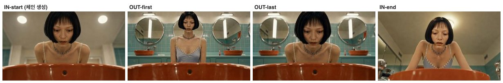


- **프롬프트(번역)**: 세면대 위로 천천히 몸을 기울인다. — 같은 세면대 탑다운 POV. 끝 상태: 얼굴이 림에 조금 더 가까이, 시선은 아래에 고정. *(+ 공통 계약 2층, 문서 상단)*
- **SSIM**: 첫 프레임 0.707 · 끝 도달 0.690
- **입력 이미지**: `assets/arm-c/frames/s5_start.jpg (런타임 체인 생성)` + `assets/arm-b1/frames/s5_end.jpg`
- **프로버넌스**: higgsfield · job `c46502e6` · 생성 4.06s → 목표 3.63s (리타임)
- **체인**: 클립 s4의 마지막 프레임 → 편집 모델 → 시작 프레임
  - 체인 프롬프트(번역): 바로 다음 순간: 시선이 거울에서 아래 세면대로 떨어진다 — 이제 세면대 안에서 주황 림 너머 그녀 얼굴을 올려다보는 시점.
  - 체인 프롬프트(원문): "The next instant: her gaze drops from the mirror to the sink below — now seen from inside the sink looking up at her face over the orange rim."

<details><summary>영상 프롬프트 원문</summary>

```
She leans in slowly over the sink. Ending state: Same top-down sink POV. End state: her face a little closer to the rim, gaze fixed downward.
Continuity bible (LOCKED): the same young woman in every shot — black lip-length bob with wispy bangs, layered silver charm choker, pale blue satin slip dress with white daisy lace trim; wardrobe and hairstyle never change. Location: retro pastel public restroom — mint-green tiles, orange-red round sinks on a mint counter, large round mirrors with vertical tube lights. Light: warm fluorescent from above the mirrors, constant, same time of day. She stays on the same side of the 180-degree line, facing the mirror wall. Signature props: small lip-gloss wand; chrome drain.
Never: any camera movement beyond what is specified, wardrobe or hairstyle change, shadow direction flip, day/night jump, extra people, duplicate faces, plastic skin, morphing hands, on-screen text, watermark.
```
</details>

### c 샷 6

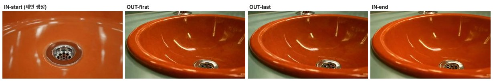


- **프롬프트(번역)**: 정지 샷, 희미한 빛 일렁임만. — 같은 배수구 매크로 프레이밍, 변화 없음(정지 인서트). 세면대는 마른 채 비어 있음 — 물·수도 틀기 금지. *(+ 공통 계약 2층, 문서 상단)*
- **SSIM**: 첫 프레임 0.721 · 끝 도달 0.861
- **입력 이미지**: `assets/arm-c/frames/s6_start.jpg (런타임 체인 생성)` + `assets/arm-b1/frames/s6_end.jpg`
- **프로버넌스**: higgsfield · job `bd191653` · 생성 4.06s → 목표 1.57s (리타임)
- **체인**: 클립 s5의 마지막 프레임 → 편집 모델 → 시작 프레임
  - 체인 프롬프트(번역): 그녀가 보고 있는 것: 같은 주황 세면대와 크롬 배수구의 익스트림 클로즈업, 인물 없음.
  - 체인 프롬프트(원문): "What she is looking at: extreme close-up of the same orange basin and chrome drain, no person."

<details><summary>영상 프롬프트 원문</summary>

```
Static shot, faint shimmer. Ending state: Same macro framing of the drain, unchanged (static insert). The basin stays dry and empty — no water, no running faucet, nothing added.
Continuity bible (LOCKED): the same young woman in every shot — black lip-length bob with wispy bangs, layered silver charm choker, pale blue satin slip dress with white daisy lace trim; wardrobe and hairstyle never change. Location: retro pastel public restroom — mint-green tiles, orange-red round sinks on a mint counter, large round mirrors with vertical tube lights. Light: warm fluorescent from above the mirrors, constant, same time of day. She stays on the same side of the 180-degree line, facing the mirror wall. Signature props: small lip-gloss wand; chrome drain.
Never: any camera movement beyond what is specified, wardrobe or hairstyle change, shadow direction flip, day/night jump, extra people, duplicate faces, plastic skin, morphing hands, on-screen text, watermark.
```
</details>

## A — 자산+연출 텍스트 (끝 프레임 없음)

> **현행 워크플로우의 강화판이자 대조 팔.** 캐릭터 시트+빈 배경 플레이트로 시작 그림을 만들어 주되, **끝 그림은 주지 않는다**. 움직임의 도착점이 텍스트("Camera locked")뿐이면 임의 카메라 무브를 못 막을 것이라는 약점 가설을 검증한다. B1이 A를 얼마나 이기는지가 이 실험의 핵심 대조.

### a 샷 1

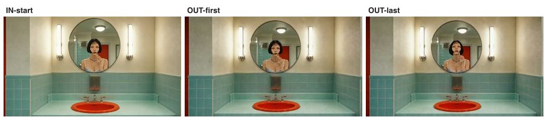


- **프롬프트(번역)**: 천천히 립글로스를 바른다 — 손과 입술만 움직임. 카메라 고정, 무브 없음. — 시작 프레임과 같은 장면·같은 고정 카메라. 끝 상태: 글로스 완드가 입술에 닿고, 턱이 살짝 들리고, 입술엔 갓 바른 광. *(+ 공통 계약 2층, 문서 상단)*
- **SSIM**: 첫 프레임 0.760 · 끝 도달 — (끝 입력 없음)
- **입력 이미지**: `assets/arm-a/frames/s1_start.jpg`
- **프로버넌스**: higgsfield · job `9244b58e` · 생성 6.06s → 목표 5.53s (리타임)

<details><summary>영상 프롬프트 원문</summary>

```
She slowly applies lip gloss; only her hand and lips move. Camera locked, no movement. Ending state: Same scene, same locked camera as the start frame. End state: the gloss wand touches her lips, her chin tilted slightly up, lips freshly glossed.
Continuity bible (LOCKED): the same young woman in every shot — black lip-length bob with wispy bangs, layered silver charm choker, pale blue satin slip dress with white daisy lace trim; wardrobe and hairstyle never change. Location: retro pastel public restroom — mint-green tiles, orange-red round sinks on a mint counter, large round mirrors with vertical tube lights. Light: warm fluorescent from above the mirrors, constant, same time of day. She stays on the same side of the 180-degree line, facing the mirror wall. Signature props: small lip-gloss wand; chrome drain.
Never: any camera movement beyond what is specified, wardrobe or hairstyle change, shadow direction flip, day/night jump, extra people, duplicate faces, plastic skin, morphing hands, on-screen text, watermark.
```
</details>

### a 샷 2

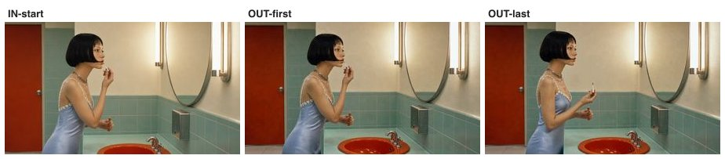


- **프롬프트(번역)**: 프로필인 채 계속 바른다 — 고개 미세 조정만. 카메라 고정. — 같은 프로필 프레이밍. 끝 상태: 완드를 입술에서 몇 cm 내리고, 눈은 거울을 확인. *(+ 공통 계약 2층, 문서 상단)*
- **SSIM**: 첫 프레임 0.763 · 끝 도달 — (끝 입력 없음)
- **입력 이미지**: `assets/arm-a/frames/s2_start.jpg`
- **프로버넌스**: higgsfield · job `e94da6fe` · 생성 4.06s → 목표 3.43s (리타임)

<details><summary>영상 프롬프트 원문</summary>

```
She keeps applying gloss in profile; tiny head adjustments only. Camera locked. Ending state: Same profile framing. End state: wand lowered a few centimeters from her lips, her eyes checking the mirror.
Continuity bible (LOCKED): the same young woman in every shot — black lip-length bob with wispy bangs, layered silver charm choker, pale blue satin slip dress with white daisy lace trim; wardrobe and hairstyle never change. Location: retro pastel public restroom — mint-green tiles, orange-red round sinks on a mint counter, large round mirrors with vertical tube lights. Light: warm fluorescent from above the mirrors, constant, same time of day. She stays on the same side of the 180-degree line, facing the mirror wall. Signature props: small lip-gloss wand; chrome drain.
Never: any camera movement beyond what is specified, wardrobe or hairstyle change, shadow direction flip, day/night jump, extra people, duplicate faces, plastic skin, morphing hands, on-screen text, watermark.
```
</details>

### a 샷 3

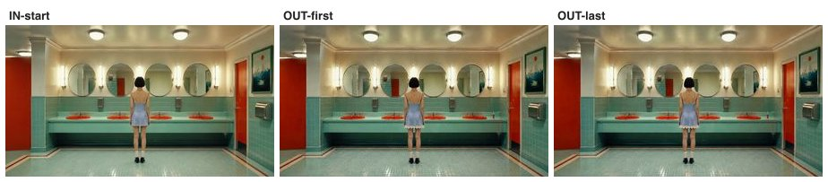


- **프롬프트(번역)**: 거의 정지, 체중만 살짝 이동. 카메라 고정. — 같은 와이드 마스터 프레이밍. 끝 상태: 거의 동일, 체중만 반대 다리로. *(+ 공통 계약 2층, 문서 상단)*
- **SSIM**: 첫 프레임 0.779 · 끝 도달 — (끝 입력 없음)
- **입력 이미지**: `assets/arm-a/frames/s3_start.jpg`
- **프로버넌스**: higgsfield · job `876462f0` · 생성 4.06s → 목표 1.44s (리타임)

<details><summary>영상 프롬프트 원문</summary>

```
She stands almost still, slight weight shift. Camera locked. Ending state: Same wide master framing. End state: nearly identical, her weight shifted to the other leg.
Continuity bible (LOCKED): the same young woman in every shot — black lip-length bob with wispy bangs, layered silver charm choker, pale blue satin slip dress with white daisy lace trim; wardrobe and hairstyle never change. Location: retro pastel public restroom — mint-green tiles, orange-red round sinks on a mint counter, large round mirrors with vertical tube lights. Light: warm fluorescent from above the mirrors, constant, same time of day. She stays on the same side of the 180-degree line, facing the mirror wall. Signature props: small lip-gloss wand; chrome drain.
Never: any camera movement beyond what is specified, wardrobe or hairstyle change, shadow direction flip, day/night jump, extra people, duplicate faces, plastic skin, morphing hands, on-screen text, watermark.
```
</details>

### a 샷 4

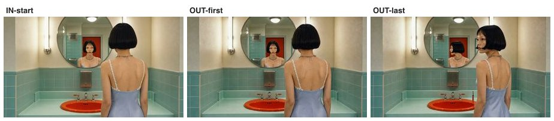


- **프롬프트(번역)**: 거울 속 자신을 살핀다, 고개 몇 도 회전. 카메라 고정. — 같은 오버숄더 프레이밍. 끝 상태: 고개가 몇 도 돌아가 거울 속 자신과 시선이 마주침. *(+ 공통 계약 2층, 문서 상단)*
- **SSIM**: 첫 프레임 0.839 · 끝 도달 — (끝 입력 없음)
- **입력 이미지**: `assets/arm-a/frames/s4_start.jpg`
- **프로버넌스**: higgsfield · job `ae821bf8` · 생성 4.06s → 목표 3.3s (리타임)

<details><summary>영상 프롬프트 원문</summary>

```
She studies herself in the mirror, head turns a few degrees. Camera locked. Ending state: Same over-the-shoulder framing. End state: her head turned a few degrees, eyes meeting her own reflection.
Continuity bible (LOCKED): the same young woman in every shot — black lip-length bob with wispy bangs, layered silver charm choker, pale blue satin slip dress with white daisy lace trim; wardrobe and hairstyle never change. Location: retro pastel public restroom — mint-green tiles, orange-red round sinks on a mint counter, large round mirrors with vertical tube lights. Light: warm fluorescent from above the mirrors, constant, same time of day. She stays on the same side of the 180-degree line, facing the mirror wall. Signature props: small lip-gloss wand; chrome drain.
Never: any camera movement beyond what is specified, wardrobe or hairstyle change, shadow direction flip, day/night jump, extra people, duplicate faces, plastic skin, morphing hands, on-screen text, watermark.
```
</details>

### a 샷 5

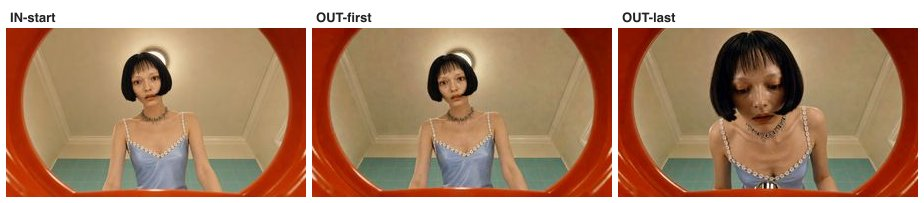


- **프롬프트(번역)**: 세면대 위로 조금 더 다가가고 시선은 아래를 훑는다. 카메라 고정. — 같은 세면대 탑다운 POV. 끝 상태: 얼굴이 림에 조금 더 가까이, 시선은 아래에 고정. *(+ 공통 계약 2층, 문서 상단)*
- **SSIM**: 첫 프레임 0.890 · 끝 도달 — (끝 입력 없음)
- **입력 이미지**: `assets/arm-a/frames/s5_start.jpg`
- **프로버넌스**: higgsfield · job `3cb62db6` · 생성 4.06s → 목표 3.63s (리타임)

<details><summary>영상 프롬프트 원문</summary>

```
She leans a little closer over the sink, eyes scanning downward. Camera locked. Ending state: Same top-down sink POV. End state: her face a little closer to the rim, gaze fixed downward.
Continuity bible (LOCKED): the same young woman in every shot — black lip-length bob with wispy bangs, layered silver charm choker, pale blue satin slip dress with white daisy lace trim; wardrobe and hairstyle never change. Location: retro pastel public restroom — mint-green tiles, orange-red round sinks on a mint counter, large round mirrors with vertical tube lights. Light: warm fluorescent from above the mirrors, constant, same time of day. She stays on the same side of the 180-degree line, facing the mirror wall. Signature props: small lip-gloss wand; chrome drain.
Never: any camera movement beyond what is specified, wardrobe or hairstyle change, shadow direction flip, day/night jump, extra people, duplicate faces, plastic skin, morphing hands, on-screen text, watermark.
```
</details>

### a 샷 6

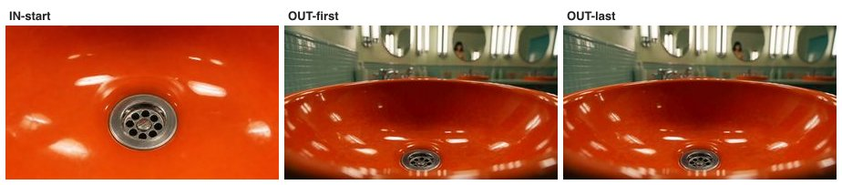


- **프롬프트(번역)**: 정지 인서트 — 희미한 빛 일렁임만. 카메라 고정. — 같은 배수구 매크로 프레이밍, 변화 없음(정지 인서트). 세면대는 마른 채 비어 있음 — 물·수도 틀기 금지. *(+ 공통 계약 2층, 문서 상단)*
- **SSIM**: 첫 프레임 0.657 · 끝 도달 — (끝 입력 없음)
- **입력 이미지**: `assets/arm-a/frames/s6_start.jpg`
- **프로버넌스**: higgsfield · job `7ffe1736` · 생성 4.06s → 목표 1.57s (리타임)

<details><summary>영상 프롬프트 원문</summary>

```
Static insert; faint light shimmer only. Camera locked. Ending state: Same macro framing of the drain, unchanged (static insert). The basin stays dry and empty — no water, no running faucet, nothing added.
Continuity bible (LOCKED): the same young woman in every shot — black lip-length bob with wispy bangs, layered silver charm choker, pale blue satin slip dress with white daisy lace trim; wardrobe and hairstyle never change. Location: retro pastel public restroom — mint-green tiles, orange-red round sinks on a mint counter, large round mirrors with vertical tube lights. Light: warm fluorescent from above the mirrors, constant, same time of day. She stays on the same side of the 180-degree line, facing the mirror wall. Signature props: small lip-gloss wand; chrome drain.
Never: any camera movement beyond what is specified, wardrobe or hairstyle change, shadow direction flip, day/night jump, extra people, duplicate faces, plastic skin, morphing hands, on-screen text, watermark.
```
</details>

## B2β — 시트 통째 입력 (판정 제외, 오작동 기록용)

> **원안 그대로의 SNS 소문 검증**: 시작·끝 그림과 연출 노트가 행마다 박힌 연출 시트 한 장을 영상 모델에 통째로 넣고 "이 표대로 만들어라"고 시키면 되는가? 격자가 화면에 그대로 나오는 오작동만 기록하고 판정에선 제외한다.

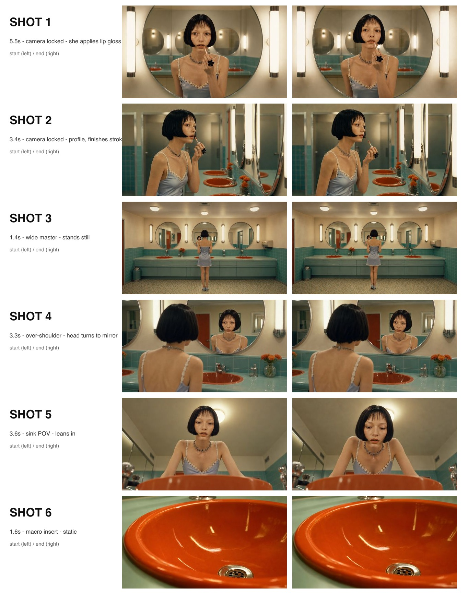


- **입력**: `assets/arm-b2/beta_sheet.jpg` 1장 + 아래 프롬프트 · 15초 요청 · 1차 nsfw 차단 → 재시도 성공
- **프롬프트(번역)**: 전체 시퀀스를 만들어라: 각 행이 샷 하나, 순서대로, 적힌 길이대로. 샷 사이는 컷. 시트 자체를 화면에 보여주지 말 것.

```
Create the full sequence: each row is one shot, in order, with the written durations. Cut between shots. Do not show the sheet itself.
```
