# E9d-copy 설계도 ⓪ — 콘티 (공통 정답지)

> **이 문서는 네 가지 방식(A·B1·B2·C)이 전부 똑같이 재현해야 하는 "정답 콘티"다.** 레퍼런스 영상의
> 립 바르기 구간(5.8초~24.7초, 6샷 18.9초)을 원본 프레임과 함께 샷 단위로 옮겨 적었다.
> 어느 방식이 이기든, 이 콘티에서 벗어난 카메라 움직임·인물 변형이 "감점"이다.
>
> 작성일 2026-07-23 · 영상 생성 0회(원본 프레임 추출만) · 오너 검토용.

## 0. 구간 확정 메모

오너가 고른 "립 바르기 구간"을 원본 컷 경계에 맞춰 확정하니 **6샷 18.9초**가 됐다(제안서의 "5샷
13초"에서 조정). 조정 이유: 원본을 실측하니 립 바르기 클러스터(정면→프로필→뒤통수) **사이에 마스터
와이드가 1.4초 쉼표로 끼어 있는** 구조였다 — 마스터 후렴을 클러스터 밖이 아니라 안에 박아 쓰는 실제
사례라, 자르지 않고 그대로 포함했다. 뒤이어 세면대 사건 시작(5번)과 배수구 인서트(6번)까지 물면
문법 요소(홀드·클러스터·마스터·사건 전환·인서트)가 전부 이 한 구간에 들어온다.

## 1. 콘티 — 6샷 (원본 시작/중간/끝 프레임)

**이 구간의 카메라는 6샷 전부 고정(무브 없음)이다.** 화면의 모든 움직임은 인물의 동작이 만든다 —
그래서 "AI가 멋대로 카메라를 움직였는가"를 판별하기 가장 좋은 구간이다.

> **읽는 법**: 세 프레임 중 실제 영상 모델 입력으로 쓰이는 건 **시작**(A안)·**시작+끝**(B1·B2·C·R)뿐이다. **중간 프레임은 입력이 아니라 원본 동작 궤적을 눈으로 대조하는 리뷰용 참고 이미지**다(정량평가도 시작/끝 프레임만 사용 — design.md §5-3·4).

아래 각 샷의 이미지 줄은 왼쪽부터 **시작 · 중간 · 끝** 순서다. 표시용은 300px 썸네일(`assets/conti/thumbs/`)이고, 전체 해상도 원본(1280×720, 입력·R대조군용)은 `assets/conti/`에 그대로 있다. (Orca가 표 셀 안 이미지·HTML·`|width` 폭 지정을 안 먹어, 표 대신 샷별 블록 + 실물 썸네일로 배치했다 — 옵시디언·GitHub·VS Code에서도 동일하게 보인다.)

**샷 1 · 5.53초 (홀드)** — 둥근 거울 정면. 립글로스를 천천히 입술로 가져가 바른다. 손과 입술만 움직임.

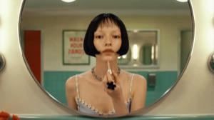 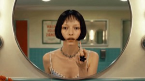 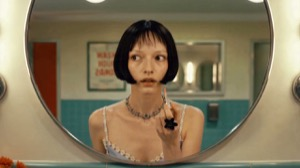

**샷 2 · 3.43초** — **같은 동작을 옆모습으로 이어받음**(앵글 점프). 프로필로 계속 바른다.

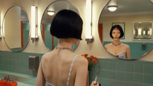 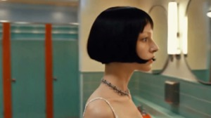 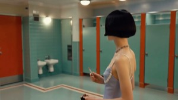

**샷 3 · 1.44초** — **마스터 와이드 쉼표**. 대칭 전경, 소녀가 중앙에 작게. 거의 정지.

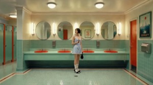 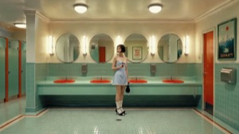 

**샷 4 · 3.30초** — 뒤통수 너머 거울 반사. 거울 확인 동작을 세 번째 앵글로 이어받음. 고개 미세 회전.

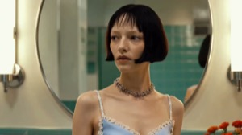 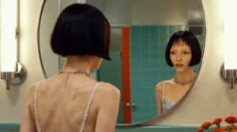 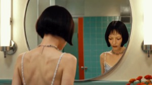

**샷 5 · 3.63초** — **사건 전환**. 세면대 안에서 올려다본 시점. 얼굴이 세면대를 내려다보며 다가옴.

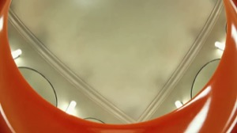 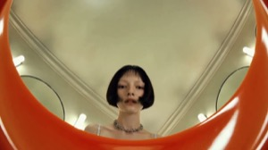 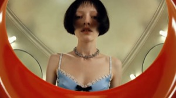

**샷 6 · 1.57초** — **인서트 쉼표**. 주황 세면대 배수구 클로즈업. 인물 없음, 완전 정지.

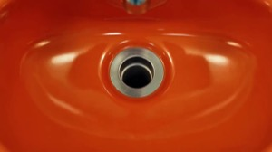 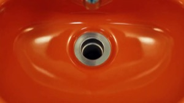 

## 2. 샷 사이의 연결 (이 콘티가 연속으로 읽히는 이유)

- 1→2: **같은 동작(립 바르기)의 앵글 점프** — 동작이 컷을 관통
- 2→3: 마스터 와이드로 잠깐 물러남 — 공간 지도 리셋 (쉼표)
- 3→4: 다시 가까이 — 거울 확인이라는 같은 사건의 세 번째 앵글
- 4→5: 시선이 거울에서 세면대로 — 사건이 자연스럽게 넘어가는 전환점
- 5→6: 그녀가 보고 있는 대상(배수구)을 보여줌 — 시선 연결 인서트

## 3. R 대조군 (상한선) 정의

위 표의 **원본 시작 프레임(끝 프레임 방식은 끝 프레임도)을 그대로** 영상 모델에 넣는다. 우리 이미지
생성 계층을 완전히 우회하므로, R의 결과 = "영상 모델이 낼 수 있는 최고치". A~C가 R에 얼마나
가까운지로 "이미지 계층에서 잃은 것"과 "영상 계층에서 잃은 것"을 분리해 읽는다.

## 4. 공통 재료 (모든 방식이 공유)

- **캐릭터 정본**: `../2026-07-23_character-canon/assets/identity_ref.jpg` (원본 10.9초 정면 — 신원 전파 검증 완료)
- **빈 배경 원천**: 원본 영상 끝부분(60.9~66초)에 인물 없는 빈 화장실 와이드가 있다 — A안의 배경
  플레이트 원천으로 사용 (다른 앵글의 빈 배경은 여기서 편집 모델로 파생)
- **화면비**: 16:9 · 스타일 공통 문구: 민트 타일·주황 세면대·둥근 거울·웜 형광등, 영화적 사실주의

---

기술 부록: 프레임 추출 = 원본 `video_girls_in_mirror.mp4`에서 컷 경계(±0.1초 여유) ffmpeg 추출.
컷 시각은 레퍼런스 해석 문서(`../../../references/2026-07-22-girls-in-mirror-continuity.md` 부록) 재사용.
샷 경계(초): 5.77 / 11.30 / 14.73 / 16.17 / 19.47 / 23.10 / 24.67.
