# 스테이징 기록 — 영상 생성 "직전 상태" 완료 (2026-07-23)

> **다섯 팔(A·B1·B2·C·R) 전부, 영상 모델에 넣을 이미지·프롬프트·길이가 준비됐다.**
> 남은 것은 선행-가(엄격 I2V 모델 스크리닝, design.md §4)와 I2V 실행뿐. 이 문서는 무엇이
> 어떻게 준비됐고 어디에 있는지의 기록이다. 편집 모델 실사용 30콜 (예산 ~45콜 안).

## 1. 계약서 — `assets/payloads/payloads.json`

영상 생성기 러너가 읽을 단일 파일. 팔×샷마다 `start_image`/`end_image`(경로)·`video_prompt`
(움직임 + 결말 상태 + 연속성 바이블 + 네거티브 배터리, design.md §8-1의 3층 계약)·`duration_s`·
`aspect_ratio`·모델 요구사항이 들어 있다. 경로는 실험 루트 기준.

## 2. 팔별 상세 설명서

각 팔 폴더에 README를 뒀다 — **무엇을 넣어서 무엇을 만들었고, 폴더 안 파일이 각각 뭔지**의
상세 기록: [`assets/README.md`](assets/README.md)(지도) ·
[`arm-a`](assets/arm-a/README.md) · [`arm-b1`](assets/arm-b1/README.md) ·
[`arm-b2`](assets/arm-b2/README.md) · [`arm-c`](assets/arm-c/README.md) ·
[`arm-r`](assets/arm-r/README.md). 아래는 요약이다.

## 3. 팔별 준비물 (요약)

### Ⓐ 자산 + 연출 텍스트 — `assets/arm-a/`

캐릭터 시트 1 + 배경 플레이트 4(와이드는 원본 65.5초 프레임 승격, 0콜) → 시작 프레임 6.
영상 입력 = 시작 프레임 + 움직임 텍스트 (끝 프레임 없음 — 이 팔의 요체).

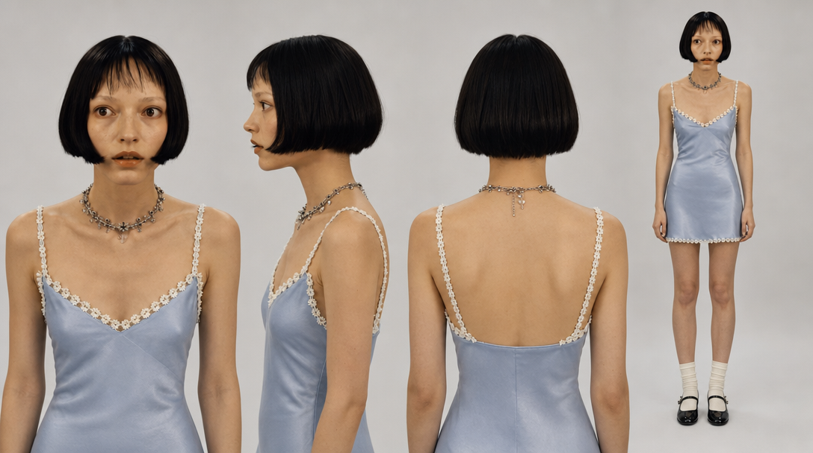 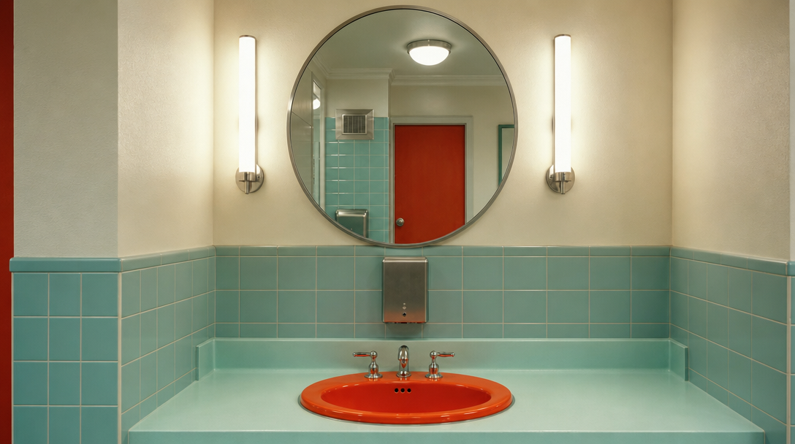 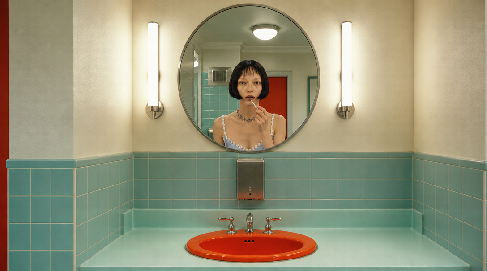 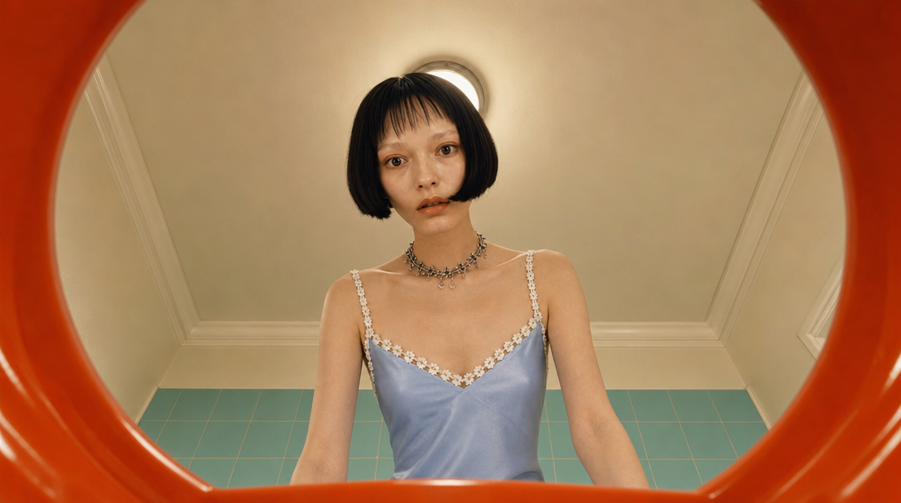

### Ⓑ1 시작+끝 프레임 쌍 — `assets/arm-b1/`

정본 1장 + 구도 텍스트 → 시작 6 → 각 시작을 참조로 끝 6. 쌍 12장 전부 같은 카메라 유지 확인.

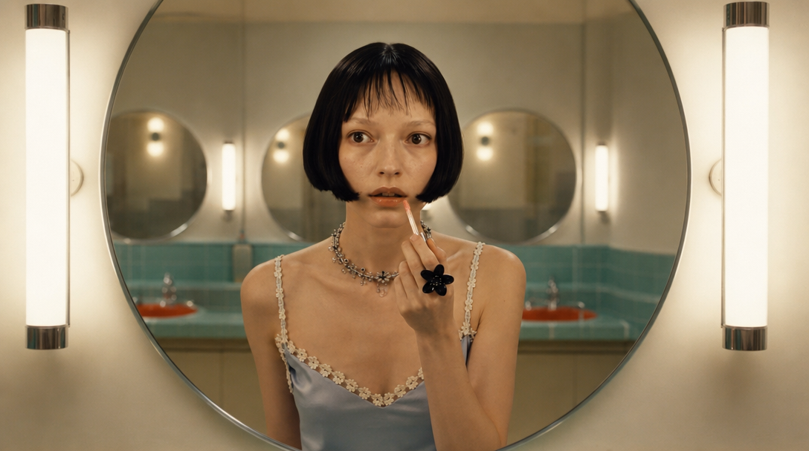 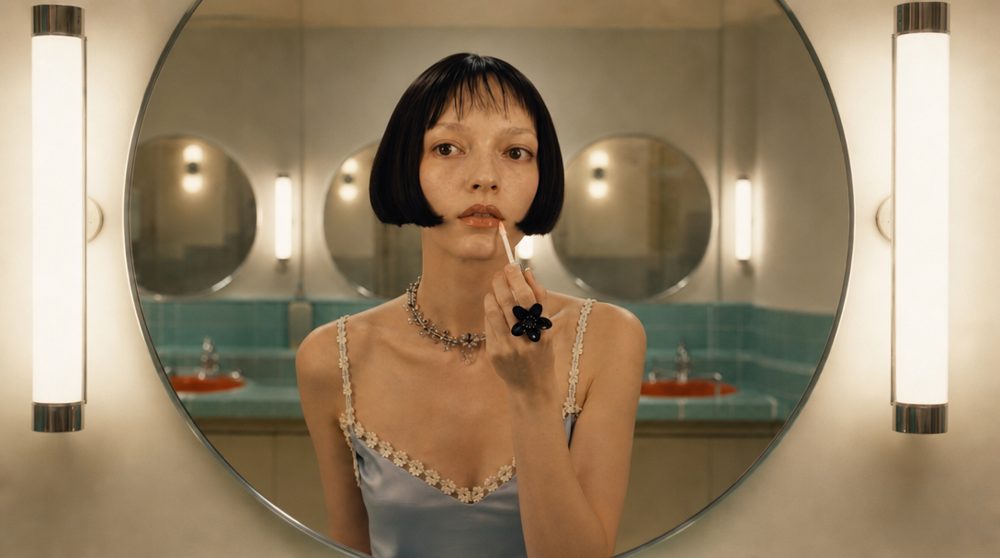 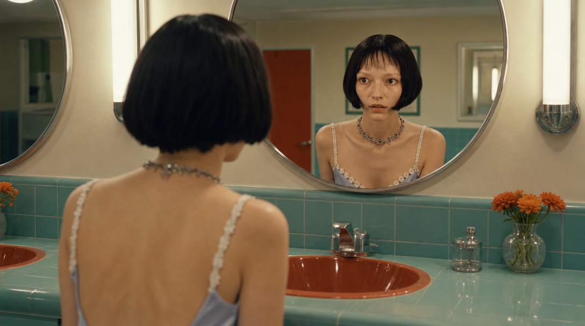 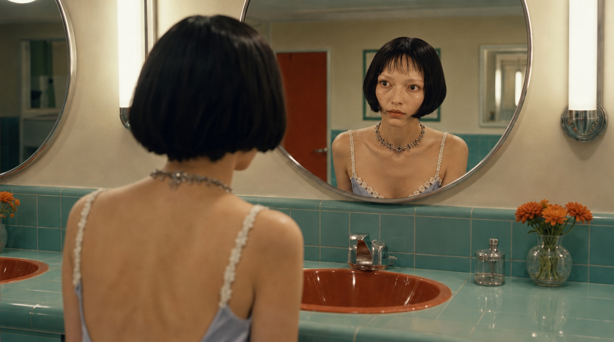

### Ⓑ2 콘티 시트 셀 수확 — `assets/arm-b2/`

v2 재정의대로: 한 생성 안 6컷 시트(`conti_sheet.jpg`) → 셀 크롭 수확 → 시작 6(공짜 일관성) →
끝 6은 Ⓑ1 방법. β(통째 입력·판정 제외)용 연출 시트는 코드 합성(`beta_sheet.jpg`, B1 프레임 재사용).

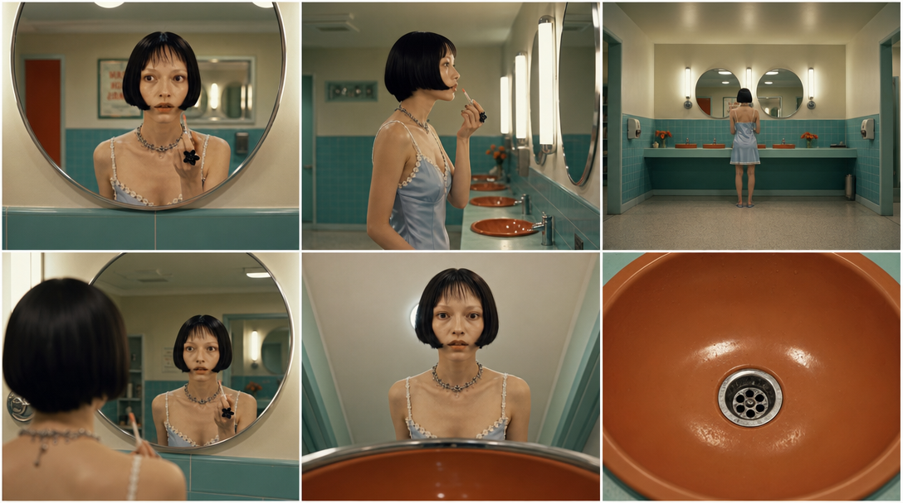 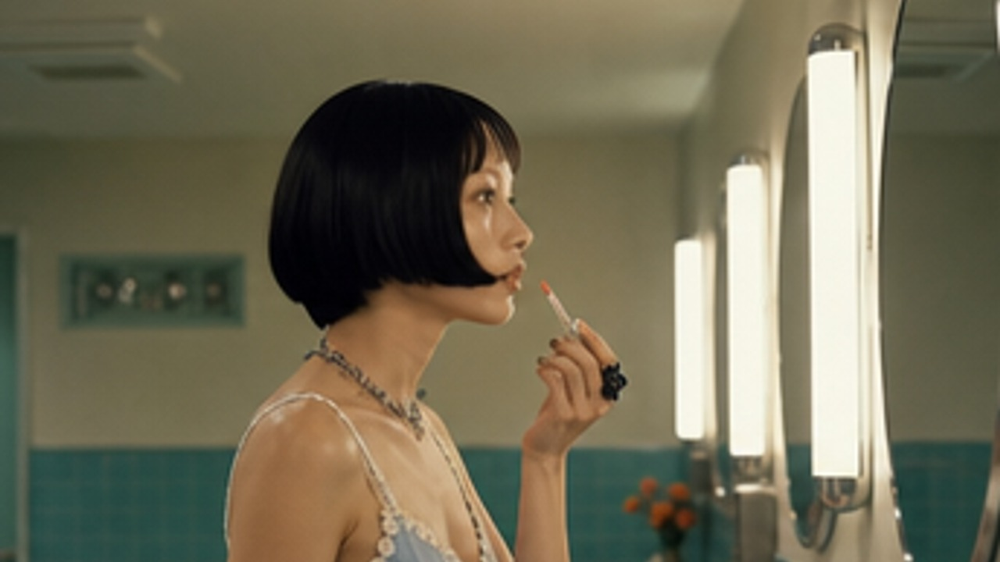 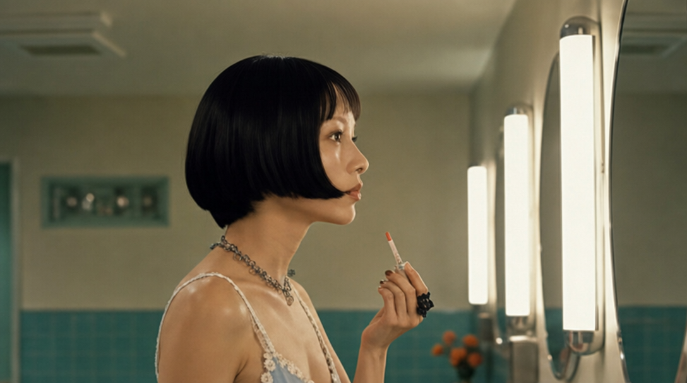

### Ⓒ 클러스터 체이닝

시작 프레임 사전 생성이 구조적으로 불가능한 샷(2·5·6 — 앞 샷 클립의 실제 마지막 프레임이 필요)은
payloads의 `chain` 블록에 추출→편집 절차와 체이닝 프롬프트를 명세로 실었다. 샷 1·3·4와 끝 프레임
6장은 Ⓑ1 프레임 재사용(blueprint-c §2). 실행은 순차.

### R 상한 대조군

원본 콘티 프레임(`assets/conti/`) 그대로 — 생성 0콜, payloads에 배선만.

## 4. 진행 중 관찰 (실행 전에 알아둘 것)

1. **콘텐츠 체커 충돌 1건**: b2 샷2 끝 프레임이 gpt-image-2/edit 콘텐츠 체커에 2회 차단됨
   (수확 셀의 프로필+슬립 드레스 조합 추정 — 프롬프트 재작성으로는 안 풀림). 셀을 얼굴 중심
   (attention) 크롭으로 재수확하니 통과. **I2V 단계에서도 같은 팔 샷2에서 재발 가능성 있음.**
2. **끝 프레임 품질 관문 실증 (blueprint-b1 리스크 2)**: b1 샷6 끝 프레임 1차 생성에서 모델이
   "faint shimmer"를 물줄기로 확대해석 → "dry and empty, no water" 명시로 재생성해 해결.
   끝 프레임은 생성 후 눈 검수가 필수라는 리스크가 스테이징에서 이미 한 번 실증됐다.
3. **워터마크**: 원본 프레임(플레이트 원천·R 대조군)에 "DAAIKEEM" 워터마크 잔존. 생성 팔에는
   프롬프트로 제거 지시했고 전파 안 됨. R 팔 평가 시 무시할 것.
4. β 시트 라벨 일부가 폭에 잘림(코드 합성 사소 결함) — β는 판정 제외 팔이라 방치.

## 5. 재현

```
node tools/stage_inputs.mjs           # resume 지원 (staging_state.json), 완료분 skip
PHASE=dry node tools/stage_inputs.mjs # 콜 계획만
```

다음 단계: design.md §4-가 모델 스크리닝(시작+끝 동시 입력 지원 필수, Seedance 계열 포함) →
승인 시 payloads.json 그대로 I2V 실행.
