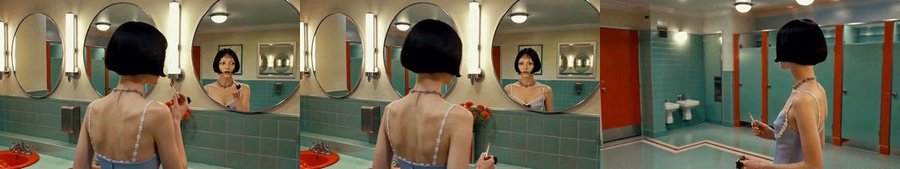
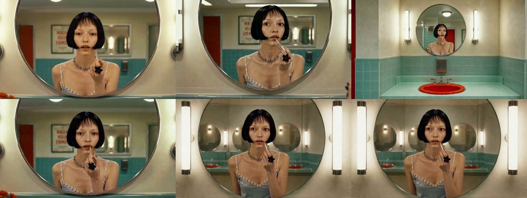
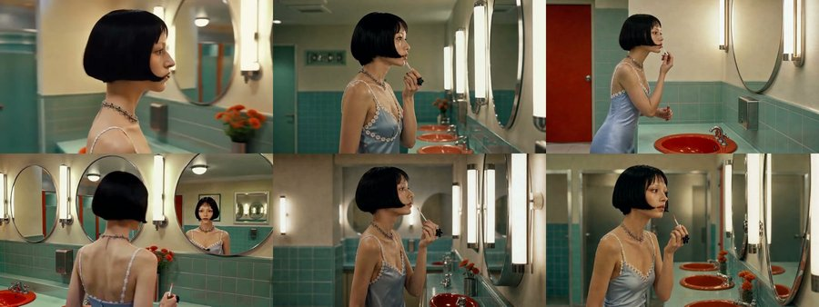
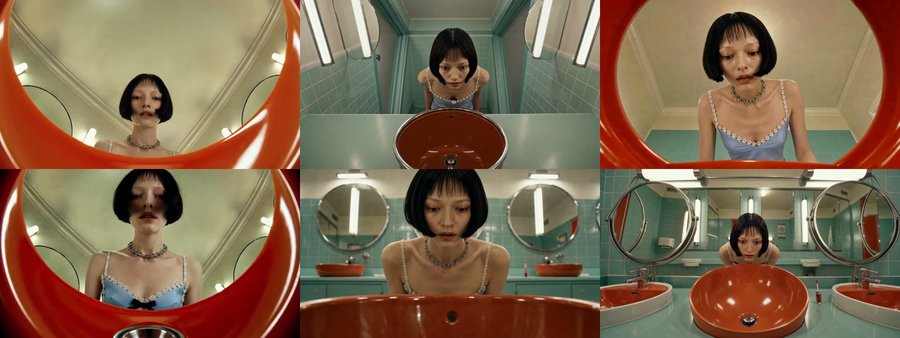

# 입력 포맷 실험 결과 — 판정 완료: 승자 채택 없음, "컷편집 + 카메라 교정" 재실험으로 전환

> **오너 판정 (2026-07-23)**: 전 팔이 채택 기준 미달. R(상한)이 베스트에 가깝지만 샷 간 연결이
> 원본급이 아니고, A는 샷 간 연속성 최악, B1·B2는 디테일·신원 최악, C는 B 계열과 동급.
> **다음 목표 재설정: 원테이크 흉내가 아니라 "컷편집 허용 + 카메라 위치 교정"을 잡는다.**
> 핵심 원인 분해는 §7. (예비 결론이었던 "Seedance는 첫 프레임을 재렌더한다·정지 샷일수록 고정
> 강함·임의 무브는 R에서도 발생"은 판정에서 그대로 확정됐다.)
>
> 실행일 2026-07-23 · 영상 모델 Seedance 2.0(오너 확정) · 힉스필드 단일 레인 × 동시 4 · 클립 31 + β 1

## 1. 무엇을 실행했나

- 설계(design.md)의 5팔: **A**(시작만) · **B1**(시작+끝) · **B2**(시트 수확 시작+끝) · **C**(클러스터
  체이닝) · **R**(원본 프레임 상한) — 샷 6개(립 바르기 구간 18.9초, conti.md) 전부.
- 레인: fal+힉스필드 2레인 계획 → **fal 탈락**(Seedance 파트너 검증이 포토리얼 얼굴 차단) →
  힉스필드 단일 레인. 부수 효과로 전 팔 동일 백엔드 = 통제 변수 강화.
  초기 2콜 실측은 프롬프트 변수가 교란돼 있었고, 오너 반박("fal로 실존인물 영상 DB에 많다")
  후 **8케이스 격자 프로브로 재검증·확정** (2026-07-23, `assets/probe-fal/probe_results.json`):
  차단 원인 = 이미지의 포토리얼 얼굴 (프롬프트 무관 — 중립/풀 프롬프트 동일 차단, 에러 위치
  `image_url`) · 실존/생성 무구분 · 애니 스타일·무인물·극소 인물(와이드)은 통과 ·
  **같은 실존 인물 프레임이 happy_horse에선 통과** → 과거 fal 실존인물 영상 성공(제품 기본
  배선 happy_horse)과 정합. 즉 "fal 실패"가 아니라 **fal×Seedance×포토리얼 얼굴 조합만 불가**.
  **외부 검증(2026-07-23)**: 모델 능력 문제가 아님 — 뿌리는 바이트댄스의 실인물 초상 정책
  (2026-02 프라이버시 사태로 real-person photo 기능 중단 이력, 이후 초상 레퍼런스에 인증/허가
  요구)이고, fal 공식 문서가 "파트너별 필터·민감도 상이"를 명시하며, 커뮤니티 가이드도 "같은
  Seedance라도 힉스필드 등은 더 관대한 필터 — 한 플랫폼에서 막히면 다른 플랫폼에선 될 수 있다"고
  보고. 단 fal 프로파일은 "AI 생성 초상 우회법"조차 차단할 만큼 엄격함(우리 실측).
- C팔: 샷 1·3·4는 B1 클립 재사용(입력 동일 → 재생성은 중복 과금 + 무관 확률 변동. 재사용이
  "B1 vs C = 체이닝 차이만"으로 격리), 샷 2·5·6은 앞 클립 실물 마지막 프레임에서 순차 체인.
- Seedance 제약 실측: 최소 4초(1.44초 샷도 4초로 생성 → 대조용은 setpts 배속 압축으로 콘티 길이
  복원 — 트림은 도착점을 잘라먹어 부적합) · **시드 입력 없음**(출력에만 — 재현 불가, 프로버넌스 기록).

## 2. 정량 — 프레임 재현 SSIM (ffmpeg, 샷별 클립 프레임 vs 입력 프레임)

첫 프레임 SSIM = "시작 그림을 얼마나 그대로 물었나", 끝 SSIM = "도착점에 실제로 닿았나".

| 팔 | 첫 프레임 평균 | 끝 프레임 평균 | 비고 |
|---|---|---|---|
| **R** (상한) | **0.809** | **0.805** | 원본 직입력조차 재렌더 — 픽셀 고정 아님 |
| A | 0.781 | — (끝 입력 없음) | |
| C | 0.778 | 0.763 | 체인 샷 2 첫 프레임 0.867 (팔 내 최고) |
| B1 | 0.754 | 0.787 | 끝 도달은 R 다음 |
| B2 | 0.740 | 0.739 | 최저 — 셀 해상도 손실 가설(blueprint-b2 리스크 ②)과 일치 |

- **정지 샷일수록 고정이 강하다**: R 샷6(배수구, 완전 정지) 0.957/0.957로 전체 최고.
  움직임·얼굴이 클수록 재렌더 폭이 커진다. 샷별 전체 수치: `assets/compare/metrics.json`.
- SSIM은 구도 유지의 근사치다. 카메라 무브·컨시스턴시 카운트(design §5 정량 1·2)는
  영상 재생 검수가 필요해 블라인드 리뷰와 함께 진행한다.

## 3. 예비 관찰 (영상 프레임 실측 — 공식 판정 아님)

**R에서도 임의 카메라 무브 재현**: 샷2(프로필 고정)에서 Seedance가 뒷모습→화장실 전경 와이드로
카메라를 끌고 나갔다가 끝 프레임으로 복귀한다. 시작·끝을 원본 실사 프레임으로 못박아도
"시네마틱 무브 창작"이 발동한다는 실증 — 시제품 문제 ①의 뿌리가 입력 포맷 밖에도 있다.

블라인드 모자이크 샘플 (배치는 mosaic_key.txt — 순위 매긴 후 열 것):

- 샷1: A의 구도 이탈이 눈에 띈다(거울 클로즈업 대신 와이드성 구도 — 이미지 계층 손실).
- 샷5: 팔마다 세면대 POV 해석이 갈린다 — 원본과 가장 가까운 건 R.
- 샷4: 전 팔이 오버숄더 구도를 대체로 유지.

## 4. 실행 사건 기록 (notes.md §4 처방 분류 준거)

| 사건 | 분류 | 처치 |
|---|---|---|
| fal×Seedance 포토리얼 얼굴 차단 — 8케이스 격자로 원인 확정 (프롬프트 무관·이미지 원인, §1) | Ⓑ 입력 문제 (파트너 정책) | 힉스필드 단일 레인으로 라우팅 |
| 힉스필드 "nsfw" 판정 3건 (b2β·c_s2·산발) | Ⓐ 재생성 해결 — **판정이 확률적** (동일 입력 재시도 통과) | 러너에 3회 백오프 재시도 추가 |
| 힉스필드 HTTP 503 2건 | Ⓐ 재생성 해결 | 재시도 통과 |
| nohup 백그라운드 배치가 셸 종료와 함께 사망 | Ⓒ 파이프라인 | 포그라운드 실행으로 전환 |
| ffmpeg drawtext 필터 부재 | Ⓒ 파이프라인 | 무라벨 블라인드 모자이크로 전환(설계 §5와 오히려 부합) |

β(시트 통째 입력): 1차 nsfw 차단 → 재시도 성공, `clips/arm-b2/beta_full.mp4` 생성됨.
격자 오작동 여부는 블라인드와 무관하게 별도 확인 (판정 제외 팔).

## 5. 리뷰 자료 (판정에 사용됨)

블라인드 모자이크 `assets/compare/mosaic_blind.mp4`(키: `mosaic_key.txt`) · 팔별 시퀀스
`assets/compare/arm-*_seq.mp4` · 원본 정답 구간 `original_segment.mp4` · 샷별 **입력↔산출 연결
리뷰**(IN/OUT 스트립 + 프롬프트 원문·번역 + SSIM + 프로버넌스): [`assets/compare/README.md`](assets/compare/README.md)

## 6. 오너 판정 전문과 원인 분해 (2026-07-23)

### 팔별 평가 (오너)

- **R**: 베스트에 가깝지만 디테일 아쉬움 — 원본의 4→5초·9→10초 샷 연결 수준엔 미달. s2에서
  근거 없는 카메라 오빗(정직한 후방 레퍼런스인데 우측 후방 → 3초대 좌측 문 응시로 전환), 그
  이탈 때문에 s2끝↔s3 시선 방향까지 모순. s4부터는 양호.
- **A**: 샷 간 연속성 최악 — 뚝뚝 끊겨 시청이 불편(시제품에서 지적한 문제 그대로). 샷 자체
  퀄리티도 저하, s3는 아무것도 안 하고 s2와 연결도 안 됨.
- **B1·B2**: 최악군 — 디테일 저하(틴트가 입술에 닿지도 않음, 화장 중 시선이 거울 정면이 아님),
  s1↔s2 인물이 다른 사람급, s1→s2→s3 연결성 부재.
- **C**: B 계열과 동급 문제(s1 초점·틴트 미접촉).
- **B2β**: 최악, 논외.
- **총평**: 프롬프트에 카메라 연출(어디서 어떻게 찍는가)이 거의 없어 자유도가 과도. 줄거리
  (세면대에서 소리가 나 놀라는 스릴러 비트)가 입력에 없어 s4~s6 응시가 무맥락. 이 레퍼런스는
  원테이크 연습용으로 부적합 — **컷편집을 허용하되 카메라 위치를 교정할 수 있는 것**을 다음
  목표로. 클립은 더 길어도 되고, 프롬프트 교정 필요. A는 실제 우리 백엔드를 돌린 게 아님.

### 원인 분해 (판정 확정 사항)

1. **blueprint-b1 가설 기각**: "도착점을 그림으로 못박으면 카메라 텍스트 의존이 사라진다" —
   기각. R s2가 실증: 원본 실사 시작·끝을 줘도 사이 구간에서 시네마틱 오빗을 창작한다.
   B1 계열 프롬프트에는 긍정형 카메라 지시가 의도적으로 없었고(설계대로), 네거티브의 "지시 외
   무브 금지"는 지시가 없으면 공허하다. → **카메라 연출층(위치·앵글·고정)은 이미지와 무관하게
   텍스트로 항상 명시**해야 한다. (design §8-4에서 "전 샷 고정 카메라라 실험 무관"으로 I9
   백로그에 보낸 카메라 4요소 표기가 사실은 이 실험의 급소였다.)
2. **줄거리 부재 = 무맥락 생성**: 콘티가 구도·동작만 추출하고 사건(음향 비트 포함)을 버려서,
   모델이 "왜 이 행동을 하는가"를 모른 채 채웠다. 사건 맥락 층을 프롬프트에 추가해야 한다.
3. **B1 s2 인물 붕괴는 이미지 계층 결함**(시작 프레임 신원 드리프트 — 영상 모델 무죄),
   **틴트 미접촉은 영상 계층 결함**(미세 접촉 인터랙션 약함), **시선 이탈은 입력 결함의 충실한
   보간**(시작·끝에서 이미 나가 있었음). → 이미지 QC 게이트에 신원·시선·소품 접촉 체크 추가.
4. **B2 화질 열화 원인 확정**: 시트(1088×608) 셀 ~344×286 → 720p 업스케일. 시트 수확 방식의
   구조적 비용.
5. **A는 제품 백엔드 재현이 아니었다**(텍스트 계층을 전 팔 공통으로 통제한 설계 결과). 제품
   파이프라인 자체 판정은 별도 실험 필요.
6. **R↔원본 격차 = 입력 포맷으로 못 넘는 모델 한계** — 다음 실험은 포맷이 아니라 프롬프트
   연출층·컷편집 전략·샷 길이로 접근한다.

### 후속 실험 방향 (오너 지시 반영)

- 목표: **컷편집 허용 + 카메라 위치 교정** (원테이크 흉내 폐기).
- 프롬프트: 샷마다 카메라 4요소(렌즈·앵글/구도·무브·광학) 긍정형 명시 + 사건 맥락 층 추가.
- 샷 길이: 더 길게(모델 최소 4초와의 마찰 완화).
- 이미지 QC 게이트: 신원·시선·소품 접촉 검수 후에만 I2V 투입.
- A 재실험 시 실제 writer 백엔드 프롬프트로.

## 7. 기술 부록

- 생성: `tools/build_jobs.mjs`(payloads→jobs 25) → `utils/tools/gen/dispatch.mjs --mode higgsfield`
  (i2v_se=seedance_2_0, 720p) → `tools/run_arm_c_chain.mjs`(C 순차: ffmpeg 마지막 프레임 →
  gpt-image-2/edit 체인 시작 프레임 → i2v_se). resume: `assets/gen_state.json`.
- 대조: `tools/assemble_compare.mjs` — setpts 리타임(콘티 길이 복원) → concat 팔별 18.9초 →
  원본 5.77~24.67초 추출 → SSIM(첫/끝 프레임) → 3×2 블라인드 모자이크.
- 프로버넌스: `assets/provenance.json` (규칙 7-1 — 클립별 provider/jobId/시드/초).
- 비용: 힉스필드 크레딧 ~635 소모(5013→4378), fal은 편집 모델 콜만(스테이징 30 + 체인 3).
- 원본: `~/Downloads/ref/video_girls_in_mirror.mp4` (레포 밖 — conti.md 부록 참조).
