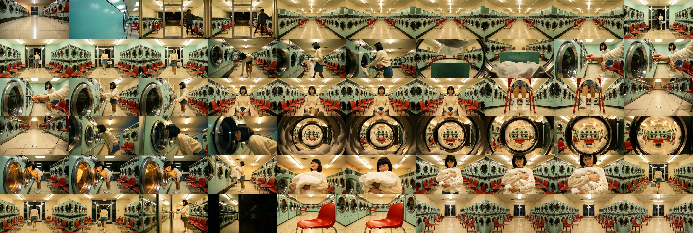

# E9d-proto — "코인세탁방" 60초 연속성 시제품

> **한 줄 요약: 컷은 21번 튀지만 "같은 장소에서 계속 이어지는 하나의 밤"처럼 보이게 만드는 것이
> 목표였고, 그게 실제로 됐다.** 레퍼런스 영상에서 배운 네 가지 규칙(사건 하나를 여러 샷이 나눠 갖기 /
> 동작이 컷을 건너 이어지기 / 같은 넓은 구도로 돌아오기 / 공간·옷·조명 절대 안 바꾸기)을 그대로 넣어
> 새벽 코인세탁방 이야기로 60초짜리 영상 딱 하나를 만들었다. 결과물: [final_60s.mp4](assets/final_60s.mp4) (60.6초).
>
> 제작일 2026-07-23 · 🔵 시제품(오너 지시 — "레퍼런스와 가장 비슷한 구조로 60초짜리 딱 하나") ·
> 모델·비용·재현 커맨드는 맨 아래 기술 부록.

---

## ① 한 줄 요약

새벽 두 시, 아무도 없는 코인세탁방에 소녀가 빨래를 하러 들어왔다 나가는 60초 이야기다. 화면은 21번
잘리지만(컷), 잘려도 "다른 장면으로 점프했다"가 아니라 "같은 밤, 같은 방에서 계속 이어진다"고 느껴지게
만들었다. 그 느낌을 만드는 규칙을 레퍼런스 영상에서 뽑아 그대로 적용한 첫 실물이다.

## ② 왜 만들었나 — 레퍼런스에서 배운 것 4가지 (쉬운 말로)

오너가 계속 지적한 문제는 "우리 영상은 모든 컷이 뚝뚝 끊긴다"였다. 그래서 "컷이 많은데도 이상하게
안 끊겨 보이는" 참고 영상(파스텔 화장실 안 소녀, 67초)을 뜯어봤더니, 비결은 컷을 적게 쓰는 게 아니라
**아래 네 가지를 지키는 것**이었다. 그 영상도 컷이 30번이나 있었다 — 우리보다 적지 않았다.

1. **사건 하나를 여러 샷이 나눠 갖는다.** 우리 영상은 "사건 1개 = 샷 1개"라서, 컷이 넘어갈 때마다
   매번 새로운 사건으로 점프한다. 그게 끊기는 진짜 이유였다. 참고 영상은 "립 바르기" 하나를 정면·
   입술 클로즈업·거울 반사·옆얼굴 이렇게 3~4개 샷이 나눠 가졌다. **같은 사건의 다른 앵글**이라 컷이
   나가도 이야기가 안 튄다.

2. **동작이 컷을 건너서 이어진다.** 앞 샷에서 시작한 몸짓(몸을 숙인다, 손을 뻗는다)이 다음 샷에서
   **그 동작의 바로 다음 순간**으로 이어진다. 단, 앵글과 크기는 크게 바꾼다(안 바꾸면 화면이 튄다).
   동작이 컷을 관통하니까 편집의 이음매가 안 보인다.

3. **같은 넓은 구도로 자꾸 돌아온다.** 방 전체가 보이는 좌우대칭 넓은 그림("마스터 구도")을 하나 정해
   놓고 영상 내내 몇 번씩 다시 돌아온다. 클로즈업으로 아무리 돌아다녀도 이 넓은 그림이 "여기가
   어디였지"를 리셋해줘서 길을 안 잃는다.

4. **공간·옷·조명을 절대 안 바꾼다.** 모든 프레임이 같은 타일, 같은 색, 같은 빛이다. 컷이 아무리
   세게 튀어도 뇌가 0.1초 만에 "아, 같은 장소 같은 순간"으로 다시 붙잡는다. 연속성의 바닥은 편집이
   아니라 **미술의 일관성**이었다.

이번 시제품은 이 네 가지를 코인세탁방 이야기에 그대로 심어 "정말 되는가"를 눈으로 확인한 것이다.

## ③ 들어간 입력 전부 (원문 그대로)

### 이야기 (소재 원문)

> 새벽 두 시의 코인세탁방. 소녀가 빨래 바구니를 안고 유리문을 밀고 들어온다. 민트색 세탁기들이 늘어선
> 텅 빈 공간. 소녀는 세탁기에 빨래를 넣고, 동전을 하나씩 넣고, 기계가 도는 것을 바라본다. 빨간 의자에
> 앉아 다리를 흔들며 기다리다, 회전하는 드럼의 거품에 이끌려 유리창에 얼굴을 가까이 댄다. 종료음과
> 함께 따뜻한 빨래를 꺼내 품에 안고, 소녀는 들어왔던 문으로 나간다. 마지막 컷은 처음과 같은 텅 빈
> 세탁방.

### 연출 연속성 문법 7규칙 (AI에게 그대로 준 지시 원문)

> 1. 사건 클러스터: 이야기의 사건 하나를 샷 2~4개가 나눠 갖는다. 각 샷은 같은 사건을 다른 앵글·다른
>    사이즈로 커버한다.
> 2. 동작 이어받기: 같은 클러스터의 인접 샷은 앞 샷이 끝나는 동작의 다음 위상에서 시작한다(동작이 컷을
>    관통). 단 앵글과 사이즈는 반드시 크게 바꾼다.
> 3. 마스터 후렴: 공간 전체가 보이는 대칭 와이드 "마스터 구도"를 하나 정하고 3회 이상 복귀한다(도입·
>    중간·수미상관 결말).
> 4. 인서트 쉼표: 사건과 사건 사이에 같은 공간의 정적 사물 클로즈업을 쉼표로 배치한다. 인서트는 새
>    사건이 아니다.
> 5. 리듬: 도입 0~4초는 0.8~1.5초 플래시 컷 3~4개(공간·사물·인물 디테일 몽타주). 본편은 샷당 2.5~4초.
>    마스터 와이드와 절정(드럼 응시) 2곳은 5초 이상 홀드.
> 6. 불변 앵커: 공간·인물 외형·의상·조명·팔레트는 전 샷 동일.
> 7. 총 60초를 정확히 맞춘다. 샷 수는 16~18개 권장.

### 고정 앵커 (모든 장면 사진 앞에 똑같이 붙인 "안 바뀌는 배경·인물" 문장)

이미지 생성기는 영어로 넣어야 잘 알아들어서 영어로 붙였다. 한국어 번역을 나란히 적는다.

> (영어 원문) Retro late-night coin laundromat interior: rows of mint-green washing machines with round
> glass doors, cherry-red plastic chairs, cream tile floor, warm fluorescent lighting, symmetrical
> planimetric composition, cinematic photorealism. A young woman in her early twenties with a black bob
> haircut, wearing a cream knit sweater, denim skirt, white socks and white sneakers.

> (한국어) 복고풍 심야 코인세탁방 내부: 둥근 유리문이 달린 민트색 세탁기가 줄지어 늘어서 있고,
> 체리레드 플라스틱 의자들, 크림색 타일 바닥, 따뜻한 형광등 조명, 좌우대칭 평면 구도, 영화적 사실주의.
> 20대 초반의 젊은 여성 — 검은 단발머리에, 크림색 니트 스웨터·데님 스커트·흰 양말·흰 운동화 차림.

이 문장을 21장의 첫 프레임 사진 프롬프트 **앞에 전부 똑같이** 붙였다(4번 규칙 = 안 바뀜을 강제하는
장치). 인물이 안 나오는 정적 인서트 샷에는 인물 문장을 빼서(사람이 잘못 끼어드는 걸 막으려고) 공간
문장만 붙였다.

## ④ 설계도 — 사건 7개 × 샷 묶음

AI(상위 저작 모델)가 60초를 **10개의 묶음**으로 나눴다: 진짜 사건 7개 + 도입 몽타주 1개 + 시작·끝의
"텅 빈 방" 마스터 구도 2개. 아래 표에서 "이어받는 동작"은 앞 샷에서 넘겨받아 이어 찍는 몸짓이다(2번
규칙). 각 묶음 안에서 앵글과 크기가 크게 바뀌는 것에 주목.

| 묶음 | 무엇 | 샷들 (앵글/크기) | 이어받는 동작 (컷을 건너 이어지는 몸짓) |
|---|---|---|---|
| 도입 몽타주 | 공간·사물 훅 (0.9·1.2·1.5초 플래시) | 타일 반사광(초근접) → 민트 기계 패널(초근접) → 유리문 너머 새벽(근접) | 타일 질감 → 기계 표면 → 창밖 어둠으로 시선이 흐름 |
| 마스터 후렴 ① | 텅 빈 방 전경 (5초 홀드) | 좌우대칭 초광각 전경 | — (공간 지도를 처음 세움) |
| 사건 1 · 입장 | 소녀가 문을 밀고 들어옴 | 전신 풀샷 | — |
| 사건 2 · 빨래 넣기 | 세탁기 문 열고 빨래 넣음 | 상체 미디엄 → 손 클로즈업(인서트) | 빨래 넣는 손 동작이 드럼 안으로 이어짐 |
| 사건 3 · 동전 넣기 | 동전을 하나씩 투입 | 손 클로즈업 → 얼굴+손 미디엄클로즈업 | 마지막 동전이 사라지는 동작 → 기계 작동으로 이어짐 |
| 사건 4 · 앉아 기다리기 | 빨간 의자, 다리 흔들기 | 전신 와이드 → 발목 클로즈업 → 정적 사물(인서트) | 다리 흔드는 리듬 → 발목 클로즈업 → 정적 사물로 시선 |
| 사건 5 · 드럼 응시 (절정) | 유리창에 얼굴 대고 거품 바라봄 | 측면 미디엄 → **드럼 시점 6초 홀드** → 얼굴 반응 미디엄클로즈업 | 얼굴이 유리에 닿는 순간 → 소녀 시점 → 다시 소녀 표정으로 |
| 사건 6 · 빨래 꺼내 안기 | 따뜻한 빨래를 품에 안음 | 전신 미디엄풀 → 안기는 순간 클로즈업 | 빨래 꺼내는 손 → 품에 안기는 순간으로 이어짐 |
| 사건 7 · 퇴장 | 문으로 걸어 나감 | 후면 전신 풀샷 → 문에 손 대는 미디엄클로즈업 → 정적 사물(인서트) | 걸어가는 발걸음 → 문에 손 → 문 닫히는 뒤 정적 사물로 |
| 마스터 후렴 ② | 텅 빈 방 (처음과 동일 · 5초) | 좌우대칭 초광각 전경 | — (수미상관: 시작과 같은 빈 방으로 닫음) |

전체 21샷, 설계 총 길이 60.6초. 도입은 1초 안팎 플래시 컷 3개, 절정(드럼 응시)과 양 끝 마스터는 5~6초
홀드 — 5번 리듬 규칙대로 나왔다.

## ⑤ 만든 과정 — 글에서 영상까지

```
   이야기 한 문단
        │  (구조 잡기: AI가 "기승전결 4막"으로 판단)
        ▼
   샷 목록 21개   ←  여기에 "연속성 문법 7규칙"을 넣어 AI가 저작
        │           (사건 묶음·이어받는 동작·마스터 후렴·인서트·리듬을 다 정함)
        ▼
   장면 사진 21장  ←  샷마다 첫 프레임을 그림(고정 앵커 문장을 앞에 붙여 "안 바뀌게")
        │
        ▼
   짧은 영상 21개  ←  각 사진을 시작점으로 몇 초짜리 움직이는 영상으로
        │           (이어받는 동작은 프롬프트에 "앞 샷에서 이어진다" 문구를 덧붙임)
        ▼
   이어붙이기      ←  설계 길이대로 자르고 순서대로 붙여 60초 완성
```

- **글 → 샷 목록**: AI가 이야기를 21개 샷으로 쪼개면서, 어떤 샷들이 "같은 사건"인지(묶음 번호), 각 샷이
  "앞 샷에서 무슨 동작을 이어받는지"를 함께 적게 했다.
- **샷 목록 → 장면 사진**: 샷마다 첫 프레임 한 장을 그렸다. 21장 모두 앞에 똑같은 앵커 문장을 붙여서
  민트색 방·검은 단발 소녀·크림 스웨터가 안 바뀌게 했다. 인물 나오는 샷은 씨앗값(랜덤 시드)을 고정해
  얼굴을 최대한 같게 시도했다.
- **사진 → 짧은 영상**: 각 사진을 시작 이미지로 넣어 몇 초짜리 움직이는 클립으로 만들었다. "이어받는
  동작"이 있는 샷 11개는 영상 지시문 뒤에 "앞 샷의 마지막 동작에서 매끄럽게 이어진다"는 문구를 덧붙여
  동작이 컷을 관통하도록 유도했다.
- **이어붙이기**: 클립들을 설계 길이(플래시 0.9초부터 절정 6초까지)로 자르고 순서대로 무손실로 붙여
  60.6초 완성. 소리는 이번 시제품 범위 밖이라 넣지 않았다(무음).

## ⑥ 결과 — 잘된 점과 한계 (정직하게)

**영상: [final_60s.mp4](assets/final_60s.mp4)** (60.6초 · 1920×1080 · 무음)

**1초 간격 필름스트립(전체 흐름 한눈에):**



### 잘된 점

- **"같은 장소, 같은 밤"이 확실히 걸렸다.** 60프레임 어디를 봐도 같은 민트색 방·같은 빛·같은 소녀다.
  컷이 21번 튀는데도 다른 장소로 점프하는 느낌이 없다 — ④번 규칙(불변 앵커)이 가장 강하게 작동했다.
  고정 앵커 문장 하나로 미술 일관성을 강제한 게 주효했다.
- **사건을 여러 샷이 나눠 갖는 게 눈에 보인다.** "빨래 넣기"가 상체 미디엄+손 클로즈업으로, "드럼 응시"가
  측면+드럼 시점+얼굴 반응 3샷으로 쪼개졌다. 매 컷이 새 사건이 아니라 같은 사건의 다른 앵글이라, 예전
  "샷마다 점프"하던 문제가 이 구간들에서 사라졌다.
- **수미상관 마스터가 닫힌다.** 첫 마스터(텅 빈 방)와 끝 마스터(다시 텅 빈 방)가 거의 같은 구도로
  맞물려, 60초가 "하나의 완결된 밤"으로 닫힌다.
- **리듬이 설계대로다.** 도입 플래시(0.9·1.2·1.5초) → 본편 2~4초 → 절정 드럼 6초 홀드. 빠르게 훅을
  걸고 절정에서 숨을 참는 리듬이 그대로 나왔다.

### 한계 (다음에 풀어야 할 것)

- **소녀 얼굴이 샷마다 조금씩 다르다.** 머리 모양·옷·색은 잘 유지되는데, 얼굴 이목구비가 앵글이 바뀔
  때마다 미세하게 달라진다. 씨앗값 고정으로 많이 줄였지만 완전히는 못 잡았다 — 사진 생성기가 샷마다
  독립적으로 그리기 때문(인물 일관성은 별도 트랙 필요).
- **"동작 이어받기"는 위상 연결이지 프레임 일치가 아니다.** 앞 샷의 손 위치와 뒤 샷의 손 위치가 픽셀
  단위로 딱 맞지는 않는다. 같은 공간에서 동작의 "다음 순간"으로 이어져 연속으로 읽히긴 하지만, 완벽한
  매치컷(프레임 이음)은 아니다. 이건 레퍼런스 영상도 마찬가지였다(위상 연결이 정답).
- **영상 생성이 시작 프레임을 100% 그대로 쓰진 않는다.** 이번에 쓴 영상 모델은 시작 사진을 "참고
  이미지"로 받아 움직임을 만든다(엄격한 첫 프레임 고정 방식이 아님). 그래서 클립 첫 프레임이 원본 사진과
  미세하게 다를 수 있다. 다행히 참고 이미지가 강하게 지배해서 연속성은 유지됐다.
- **대칭 구도가 가끔 과하게 휜다.** 앵커가 "좌우대칭 평면 구도"를 강하게 밀다 보니 일부 샷이 어안렌즈처럼
  휜다. 마스터 후렴의 웅장함엔 도움되지만, 중간 샷 몇 개는 실제 영화보다 왜곡이 크다.
- **마스터 후렴은 3회가 아니라 2회 나왔다.** 규칙은 "3회 이상(도입·중간·수미상관)"인데 이번 저작은
  도입·결말 2회만 넣었다(중간 복귀 1회 누락). 수미상관은 확실히 걸렸지만 중간 리셋이 빠졌다. 재실행을
  한 번 더 돌려봤지만(아래 부록) 그 판본은 샷이 23개로 늘고 0초짜리 깨진 샷이 생겨 더 나빴다 — 그래서
  현재 판본(21샷·60초 정확)을 채택했다.

## ⑦ 다음 단계 (본실험 E9d)

이번 시제품은 "문법을 넣으면 연속성이 생기는가?"에 **눈으로 된다**는 증거를 냈다. 본실험에서 풀 것:

1. **인물 얼굴 일관성** — 얼굴이 샷마다 흔들리는 문제를 별도 장치(캐릭터 고정 참조 이미지 등)로 잡는다.
2. **동작 이어받기 A/B** — 지금처럼 "샷마다 따로 생성"한 것과, 클러스터를 한 번에 길게 생성하거나 앞
   클립의 끝 프레임을 다음 클립 시작으로 넘기는 체이닝 방식을 실제로 비교한다.
3. **마스터 후렴 3회 강제** — 저작 단계에서 중간 마스터 복귀가 확실히 들어가게 규칙을 조인다.
4. **음악·사운드** — 이번엔 범위 밖이었던 소리를 붙였을 때 컷-비트 정합이 연속감에 얼마나 기여하는지.

---

## 기술 부록 (재현용 — 개발/연구자용)

### 저작 체인 (하네스 실행, 프로덕션 `src/` 변경 0)

- **하네스**: `tests/pipeline/writer_stage_experiment.test.ts` — 신규 프리셋 `laundromat`(60s·D3·
  horizontal_16:9) + 신규 STAGE_FN `sceneShotCoGenGrammar`(B' = `sceneShotCoGenHi` 복제 + 연출 연속성
  문법 7규칙 블록 주입 + 샷마다 `cluster_id`·`carry_from` 출력, `shot_meta`를 전역 `shot_id`에 조인해 반환).
- **실행 매트릭스**: `narrativeStructure`(gemini-3-flash-preview) → `sceneShotCoGenGrammar`
  (claude-sonnet-4-6, C축 기본값 재사용, `CLAUDE_API_KEY`) → `shotDesign`(gemini-3-flash-preview,
  `v4_shots.ts` E11 영어 정본 — `first_frame_prompt`/`motion_prompt` 한글 0 확인).
- **채택 판본 e9dp1**: narrativeStructure=kishōtenketsu 4막 / 21샷 / 10 클러스터 / carry 11개(모든
  비-클러스터-첫 샷) / 마스터 2회(shot_4·shot_21) / 인서트 8개 / 설계 총 60s. 저작 시간
  narrativeStructure 11.5s · sceneShotCoGenGrammar 85.4s · shotDesign 33.1s.
- **재실행 e9dp2 (미채택, 회수 1)**: 23샷(>I2V 상한 22)·마스터 3(그중 shot_23이 0초 깨짐)·carry 8/23·
  클러스터 12개로 파편화 — e9dp1보다 열위라 기각. Task B의 "1회 재실행" 예산 소진.
- **로그**: `logs/writer-stage-exp/laundromat__{narrativeStructure,sceneShotCoGenGrammar,shotDesign}__e9dp{1,2}.json`.

### 결정론 후처리 (렌더 스크립트, LLM 0콜)

- **앵커 접두 (Task D)**: `ANCHOR_SPACE`(+ 인물 샷은 `ANCHOR_CHARACTER`)를 21개 `first_frame_prompt`
  앞에 결정론 접두. 인물 없는 인서트/공간 샷은 공간 앵커만(인물 환각 방지).
- **carry 반영 (Task C)**: `carry_from` 있는 샷 11개의 `motion_prompt`에 영어 match-on-action 큐를
  결정론 접미("...picks up seamlessly from the previous shot's ending motion, now seen from this new
  angle and shot size."). 변경 목록 `carry_reflection.json`.
- **render_seconds (Task F)**: cluster 1 establish 3샷을 도입 플래시 0.9/1.2/1.5s로 스프레드, 나머지는
  shotDesign 설계 길이. 총 60.6s(58~62 대역 내).

### 이미지·영상 생성 (제품 실배선 그대로)

`research/experiments/continuity-copy/2026-07-23_laundromat-proto/tools/e9dp_generate.mjs` — `src/lib/writer/llm/fal.ts`의 fal 입력 조립을
복제(모델 id·입력 스키마 동일).

- **T2I**: `fal-ai/flux-2/klein/9b` (제품 `ROUGH_STORYBOARD_IMAGE_MODEL`). input=`{prompt, image_size:
  'landscape_16_9', seed}`. 인물 샷 seed=70723 고정(외형 일관성 시도). 21장 성공/21시도, 실패 0 (상한 25).
  산출 1024×576.
- **I2V/TI2V**: `alibaba/happy-horse/reference-to-video` (제품 `DEFAULT_VIDEO_MODEL`,
  `video-models.ts`). input=`{prompt, image_urls:[startFrameUrl], duration(int 3~15), aspect_ratio:'16:9'}`.
  21클립 성공/21시도, 실패 0 (상한 22). 산출 1920×1080·24fps·오디오 트랙 포함(무시). **주의: reference-
  to-video는 시작 프레임을 참조 이미지로 사용 — 엄격한 첫프레임 I2V 아님**(⑥ 한계 참조).
- **생성 카운트** (`generation_log.json`): `{t2i:21/21, i2v:21/21, fail:0, freeze_fallback:0}`.

### 조립 (ffmpeg)

`research/experiments/continuity-copy/2026-07-23_laundromat-proto/tools/e9dp_assemble.mjs` — 각 클립을 `render_seconds`로 트리밍 +
1920×1080·24fps·H.264·yuv420p·무음 정규화 → concat 재인코딩 → `final_60s.mp4`(60.63s, 1455프레임,
오디오 스트림 없음). 영상 없는 샷은 첫 프레임 이미지 프리즈로 대체(freeze-fallback, 이번엔 0건).
필름스트립 = `fps=1,scale=320:180,tile=10x6`.

### 산출물 (`research/experiments/continuity-copy/2026-07-23_laundromat-proto/assets/`)

`final_60s.mp4` · `filmstrip.jpg` · `shots/`(첫 프레임 21장) · `clips/`(원본 I2V 21개 — 용량상 git 미추적,
로컬 디스크에만 보존; 최종본에 전량 포함돼 있어 재현은 재생성 커맨드로) · `shotplan.json`
(클러스터·carry·render_seconds 포함) · `prompts.json`(앵커 접두·carry 반영 최종 프롬프트) ·
`generation_log.json` · `carry_reflection.json` · `assembly_report.json` · `gen_state.json`.

### 재현 커맨드

```bash
# 1) 저작 (유료: gemini + claude)
set -a && source .env.local && set +a
RUN_WRITER_STAGE=1 WRITER_INPUT=laundromat \
  WRITER_STAGES=narrativeStructure,sceneShotCoGenGrammar,shotDesign WRITER_RUN_ID=e9dp1 \
  npx vitest run tests/pipeline/writer_stage_experiment.test.ts --disable-console-intercept
# 2) 샷플랜 조립 (결정론)
E9DP_RUN=e9dp1 node research/experiments/continuity-copy/2026-07-23_laundromat-proto/tools/e9dp_build_shotplan.mjs
# 3) 이미지·영상 생성 (유료: fal). PHASE=images|videos|all, gen_state.json으로 resume
set -a && source .env.local && set +a
PHASE=all node research/experiments/continuity-copy/2026-07-23_laundromat-proto/tools/e9dp_generate.mjs
# 4) 트리밍·concat·필름스트립 (ffmpeg)
node research/experiments/continuity-copy/2026-07-23_laundromat-proto/tools/e9dp_assemble.mjs
```

- 키(`FAL_KEY`/`CLAUDE_API_KEY`/`GEMINI_API_KEY`)는 `.env.local`에서 `set -a && source` 로만 주입 —
  로그 출력 금지. git 커밋 없음. run-id `e9dp*`.
- 관련: 레퍼런스 해석 `../../../references/2026-07-22-girls-in-mirror-continuity.md`, 모델 티어 근거
  `../../scene-shot-authoring/2026-07-22_model-tier/result.md`(B' 채용), 실험 카드 `../../utils/campaign-2607/plan.md` Phase 5.

<!-- 작성 규칙 준수(MEMORY): 본문 사람 언어·코드 식별자 없음, 실제 입력 원문 blockquote 인용, 모델명·env·비용·재현은 부록에만. -->
