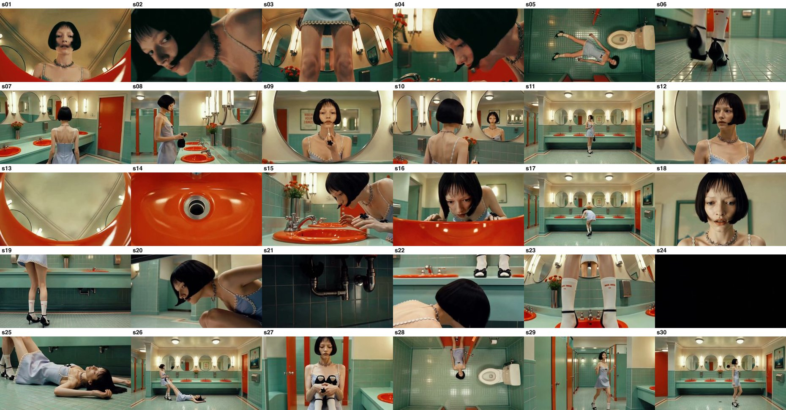

# BKM2 팔 설계도 — 도입 재사용 편집 + 원본 프레임 대조 구도 정밀화 (full-copy v2)

한 줄 요약: v1 BKM(사람판)을 무효로 만든 결함 2건 — 도입 플래시 오분할·구도 이탈 — 을 고친 재설계판. 도입 플래시 8컷 중 4컷은 후반 동일/유사 구도 테이크에서 오려 쓰고, 프레임은 전량 재생성하되 테이크마다 원본 프레임을 눈으로 대조한 정밀 구도 문장으로 저작하며, 원본 대응 프레임과의 나란히 대조 QC를 강제한다.

- **상태: 오너 확인 대기** (이 문서의 페이로드로 생성 착수 전 오너 컨펌 필요 — 유료 호출 없음, 문서만 작성된 상태)
- 작성일: 2026-07-24
- 상위 설계: [design.md](design.md)
- 원본 컷 정답지: [`../2026-07-23_full-copy-bundle/conti_full.md`](../2026-07-23_full-copy-bundle/conti_full.md) · v1 테이크 원문: [`../2026-07-23_full-copy-bundle/takes.json`](../2026-07-23_full-copy-bundle/takes.json) · v1 입출력 대조: [`../2026-07-23_full-copy-bundle/assets/arm-bkm/io_review.md`](../2026-07-23_full-copy-bundle/assets/arm-bkm/io_review.md)

원본 30컷 시작 프레임 시트 (구도 근거의 기준판 — 개별 프레임은 각 테이크 블록에 경로로 표기):



---

## 1. 개요 — 의도 / 가설 / 왜

### 왜 (v1 BKM이 어떻게 박살났는지)

오너 검수에서 v1 BKM은 결함 2건으로 무효 판정됐다.

1. **테이크 계획 결함.** 원본 도입부(0~5.8초)는 0.3~1.9초짜리 플래시 컷 8개(s01~s08)의 빨리감기 몽타주다 — 그리고 이 몽타주는 신품 장면이 아니라 **후반 장면들의 플래시 프리뷰**다(콘티에 s05=s28 동일 구도가 명시돼 있고, 이번 재분석에서 s01=s13 끝 프레임과 동일 구도임을 추가 확인). v1은 이걸 컷마다 독립 4~5초 테이크로 할당했고, 서로 따로 생성된 8개의 세계를 1초 미만씩 오려 붙인 도입부는 세계관이 컷마다 튀는 쓰레기가 됐다.
2. **프레임 품질 결함.** 생성된 시작·끝 프레임의 구도가 원본과 동떨어지게 재구성됐다. 대표 반례가 s26 끌기: 원본은 두 인물이 화면 좌측 1/3에 작게(서 있는 소녀가 프레임 높이의 ~45%) 놓이는 마스터 와이드인데, 생성본은 인물이 중앙에 크게 섰다(관찰 기록: [`../2026-07-23_full-copy-bundle/result.md`](../2026-07-23_full-copy-bundle/result.md) §7-2). QC 게이트가 문서에 있었지만 "원본 프레임과 나란히 대조"가 절차에 없어 실효가 없었다.

### 의도

BKM의 정의는 유지한다 — **원본 67초를 분석한 사람이 쓸 수 있는 최고 연출**. 입력은 여전히 정본(캐릭터 시트) + 빈 방 플레이트 + 텍스트 지시뿐이고, 원본 픽셀은 입력으로 쓰지 않는다(상한판 R과의 경계 유지). 고치는 것은 두 가지다:

1. **구간설정(편집 계획)**: 도입 플래시는 전용 신규 테이크 생성 금지가 원칙. 후반 동일/유사 구도 테이크의 구간에서 오려 쓴다. 후반에 대응 구도가 정말 없는 컷만 전용 테이크를 허용하고 사유를 명시한다(§3).
2. **프레임 저작 방식**: 기존 arm-bkm 프레임 54장 전량 폐기·재생성. i2i 방식(시작=정본+플레이트+텍스트, 끝=시작 프레임 참조+끝 상태 문장)은 유지하되, 구도 지시를 원본 프레임을 직접 보고 쓴 정밀 문장(인물의 3분할 위치·프레임 대비 크기·카메라 높이·주요 배경 요소 배치)으로 저작하고, 테이크마다 원본 대응 프레임과의 나란히 대조 QC(§6)를 통과해야 영상을 발사한다.

### 가설 (사전 고정)

> 도입을 후반 테이크 재사용으로 조립하고 구도를 원본 프레임 수준으로 못박으면, BKM2는 블라인드 구간 순위에서 v1 BKM의 실패 두 축(도입 붕괴·구도 이탈)이 소멸하고, 제품 두 팔(ORIGIN·FRAMEFIX)에 과반 구간 우위를 되찾는다. 격차의 크기가 writer 연출층의 개선 여지다(상위 설계 H3).

### v1에서 살리는 것 / 고치는 것

| 층 | v1 | BKM2 |
|---|---|---|
| 공통 계약 (bible 605자 · bible_two 672자 · negative 255자) | 검증됨 | **원문 그대로 유지** (§4-0) |
| video_prompt 조립 구조 (동작+카메라+Context 줄+계약) | 검증됨 | 유지 |
| 카메라·동작 문장 | 장면 요지 수준 | **원본 프레임 분석 기반 재작성** (전 테이크) |
| 도입 s01~s08 | 독립 테이크 8개 | 재사용 4 + 전용 4 (§3) |
| s22·s23·s25 스테이징 | 1인·오버림·정지 등 원본과 다른 내용 | 원본 프레임대로 수정 (2인 복선·카운터 위 발 등, §4) |
| s14·s21 정적 인서트 | 4초 영상 테이크 | **i2i 스틸 1장 + 편집 홀드** (생성 0콜, §3-3) |
| 테이크 수 / 생성 초수 | 27개 / 108초 | **22개 / 102초** |

---

## 2. 재료 (전부 기존 산출 재사용, 이 문서로 신규 생성 없음)

- 정본: `../2026-07-23_character-canon/assets/identity_ref.jpg`
- 빈 방 플레이트: `../2026-07-23_input-format/assets/plates/src_empty_wide.jpg`
- 원본 컷 프레임(QC 대조·구도 근거): `../2026-07-23_full-copy-bundle/assets/conti/sNN_{start,end}.jpg` (60장)
- 모델·레인 (v1 확정 유지): 프레임 fal `openai/gpt-image-2/edit` · 영상 Seedance 2.0 힉스필드 레인, task `i2v_se`(시작+끝 프레임)
- 산출 위치: `assets/arm-bkm2/frames/T*_{start,end}.jpg` · `assets/clips/arm-bkm2/T*.mp4` · `jobs.bkm2.json`

---

## 3. 구간설정 — 편집 계획 전체

### 3-1. 원칙

1. 생성 단위는 테이크(4~8초), 완성 컷은 편집에서 오려 쓴다. 같은 소스 구간의 중복 사용 허용(원본도 s05=s28 프리뷰 재사용).
2. 도입 플래시(s01~s08)는 후반 테이크 재사용이 기본. 프레임 대조로 대응 구도를 확정한 4컷(s01·s02·s04·s05)만 재사용하고, 대응이 없는 4컷(s03·s06·s07·s08)은 전용 테이크로 사유와 함께 남긴다(§3-2 근거).
3. 플래시 컷 한정, 재사용 구간의 **펀치인(디지털 확대) ≤ 35%**를 편집 보정으로 허용한다. 근거: v1의 치명 결함은 컷 간 세계관 점프였고, 같은 테이크 안에서의 소폭 확대는 세계관을 완전히 보존한다. 0.3~0.6초 플래시에서 해상도 손실은 지각 한계 이하로 판단. 펀치인이 필요한 매핑은 표에 배율 명기.
4. s24(블랙)는 생성 0콜(편집 삽입). s14·s21(무인물 정적 인서트)은 i2i 스틸 1장 + 편집 홀드(§3-3).

### 3-2. 30컷 → 테이크 매핑 표

| 컷 | 구간(s) | 길이 | 소스 | 소스 구간 | 편집 비고 |
|---|---|---|---|---|---|
| s01 | 0.00~0.37 | 0.4 | T05 | 4.6~5.0 | 도입 플래시 — 재사용 |
| s02 | 0.37~0.63 | 0.3 | T10 | 0.3~0.6 | 재사용 + 펀치인 ~20% (얼굴·목 영역) |
| s03 | 0.63~1.20 | 0.6 | T19 | 1.5~2.1 | **전용** |
| s04 | 1.20~1.50 | 0.3 | T06 | 2.2~2.5 | 재사용 + 펀치인 ~35% (얼굴+수전 영역) |
| s05 | 1.50~1.63 | 0.1 | T16 | 0.3~0.4 | 재사용 (콘티 명시 s05=s28) |
| s06 | 1.63~2.73 | 1.1 | T20 | 0.5~1.6 | **전용** |
| s07 | 2.73~3.87 | 1.1 | T21 | 0.5~1.6 | **전용** |
| s08 | 3.87~5.77 | 1.9 | T22 | 1.0~2.9 | **전용** |
| s09 | 5.77~11.30 | 5.5 | T01 | 0.2~5.7 | |
| s10 | 11.30~14.73 | 3.4 | T02 | 0.2~3.6 | 꼬리 ~0.4초(칸막이 앞 프로필 전환 순간)는 커버 안 함 — §3-4 발견 ④ |
| s11 | 14.73~16.17 | 1.4 | T03 | 0.3~1.7 | 마스터 정지 구간 |
| s12 | 16.17~19.47 | 3.3 | T04 + T02 | T04 0.4~2.7 + T02 3.0~4.0 | 원본 s12 꼬리가 오버숄더 시선 하강(§3-4 발견 ②) — T02 말미로 커버 |
| s13 | 19.47~23.10 | 3.6 | T05 | 0.0~3.6 | 빈 림 → 얼굴 진입 |
| s14 | 23.10~24.67 | 1.6 | F01 스틸 | — | 홀드 1.6s + 푸시인 1~2% |
| s15 | 24.67~27.73 | 3.1 | T06 | 0.4~3.5 | |
| s16 | 27.73~29.50 | 1.8 | T07 | 1.0~2.8 | |
| s17 | 29.50~33.03 | 3.5 | T03 | 4.3~7.8 | 숙여 뒤지기 → 일어나 우측 이동 |
| s18 | 33.03~34.07 | 1.0 | T08 | 1.5~2.5 | |
| s19 | 34.07~35.47 | 1.4 | T09 | 1.2~2.6 | 서기 → 하강 시작 걸침 |
| s20 | 35.47~37.17 | 1.7 | T10 | 2.2~3.9 | 쪼그림 완성 구간 |
| s21 | 37.17~38.67 | 1.5 | F02 스틸 | — | 홀드 1.5s + 푸시인 1~2% |
| s22 | 38.67~41.47 | 2.8 | T11 | 0.6~3.4 | 2인 복선 컷 (§3-4 발견 ①) |
| s23 | 41.47~46.97 | 5.5 | T12 + T05 | T12 0.3~4.3 + T05 4.4~5.9 | 원본 s23 꼬리는 드레인 POV 얼굴(§3-4 발견 ③) — T05 정지 응시 구간으로 대체 |
| s24 | 46.97~48.77 | 1.8 | 블랙 | — | 생성 0콜 |
| s25 | 48.77~50.77 | 2.0 | T13 | 1.0~3.0 | |
| s26 | 50.77~53.50 | 2.7 | T14 | 1.2~3.9 | QC 반례 기준 컷 |
| s27 | 53.50~55.90 | 2.4 | T15 | 0.8~3.2 | |
| s28 | 55.90~60.90 | 5.0 | T16 | 0.8~5.8 | |
| s29 | 60.90~61.80 | 0.9 | T17 | 1.4~2.3 | |
| s30 | 61.80~65.90 | 4.1 | T18 | 0.5~4.6 | 65.9 이후 암전은 편집 |

**도입 플래시 매핑 근거 (컷별 한 줄, 전부 원본 프레임을 나란히 놓고 판정):**

- **s01 ← T05(s13)**: `s01_start.jpg`와 `s13_end.jpg`가 동일 구도다 — 세면대 안 어안에서 올려다본 얼굴, 주황 림이 하단을 감싸고 좌우에 거울·튜브 조명, 얼굴 중앙 상단. s13 테이크의 얼굴 진입 완료 구간을 그대로 쓴다.
- **s02 ← T10(s20)**: `s02_start.jpg`는 왼쪽 전방 저위치 카메라가 본 "숙인 얼굴" 초근접(좌하향 3/4 얼굴, 초커 늘어짐, 민트 타일 보케). `s20_start.jpg`와 카메라 측·높이·얼굴 방향·배경이 일치하고 샷 크기만 한 단계 타이트 — T10 하강 초반 구간 + 펀치인 ~20%로 커버.
- **s03 → 전용 T19**: 유사 후보 둘 다 프레임 대조로 기각. T09(s19)는 표준 렌즈·무릎 높이·배경이 카운터 전면(s03은 어안·정강이 높이·배경이 거울벽), T12(s23)는 피사체가 카운터 위 삭스 발(s03은 바닥에 선 허벅지~무릎)이고 양손으로 치맛단을 들어올리는 동작이 후반 어디에도 없다. 내용 결손이라 펀치인으로 구제 불가.
- **s04 ← T06(s15)**: `s04_start.jpg`와 `s15_start.jpg`는 같은 수전-기울임 순간의 같은 배치다 — 꽃 좌상단·크롬 수전 좌하단·숙인 옆얼굴이 중앙-우측. 차이는 샷 크기뿐 — T06 중반 + 펀치인 ~35%(얼굴+수전 영역)로 커버.
- **s05 ← T16(s28)**: 콘티 정답지에 동일 구도 명시. 변기 옆 쓰러진 소녀 수직 탑뷰 — T16 초반 프레임 그대로.
- **s06 → 전용 T20**: 바닥 높이에서 뒤따라가는 보행 구두 매크로. 후반의 발 관련 컷은 전부 정지 상태(s19 서 있는 다리, s23 카운터 위에 선 발)라 보행 인서트의 대응이 없다.
- **s07 → 전용 T21**: 거울벽 앞 뒷모습 미디엄(정수리~허리, 실물 빨간 문 우측 1/3). 같은 축의 후반 컷 s10은 헤드숏 크기라 두 단계 차이 — 오려쓰기도 펀치아웃도 불가.
- **s08 → 전용 T22**: 카운터 옆 전신 프로필로 파우치를 여는 컷. 파우치 개봉은 도입에서만 일어나는 사건이고, 후반 전신 컷(마스터)에선 인물이 프레임 높이 ~45%로 너무 작아 크기 대응이 안 된다.

### 3-3. 정적 인서트 2건 — 영상 생성 0콜 설계

s14(배수구 매크로 1.6s)와 s21(배관 인서트 1.5s)은 원본이 무인물 정적 컷이다. v1은 각각 4초 영상 테이크(T12·T18)로 생성했지만, BKM2는 **i2i 프레임 1장씩(F01·F02)을 편집에서 홀드 + 1~2% 디지털 푸시인**으로 처리한다. 근거: 원본의 움직임이 광택 미세 반짝임 수준이라 스틸+푸시로 재현 가능하고, 이는 편집자가 실제로 쓰는 표준 기법이므로 "사람이 쓸 수 있는 최고 연출" 정의 안이다. 영상 8초(~37크레딧) 절약. 오너가 미세 반짝임의 생동감을 원하면 v1 방식(4초 테이크 2개 추가)으로 되돌릴 수 있다 — 그 경우 총 24테이크·110초.

### 3-4. 재분석에서 나온 발견 4건 (콘티 정답지 보정 관찰)

원본 프레임 60장을 이번에 전수 대조하며, 30컷 목록이 합쳐 세었거나 경계가 번진 지점 4건을 확인했다. 편집 계획은 위 표에 이미 반영돼 있다.

1. **s22는 2인 복선 컷이다.** `s22_start.jpg`: 전경에 숙인 그녀의 정수리·뒷목, 그 뒤 카운터 **위에** 흰 삭스+메리제인을 신은 두 발이 서 있다. `s22_end.jpg`: 그녀 고개가 발 쪽으로 살짝 돌아간다. v1 T19a는 이걸 1인 "림 너머 정수리 탑 CU"로 오독했다 — 구도도 인원도 원본과 달랐다. T11에서 2인 계약(bible_two)으로 바로잡는다.
2. **s12 꼬리는 오버숄더다.** `s12_end.jpg`는 3/4 CU가 아니라 오버숄더 거울 반사(시선 아래) — 30컷 목록이 내부 컷 하나를 병합했다. 고정 카메라 테이크 하나로는 물리적으로 커버 불가 → s12 = T04(3/4 CU 본체) + T02 말미(오버숄더 시선 하강)로 나눠 잇는다.
3. **s23은 내부에서 구도가 전환된다.** `s23_start.jpg`는 카운터 위에 올라선 발 뒤 어안, `s23_end.jpg`는 드레인 POV에서 올려다본 얼굴(림 없음, 천장 돔 램프 2개). 한 카메라로 불가 → 본체는 T12, 꼬리 ~1.5초는 T05의 정지 응시 구간(같은 "아래에서 올려다본 내려다보는 얼굴" 가족, 주황 림이 보이는 차이 있음)으로 대체한다. 꼬리 정합을 원본 수준으로 올리려면 전용 테이크(드레인 POV 얼굴 4초, +18크레딧) 추가가 대안 — 기본 설계는 미채택.
4. **s03 끝·s10 끝은 경계 블리드.** `s03_end.jpg`는 쓰러진 소녀 플래시(s25 계열)가 이미 섞인 프레임이고 — 도입부가 후반 프리뷰라는 구조의 직접 증거다 — `s10_end.jpg`는 칸막이 앞 프로필 전환 순간이다. 두 꼬리 모두 0.5초 미만이라 커버하지 않는다(표 비고 참조).
---

## 4. 테이크별 설계 (본체 — 22테이크 + 스틸 2)

### 4-0. 공통 계약 (v1 검증분 원문 그대로 — 전 테이크의 video_prompt 말미에 축약 없이 전문이 붙는다)

**bible (1인 테이크용, 원문):**

```
Continuity bible (LOCKED): the same young woman (black lip-length bob with wispy bangs, layered silver charm choker, pale blue satin slip dress with white daisy lace trim, white crew socks, black mary-jane heels); wardrobe and hairstyle never change. Location: retro pastel public restroom — mint-green tiles, orange-red round sinks on a mint counter, large round mirrors with vertical tube lights, red-orange stall doors. Light: warm fluorescent from above the mirrors, constant, same time of day. Signature props: small lip-gloss wand; chrome drain. Genre mood: quiet thriller — calm, uncanny stillness.
```

한국어 전문: "연속성 바이블(잠금): 같은 젊은 여성(입술 길이의 검은 보브컷에 잔머리 앞머리, 겹겹의 은색 참 초커, 흰 데이지 레이스 장식이 달린 연한 파란색 새틴 슬립 드레스, 흰 크루삭스, 검은 메리제인 힐); 의상과 헤어스타일은 절대 바뀌지 않는다. 장소: 레트로 파스텔 공중화장실 — 민트그린 타일, 민트 카운터 위 주홍색 원형 세면대, 세로 튜브 조명이 달린 큰 원형 거울, 다홍색 칸막이 문. 조명: 거울 위쪽의 따뜻한 형광등, 일정하고 같은 시각. 시그니처 소품: 작은 립글로스 완드; 크롬 배수구. 장르 무드: 조용한 스릴러 — 차분하고 섬뜩한 정적."

**bible_two (2인 테이크용 — T11·T13·T14, 원문):**

```
Continuity bible (LOCKED): TWO identical young women (the girl and her doppelganger — identical face, hair, dress) (black lip-length bob with wispy bangs, layered silver charm choker, pale blue satin slip dress with white daisy lace trim, white crew socks, black mary-jane heels); wardrobe and hairstyle never change. Location: retro pastel public restroom — mint-green tiles, orange-red round sinks on a mint counter, large round mirrors with vertical tube lights, red-orange stall doors. Light: warm fluorescent from above the mirrors, constant, same time of day. Signature props: small lip-gloss wand; chrome drain. Genre mood: quiet thriller — calm, uncanny stillness.
```

한국어 전문: "연속성 바이블(잠금): 완전히 똑같은 두 젊은 여성(소녀와 그녀의 도플갱어 — 동일한 얼굴·머리·드레스)(입술 길이의 검은 보브컷에 잔머리 앞머리, 겹겹의 은색 참 초커, 흰 데이지 레이스 장식이 달린 연한 파란색 새틴 슬립 드레스, 흰 크루삭스, 검은 메리제인 힐); 의상과 헤어스타일은 절대 바뀌지 않는다. 장소·조명·소품·무드는 위 bible과 동일 문자열."

**negative (전 테이크 공통, 원문):**

```
Never: any camera movement beyond what is specified, wardrobe or hairstyle change, shadow direction flip, day/night jump, extra people beyond those specified, duplicate faces beyond those specified, plastic skin, morphing hands, on-screen text, watermark.
```

한국어 전문: "금지: 지정된 것 이외의 어떤 카메라 움직임도, 의상·헤어스타일 변경, 그림자 방향 반전, 낮/밤 점프, 지정 인원 외 추가 인물, 지정된 것 이외의 중복 얼굴, 플라스틱 같은 피부, 뭉개지는 손, 화면 내 텍스트, 워터마크."

**표기 규약**: 아래 각 테이크의 영문 페이로드 코드블록에는 위 계약이 **매번 전문으로** 들어가 있다(API에 그대로 던지는 최종 문자열). 한국어 번역에서는 테이크마다 달라지는 부분(동작·카메라·Context)을 전문 번역하고, 계약 부분은 위 §4-0의 한국어 전문이 그대로 이어지는 것으로 표기한다(계약은 잠금 단일 문자열이라 테이크 간 한 글자도 다르지 않다).

**i2i 공통 틀** (스테이징 도구가 그대로 사용, §5-1):

- 시작 프레임 참조: 1인 테이크 = [정본, 플레이트] · 2인 테이크 = [정본(+마스터 구도인 T14만 플레이트 추가)] · 무인물 = [플레이트]
- 시작 프레임 프롬프트 도입부(공통): `Create a single photorealistic cinematic film frame (16:9).` + 참조 역할 문장 + 아래 테이크별 구도·순간 문장 + 공통 마무리 `Retro pastel public restroom: mint-green tiles, orange-red round sinks on a mint counter, large round mirrors with vertical tube lights, red-orange stall doors, warm fluorescent light. No on-screen text, no watermark.`
- 끝 프레임 프롬프트(공통 틀): `Using the reference image as the start frame: keep the identical scene, identical camera position and framing, identical person(s), wardrobe and lighting. Change only the action state. End state: {테이크별 끝 상태 문장}` — 시작 프레임에 없던 인물이 등장하는 T05만 정본을 참조 2로 추가.

테이크 번호는 v2 신규 채번이다(v1 T번호와 무관). T01~T18 = 본편(커버 컷 s09 이후 시간순), T19~T22 = 도입 전용.

---

### T01 — 커버 컷 s09 · 6초

**원본 구도 분석** (`s09_start.jpg` 직접 확인): 원형 거울 속 반사상으로 프레임된 정면 상반신 CU. 얼굴은 프레임 상단 1/3 정중앙(눈높이 y≈0.3), 머리 크기는 프레임 높이의 약 1/4, 가슴 위 상반신이 거울 원을 채운다. 거울 테두리가 좌·우·상단을 감싼다. 반사 배경: 좌측 빨간 문, 얼굴 왼쪽에 액자 포스터(거울상 반전 글자), 민트 웨인스코트, 우측 은색 디스펜서. 하단에 카운터 선반과 좌하단 구석 주황 꽃. 카메라 눈높이 정면 50mm급, 고정.

**시작 프레임 i2i 페이로드** — 참조: `identity_ref.jpg` + `src_empty_wide.jpg` → `arm-bkm2/frames/T01_start.jpg`

```
Create a single photorealistic cinematic film frame (16:9). Reference 1 is the exact same young woman (identical face, black lip-length bob, silver charm choker, pale blue satin slip dress with daisy lace trim). Reference 2 is the actual empty restroom — match its materials, colors and lighting exactly. 50mm straight-on eye-level close-up framed inside the round mirror: her reflected face in the upper third of frame at dead center, head about a quarter of frame height, chest-up reflection filling the mirror circle, the mirror's steel rim sweeping around the left, right and top edges. In the reflection: a red door at frame left, a small framed poster with illegible mirrored lettering left of her head, mint wainscot tiles, a steel towel dispenser at right. Counter ledge with orange flowers in the bottom-left corner. Scene moment: she raises a small lip-gloss wand toward her lips, a black flower ring on her hand, calm gaze on herself. Retro pastel public restroom: mint-green tiles, orange-red round sinks on a mint counter, large round mirrors with vertical tube lights, red-orange stall doors, warm fluorescent light. No on-screen text, no watermark.
```

번역: "포토리얼한 시네마틱 필름 프레임 1장(16:9)을 만들어라. 참조 1은 정확히 같은 젊은 여성(동일한 얼굴, 입술 길이 검은 보브컷, 은색 참 초커, 데이지 레이스 장식 연파랑 새틴 슬립 드레스). 참조 2는 실제 빈 화장실 — 재질·색·조명을 정확히 맞춰라. 50mm 눈높이 정면 클로즈업, 원형 거울 안에 프레이밍: 반사된 얼굴이 프레임 상단 1/3 정중앙, 머리는 프레임 높이의 약 1/4, 가슴 위 반사상이 거울 원을 채우고, 거울 스틸 테두리가 좌·우·상단 가장자리를 감싼다. 반사 안: 프레임 왼쪽에 빨간 문, 얼굴 왼쪽에 읽을 수 없는 거울상 글자의 작은 액자 포스터, 민트 웨인스코트 타일, 오른쪽에 은색 타월 디스펜서. 좌하단 구석에 카운터 선반과 주황 꽃. 장면 순간: 그녀가 작은 립글로스 완드를 입술 쪽으로 들어 올린다, 손에 검은 꽃 반지, 자신을 향한 차분한 시선. 레트로 파스텔 공중화장실: 민트그린 타일, 민트 카운터 위 주홍 원형 세면대, 세로 튜브 조명의 큰 원형 거울, 다홍 칸막이 문, 따뜻한 형광등. 화면 내 텍스트 없음, 워터마크 없음."

**끝 프레임 i2i 페이로드** — 참조: `T01_start.jpg` → `arm-bkm2/frames/T01_end.jpg`

```
Using the reference image as the start frame: keep the identical scene, identical camera position and framing, identical person(s), wardrobe and lighting. Change only the action state. End state: the gloss wand touching her lips, chin tilted slightly up, eyes on her own reflection.
```

번역: "참조 이미지를 시작 프레임으로 삼아: 동일한 장면, 동일한 카메라 위치와 프레이밍, 동일한 인물·의상·조명을 유지하라. 동작 상태만 바꿔라. 끝 상태: 글로스 완드가 입술에 닿아 있고, 턱이 살짝 들리고, 시선은 거울 속 자신에게."

**영상 페이로드** — task `i2v_se` · seconds 6 · aspect 16:9 · image `arm-bkm2/frames/T01_start.jpg` · end_image `arm-bkm2/frames/T01_end.jpg` · out `clips/arm-bkm2/T01.mp4`

```
She slowly applies lip gloss facing the mirror; only her hand and lips move. Near the end her hand hesitates for one beat, then continues. 50mm, straight-on eye-level close-up framed inside the round mirror: her reflected face in the upper third of frame, head about a quarter of frame height, chest-up reflection filling the mirror circle; red door and a small illegible poster reflected at left, mint wainscot and a steel dispenser at right, counter ledge with orange flowers in the bottom-left corner. Camera locked on tripod, no movement.
Context: A faint female whisper — "somebody… help me…" — drifts in, almost inaudible, like ASMR. She barely registers it and keeps applying.
Continuity bible (LOCKED): the same young woman (black lip-length bob with wispy bangs, layered silver charm choker, pale blue satin slip dress with white daisy lace trim, white crew socks, black mary-jane heels); wardrobe and hairstyle never change. Location: retro pastel public restroom — mint-green tiles, orange-red round sinks on a mint counter, large round mirrors with vertical tube lights, red-orange stall doors. Light: warm fluorescent from above the mirrors, constant, same time of day. Signature props: small lip-gloss wand; chrome drain. Genre mood: quiet thriller — calm, uncanny stillness.
Never: any camera movement beyond what is specified, wardrobe or hairstyle change, shadow direction flip, day/night jump, extra people beyond those specified, duplicate faces beyond those specified, plastic skin, morphing hands, on-screen text, watermark.
```

번역: "그녀가 거울을 마주하고 천천히 립글로스를 바른다; 손과 입술만 움직인다. 끝 무렵 손이 한 박자 멈칫하다가 다시 이어진다. 50mm, 원형 거울 안에 프레이밍된 눈높이 정면 클로즈업: 반사된 얼굴이 프레임 상단 1/3, 머리는 프레임 높이의 약 1/4, 가슴 위 반사상이 거울 원을 채움; 왼쪽 반사에 빨간 문과 읽을 수 없는 작은 포스터, 오른쪽에 민트 웨인스코트와 은색 디스펜서, 좌하단 구석에 카운터 선반과 주황 꽃. 카메라는 삼각대에 고정, 움직임 없음. / 맥락: 희미한 여자 속삭임 — 'somebody… help me…' — 이 ASMR처럼 거의 들리지 않게 흘러든다. 그녀는 거의 알아채지 못한 채 계속 바른다. / (이하 공통 계약 — §4-0 bible·negative 한국어 전문 그대로)"

jobs.bkm2.json 조각:

```json
{
  "id": "bkm2_T01",
  "task": "i2v_se",
  "prompt": "She slowly applies lip gloss facing the mirror; only her hand and lips move. Near the end her hand hesitates for one beat, then continues. 50mm, straight-on eye-level close-up framed inside the round mirror: her reflected face in the upper third of frame, head about a quarter of frame height, chest-up reflection filling the mirror circle; red door and a small illegible poster reflected at left, mint wainscot and a steel dispenser at right, counter ledge with orange flowers in the bottom-left corner. Camera locked on tripod, no movement.\nContext: A faint female whisper — \"somebody… help me…\" — drifts in, almost inaudible, like ASMR. She barely registers it and keeps applying.\nContinuity bible (LOCKED): the same young woman (black lip-length bob with wispy bangs, layered silver charm choker, pale blue satin slip dress with white daisy lace trim, white crew socks, black mary-jane heels); wardrobe and hairstyle never change. Location: retro pastel public restroom — mint-green tiles, orange-red round sinks on a mint counter, large round mirrors with vertical tube lights, red-orange stall doors. Light: warm fluorescent from above the mirrors, constant, same time of day. Signature props: small lip-gloss wand; chrome drain. Genre mood: quiet thriller — calm, uncanny stillness.\nNever: any camera movement beyond what is specified, wardrobe or hairstyle change, shadow direction flip, day/night jump, extra people beyond those specified, duplicate faces beyond those specified, plastic skin, morphing hands, on-screen text, watermark.",
  "image": "arm-bkm2/frames/T01_start.jpg",
  "end_image": "arm-bkm2/frames/T01_end.jpg",
  "seconds": 6,
  "aspect": "16:9",
  "out": "clips/arm-bkm2/T01.mp4"
}
```

- 원본 대응 프레임 (QC 대조): `../2026-07-23_full-copy-bundle/assets/conti/s09_start.jpg` · `s09_end.jpg`

### T02 — 커버 컷 s10 · s12 꼬리 · 4초

**원본 구도 분석** (`s10_start.jpg`·`s12_end.jpg` 직접 확인): 어깨 높이, 그녀 왼쪽 뒤에서의 오버숄더. 뒷머리와 맨 등이 좌하 절반(프레임 높이의 ~55%, 중심 x≈0.35), 앞에 원형 거울 3개 — 왼쪽 거울은 빈 방을 반사, 오른쪽 거울(우측 1/3, x≈0.75)에 그녀의 가슴 위 정면 반사상(프레임 높이의 ~30%). 거울 사이 세로 튜브 조명, 중앙 우측 웨인스코트 앞 주황 꽃, 좌하단 구석 주황 세면대 림+수전, 좌측 디스펜서. s12 꼬리 프레임(`s12_end.jpg`)은 같은 축의 오버숄더에서 반사상 시선이 아래(세면대)로 떨어진 상태다.

**시작 프레임 i2i 페이로드** — 참조: `identity_ref.jpg` + `src_empty_wide.jpg` → `arm-bkm2/frames/T02_start.jpg`

```
Create a single photorealistic cinematic film frame (16:9). Reference 1 is the exact same young woman (identical face, black lip-length bob, silver charm choker, pale blue satin slip dress with daisy lace trim). Reference 2 is the actual empty restroom — match its materials, colors and lighting exactly. 50mm over-shoulder from behind her left shoulder at shoulder height: the back of her head and bare back fill the lower-left half of frame at about half of frame height; ahead, three round mirrors — the left one reflecting the empty room, the right one in the right third of frame holding her chest-up frontal reflection at about a third of frame height. Vertical tube lights between the mirrors, orange flowers against the mint wainscot at center-right, a steel dispenser at left, an orange sink rim and faucet in the bottom-left corner. Scene moment: she holds the lip-gloss wand near her lowered hand, studying her own reflection. Retro pastel public restroom: mint-green tiles, orange-red round sinks on a mint counter, large round mirrors with vertical tube lights, red-orange stall doors, warm fluorescent light. No on-screen text, no watermark.
```

번역: "포토리얼한 시네마틱 필름 프레임 1장(16:9). 참조 1은 정확히 같은 젊은 여성(…), 참조 2는 실제 빈 화장실 — 재질·색·조명을 정확히 맞춰라. 50mm, 어깨 높이에서 그녀 왼쪽 어깨 뒤 오버숄더: 뒷머리와 맨 등이 프레임 좌하 절반을 채우고(프레임 높이의 약 1/2); 앞쪽에 원형 거울 셋 — 왼쪽 거울은 빈 방을 반사, 오른쪽 1/3의 거울에 가슴 위 정면 반사상(프레임 높이의 약 1/3). 거울 사이 세로 튜브 조명, 중앙 우측 민트 웨인스코트 앞 주황 꽃, 왼쪽 은색 디스펜서, 좌하단 구석 주황 세면대 림과 수전. 장면 순간: 내린 손 근처에 립글로스 완드를 쥔 채 자신의 반사상을 살핀다. 레트로 파스텔 공중화장실(…). 화면 내 텍스트·워터마크 없음."

**끝 프레임 i2i 페이로드** — 참조: `T02_start.jpg` → `arm-bkm2/frames/T02_end.jpg`

```
Using the reference image as the start frame: keep the identical scene, identical camera position and framing, identical person(s), wardrobe and lighting. Change only the action state. End state: the wand lowered out of view; her reflected face in the right mirror now looks downward, toward the sink below.
```

번역: "(공통 틀) 끝 상태: 완드는 시야 밖으로 내려갔고; 오른쪽 거울 속 반사된 얼굴이 이제 아래쪽, 밑의 세면대를 향해 내려다본다."

**영상 페이로드** — task `i2v_se` · seconds 4 · aspect 16:9 · image `arm-bkm2/frames/T02_start.jpg` · end_image `arm-bkm2/frames/T02_end.jpg` · out `clips/arm-bkm2/T02.mp4`

```
She finishes the gloss and lowers the wand, studying her reflection; in the last beat her reflected gaze drops from the mirror down toward the sink below. 50mm over-shoulder from behind her left shoulder at shoulder height: the back of her head and bare back in the lower-left half at about half of frame height, three round mirrors ahead — the left one reflecting the empty room, the right one holding her chest-up reflection at about a third of frame height in the right third of frame; vertical tube lights between the mirrors, orange flowers at center-right, an orange sink rim in the bottom-left corner. Camera locked.
Context: The whisper is gone; she returns to her routine, faintly uneasy — then something pulls her eyes down.
Continuity bible (LOCKED): the same young woman (black lip-length bob with wispy bangs, layered silver charm choker, pale blue satin slip dress with white daisy lace trim, white crew socks, black mary-jane heels); wardrobe and hairstyle never change. Location: retro pastel public restroom — mint-green tiles, orange-red round sinks on a mint counter, large round mirrors with vertical tube lights, red-orange stall doors. Light: warm fluorescent from above the mirrors, constant, same time of day. Signature props: small lip-gloss wand; chrome drain. Genre mood: quiet thriller — calm, uncanny stillness.
Never: any camera movement beyond what is specified, wardrobe or hairstyle change, shadow direction flip, day/night jump, extra people beyond those specified, duplicate faces beyond those specified, plastic skin, morphing hands, on-screen text, watermark.
```

번역: "그녀가 글로스를 마치고 완드를 내리며 반사상을 살핀다; 마지막 박자에 거울 속 시선이 아래의 세면대 쪽으로 떨어진다. 50mm, 어깨 높이 왼쪽 어깨 뒤 오버숄더: 뒷머리와 맨 등이 좌하 절반(프레임 높이의 약 1/2), 앞에 원형 거울 셋 — 왼쪽 거울엔 빈 방, 오른쪽 1/3의 거울엔 가슴 위 반사상(프레임 높이의 약 1/3); 거울 사이 세로 튜브 조명, 중앙 우측 주황 꽃, 좌하단 구석 주황 세면대 림. 카메라 고정. / 맥락: 속삭임은 사라졌다; 그녀는 살짝 불안한 채 일상으로 돌아온다 — 그러다 무언가가 시선을 아래로 끌어당긴다. / (이하 공통 계약 — §4-0 한국어 전문 그대로)"

jobs.bkm2.json 조각:

```json
{
  "id": "bkm2_T02",
  "task": "i2v_se",
  "prompt": "She finishes the gloss and lowers the wand, studying her reflection; in the last beat her reflected gaze drops from the mirror down toward the sink below. 50mm over-shoulder from behind her left shoulder at shoulder height: the back of her head and bare back in the lower-left half at about half of frame height, three round mirrors ahead — the left one reflecting the empty room, the right one holding her chest-up reflection at about a third of frame height in the right third of frame; vertical tube lights between the mirrors, orange flowers at center-right, an orange sink rim in the bottom-left corner. Camera locked.\nContext: The whisper is gone; she returns to her routine, faintly uneasy — then something pulls her eyes down.\nContinuity bible (LOCKED): the same young woman (black lip-length bob with wispy bangs, layered silver charm choker, pale blue satin slip dress with white daisy lace trim, white crew socks, black mary-jane heels); wardrobe and hairstyle never change. Location: retro pastel public restroom — mint-green tiles, orange-red round sinks on a mint counter, large round mirrors with vertical tube lights, red-orange stall doors. Light: warm fluorescent from above the mirrors, constant, same time of day. Signature props: small lip-gloss wand; chrome drain. Genre mood: quiet thriller — calm, uncanny stillness.\nNever: any camera movement beyond what is specified, wardrobe or hairstyle change, shadow direction flip, day/night jump, extra people beyond those specified, duplicate faces beyond those specified, plastic skin, morphing hands, on-screen text, watermark.",
  "image": "arm-bkm2/frames/T02_start.jpg",
  "end_image": "arm-bkm2/frames/T02_end.jpg",
  "seconds": 4,
  "aspect": "16:9",
  "out": "clips/arm-bkm2/T02.mp4"
}
```

- 원본 대응 프레임 (QC 대조): `../2026-07-23_full-copy-bundle/assets/conti/s10_start.jpg` · s12 꼬리용 `s12_end.jpg`

### T03 — 커버 컷 s11 · s17 · 8초 (마스터 α+β 통합)

**원본 구도 분석** (`s11_start.jpg`·`s17_start.jpg`·`s17_end.jpg` 직접 확인): 대칭 원포인트 마스터 와이드, 가슴 높이 24mm급, 완전 수평. 방 전체: 민트 카운터+주황 세면대 4개가 프레임을 가로지르고(카운터 상판 y≈0.6), 위로 원형 거울 4개와 중앙 꽃병, 좌단에 칸막이 기둥, 우측에 빨간 문+ZERMATT 포스터+핸드드라이어, 천장 돔 조명 2개, 바닥 배수구 하단 중앙. s11: 인물이 카운터 앞 정중앙(x≈0.50)에 서서 몸은 카메라 쪽, 고개만 화면 오른쪽으로 돌림, 왼손에 검은 파우치, 프레임 높이의 ~55%. s17 시작: 같은 카메라, 인물이 x≈0.47에서 두 번째 세면대 위로 상체를 숙여 손을 안에 넣음. s17 끝: 인물이 x≈0.72(네 번째 세면대 앞)에 서서 고개 숙여 자기 손을 내려다봄. **v1이 "좌측 이동"으로 잘못 기술했던 동선을 프레임 실측대로 "숙여 뒤지기 → 일어나 오른쪽 한 칸 이동"으로 교정.**

**시작 프레임 i2i 페이로드** — 참조: `identity_ref.jpg` + `src_empty_wide.jpg` → `arm-bkm2/frames/T03_start.jpg`

```
Create a single photorealistic cinematic film frame (16:9). Reference 1 is the exact same young woman (identical face, black lip-length bob, silver charm choker, pale blue satin slip dress with daisy lace trim). Reference 2 is the actual empty restroom — match its materials, colors and lighting exactly. 24mm symmetrical one-point master wide at chest height, perfectly level: the mint counter with four orange sinks runs across the frame, four round mirrors above with a flower vase at the center of the counter, stall partitions at the far left edge, red door with a ZERMATT travel poster and a steel hand dryer at right, two ceiling dome lamps, floor drain at bottom center. Scene moment: she stands in front of the counter at the exact center of frame at about half of frame height, body toward camera, head turned to screen right, a small black velvet pouch in her left hand. Retro pastel public restroom: mint-green tiles, orange-red round sinks on a mint counter, large round mirrors with vertical tube lights, red-orange stall doors, warm fluorescent light. No on-screen text, no watermark.
```

번역: "(공통 도입) 24mm 대칭 원포인트 마스터 와이드, 가슴 높이, 완전 수평: 주황 세면대 4개가 놓인 민트 카운터가 프레임을 가로지르고, 위로 원형 거울 4개와 카운터 중앙의 꽃병, 맨 왼쪽 가장자리에 칸막이, 오른쪽에 ZERMATT 여행 포스터가 걸린 빨간 문과 은색 핸드드라이어, 천장 돔 조명 2개, 하단 중앙 바닥 배수구. 장면 순간: 그녀가 카운터 앞 프레임 정중앙에 프레임 높이의 약 1/2 크기로 서서, 몸은 카메라 쪽, 고개는 화면 오른쪽으로 돌리고, 왼손에 작은 검은 벨벳 파우치. (공통 마무리)"

**끝 프레임 i2i 페이로드** — 참조: `T03_start.jpg` → `arm-bkm2/frames/T03_end.jpg`

```
Using the reference image as the start frame: keep the identical scene, identical camera position and framing, identical person(s), wardrobe and lighting. Change only the action state. End state: she now stands one sink to the right of center, in front of the fourth sink at about two-thirds of frame width, upright, head bowed, looking down at her own hands.
```

번역: "(공통 틀) 끝 상태: 그녀는 이제 중앙에서 오른쪽으로 세면대 한 칸 옮겨, 프레임 폭 약 2/3 지점의 네 번째 세면대 앞에 서 있다. 몸은 곧게, 고개는 숙여 자기 손을 내려다본다."

**영상 페이로드** — task `i2v_se` · seconds 8 · aspect 16:9 · image `arm-bkm2/frames/T03_start.jpg` · end_image `arm-bkm2/frames/T03_end.jpg` · out `clips/arm-bkm2/T03.mp4`

```
She stands almost still at the counter for a beat, then steps to the near sink, bends over it and reaches into the basin, searching it; then she straightens, moves one sink to the right, stops, and looks down at her hands. 24mm symmetrical one-point master wide of the whole restroom at chest height: mint counter with four orange sinks across the frame, four round mirrors above with a flower vase at center, stall partitions at the far left edge, red door with ZERMATT poster and hand dryer at right, two ceiling dome lamps, floor drain at bottom center; she stays small, about half of frame height. Camera locked, perfectly level, no movement.
Context: She checks the sinks one by one — which one did the voice come from?
Continuity bible (LOCKED): the same young woman (black lip-length bob with wispy bangs, layered silver charm choker, pale blue satin slip dress with white daisy lace trim, white crew socks, black mary-jane heels); wardrobe and hairstyle never change. Location: retro pastel public restroom — mint-green tiles, orange-red round sinks on a mint counter, large round mirrors with vertical tube lights, red-orange stall doors. Light: warm fluorescent from above the mirrors, constant, same time of day. Signature props: small lip-gloss wand; chrome drain. Genre mood: quiet thriller — calm, uncanny stillness.
Never: any camera movement beyond what is specified, wardrobe or hairstyle change, shadow direction flip, day/night jump, extra people beyond those specified, duplicate faces beyond those specified, plastic skin, morphing hands, on-screen text, watermark.
```

번역: "그녀가 카운터 앞에 한 박자 거의 정지해 서 있다가, 가까운 세면대로 다가가 상체를 숙이고 손을 대야 안에 넣어 뒤진다; 그런 다음 몸을 펴고 오른쪽으로 세면대 한 칸 이동해 멈추고, 자기 손을 내려다본다. 24mm 대칭 원포인트 마스터 와이드, 가슴 높이: 주황 세면대 4개의 민트 카운터가 프레임을 가로지르고, 위로 원형 거울 4개와 중앙 꽃병, 맨 왼쪽에 칸막이, 오른쪽에 ZERMATT 포스터의 빨간 문과 핸드드라이어, 천장 돔 조명 2개, 하단 중앙 배수구; 인물은 프레임 높이의 약 1/2로 작게 유지된다. 카메라 고정, 완전 수평, 움직임 없음. / 맥락: 그녀가 세면대를 하나씩 확인한다 — 목소리는 어느 세면대에서 났을까? / (이하 공통 계약 — §4-0 한국어 전문 그대로)"

jobs.bkm2.json 조각:

```json
{
  "id": "bkm2_T03",
  "task": "i2v_se",
  "prompt": "She stands almost still at the counter for a beat, then steps to the near sink, bends over it and reaches into the basin, searching it; then she straightens, moves one sink to the right, stops, and looks down at her hands. 24mm symmetrical one-point master wide of the whole restroom at chest height: mint counter with four orange sinks across the frame, four round mirrors above with a flower vase at center, stall partitions at the far left edge, red door with ZERMATT poster and hand dryer at right, two ceiling dome lamps, floor drain at bottom center; she stays small, about half of frame height. Camera locked, perfectly level, no movement.\nContext: She checks the sinks one by one — which one did the voice come from?\nContinuity bible (LOCKED): the same young woman (black lip-length bob with wispy bangs, layered silver charm choker, pale blue satin slip dress with white daisy lace trim, white crew socks, black mary-jane heels); wardrobe and hairstyle never change. Location: retro pastel public restroom — mint-green tiles, orange-red round sinks on a mint counter, large round mirrors with vertical tube lights, red-orange stall doors. Light: warm fluorescent from above the mirrors, constant, same time of day. Signature props: small lip-gloss wand; chrome drain. Genre mood: quiet thriller — calm, uncanny stillness.\nNever: any camera movement beyond what is specified, wardrobe or hairstyle change, shadow direction flip, day/night jump, extra people beyond those specified, duplicate faces beyond those specified, plastic skin, morphing hands, on-screen text, watermark.",
  "image": "arm-bkm2/frames/T03_start.jpg",
  "end_image": "arm-bkm2/frames/T03_end.jpg",
  "seconds": 8,
  "aspect": "16:9",
  "out": "clips/arm-bkm2/T03.mp4"
}
```

- 원본 대응 프레임 (QC 대조): `../2026-07-23_full-copy-bundle/assets/conti/s11_start.jpg` · `s17_start.jpg` · `s17_end.jpg`

### T04 — 커버 컷 s12 (본체) · 4초

**원본 구도 분석** (`s12_start.jpg` 직접 확인): 눈높이보다 약간 낮은 50mm급 3/4 얼굴 CU. 머리가 프레임 높이의 ~60%, 얼굴 정중앙(눈 y≈0.28). 몸은 카메라 정면인데 고개를 그녀의 왼쪽(화면 오른쪽)으로 돌려 눈을 크게 뜬 상태. 배경: 원형 거울의 스틸 테두리가 좌-중앙 뒤로 지나가고 거울 안에 민트 타일 벽과 주황 문 조각이 반사, 좌우 가장자리에 세로 튜브 조명의 은색 브래킷, 우하단 구석에 주황 꽃. s12의 오버숄더 꼬리는 T02가 커버(§3-4 발견 ②).

**시작 프레임 i2i 페이로드** — 참조: `identity_ref.jpg` + `src_empty_wide.jpg` → `arm-bkm2/frames/T04_start.jpg`

```
Create a single photorealistic cinematic film frame (16:9). Reference 1 is the exact same young woman (identical face, black lip-length bob, silver charm choker, pale blue satin slip dress with daisy lace trim). Reference 2 is the actual empty restroom — match its materials, colors and lighting exactly. 50mm three-quarter face close-up from slightly below eye level: her head about two-thirds of frame height at dead center, body frontal, head turned to screen right with wide startled eyes, lips slightly parted. Behind her the steel rim of a round mirror crosses the left-center background, mint tiles and a fragment of orange door reflected in it; silver sconce brackets of vertical tube lights at both frame edges; orange flowers in the bottom-right corner. Scene moment: she has just startled at a voice, glancing sharply to the side. Retro pastel public restroom: mint-green tiles, orange-red round sinks on a mint counter, large round mirrors with vertical tube lights, red-orange stall doors, warm fluorescent light. No on-screen text, no watermark.
```

번역: "(공통 도입) 50mm, 눈높이보다 약간 낮은 곳에서의 3/4 얼굴 클로즈업: 머리가 프레임 높이의 약 2/3, 정중앙. 몸은 정면인데 고개는 화면 오른쪽으로 돌아가 있고 놀라 커진 눈, 살짝 벌어진 입술. 뒤로는 원형 거울의 스틸 테두리가 좌-중앙 배경을 가로지르고 그 안에 민트 타일과 주황 문 조각이 반사; 좌우 가장자리에 세로 튜브 조명의 은색 브래킷; 우하단 구석에 주황 꽃. 장면 순간: 방금 목소리에 놀라 옆을 홱 본 참이다. (공통 마무리)"

**끝 프레임 i2i 페이로드** — 참조: `T04_start.jpg` → `arm-bkm2/frames/T04_end.jpg`

```
Using the reference image as the start frame: keep the identical scene, identical camera position and framing, identical person(s), wardrobe and lighting. Change only the action state. End state: her gaze arrived downward toward the sink below, eyes still wide, brow tense.
```

번역: "(공통 틀) 끝 상태: 시선이 아래의 세면대 쪽으로 내려가 있고, 눈은 여전히 크게, 미간은 긴장."

**영상 페이로드** — task `i2v_se` · seconds 4 · aspect 16:9 · image `arm-bkm2/frames/T04_start.jpg` · end_image `arm-bkm2/frames/T04_end.jpg` · out `clips/arm-bkm2/T04.mp4`

```
She startles — a small jolt — glances toward the mirror, scans it, then her gaze drops down toward the sink below, brow tightening. 50mm three-quarter face close-up from slightly below eye level: her head about two-thirds of frame height at dead center, head turned to screen right; the steel rim of a round mirror crossing the left-center background with mint tiles reflected in it, silver sconce brackets of vertical tube lights at both edges, orange flowers in the bottom-right corner. Camera locked.
Context: The voice comes again, clearer this time — "help me." It seems to come from below, from the sink.
Continuity bible (LOCKED): the same young woman (black lip-length bob with wispy bangs, layered silver charm choker, pale blue satin slip dress with white daisy lace trim, white crew socks, black mary-jane heels); wardrobe and hairstyle never change. Location: retro pastel public restroom — mint-green tiles, orange-red round sinks on a mint counter, large round mirrors with vertical tube lights, red-orange stall doors. Light: warm fluorescent from above the mirrors, constant, same time of day. Signature props: small lip-gloss wand; chrome drain. Genre mood: quiet thriller — calm, uncanny stillness.
Never: any camera movement beyond what is specified, wardrobe or hairstyle change, shadow direction flip, day/night jump, extra people beyond those specified, duplicate faces beyond those specified, plastic skin, morphing hands, on-screen text, watermark.
```

번역: "그녀가 흠칫 놀란다 — 작은 경련 — 거울 쪽을 흘긋 보고 훑은 뒤, 시선이 아래의 세면대 쪽으로 떨어지고 미간이 조여든다. 50mm, 눈높이 약간 아래의 3/4 얼굴 클로즈업: 머리가 프레임 높이의 약 2/3, 정중앙, 고개는 화면 오른쪽으로; 좌-중앙 배경을 가로지르는 원형 거울 스틸 테두리와 그 안의 민트 타일 반사, 양 가장자리의 세로 튜브 조명 은색 브래킷, 우하단 구석 주황 꽃. 카메라 고정. / 맥락: 목소리가 다시, 이번엔 더 또렷하게 들린다 — 'help me.' 아래쪽, 세면대에서 나는 것 같다. / (이하 공통 계약 — §4-0 한국어 전문 그대로)"

jobs.bkm2.json 조각:

```json
{
  "id": "bkm2_T04",
  "task": "i2v_se",
  "prompt": "She startles — a small jolt — glances toward the mirror, scans it, then her gaze drops down toward the sink below, brow tightening. 50mm three-quarter face close-up from slightly below eye level: her head about two-thirds of frame height at dead center, head turned to screen right; the steel rim of a round mirror crossing the left-center background with mint tiles reflected in it, silver sconce brackets of vertical tube lights at both edges, orange flowers in the bottom-right corner. Camera locked.\nContext: The voice comes again, clearer this time — \"help me.\" It seems to come from below, from the sink.\nContinuity bible (LOCKED): the same young woman (black lip-length bob with wispy bangs, layered silver charm choker, pale blue satin slip dress with white daisy lace trim, white crew socks, black mary-jane heels); wardrobe and hairstyle never change. Location: retro pastel public restroom — mint-green tiles, orange-red round sinks on a mint counter, large round mirrors with vertical tube lights, red-orange stall doors. Light: warm fluorescent from above the mirrors, constant, same time of day. Signature props: small lip-gloss wand; chrome drain. Genre mood: quiet thriller — calm, uncanny stillness.\nNever: any camera movement beyond what is specified, wardrobe or hairstyle change, shadow direction flip, day/night jump, extra people beyond those specified, duplicate faces beyond those specified, plastic skin, morphing hands, on-screen text, watermark.",
  "image": "arm-bkm2/frames/T04_start.jpg",
  "end_image": "arm-bkm2/frames/T04_end.jpg",
  "seconds": 4,
  "aspect": "16:9",
  "out": "clips/arm-bkm2/T04.mp4"
}
```

- 원본 대응 프레임 (QC 대조): `../2026-07-23_full-copy-bundle/assets/conti/s12_start.jpg` (꼬리는 `s12_end.jpg` — T02 담당)

### T05 — 커버 컷 s13 · s01(도입 재사용) · s23 꼬리 · 6초

**원본 구도 분석** (`s13_start.jpg`·`s13_end.jpg`·`s01_start.jpg` 직접 확인): 세면대 안에서 수직으로 올려다본 초광각 어안. 시작: 주황 림 안쪽이 프레임 좌·우·하단을 감싸고(좌하단이 가장 두꺼움) 위로 크림색 천장과 몰딩이 V자로 열리며, 좌우에 원형 거울 가장자리와 세로 튜브 조명 4개 — **인물 없음**. 끝(=s01과 동일 구도): 얼굴이 림 원 안 중앙 상단에 진입해 프레임 높이의 절반 가까이 차지하고 정면으로 내려다봄, 초커와 어깨끈이 하단, 어안 왜곡으로 목이 길어 보임. s23 꼬리(드레인 POV 얼굴)는 이 테이크의 정지 응시 구간으로 대체(§3-4 발견 ③).

**시작 프레임 i2i 페이로드** — 참조: `src_empty_wide.jpg` (무인물) → `arm-bkm2/frames/T05_start.jpg`

```
Create a single photorealistic cinematic film frame (16:9). No person in frame. Reference is the actual empty restroom — match its materials, colors and lighting exactly. Ultra-wide fisheye from inside an orange sink basin looking straight up: the glossy orange rim sweeps around the lower and side edges of frame, thickest at the bottom-left; above it the cream ceiling and crown moldings open in a V; edges of two round mirrors and four vertical tube lights at both sides, warm fluorescent glow. The basin dry, the shot completely empty of people. Retro pastel public restroom: mint-green tiles, orange-red round sinks on a mint counter, large round mirrors with vertical tube lights, red-orange stall doors, warm fluorescent light. No on-screen text, no watermark.
```

번역: "포토리얼한 시네마틱 필름 프레임 1장(16:9). 프레임에 인물 없음. 참조는 실제 빈 화장실 — 재질·색·조명을 정확히 맞춰라. 주황 세면대 대야 안에서 수직으로 올려다본 초광각 어안: 광택 주황 림이 프레임 하단과 좌우 가장자리를 감싸고(좌하단이 가장 두꺼움); 그 위로 크림색 천장과 크라운 몰딩이 V자로 열린다; 양옆에 원형 거울 가장자리와 세로 튜브 조명 4개, 따뜻한 형광 광. 대야는 말라 있고, 숏에 사람이 전혀 없다. (공통 마무리)"

**끝 프레임 i2i 페이로드** — 참조: `T05_start.jpg` + `identity_ref.jpg` (얼굴 신원 앵커 — 인물이 새로 등장하는 유일한 테이크) → `arm-bkm2/frames/T05_end.jpg`

```
Using reference 1 as the start frame: keep the identical scene, identical camera position and framing, identical lighting. Change only the action state. Reference 2 is the exact same young woman whose face now enters the frame (identical face, black lip-length bob, silver charm choker, pale blue satin slip dress). End state: her face rests centered above the rim at upper center, nearly half of frame height, looking straight down into the drain, choker and dress straps visible at the bottom, neck foreshortened by the wide lens.
```

번역: "참조 1을 시작 프레임으로: 동일한 장면·카메라 위치·프레이밍·조명 유지, 동작 상태만 변경. 참조 2는 이제 프레임에 등장하는 얼굴의 주인공인 정확히 같은 젊은 여성(동일 얼굴, 검은 보브컷, 은색 참 초커, 연파랑 새틴 슬립 드레스). 끝 상태: 얼굴이 림 위 중앙 상단에 자리 잡아 프레임 높이의 절반 가까이 차지하고, 배수구를 똑바로 내려다본다. 하단에 초커와 어깨끈, 광각 왜곡으로 목이 짧아 보이는 원근."

**영상 페이로드** — task `i2v_se` · seconds 6 · aspect 16:9 · image `arm-bkm2/frames/T05_start.jpg` · end_image `arm-bkm2/frames/T05_end.jpg` · out `clips/arm-bkm2/T05.mp4`

```
For a moment the rim stands empty; then her face slowly leans in over the rim from above, comes to rest centered, and stares straight down into the drain; the final beat holds frozen. Ultra-wide fisheye from inside the sink basin looking straight up: the orange rim sweeping around the lower and side edges (thickest at bottom-left), cream ceiling and moldings opening in a V above, edges of two round mirrors and four vertical tube lights at both sides; when her face arrives it fills nearly half of frame height at upper center, choker and dress straps at the bottom. Camera locked.
Context: She is certain now the voice came from the drain; she searches it — and cannot look away.
Continuity bible (LOCKED): the same young woman (black lip-length bob with wispy bangs, layered silver charm choker, pale blue satin slip dress with white daisy lace trim, white crew socks, black mary-jane heels); wardrobe and hairstyle never change. Location: retro pastel public restroom — mint-green tiles, orange-red round sinks on a mint counter, large round mirrors with vertical tube lights, red-orange stall doors. Light: warm fluorescent from above the mirrors, constant, same time of day. Signature props: small lip-gloss wand; chrome drain. Genre mood: quiet thriller — calm, uncanny stillness.
Never: any camera movement beyond what is specified, wardrobe or hairstyle change, shadow direction flip, day/night jump, extra people beyond those specified, duplicate faces beyond those specified, plastic skin, morphing hands, on-screen text, watermark.
```

번역: "잠시 림이 비어 있다; 그러다 얼굴이 위에서 림 너머로 천천히 기울어 들어와 중앙에 자리 잡고, 배수구를 똑바로 내려다본다; 마지막 박자는 얼어붙은 듯 정지한다. 세면대 대야 안에서 수직으로 올려다본 초광각 어안: 주황 림이 하단과 좌우 가장자리를 감싸고(좌하단이 가장 두꺼움), 위로 크림 천장과 몰딩이 V자로 열리고, 양옆에 원형 거울 가장자리와 세로 튜브 조명 4개; 얼굴이 도착하면 중앙 상단에서 프레임 높이의 절반 가까이 차지하고, 하단에 초커와 어깨끈. 카메라 고정. / 맥락: 이제 목소리가 배수구에서 났다고 확신한다; 그녀는 그것을 살핀다 — 그리고 눈을 떼지 못한다. / (이하 공통 계약 — §4-0 한국어 전문 그대로)"

jobs.bkm2.json 조각:

```json
{
  "id": "bkm2_T05",
  "task": "i2v_se",
  "prompt": "For a moment the rim stands empty; then her face slowly leans in over the rim from above, comes to rest centered, and stares straight down into the drain; the final beat holds frozen. Ultra-wide fisheye from inside the sink basin looking straight up: the orange rim sweeping around the lower and side edges (thickest at bottom-left), cream ceiling and moldings opening in a V above, edges of two round mirrors and four vertical tube lights at both sides; when her face arrives it fills nearly half of frame height at upper center, choker and dress straps at the bottom. Camera locked.\nContext: She is certain now the voice came from the drain; she searches it — and cannot look away.\nContinuity bible (LOCKED): the same young woman (black lip-length bob with wispy bangs, layered silver charm choker, pale blue satin slip dress with white daisy lace trim, white crew socks, black mary-jane heels); wardrobe and hairstyle never change. Location: retro pastel public restroom — mint-green tiles, orange-red round sinks on a mint counter, large round mirrors with vertical tube lights, red-orange stall doors. Light: warm fluorescent from above the mirrors, constant, same time of day. Signature props: small lip-gloss wand; chrome drain. Genre mood: quiet thriller — calm, uncanny stillness.\nNever: any camera movement beyond what is specified, wardrobe or hairstyle change, shadow direction flip, day/night jump, extra people beyond those specified, duplicate faces beyond those specified, plastic skin, morphing hands, on-screen text, watermark.",
  "image": "arm-bkm2/frames/T05_start.jpg",
  "end_image": "arm-bkm2/frames/T05_end.jpg",
  "seconds": 6,
  "aspect": "16:9",
  "out": "clips/arm-bkm2/T05.mp4"
}
```

- 원본 대응 프레임 (QC 대조): `../2026-07-23_full-copy-bundle/assets/conti/s13_start.jpg` · `s13_end.jpg` · 도입 재사용분 `s01_start.jpg` · 꼬리 대체분 `s23_end.jpg`

### T06 — 커버 컷 s15 · s04(도입 재사용) · 4초

**원본 구도 분석** (`s15_start.jpg`·`s15_end.jpg`·`s04_start.jpg` 직접 확인): 카운터 높이 고정 50mm, 그녀의 앞-오른쪽에서. 그녀는 프레임 오른쪽 절반: 보브 머리가 우상단 사분면(중심 x≈0.65)에서 화면 왼쪽-아래로 숙임, 어깨와 팔이 우측 가장자리를 채움. 양손은 세면대 림 위(중앙대 y≈0.65), 오른손에 검은 꽃 반지. 전경: 주황 세면대가 프레임 폭의 ~70%를 좌하단에 크게, 크롬 수전이 중앙-좌(x≈0.3). 배경: 좌상단 은색 화병의 주황 꽃, 민트 타일, 디스펜서, 원경에 두 번째 세면대. s15 끝 프레임은 얼굴이 조금 더 낮아진 것 외 동일. s04는 같은 배치(꽃 좌상·수전 좌하·숙인 옆얼굴 중앙-우)의 타이트판 — 중반 구간 펀치인 ~35%로 재사용.

**시작 프레임 i2i 페이로드** — 참조: `identity_ref.jpg` + `src_empty_wide.jpg` → `arm-bkm2/frames/T06_start.jpg`

```
Create a single photorealistic cinematic film frame (16:9). Reference 1 is the exact same young woman (identical face, black lip-length bob, silver charm choker, pale blue satin slip dress with daisy lace trim). Reference 2 is the actual empty restroom — match its materials, colors and lighting exactly. 50mm close shot at counter height from her front-right: her bobbed head in the upper-right quadrant angled down toward screen left, shoulder and arm filling the right edge, both hands resting on the sink rim at mid-frame, a black flower ring on her right hand. The glossy orange sink fills the lower-left foreground at about two-thirds of frame width, chrome faucet at center-left; orange flowers in a silver vase at upper left, mint tiles, a paper-towel dispenser and a second sink small in the background. Scene moment: she leans down over the basin, ear tilting toward the faucet, listening. Retro pastel public restroom: mint-green tiles, orange-red round sinks on a mint counter, large round mirrors with vertical tube lights, red-orange stall doors, warm fluorescent light. No on-screen text, no watermark.
```

번역: "(공통 도입) 50mm, 카운터 높이, 그녀의 앞-오른쪽에서의 클로즈숏: 보브 머리가 우상단 사분면에서 화면 왼쪽 아래로 기울고, 어깨와 팔이 오른쪽 가장자리를 채운다. 양손은 프레임 중간 높이의 세면대 림 위에, 오른손에 검은 꽃 반지. 광택 주황 세면대가 좌하 전경을 프레임 폭의 약 2/3로 채우고, 크롬 수전이 중앙-좌; 좌상단에 은색 화병의 주황 꽃, 민트 타일, 종이타월 디스펜서, 원경에 작은 두 번째 세면대. 장면 순간: 그녀가 대야 위로 몸을 숙이고 귀를 수전 쪽으로 기울여 귀 기울인다. (공통 마무리)"

**끝 프레임 i2i 페이로드** — 참조: `T06_start.jpg` → `arm-bkm2/frames/T06_end.jpg`

```
Using the reference image as the start frame: keep the identical scene, identical camera position and framing, identical person(s), wardrobe and lighting. Change only the action state. End state: her face a little lower toward the faucet, ear almost touching it, hands unchanged on the rim.
```

번역: "(공통 틀) 끝 상태: 얼굴이 수전 쪽으로 조금 더 낮아져 귀가 거의 닿을 듯하고, 손은 림 위 그대로."

**영상 페이로드** — task `i2v_se` · seconds 4 · aspect 16:9 · image `arm-bkm2/frames/T06_start.jpg` · end_image `arm-bkm2/frames/T06_end.jpg` · out `clips/arm-bkm2/T06.mp4`

```
She leans down over the basin, ear tilting toward the faucet, hands resting on the rim, holding almost still; her face lowers a little further. 50mm close shot at counter height from her front-right: her bobbed head in the upper-right quadrant angled down to screen left, shoulder and arm filling the right edge, both hands on the rim at mid-frame, black flower ring on her right hand; the orange sink filling the lower-left foreground, chrome faucet at center-left, orange flowers in a silver vase at upper left. Camera locked.
Context: She listens for the voice at the fixture itself. Nothing answers.
Continuity bible (LOCKED): the same young woman (black lip-length bob with wispy bangs, layered silver charm choker, pale blue satin slip dress with white daisy lace trim, white crew socks, black mary-jane heels); wardrobe and hairstyle never change. Location: retro pastel public restroom — mint-green tiles, orange-red round sinks on a mint counter, large round mirrors with vertical tube lights, red-orange stall doors. Light: warm fluorescent from above the mirrors, constant, same time of day. Signature props: small lip-gloss wand; chrome drain. Genre mood: quiet thriller — calm, uncanny stillness.
Never: any camera movement beyond what is specified, wardrobe or hairstyle change, shadow direction flip, day/night jump, extra people beyond those specified, duplicate faces beyond those specified, plastic skin, morphing hands, on-screen text, watermark.
```

번역: "그녀가 대야 위로 몸을 숙이고, 귀를 수전 쪽으로 기울이고, 손은 림 위에 얹은 채 거의 정지해 있다; 얼굴이 조금 더 낮아진다. 50mm, 카운터 높이, 앞-오른쪽에서의 클로즈숏: 보브 머리가 우상단 사분면에서 화면 왼쪽 아래로 기울고, 어깨와 팔이 오른쪽 가장자리를 채우고, 양손이 프레임 중간의 림 위, 오른손에 검은 꽃 반지; 주황 세면대가 좌하 전경을 채우고, 크롬 수전 중앙-좌, 좌상단 은색 화병의 주황 꽃. 카메라 고정. / 맥락: 그녀가 수전 자체에 대고 목소리를 듣는다. 아무것도 대답하지 않는다. / (이하 공통 계약 — §4-0 한국어 전문 그대로)"

jobs.bkm2.json 조각:

```json
{
  "id": "bkm2_T06",
  "task": "i2v_se",
  "prompt": "She leans down over the basin, ear tilting toward the faucet, hands resting on the rim, holding almost still; her face lowers a little further. 50mm close shot at counter height from her front-right: her bobbed head in the upper-right quadrant angled down to screen left, shoulder and arm filling the right edge, both hands on the rim at mid-frame, black flower ring on her right hand; the orange sink filling the lower-left foreground, chrome faucet at center-left, orange flowers in a silver vase at upper left. Camera locked.\nContext: She listens for the voice at the fixture itself. Nothing answers.\nContinuity bible (LOCKED): the same young woman (black lip-length bob with wispy bangs, layered silver charm choker, pale blue satin slip dress with white daisy lace trim, white crew socks, black mary-jane heels); wardrobe and hairstyle never change. Location: retro pastel public restroom — mint-green tiles, orange-red round sinks on a mint counter, large round mirrors with vertical tube lights, red-orange stall doors. Light: warm fluorescent from above the mirrors, constant, same time of day. Signature props: small lip-gloss wand; chrome drain. Genre mood: quiet thriller — calm, uncanny stillness.\nNever: any camera movement beyond what is specified, wardrobe or hairstyle change, shadow direction flip, day/night jump, extra people beyond those specified, duplicate faces beyond those specified, plastic skin, morphing hands, on-screen text, watermark.",
  "image": "arm-bkm2/frames/T06_start.jpg",
  "end_image": "arm-bkm2/frames/T06_end.jpg",
  "seconds": 4,
  "aspect": "16:9",
  "out": "clips/arm-bkm2/T06.mp4"
}
```

- 원본 대응 프레임 (QC 대조): `../2026-07-23_full-copy-bundle/assets/conti/s15_start.jpg` · `s15_end.jpg` · 도입 재사용분 `s04_start.jpg`

### T07 — 커버 컷 s16 · 4초

**원본 구도 분석** (`s16_start.jpg`·`s16_end.jpg` 직접 확인): 림 높이보다 약간 위, 정면 35mm급. 주황 림이 프레임 하단 ~35%를 가로지른다. 얼굴이 중앙 상단에 크게(머리가 프레임 높이의 절반 이상), 정면으로 수그려 대야를 내려다봄, 시선 아래. 양손이 림 양옆에 짚임(왼손 좌측, 검은 꽃 반지의 오른손 우측). 배경: 좌측에 열린 통로와 은색 핸드드라이어, 우상단 크림 벽의 액자, 민트 반타일. 끝 프레임은 눈이 더 커진 것 외 동일.

**시작 프레임 i2i 페이로드** — 참조: `identity_ref.jpg` + `src_empty_wide.jpg` → `arm-bkm2/frames/T07_start.jpg`

```
Create a single photorealistic cinematic film frame (16:9). Reference 1 is the exact same young woman (identical face, black lip-length bob, silver charm choker, pale blue satin slip dress with daisy lace trim). Reference 2 is the actual empty restroom — match its materials, colors and lighting exactly. 35mm frontal shot from just above rim height: the glossy orange sink rim crosses the bottom third of frame; her face large at upper center — head over half of frame height — bowed straight toward the basin, eyes cast down, wispy bangs over her forehead; both hands braced on the rim at either side, a black flower ring on her right hand. Background: an open doorway with a silver hand dryer at left, a framed picture on the cream wall at upper right, mint half-tiles below. Scene moment: she peers down into the dry basin, searching it. Retro pastel public restroom: mint-green tiles, orange-red round sinks on a mint counter, large round mirrors with vertical tube lights, red-orange stall doors, warm fluorescent light. No on-screen text, no watermark.
```

번역: "(공통 도입) 35mm, 림보다 약간 높은 정면 숏: 광택 주황 세면대 림이 프레임 하단 1/3을 가로지른다; 얼굴이 중앙 상단에 크게 — 머리가 프레임 높이의 절반 이상 — 대야를 향해 똑바로 수그려져 시선은 아래, 이마 위 잔머리 앞머리; 양손이 림 양옆을 짚고, 오른손에 검은 꽃 반지. 배경: 왼쪽에 은색 핸드드라이어가 있는 열린 통로, 우상단 크림 벽의 액자, 아래는 민트 반타일. 장면 순간: 마른 대야 안을 내려다보며 살핀다. (공통 마무리)"

**끝 프레임 i2i 페이로드** — 참조: `T07_start.jpg` → `arm-bkm2/frames/T07_end.jpg`

```
Using the reference image as the start frame: keep the identical scene, identical camera position and framing, identical person(s), wardrobe and lighting. Change only the action state. End state: nearly identical, her eyes a fraction wider, face a touch closer over the basin.
```

번역: "(공통 틀) 끝 상태: 거의 동일하되 눈이 아주 조금 더 커지고, 얼굴이 대야 위로 한 뼘 더 가까워짐."

**영상 페이로드** — task `i2v_se` · seconds 4 · aspect 16:9 · image `arm-bkm2/frames/T07_start.jpg` · end_image `arm-bkm2/frames/T07_end.jpg` · out `clips/arm-bkm2/T07.mp4`

```
She peers down into the basin, hands braced on both sides of the rim, eyes scanning slowly downward. 35mm frontal shot from just above rim height: the orange rim crossing the bottom third of frame, her face large at upper center (head over half of frame height) bowed straight toward the basin; an open doorway with a silver hand dryer at left, a framed picture at upper right, mint half-tiles behind. Camera locked.
Context: Still searching — her calm is starting to crack.
Continuity bible (LOCKED): the same young woman (black lip-length bob with wispy bangs, layered silver charm choker, pale blue satin slip dress with white daisy lace trim, white crew socks, black mary-jane heels); wardrobe and hairstyle never change. Location: retro pastel public restroom — mint-green tiles, orange-red round sinks on a mint counter, large round mirrors with vertical tube lights, red-orange stall doors. Light: warm fluorescent from above the mirrors, constant, same time of day. Signature props: small lip-gloss wand; chrome drain. Genre mood: quiet thriller — calm, uncanny stillness.
Never: any camera movement beyond what is specified, wardrobe or hairstyle change, shadow direction flip, day/night jump, extra people beyond those specified, duplicate faces beyond those specified, plastic skin, morphing hands, on-screen text, watermark.
```

번역: "그녀가 림 양옆을 손으로 짚은 채 대야 안을 내려다보고, 시선이 천천히 아래를 훑는다. 35mm, 림보다 약간 높은 정면 숏: 주황 림이 하단 1/3을 가로지르고, 얼굴이 중앙 상단에 크게(머리가 프레임 높이의 절반 이상) 대야를 향해 수그려짐; 왼쪽에 은색 핸드드라이어의 열린 통로, 우상단 액자, 뒤로 민트 반타일. 카메라 고정. / 맥락: 아직도 찾는 중 — 그녀의 침착함에 금이 가기 시작한다. / (이하 공통 계약 — §4-0 한국어 전문 그대로)"

jobs.bkm2.json 조각:

```json
{
  "id": "bkm2_T07",
  "task": "i2v_se",
  "prompt": "She peers down into the basin, hands braced on both sides of the rim, eyes scanning slowly downward. 35mm frontal shot from just above rim height: the orange rim crossing the bottom third of frame, her face large at upper center (head over half of frame height) bowed straight toward the basin; an open doorway with a silver hand dryer at left, a framed picture at upper right, mint half-tiles behind. Camera locked.\nContext: Still searching — her calm is starting to crack.\nContinuity bible (LOCKED): the same young woman (black lip-length bob with wispy bangs, layered silver charm choker, pale blue satin slip dress with white daisy lace trim, white crew socks, black mary-jane heels); wardrobe and hairstyle never change. Location: retro pastel public restroom — mint-green tiles, orange-red round sinks on a mint counter, large round mirrors with vertical tube lights, red-orange stall doors. Light: warm fluorescent from above the mirrors, constant, same time of day. Signature props: small lip-gloss wand; chrome drain. Genre mood: quiet thriller — calm, uncanny stillness.\nNever: any camera movement beyond what is specified, wardrobe or hairstyle change, shadow direction flip, day/night jump, extra people beyond those specified, duplicate faces beyond those specified, plastic skin, morphing hands, on-screen text, watermark.",
  "image": "arm-bkm2/frames/T07_start.jpg",
  "end_image": "arm-bkm2/frames/T07_end.jpg",
  "seconds": 4,
  "aspect": "16:9",
  "out": "clips/arm-bkm2/T07.mp4"
}
```

- 원본 대응 프레임 (QC 대조): `../2026-07-23_full-copy-bundle/assets/conti/s16_start.jpg` · `s16_end.jpg`

### T08 — 커버 컷 s18 · 4초

**원본 구도 분석** (`s18_start.jpg` 직접 확인): 눈높이 정면 85mm급 타이트 CU. 얼굴이 프레임 높이의 ~85%를 채우며 정중앙. 시선은 아래로(눈꺼풀 내려감), 입술 살짝 벌어짐. 배경 아웃포커스: 좌측 초록 프레임의 여행 포스터 액자, 맨 왼쪽 가장자리에 빨강·주황 조각, 우측 크림 벽. 하단에 초커와 드레스 어깨끈. v1 T16a는 "eyes large"로 시선 방향을 놓쳤다 — 원본은 내리깐 눈이다.

**시작 프레임 i2i 페이로드** — 참조: `identity_ref.jpg` + `src_empty_wide.jpg` → `arm-bkm2/frames/T08_start.jpg`

```
Create a single photorealistic cinematic film frame (16:9). Reference 1 is the exact same young woman (identical face, black lip-length bob, silver charm choker, pale blue satin slip dress with daisy lace trim). Reference 2 is the actual empty restroom — match its materials, colors and lighting exactly. 85mm tight frontal close-up at eye level: her face fills about 85 percent of frame height at dead center, gaze lowered with eyelids down, lips slightly parted, wispy bangs. Background melted soft: a green-framed travel poster at left, a sliver of red-orange at the far left edge, cream wall at right; layered choker and dress straps at the bottom edge. Scene moment: she holds utterly still, listening to the silence. Retro pastel public restroom: mint-green tiles, orange-red round sinks on a mint counter, large round mirrors with vertical tube lights, red-orange stall doors, warm fluorescent light. No on-screen text, no watermark.
```

번역: "(공통 도입) 85mm 눈높이 정면 타이트 클로즈업: 얼굴이 프레임 높이의 약 85%를 정중앙에서 채우고, 눈꺼풀을 내린 채 시선은 아래, 입술은 살짝 벌어짐, 잔머리 앞머리. 배경은 부드럽게 뭉개짐: 왼쪽에 초록 프레임 여행 포스터, 맨 왼쪽 가장자리에 빨강·주황 조각, 오른쪽 크림 벽; 하단 가장자리에 겹겹 초커와 어깨끈. 장면 순간: 그녀가 완전히 정지한 채 침묵에 귀 기울인다. (공통 마무리)"

**끝 프레임 i2i 페이로드** — 참조: `T08_start.jpg` → `arm-bkm2/frames/T08_end.jpg`

```
Using the reference image as the start frame: keep the identical scene, identical camera position and framing, identical person(s), wardrobe and lighting. Change only the action state. End state: her eyes shifted slightly to one side, everything else frozen.
```

번역: "(공통 틀) 끝 상태: 눈동자만 살짝 한쪽으로 움직였고, 나머지는 전부 얼어붙은 그대로."

**영상 페이로드** — task `i2v_se` · seconds 4 · aspect 16:9 · image `arm-bkm2/frames/T08_start.jpg` · end_image `arm-bkm2/frames/T08_end.jpg` · out `clips/arm-bkm2/T08.mp4`

```
She holds still, listening hard, gaze lowered; only her eyes move. 85mm tight frontal close-up at eye level: her face filling about 85 percent of frame height at dead center, lips slightly parted; background melted soft — a green-framed poster at left, a sliver of red-orange at the far left edge, cream wall at right; choker and dress straps at the bottom edge. Camera locked.
Context: Total silence — which is somehow worse than the voice.
Continuity bible (LOCKED): the same young woman (black lip-length bob with wispy bangs, layered silver charm choker, pale blue satin slip dress with white daisy lace trim, white crew socks, black mary-jane heels); wardrobe and hairstyle never change. Location: retro pastel public restroom — mint-green tiles, orange-red round sinks on a mint counter, large round mirrors with vertical tube lights, red-orange stall doors. Light: warm fluorescent from above the mirrors, constant, same time of day. Signature props: small lip-gloss wand; chrome drain. Genre mood: quiet thriller — calm, uncanny stillness.
Never: any camera movement beyond what is specified, wardrobe or hairstyle change, shadow direction flip, day/night jump, extra people beyond those specified, duplicate faces beyond those specified, plastic skin, morphing hands, on-screen text, watermark.
```

번역: "그녀가 정지한 채 온 신경으로 듣는다, 시선은 내리깐 채; 눈동자만 움직인다. 85mm 눈높이 정면 타이트 클로즈업: 얼굴이 프레임 높이의 약 85%를 정중앙에서 채우고, 입술 살짝 벌어짐; 배경은 부드럽게 뭉개짐 — 왼쪽 초록 프레임 포스터, 맨 왼쪽 가장자리 빨강·주황 조각, 오른쪽 크림 벽; 하단 가장자리에 초커와 어깨끈. 카메라 고정. / 맥락: 완전한 침묵 — 그게 목소리보다 어쩐지 더 나쁘다. / (이하 공통 계약 — §4-0 한국어 전문 그대로)"

jobs.bkm2.json 조각:

```json
{
  "id": "bkm2_T08",
  "task": "i2v_se",
  "prompt": "She holds still, listening hard, gaze lowered; only her eyes move. 85mm tight frontal close-up at eye level: her face filling about 85 percent of frame height at dead center, lips slightly parted; background melted soft — a green-framed poster at left, a sliver of red-orange at the far left edge, cream wall at right; choker and dress straps at the bottom edge. Camera locked.\nContext: Total silence — which is somehow worse than the voice.\nContinuity bible (LOCKED): the same young woman (black lip-length bob with wispy bangs, layered silver charm choker, pale blue satin slip dress with white daisy lace trim, white crew socks, black mary-jane heels); wardrobe and hairstyle never change. Location: retro pastel public restroom — mint-green tiles, orange-red round sinks on a mint counter, large round mirrors with vertical tube lights, red-orange stall doors. Light: warm fluorescent from above the mirrors, constant, same time of day. Signature props: small lip-gloss wand; chrome drain. Genre mood: quiet thriller — calm, uncanny stillness.\nNever: any camera movement beyond what is specified, wardrobe or hairstyle change, shadow direction flip, day/night jump, extra people beyond those specified, duplicate faces beyond those specified, plastic skin, morphing hands, on-screen text, watermark.",
  "image": "arm-bkm2/frames/T08_start.jpg",
  "end_image": "arm-bkm2/frames/T08_end.jpg",
  "seconds": 4,
  "aspect": "16:9",
  "out": "clips/arm-bkm2/T08.mp4"
}
```

- 원본 대응 프레임 (QC 대조): `../2026-07-23_full-copy-bundle/assets/conti/s18_start.jpg` · `s18_end.jpg`

### T09 — 커버 컷 s19 · 4초

**원본 구도 분석** (`s19_start.jpg`·`s19_end.jpg` 직접 확인): 무릎 높이 35mm, 뒤에서. 시작: 다리(엉덩이~바닥)가 프레임 좌측 1/3(중심 x≈0.25)에 프레임 높이의 ~90% — 치맛단 상단, 맨다리, 작은 빨간 글자가 있는 흰 크루삭스, 검은 메리제인 힐. 배경: 민트 카운터 전면 패널이 상단 절반, 카운터 위 꽃병·수전·주황 세면대 가장자리, 카운터 아래 중앙-우측(x≈0.65)에 크롬 배관, 하부 진초록 타일, 민트 모자이크 바닥. 끝: **같은 카메라에서 그녀가 완전히 쪼그려 앉아** 몸 전체가 좌중앙에 프로필로 접힘, 머리가 카운터 상판 아래로 내려감 — v1이 "한 걸음 걷기"로 오독한 동선을 프레임대로 "서기→쪼그림"으로 교정.

**시작 프레임 i2i 페이로드** — 참조: `identity_ref.jpg` + `src_empty_wide.jpg` → `arm-bkm2/frames/T09_start.jpg`

```
Create a single photorealistic cinematic film frame (16:9). Reference 1 is the exact same young woman (identical face, black lip-length bob, silver charm choker, pale blue satin slip dress with daisy lace trim). Reference 2 is the actual empty restroom — match its materials, colors and lighting exactly. 35mm at knee height from behind: her legs from hip to floor in the left third of frame at about 90 percent of frame height — satin skirt hem at top, bare legs, white crew socks with small red lettering, black mary-jane heels. Background: the mint counter front panel fills the upper half with a flower vase, faucets and an orange sink edge on top; chrome pipes under the counter at center-right, deep-green lower wall tiles, mint mosaic floor. Scene moment: she stands at the counter, weight even, about to lower herself. Retro pastel public restroom: mint-green tiles, orange-red round sinks on a mint counter, large round mirrors with vertical tube lights, red-orange stall doors, warm fluorescent light. No on-screen text, no watermark.
```

번역: "(공통 도입) 35mm, 무릎 높이, 뒤에서: 엉덩이부터 바닥까지의 다리가 프레임 좌측 1/3에서 프레임 높이의 약 90% — 상단에 새틴 치맛단, 맨다리, 작은 빨간 글자의 흰 크루삭스, 검은 메리제인 힐. 배경: 민트 카운터 전면 패널이 상단 절반을 채우고 그 위에 꽃병·수전·주황 세면대 가장자리; 카운터 아래 중앙-우측에 크롬 배관, 하부 진초록 벽타일, 민트 모자이크 바닥. 장면 순간: 카운터 앞에 균등한 체중으로 서서, 막 몸을 낮추려는 참. (공통 마무리)"

**끝 프레임 i2i 페이로드** — 참조: `T09_start.jpg` → `arm-bkm2/frames/T09_end.jpg`

```
Using the reference image as the start frame: keep the identical scene, identical camera position and framing, identical person(s), wardrobe and lighting. Change only the action state. End state: she is fully crouched beside the counter in profile, knees folded, head dipped below the counter edge, skirt settled over her knees.
```

번역: "(공통 틀) 끝 상태: 카운터 옆에 완전히 쪼그려 앉은 프로필 — 무릎은 접히고, 머리는 카운터 상판 아래로 내려가고, 치마가 무릎 위에 가라앉음."

**영상 페이로드** — task `i2v_se` · seconds 4 · aspect 16:9 · image `arm-bkm2/frames/T09_start.jpg` · end_image `arm-bkm2/frames/T09_end.jpg` · out `clips/arm-bkm2/T09.mp4`

```
She stands at the counter seen from behind, then bends her knees and sinks into a crouch beside it, head dipping below the counter edge, skirt settling. 35mm at knee height from behind: her legs in the left third of frame at about 90 percent of frame height — skirt hem, bare legs, white crew socks, black mary-jane heels; mint counter front panel above with flower vase and faucets on top, chrome pipes under the counter at center-right, deep-green lower tiles, mint mosaic floor. Camera locked.
Context: She lowers herself to check the last place the voice could hide.
Continuity bible (LOCKED): the same young woman (black lip-length bob with wispy bangs, layered silver charm choker, pale blue satin slip dress with white daisy lace trim, white crew socks, black mary-jane heels); wardrobe and hairstyle never change. Location: retro pastel public restroom — mint-green tiles, orange-red round sinks on a mint counter, large round mirrors with vertical tube lights, red-orange stall doors. Light: warm fluorescent from above the mirrors, constant, same time of day. Signature props: small lip-gloss wand; chrome drain. Genre mood: quiet thriller — calm, uncanny stillness.
Never: any camera movement beyond what is specified, wardrobe or hairstyle change, shadow direction flip, day/night jump, extra people beyond those specified, duplicate faces beyond those specified, plastic skin, morphing hands, on-screen text, watermark.
```

번역: "뒤에서 본 그녀가 카운터 앞에 서 있다가, 무릎을 굽혀 그 옆에 쪼그려 앉는다. 머리가 카운터 가장자리 아래로 내려가고 치마가 가라앉는다. 35mm, 무릎 높이, 뒤에서: 다리가 프레임 좌측 1/3에서 프레임 높이의 약 90% — 치맛단, 맨다리, 흰 크루삭스, 검은 메리제인; 위로 꽃병과 수전이 놓인 민트 카운터 전면 패널, 카운터 아래 중앙-우측 크롬 배관, 하부 진초록 타일, 민트 모자이크 바닥. 카메라 고정. / 맥락: 목소리가 숨을 수 있는 마지막 장소를 확인하려 몸을 낮춘다. / (이하 공통 계약 — §4-0 한국어 전문 그대로)"

jobs.bkm2.json 조각:

```json
{
  "id": "bkm2_T09",
  "task": "i2v_se",
  "prompt": "She stands at the counter seen from behind, then bends her knees and sinks into a crouch beside it, head dipping below the counter edge, skirt settling. 35mm at knee height from behind: her legs in the left third of frame at about 90 percent of frame height — skirt hem, bare legs, white crew socks, black mary-jane heels; mint counter front panel above with flower vase and faucets on top, chrome pipes under the counter at center-right, deep-green lower tiles, mint mosaic floor. Camera locked.\nContext: She lowers herself to check the last place the voice could hide.\nContinuity bible (LOCKED): the same young woman (black lip-length bob with wispy bangs, layered silver charm choker, pale blue satin slip dress with white daisy lace trim, white crew socks, black mary-jane heels); wardrobe and hairstyle never change. Location: retro pastel public restroom — mint-green tiles, orange-red round sinks on a mint counter, large round mirrors with vertical tube lights, red-orange stall doors. Light: warm fluorescent from above the mirrors, constant, same time of day. Signature props: small lip-gloss wand; chrome drain. Genre mood: quiet thriller — calm, uncanny stillness.\nNever: any camera movement beyond what is specified, wardrobe or hairstyle change, shadow direction flip, day/night jump, extra people beyond those specified, duplicate faces beyond those specified, plastic skin, morphing hands, on-screen text, watermark.",
  "image": "arm-bkm2/frames/T09_start.jpg",
  "end_image": "arm-bkm2/frames/T09_end.jpg",
  "seconds": 4,
  "aspect": "16:9",
  "out": "clips/arm-bkm2/T09.mp4"
}
```

- 원본 대응 프레임 (QC 대조): `../2026-07-23_full-copy-bundle/assets/conti/s19_start.jpg` · `s19_end.jpg`

### T10 — 커버 컷 s20 · s02(도입 재사용) · 4초

**원본 구도 분석** (`s20_start.jpg`·`s02_start.jpg` 직접 확인): 카운터 립 바로 아래 높이, 그녀의 왼쪽 전방 35mm급. 카운터 밑면의 어두운 띠가 프레임 최상단을 가로지른다. 그녀는 우측 2/3: 쪼그린 몸(어깨·가슴·무릎이 우하), 보브 머리가 중앙 부근(x≈0.45)에서 프레임 높이의 ~45%, 왼쪽-아래를 향한 3/4 얼굴, 보브가 뺨을 덮고 초커가 늘어짐. 배경: 민트 타일 벽과 바닥, 좌상단에 원형 거울 조각+램프. s02는 같은 카메라 측·높이의 "숙인 얼굴" 타이트판(민트 타일 보케, 초커 늘어짐, 좌하향 얼굴) — 하강 초반 구간 + 펀치인 ~20%로 재사용.

**시작 프레임 i2i 페이로드** — 참조: `identity_ref.jpg` + `src_empty_wide.jpg` → `arm-bkm2/frames/T10_start.jpg`

```
Create a single photorealistic cinematic film frame (16:9). Reference 1 is the exact same young woman (identical face, black lip-length bob, silver charm choker, pale blue satin slip dress with daisy lace trim). Reference 2 is the actual empty restroom — match its materials, colors and lighting exactly. 35mm close shot from her front-left at just below counter height: the dark underside of the counter lip crosses the very top of frame; she is mid-descent, bent forward with her head just slipped below the counter line near center at just under half of frame height, three-quarter face angled down to screen left, bob covering her cheek, choker hanging loose, shoulder filling the lower right. Background: mint tile wall and floor, a fragment of a round mirror and lamp at upper left. Scene moment: she is lowering herself to look under the counter. Retro pastel public restroom: mint-green tiles, orange-red round sinks on a mint counter, large round mirrors with vertical tube lights, red-orange stall doors, warm fluorescent light. No on-screen text, no watermark.
```

번역: "(공통 도입) 35mm, 카운터 높이 바로 아래, 그녀의 왼쪽 전방에서의 클로즈숏: 카운터 립의 어두운 밑면이 프레임 최상단을 가로지른다; 그녀는 하강 중 — 상체를 숙여 머리가 방금 카운터 선 아래로 내려온 상태, 중앙 부근에서 프레임 높이의 절반 조금 못 되게, 3/4 얼굴은 화면 왼쪽-아래를 향하고, 보브가 뺨을 덮고, 초커가 늘어지고, 어깨가 우하단을 채운다. 배경: 민트 타일 벽과 바닥, 좌상단에 원형 거울 조각과 램프. 장면 순간: 카운터 밑을 보려고 몸을 낮추는 중이다. (공통 마무리)"

**끝 프레임 i2i 페이로드** — 참조: `T10_start.jpg` → `arm-bkm2/frames/T10_end.jpg`

```
Using the reference image as the start frame: keep the identical scene, identical camera position and framing, identical person(s), wardrobe and lighting. Change only the action state. End state: settled into a compact crouch, head deeper under the counter line, peering into the shadow beneath it, hair fallen forward.
```

번역: "(공통 틀) 끝 상태: 몸이 조밀한 쪼그림으로 가라앉아, 머리가 카운터 선 아래로 더 깊이 들어가고, 그 밑 그늘을 들여다보며, 머리카락이 앞으로 흘러내림."

**영상 페이로드** — task `i2v_se` · seconds 4 · aspect 16:9 · image `arm-bkm2/frames/T10_start.jpg` · end_image `arm-bkm2/frames/T10_end.jpg` · out `clips/arm-bkm2/T10.mp4`

```
Mid-descent, her head slips below the counter line, face angled down-left; she settles into a compact crouch and peers into the shadow under the counter, hair falling forward. 35mm close shot from her front-left at just below counter height: the dark underside of the counter lip across the very top of frame, her bobbed head near center at just under half of frame height, three-quarter face angled down to screen left, choker hanging, shoulder and knee filling the lower right; mint tile wall and floor behind, a fragment of round mirror and lamp at upper left. Camera locked.
Context: She checks under the counter — the last place the voice could hide.
Continuity bible (LOCKED): the same young woman (black lip-length bob with wispy bangs, layered silver charm choker, pale blue satin slip dress with white daisy lace trim, white crew socks, black mary-jane heels); wardrobe and hairstyle never change. Location: retro pastel public restroom — mint-green tiles, orange-red round sinks on a mint counter, large round mirrors with vertical tube lights, red-orange stall doors. Light: warm fluorescent from above the mirrors, constant, same time of day. Signature props: small lip-gloss wand; chrome drain. Genre mood: quiet thriller — calm, uncanny stillness.
Never: any camera movement beyond what is specified, wardrobe or hairstyle change, shadow direction flip, day/night jump, extra people beyond those specified, duplicate faces beyond those specified, plastic skin, morphing hands, on-screen text, watermark.
```

번역: "하강 중, 머리가 카운터 선 아래로 미끄러져 내려오고, 얼굴은 왼쪽-아래를 향한다; 그녀는 조밀한 쪼그림으로 가라앉아 카운터 밑 그늘을 들여다보고, 머리카락이 앞으로 흘러내린다. 35mm, 카운터 높이 바로 아래, 왼쪽 전방 클로즈숏: 카운터 립의 어두운 밑면이 최상단을 가로지르고, 보브 머리가 중앙 부근에서 프레임 높이의 절반 조금 못 되게, 3/4 얼굴은 화면 왼쪽-아래로, 초커가 늘어지고, 어깨와 무릎이 우하단을 채움; 뒤로 민트 타일 벽과 바닥, 좌상단 원형 거울 조각과 램프. 카메라 고정. / 맥락: 카운터 밑을 확인한다 — 목소리가 숨을 수 있는 마지막 장소. / (이하 공통 계약 — §4-0 한국어 전문 그대로)"

jobs.bkm2.json 조각:

```json
{
  "id": "bkm2_T10",
  "task": "i2v_se",
  "prompt": "Mid-descent, her head slips below the counter line, face angled down-left; she settles into a compact crouch and peers into the shadow under the counter, hair falling forward. 35mm close shot from her front-left at just below counter height: the dark underside of the counter lip across the very top of frame, her bobbed head near center at just under half of frame height, three-quarter face angled down to screen left, choker hanging, shoulder and knee filling the lower right; mint tile wall and floor behind, a fragment of round mirror and lamp at upper left. Camera locked.\nContext: She checks under the counter — the last place the voice could hide.\nContinuity bible (LOCKED): the same young woman (black lip-length bob with wispy bangs, layered silver charm choker, pale blue satin slip dress with white daisy lace trim, white crew socks, black mary-jane heels); wardrobe and hairstyle never change. Location: retro pastel public restroom — mint-green tiles, orange-red round sinks on a mint counter, large round mirrors with vertical tube lights, red-orange stall doors. Light: warm fluorescent from above the mirrors, constant, same time of day. Signature props: small lip-gloss wand; chrome drain. Genre mood: quiet thriller — calm, uncanny stillness.\nNever: any camera movement beyond what is specified, wardrobe or hairstyle change, shadow direction flip, day/night jump, extra people beyond those specified, duplicate faces beyond those specified, plastic skin, morphing hands, on-screen text, watermark.",
  "image": "arm-bkm2/frames/T10_start.jpg",
  "end_image": "arm-bkm2/frames/T10_end.jpg",
  "seconds": 4,
  "aspect": "16:9",
  "out": "clips/arm-bkm2/T10.mp4"
}
```

- 원본 대응 프레임 (QC 대조): `../2026-07-23_full-copy-bundle/assets/conti/s20_start.jpg` · `s20_end.jpg` · 도입 재사용분 `s02_start.jpg`

### T11 — 커버 컷 s22 · 4초 · **2인 (bible_two)**

**원본 구도 분석** (`s22_start.jpg`·`s22_end.jpg` 직접 확인): 카운터 상판 바로 위 높이, 전방-좌측 측면 카메라. 전경 좌하: 숙인 그녀의 정수리·뒷목·맨어깨(머리가 프레임 높이의 ~55%, 중심 x≈0.35), 얼굴은 아래(림 안쪽)를 향해 보이지 않음, 초커 뒷줄과 흰 어깨끈. 중경: 민트 카운터 상판이 수평(y≈0.3). **카운터 위 우상(x≈0.7~0.9): 흰 크루삭스+검은 메리제인을 신은 두 발이 서 있다**(발 높이가 프레임의 ~30%), 좌상에 크롬 수전, 프레임 좌·우 가장자리에 주황 림 조각. 끝 프레임: 그녀 고개가 발 쪽으로 몇 도 돌아가 입가 프로필이 드러남, 발은 그대로. v1 T19a(1인 오버림 탑 CU)의 구도·인원 오류를 원본대로 교정한 테이크.

**시작 프레임 i2i 페이로드** — 참조: `identity_ref.jpg` (두 인물 신원 겸용) → `arm-bkm2/frames/T11_start.jpg`

```
Create a single photorealistic cinematic film frame (16:9). The reference image is the identity of BOTH identical girls in this scene (same face, hair, choker, pale blue satin slip dress, white crew socks, black mary-jane heels). Side-on close shot from front-left at just above counter height: in the left foreground, the crown and nape of the first girl's bowed head fill the lower-left quadrant at about half of frame height — face hidden, angled down into a sink below frame, bare shoulder and white dress strap beneath, choker chain on her nape. The mint counter top runs horizontally across mid-frame. On the counter at upper right stand the second girl's two feet in white crew socks and black mary-jane heels, about a third of frame height, beside a chrome faucet at upper left; fragments of orange sink rims at both frame edges, mint tiles behind. Scene moment: the bowed girl searches the basin, unaware of the feet standing above her. Retro pastel public restroom: mint-green tiles, orange-red round sinks on a mint counter, large round mirrors with vertical tube lights, red-orange stall doors, warm fluorescent light. No on-screen text, no watermark.
```

번역: "포토리얼한 시네마틱 필름 프레임 1장(16:9). 참조 이미지는 이 장면의 **두 동일 소녀 모두**의 신원이다(같은 얼굴·머리·초커·연파랑 새틴 슬립 드레스·흰 크루삭스·검은 메리제인 힐). 카운터 상판 바로 위 높이, 전방-좌측 측면 클로즈숏: 좌측 전경에 첫째 소녀의 숙인 정수리와 뒷목이 좌하 사분면을 프레임 높이의 약 1/2로 채운다 — 얼굴은 프레임 아래 세면대 쪽으로 숙여져 보이지 않고, 맨어깨와 흰 어깨끈, 뒷목의 초커 체인. 민트 카운터 상판이 프레임 중간을 수평으로 가로지른다. 우상단 카운터 위에 둘째 소녀의 두 발이 서 있다 — 흰 크루삭스+검은 메리제인, 프레임 높이의 약 1/3, 좌상단 크롬 수전 옆; 프레임 좌우 가장자리에 주황 세면대 림 조각, 뒤는 민트 타일. 장면 순간: 숙인 소녀는 대야를 뒤지느라 자기 위에 서 있는 발을 모른다. (공통 마무리)"

**끝 프레임 i2i 페이로드** — 참조: `T11_start.jpg` → `arm-bkm2/frames/T11_end.jpg`

```
Using the reference image as the start frame: keep the identical scene, identical camera position and framing, identical persons, wardrobe and lighting. Change only the action state. End state: the bowed girl's head turned a few degrees toward the standing feet, her lips visible in a small profile, parted; the feet unchanged between the two orange rims.
```

번역: "(공통 틀) 끝 상태: 숙인 소녀의 고개가 서 있는 발 쪽으로 몇 도 돌아가 입가가 작은 프로필로 드러나고 입술이 벌어짐; 발은 두 주황 림 사이 그대로."

**영상 페이로드** — task `i2v_se` · seconds 4 · aspect 16:9 · image `arm-bkm2/frames/T11_start.jpg` · end_image `arm-bkm2/frames/T11_end.jpg` · out `clips/arm-bkm2/T11.mp4`

```
Her bowed head hovers over the basin, crown toward camera; on the counter above her, a second pair of feet in white socks and black mary-janes stands motionless between two orange rims; slowly her head turns a few degrees toward the standing feet, lips parting. Side-on close shot from front-left at just above counter height: her bowed crown and nape in the lower-left quadrant at about half of frame height, bare shoulder and white strap below; the mint counter top horizontal across mid-frame; the standing feet at upper right at about a third of frame height beside a chrome faucet, orange rim fragments at both frame edges, mint tiles behind. Camera locked.
Context: While she searches the basin, someone identical is already standing on the counter above her.
Continuity bible (LOCKED): TWO identical young women (the girl and her doppelganger — identical face, hair, dress) (black lip-length bob with wispy bangs, layered silver charm choker, pale blue satin slip dress with white daisy lace trim, white crew socks, black mary-jane heels); wardrobe and hairstyle never change. Location: retro pastel public restroom — mint-green tiles, orange-red round sinks on a mint counter, large round mirrors with vertical tube lights, red-orange stall doors. Light: warm fluorescent from above the mirrors, constant, same time of day. Signature props: small lip-gloss wand; chrome drain. Genre mood: quiet thriller — calm, uncanny stillness.
Never: any camera movement beyond what is specified, wardrobe or hairstyle change, shadow direction flip, day/night jump, extra people beyond those specified, duplicate faces beyond those specified, plastic skin, morphing hands, on-screen text, watermark.
```

번역: "숙인 머리가 대야 위에 떠 있고, 정수리가 카메라 쪽; 그녀 위 카운터에는 흰 삭스와 검은 메리제인의 두 번째 발 한 쌍이 두 주황 림 사이에 미동 없이 서 있다; 천천히 그녀 고개가 그 발 쪽으로 몇 도 돌아가고, 입술이 벌어진다. 카운터 상판 바로 위 높이, 전방-좌측 측면 클로즈숏: 숙인 정수리와 뒷목이 좌하 사분면에 프레임 높이의 약 1/2, 아래로 맨어깨와 흰 끈; 민트 카운터 상판이 프레임 중간을 수평으로; 서 있는 발은 우상단에 프레임 높이의 약 1/3, 크롬 수전 옆, 프레임 양 가장자리에 주황 림 조각, 뒤는 민트 타일. 카메라 고정. / 맥락: 그녀가 대야를 뒤지는 동안, 똑같이 생긴 누군가가 이미 그녀 위 카운터에 서 있다. / (이하 공통 계약 — §4-0 bible_two·negative 한국어 전문 그대로)"

jobs.bkm2.json 조각:

```json
{
  "id": "bkm2_T11",
  "task": "i2v_se",
  "prompt": "Her bowed head hovers over the basin, crown toward camera; on the counter above her, a second pair of feet in white socks and black mary-janes stands motionless between two orange rims; slowly her head turns a few degrees toward the standing feet, lips parting. Side-on close shot from front-left at just above counter height: her bowed crown and nape in the lower-left quadrant at about half of frame height, bare shoulder and white strap below; the mint counter top horizontal across mid-frame; the standing feet at upper right at about a third of frame height beside a chrome faucet, orange rim fragments at both frame edges, mint tiles behind. Camera locked.\nContext: While she searches the basin, someone identical is already standing on the counter above her.\nContinuity bible (LOCKED): TWO identical young women (the girl and her doppelganger — identical face, hair, dress) (black lip-length bob with wispy bangs, layered silver charm choker, pale blue satin slip dress with white daisy lace trim, white crew socks, black mary-jane heels); wardrobe and hairstyle never change. Location: retro pastel public restroom — mint-green tiles, orange-red round sinks on a mint counter, large round mirrors with vertical tube lights, red-orange stall doors. Light: warm fluorescent from above the mirrors, constant, same time of day. Signature props: small lip-gloss wand; chrome drain. Genre mood: quiet thriller — calm, uncanny stillness.\nNever: any camera movement beyond what is specified, wardrobe or hairstyle change, shadow direction flip, day/night jump, extra people beyond those specified, duplicate faces beyond those specified, plastic skin, morphing hands, on-screen text, watermark.",
  "image": "arm-bkm2/frames/T11_start.jpg",
  "end_image": "arm-bkm2/frames/T11_end.jpg",
  "seconds": 4,
  "aspect": "16:9",
  "out": "clips/arm-bkm2/T11.mp4"
}
```

- 원본 대응 프레임 (QC 대조): `../2026-07-23_full-copy-bundle/assets/conti/s22_start.jpg` · `s22_end.jpg`

### T12 — 커버 컷 s23 (본체) · 6초

**원본 구도 분석** (`s23_start.jpg` 직접 확인): 카운터 상판 위, 그녀의 발 바로 뒤에 놓인 초저高 어안. 흰 크루삭스+검은 발목 스트랩의 두 발이 중앙 좌우(x≈0.35, 0.65)에 프레임 높이의 ~90% — 발목에서 종아리·무릎 뒤·허벅지 상단·치맛단이 프레임 상단 밖으로 이어진다. 발 아래(y≈0.75)에 그녀가 딛고 선 세면대의 크롬 수전 핸들과 주황 보울. 중앙 상단: 원형 거울에 그녀 뒷모습 하반신이 반사. 좌측 꽃병(x≈0.22), 우측 은색 디스펜서(x≈0.77), 좌우 상단 모서리에 이웃 거울·램프가 어안으로 휘고, 하단 좌우 구석에 이웃 세면대 주황 보울 2개. 꼬리(드레인 POV 얼굴, `s23_end.jpg`)는 T05가 대체(§3-4 발견 ③).

**시작 프레임 i2i 페이로드** — 참조: `identity_ref.jpg` + `src_empty_wide.jpg` → `arm-bkm2/frames/T12_start.jpg`

```
Create a single photorealistic cinematic film frame (16:9). Reference 1 is the exact same young woman (identical face, black lip-length bob, silver charm choker, pale blue satin slip dress with daisy lace trim). Reference 2 is the actual empty restroom — match its materials, colors and lighting exactly. Ultra-wide fisheye placed on the counter top directly behind her feet: she stands ON the mint counter over a sink — two feet in white crew socks and black ankle-strap mary-janes at center at about 90 percent of frame height, calves and the backs of her knees rising out of the top of frame, skirt hem at the very top edge. Below her feet the chrome faucet handles and the orange sink she straddles; her lower body reflected from behind in the round mirror at top center; a flower vase at left, a steel dispenser at right, neighboring round mirrors and lamps warped into the upper corners, two neighboring orange sink bowls in the lower corners. Scene moment: she stands on the counter, about to look down into the basin. Retro pastel public restroom: mint-green tiles, orange-red round sinks on a mint counter, large round mirrors with vertical tube lights, red-orange stall doors, warm fluorescent light. No on-screen text, no watermark.
```

번역: "(공통 도입) 카운터 상판 위, 그녀의 발 바로 뒤에 놓인 초광각 어안: 그녀가 세면대 위 **민트 카운터 위에 올라서 있다** — 흰 크루삭스+검은 발목 스트랩 메리제인의 두 발이 중앙에 프레임 높이의 약 90%, 종아리와 무릎 뒤가 프레임 상단 밖으로 이어지고, 최상단 가장자리에 치맛단. 발 아래에는 그녀가 걸터선 세면대의 크롬 수전 핸들과 주황 보울; 중앙 상단 원형 거울에 그녀의 하반신 뒷모습이 반사; 왼쪽 꽃병, 오른쪽 은색 디스펜서, 좌우 상단 모서리에 어안으로 휜 이웃 거울과 램프, 하단 양 구석에 이웃 주황 보울 2개. 장면 순간: 카운터 위에 서서 막 대야 안을 내려다보려는 참. (공통 마무리)"

**끝 프레임 i2i 페이로드** — 참조: `T12_start.jpg` → `arm-bkm2/frames/T12_end.jpg`

```
Using the reference image as the start frame: keep the identical scene, identical camera position and framing, identical person(s), wardrobe and lighting. Change only the action state. End state: her knees slightly bent, torso tipped forward toward the mirror wall, weight on her toes, about to look down into the basin; feet in the same spots.
```

번역: "(공통 틀) 끝 상태: 무릎이 살짝 굽고, 상체가 거울벽 쪽으로 앞으로 기울고, 체중이 발끝에 실려 막 대야 안을 내려다보기 직전; 발 위치는 그대로."

**영상 페이로드** — task `i2v_se` · seconds 6 · aspect 16:9 · image `arm-bkm2/frames/T12_start.jpg` · end_image `arm-bkm2/frames/T12_end.jpg` · out `clips/arm-bkm2/T12.mp4`

```
She stands on the counter over the sink, socked feet planted beside the faucet; her weight tips slowly forward as she bends to look down into the basin; in the last beat everything freezes. Ultra-wide fisheye from counter level directly behind her feet: two feet in white crew socks and black ankle straps at center at about 90 percent of frame height, calves rising out of the top of frame, skirt hem at the very top; chrome faucet handles and the orange sink below her feet, her lower body reflected in the round mirror at top center, flower vase at left, steel dispenser at right, neighboring mirrors and orange bowls warped into the corners. Camera locked.
Context: The quiet stretches too long — and then a woman's scream tears through the room as everything cuts to black.
Continuity bible (LOCKED): the same young woman (black lip-length bob with wispy bangs, layered silver charm choker, pale blue satin slip dress with white daisy lace trim, white crew socks, black mary-jane heels); wardrobe and hairstyle never change. Location: retro pastel public restroom — mint-green tiles, orange-red round sinks on a mint counter, large round mirrors with vertical tube lights, red-orange stall doors. Light: warm fluorescent from above the mirrors, constant, same time of day. Signature props: small lip-gloss wand; chrome drain. Genre mood: quiet thriller — calm, uncanny stillness.
Never: any camera movement beyond what is specified, wardrobe or hairstyle change, shadow direction flip, day/night jump, extra people beyond those specified, duplicate faces beyond those specified, plastic skin, morphing hands, on-screen text, watermark.
```

번역: "그녀가 세면대 위 카운터에 올라서 있고, 삭스 신은 발이 수전 옆에 딛혀 있다; 대야를 내려다보려 몸을 숙이며 체중이 천천히 앞으로 기운다; 마지막 박자에 모든 것이 얼어붙는다. 카운터 높이, 발 바로 뒤의 초광각 어안: 흰 크루삭스+검은 발목 스트랩의 두 발이 중앙에 프레임 높이의 약 90%, 종아리가 프레임 상단 밖으로, 최상단에 치맛단; 발 아래 크롬 수전 핸들과 주황 세면대, 중앙 상단 원형 거울에 하반신 반사, 왼쪽 꽃병, 오른쪽 은색 디스펜서, 모서리마다 어안으로 휜 이웃 거울과 주황 보울. 카메라 고정. / 맥락: 정적이 너무 길게 늘어진다 — 그리고 여자의 비명이 방을 찢으며 모든 것이 암전된다. / (이하 공통 계약 — §4-0 한국어 전문 그대로)"

jobs.bkm2.json 조각:

```json
{
  "id": "bkm2_T12",
  "task": "i2v_se",
  "prompt": "She stands on the counter over the sink, socked feet planted beside the faucet; her weight tips slowly forward as she bends to look down into the basin; in the last beat everything freezes. Ultra-wide fisheye from counter level directly behind her feet: two feet in white crew socks and black ankle straps at center at about 90 percent of frame height, calves rising out of the top of frame, skirt hem at the very top; chrome faucet handles and the orange sink below her feet, her lower body reflected in the round mirror at top center, flower vase at left, steel dispenser at right, neighboring mirrors and orange bowls warped into the corners. Camera locked.\nContext: The quiet stretches too long — and then a woman's scream tears through the room as everything cuts to black.\nContinuity bible (LOCKED): the same young woman (black lip-length bob with wispy bangs, layered silver charm choker, pale blue satin slip dress with white daisy lace trim, white crew socks, black mary-jane heels); wardrobe and hairstyle never change. Location: retro pastel public restroom — mint-green tiles, orange-red round sinks on a mint counter, large round mirrors with vertical tube lights, red-orange stall doors. Light: warm fluorescent from above the mirrors, constant, same time of day. Signature props: small lip-gloss wand; chrome drain. Genre mood: quiet thriller — calm, uncanny stillness.\nNever: any camera movement beyond what is specified, wardrobe or hairstyle change, shadow direction flip, day/night jump, extra people beyond those specified, duplicate faces beyond those specified, plastic skin, morphing hands, on-screen text, watermark.",
  "image": "arm-bkm2/frames/T12_start.jpg",
  "end_image": "arm-bkm2/frames/T12_end.jpg",
  "seconds": 6,
  "aspect": "16:9",
  "out": "clips/arm-bkm2/T12.mp4"
}
```

- 원본 대응 프레임 (QC 대조): `../2026-07-23_full-copy-bundle/assets/conti/s23_start.jpg` (꼬리는 `s23_end.jpg` — T05 대체 담당)

### T13 — 커버 컷 s25 · 4초 · **2인 (bible_two)**

**원본 구도 분석** (`s25_start.jpg`·`s25_end.jpg` 직접 확인): 바닥 높이 35mm. 누운 소녀: 얼굴이 중앙-우(x≈0.7)에 오른쪽을 향한 프로필로(눈 감김), 상체가 프레임을 대각선으로 가로지르고, 양팔은 머리 위 바닥에 늘어짐, 새틴 치마가 중앙-좌에 부풀고, **다리는 좌상단 모서리로 들려 올라가 프레임 밖에서 붙잡혀 있다.** 맨 왼쪽 가장자리(x≈0.05)에 끄는 소녀의 흰 삭스 발목과 검은 힐. 배경 상단: 카운터 하부의 어두운 띠와 크롬 배관 2세트, 진초록 타일, 민트 모자이크 바닥. 끝 프레임: 몸이 왼쪽으로 반 미터쯤 끌려가 더 펴짐. v1 T20a(1인 "미동 없이 누움")의 인원·동작 오류를 원본대로 교정 — **끌기는 s25에서 이미 시작돼 있다.**

**시작 프레임 i2i 페이로드** — 참조: `identity_ref.jpg` (두 인물 신원 겸용) → `arm-bkm2/frames/T13_start.jpg`

```
Create a single photorealistic cinematic film frame (16:9). The reference image is the identity of BOTH identical girls in this scene (same face, hair, choker, pale blue satin slip dress, white crew socks, black mary-jane heels). 35mm at floor level: one girl lies on her back on the mint mosaic floor — her face in right-facing profile at center-right, eyes closed, torso diagonal across the frame, both arms trailing limp on the floor above her head, satin skirt ballooned at center-left, her legs lifted toward the upper-left corner and held out of frame. At the far left edge, only the standing dragger's white-socked ankles and black heels are visible. Background: the dark underside band of the counter with two sets of chrome pipes, deep-green lower tiles, mint mosaic floor. Scene moment: the drag has just begun. Retro pastel public restroom: mint-green tiles, orange-red round sinks on a mint counter, large round mirrors with vertical tube lights, red-orange stall doors, warm fluorescent light. No on-screen text, no watermark.
```

번역: "포토리얼한 시네마틱 필름 프레임 1장(16:9). 참조 이미지는 이 장면의 두 동일 소녀 모두의 신원(같은 얼굴·머리·초커·연파랑 새틴 슬립·흰 크루삭스·검은 메리제인). 35mm 바닥 높이: 한 소녀가 민트 모자이크 바닥에 반듯이 누워 있다 — 얼굴은 중앙-우에서 오른쪽을 향한 프로필, 눈 감김, 상체는 프레임을 대각선으로, 양팔은 머리 위 바닥에 축 늘어지고, 새틴 치마가 중앙-좌에 부풀고, 다리는 좌상단 모서리 쪽으로 들려 프레임 밖에서 붙잡혀 있다. 맨 왼쪽 가장자리에는 끌고 있는 소녀의 흰 삭스 발목과 검은 힐만 보인다. 배경: 크롬 배관 2세트가 있는 카운터 하부의 어두운 띠, 진초록 하부 타일, 민트 모자이크 바닥. 장면 순간: 끌기가 방금 시작됐다. (공통 마무리)"

**끝 프레임 i2i 페이로드** — 참조: `T13_start.jpg` → `arm-bkm2/frames/T13_end.jpg`

```
Using the reference image as the start frame: keep the identical scene, identical camera position and framing, identical persons, wardrobe and lighting. Change only the action state. End state: the lying girl slid about half a meter toward frame left, body straighter, legs held higher; the dragger's feet still at the left edge.
```

번역: "(공통 틀) 끝 상태: 누운 소녀가 화면 왼쪽으로 약 반 미터 미끄러져 몸이 더 펴지고 다리는 더 높이 들림; 끄는 소녀의 발은 여전히 왼쪽 가장자리에."

**영상 페이로드** — task `i2v_se` · seconds 4 · aspect 16:9 · image `arm-bkm2/frames/T13_start.jpg` · end_image `arm-bkm2/frames/T13_end.jpg` · out `clips/arm-bkm2/T13.mp4`

```
The lying girl is dragged by her raised legs toward frame left, sliding a hand's width across the tile, arms trailing limp above her head; only the dragger's socked ankles and black heels are visible at the far left edge; the lying girl does not move on her own. 35mm at floor level: the lying girl's face in right-facing profile at center-right with eyes closed, torso diagonal, satin skirt ballooned at center-left, legs lifted toward the upper-left corner and held out of frame; the dark underside band of the counter with two sets of chrome pipes above, deep-green tiles, mint mosaic floor. Camera locked.
Context: After the blackout — her doppelganger already has her by the legs.
Continuity bible (LOCKED): TWO identical young women (the girl and her doppelganger — identical face, hair, dress) (black lip-length bob with wispy bangs, layered silver charm choker, pale blue satin slip dress with white daisy lace trim, white crew socks, black mary-jane heels); wardrobe and hairstyle never change. Location: retro pastel public restroom — mint-green tiles, orange-red round sinks on a mint counter, large round mirrors with vertical tube lights, red-orange stall doors. Light: warm fluorescent from above the mirrors, constant, same time of day. Signature props: small lip-gloss wand; chrome drain. Genre mood: quiet thriller — calm, uncanny stillness.
Never: any camera movement beyond what is specified, wardrobe or hairstyle change, shadow direction flip, day/night jump, extra people beyond those specified, duplicate faces beyond those specified, plastic skin, morphing hands, on-screen text, watermark.
```

번역: "누운 소녀가 들린 다리에 끌려 화면 왼쪽으로 손 한 뼘만큼 타일 위를 미끄러진다, 양팔은 머리 위로 축 늘어진 채; 맨 왼쪽 가장자리에 끄는 이의 삭스 발목과 검은 힐만 보인다; 누운 소녀는 스스로 움직이지 않는다. 35mm 바닥 높이: 누운 소녀의 얼굴이 중앙-우에서 오른쪽 프로필로 눈 감김, 상체 대각선, 새틴 치마가 중앙-좌에 부풀고, 다리는 좌상단 모서리로 들려 프레임 밖에서 붙잡힘; 위로 크롬 배관 2세트의 카운터 하부 어두운 띠, 진초록 타일, 민트 모자이크 바닥. 카메라 고정. / 맥락: 암전 뒤 — 도플갱어가 이미 그녀의 다리를 붙잡고 있다. / (이하 공통 계약 — §4-0 bible_two·negative 한국어 전문 그대로)"

jobs.bkm2.json 조각:

```json
{
  "id": "bkm2_T13",
  "task": "i2v_se",
  "prompt": "The lying girl is dragged by her raised legs toward frame left, sliding a hand's width across the tile, arms trailing limp above her head; only the dragger's socked ankles and black heels are visible at the far left edge; the lying girl does not move on her own. 35mm at floor level: the lying girl's face in right-facing profile at center-right with eyes closed, torso diagonal, satin skirt ballooned at center-left, legs lifted toward the upper-left corner and held out of frame; the dark underside band of the counter with two sets of chrome pipes above, deep-green tiles, mint mosaic floor. Camera locked.\nContext: After the blackout — her doppelganger already has her by the legs.\nContinuity bible (LOCKED): TWO identical young women (the girl and her doppelganger — identical face, hair, dress) (black lip-length bob with wispy bangs, layered silver charm choker, pale blue satin slip dress with white daisy lace trim, white crew socks, black mary-jane heels); wardrobe and hairstyle never change. Location: retro pastel public restroom — mint-green tiles, orange-red round sinks on a mint counter, large round mirrors with vertical tube lights, red-orange stall doors. Light: warm fluorescent from above the mirrors, constant, same time of day. Signature props: small lip-gloss wand; chrome drain. Genre mood: quiet thriller — calm, uncanny stillness.\nNever: any camera movement beyond what is specified, wardrobe or hairstyle change, shadow direction flip, day/night jump, extra people beyond those specified, duplicate faces beyond those specified, plastic skin, morphing hands, on-screen text, watermark.",
  "image": "arm-bkm2/frames/T13_start.jpg",
  "end_image": "arm-bkm2/frames/T13_end.jpg",
  "seconds": 4,
  "aspect": "16:9",
  "out": "clips/arm-bkm2/T13.mp4"
}
```

- 원본 대응 프레임 (QC 대조): `../2026-07-23_full-copy-bundle/assets/conti/s25_start.jpg` · `s25_end.jpg`

### T14 — 커버 컷 s26 · 5초 · **2인 (bible_two)** · QC 반례 기준 테이크

**원본 구도 분석** (`s26_start.jpg`·`s26_end.jpg` 직접 확인): **T03과 동일한 마스터 카메라**(24mm 대칭 원포인트, 가슴 높이) — 거울 4·세면대 4·중앙 꽃병·빨간 문·ZERMATT·드라이어까지 배치가 마스터와 일치. 시작: 서 있는 소녀가 좌측(x≈0.25)에 프레임 높이의 ~45%로 작게, 누운 소녀의 흰 삭스 발목을 허리 높이로 붙잡고 칸막이(좌단) 쪽으로 뒷걸음; 누운 소녀의 몸이 그 손에서 오른쪽-아래로 대각선으로 뻗어 머리가 바닥(x≈0.5, y≈0.85). 끝: 서 있는 소녀 x≈0.08(좌단), 누운 소녀 머리 x≈0.35 — 방 오른쪽 절반이 비어 간다. **v1 실패 반례가 이 컷이다: 원본은 인물이 좌측 1/3에 작게, v1 생성본은 중앙에 크게. QC 게이트의 기준 컷(§6).**

**시작 프레임 i2i 페이로드** — 참조: `identity_ref.jpg` + `src_empty_wide.jpg` (마스터 구도라 플레이트 앵커 포함) → `arm-bkm2/frames/T14_start.jpg`

```
Create a single photorealistic cinematic film frame (16:9). Reference 1 is the identity of BOTH identical girls in this scene (same face, hair, choker, pale blue satin slip dress, white crew socks, black mary-jane heels). Reference 2 is the actual empty restroom — match its materials, colors, layout and lighting exactly. 24mm symmetrical one-point master wide at chest height, perfectly level: mint counter with four orange sinks across the frame, four round mirrors above with a flower vase at center, stall partitions at the far left edge, red door with ZERMATT poster and hand dryer at right, two ceiling dome lamps. The two girls stay small in the left third of frame: the standing girl at about a quarter of frame width from the left, about 45 percent of frame height, gripping the lying girl's white-socked ankles at hip height and leaning back toward the stalls; the lying girl stretched diagonally from those hands toward frame center, head resting on the floor. The right half of the room empty. Retro pastel public restroom: mint-green tiles, orange-red round sinks on a mint counter, large round mirrors with vertical tube lights, red-orange stall doors, warm fluorescent light. No on-screen text, no watermark.
```

번역: "포토리얼한 시네마틱 필름 프레임 1장(16:9). 참조 1은 이 장면의 두 동일 소녀 모두의 신원(…). 참조 2는 실제 빈 화장실 — 재질·색·배치·조명을 정확히 맞춰라. 24mm 대칭 원포인트 마스터 와이드, 가슴 높이, 완전 수평: 주황 세면대 4개의 민트 카운터, 위로 원형 거울 4개와 중앙 꽃병, 맨 왼쪽 칸막이, 오른쪽 ZERMATT 포스터의 빨간 문과 핸드드라이어, 천장 돔 조명 2개. **두 소녀는 프레임 좌측 1/3에 작게 머문다**: 서 있는 소녀는 왼쪽에서 프레임 폭의 약 1/4 지점, 프레임 높이의 약 45%, 누운 소녀의 흰 삭스 발목을 허리 높이로 붙잡고 칸막이 쪽으로 몸을 뒤로 기울임; 누운 소녀는 그 손에서 프레임 중앙 쪽으로 대각선으로 뻗어 머리가 바닥에 닿음. 방의 오른쪽 절반은 비어 있음. (공통 마무리)"

**끝 프레임 i2i 페이로드** — 참조: `T14_start.jpg` → `arm-bkm2/frames/T14_end.jpg`

```
Using the reference image as the start frame: keep the identical scene, identical camera position and framing, identical persons, wardrobe and lighting. Change only the action state. End state: the standing girl now at the far left edge of frame, the lying girl dragged with her — her head at about a third of frame width; the right half of the room fully empty.
```

번역: "(공통 틀) 끝 상태: 서 있는 소녀는 이제 프레임 맨 왼쪽 가장자리, 누운 소녀도 함께 끌려가 머리가 프레임 폭의 약 1/3 지점; 방 오른쪽 절반은 완전히 빔."

**영상 페이로드** — task `i2v_se` · seconds 5 · aspect 16:9 · image `arm-bkm2/frames/T14_start.jpg` · end_image `arm-bkm2/frames/T14_end.jpg` · out `clips/arm-bkm2/T14.mp4`

```
In the wide master framing, the standing girl grips the lying girl's socked ankles at hip height and drags her slowly toward the stalls at frame left; the lying girl slides across the tile without moving on her own; the right half of the room stands empty. 24mm symmetrical one-point master wide at chest height, identical framing to the master: four round mirrors, four orange sinks on the mint counter, flower vase at center, red door with ZERMATT poster and hand dryer at right, stall partitions at the far left edge; the two girls stay small in the left third — the standing girl about 45 percent of frame height. Camera locked, perfectly level.
Context: Her doppelganger — same face, same dress — is taking her away.
Continuity bible (LOCKED): TWO identical young women (the girl and her doppelganger — identical face, hair, dress) (black lip-length bob with wispy bangs, layered silver charm choker, pale blue satin slip dress with white daisy lace trim, white crew socks, black mary-jane heels); wardrobe and hairstyle never change. Location: retro pastel public restroom — mint-green tiles, orange-red round sinks on a mint counter, large round mirrors with vertical tube lights, red-orange stall doors. Light: warm fluorescent from above the mirrors, constant, same time of day. Signature props: small lip-gloss wand; chrome drain. Genre mood: quiet thriller — calm, uncanny stillness.
Never: any camera movement beyond what is specified, wardrobe or hairstyle change, shadow direction flip, day/night jump, extra people beyond those specified, duplicate faces beyond those specified, plastic skin, morphing hands, on-screen text, watermark.
```

번역: "와이드 마스터 프레이밍 안에서, 서 있는 소녀가 누운 소녀의 삭스 신은 발목을 허리 높이로 붙잡고 화면 왼쪽 칸막이 쪽으로 천천히 끌고 간다; 누운 소녀는 스스로 움직이지 않은 채 타일 위를 미끄러진다; 방의 오른쪽 절반은 비어 있다. 24mm 대칭 원포인트 마스터 와이드, 가슴 높이, 마스터와 동일 프레이밍: 원형 거울 4, 민트 카운터 위 주황 세면대 4, 중앙 꽃병, 오른쪽 ZERMATT 포스터의 빨간 문과 드라이어, 맨 왼쪽 칸막이; 두 소녀는 좌측 1/3에 작게 — 서 있는 소녀가 프레임 높이의 약 45%. 카메라 고정, 완전 수평. / 맥락: 그녀의 도플갱어 — 같은 얼굴, 같은 드레스 — 가 그녀를 데려가고 있다. / (이하 공통 계약 — §4-0 bible_two·negative 한국어 전문 그대로)"

jobs.bkm2.json 조각:

```json
{
  "id": "bkm2_T14",
  "task": "i2v_se",
  "prompt": "In the wide master framing, the standing girl grips the lying girl's socked ankles at hip height and drags her slowly toward the stalls at frame left; the lying girl slides across the tile without moving on her own; the right half of the room stands empty. 24mm symmetrical one-point master wide at chest height, identical framing to the master: four round mirrors, four orange sinks on the mint counter, flower vase at center, red door with ZERMATT poster and hand dryer at right, stall partitions at the far left edge; the two girls stay small in the left third — the standing girl about 45 percent of frame height. Camera locked, perfectly level.\nContext: Her doppelganger — same face, same dress — is taking her away.\nContinuity bible (LOCKED): TWO identical young women (the girl and her doppelganger — identical face, hair, dress) (black lip-length bob with wispy bangs, layered silver charm choker, pale blue satin slip dress with white daisy lace trim, white crew socks, black mary-jane heels); wardrobe and hairstyle never change. Location: retro pastel public restroom — mint-green tiles, orange-red round sinks on a mint counter, large round mirrors with vertical tube lights, red-orange stall doors. Light: warm fluorescent from above the mirrors, constant, same time of day. Signature props: small lip-gloss wand; chrome drain. Genre mood: quiet thriller — calm, uncanny stillness.\nNever: any camera movement beyond what is specified, wardrobe or hairstyle change, shadow direction flip, day/night jump, extra people beyond those specified, duplicate faces beyond those specified, plastic skin, morphing hands, on-screen text, watermark.",
  "image": "arm-bkm2/frames/T14_start.jpg",
  "end_image": "arm-bkm2/frames/T14_end.jpg",
  "seconds": 5,
  "aspect": "16:9",
  "out": "clips/arm-bkm2/T14.mp4"
}
```

- 원본 대응 프레임 (QC 대조): `../2026-07-23_full-copy-bundle/assets/conti/s26_start.jpg` · `s26_end.jpg` · v1 실패 프레임 비교: `../2026-07-23_full-copy-bundle/assets/compare/thumbs/beat3_drag.jpg`

### T15 — 커버 컷 s27 · 4초

**원본 구도 분석** (`s27_start.jpg` 직접 확인): 칸 안 정면 가슴 높이 35mm. 그녀가 닫힌 변기 뚜껑 위에 앉아 중앙(x≈0.47), 머리 상단(y≈0.02~0.28), 상반신이 프레임 높이의 ~85%. 시선은 왼쪽-아래. **품에는 흰 삭스가 꽂힌 채로의 검은 메리제인 한 켤레**를 가슴에 끌어안음(신발 코 위쪽, 삭스 발가락이 하트 모양으로 보임), 오른손에 검은 꽃 반지. 프레임: 좌측에 열린 다홍 칸문과 경첩(x≈0.05~0.2), 우측에 다홍 문틀 기둥(x≈0.62), 배경 민트 타일, 우측 원경에 민트 카운터와 빨간 보울 일부(우하단). v1 T22의 "black heels in both hands"를 원본대로 "삭스째 끌어안음"으로 교정.

**시작 프레임 i2i 페이로드** — 참조: `identity_ref.jpg` + `src_empty_wide.jpg` → `arm-bkm2/frames/T15_start.jpg`

```
Create a single photorealistic cinematic film frame (16:9). Reference 1 is the exact same young woman (identical face, black lip-length bob, silver charm choker, pale blue satin slip dress with daisy lace trim). Reference 2 is the actual empty restroom — match its materials, colors and lighting exactly. 35mm frontal medium inside the toilet stall at chest height: she sits on the closed toilet lid centered between the red-orange door posts — the open door leaf with chrome hinges filling the left fifth of frame, the door frame post at about two-thirds of frame width; her head in the upper sixth, torso about 85 percent of frame height. She hugs a pair of black mary-jane heels with white crew socks still tucked inside them against her chest, sock toes up, a black flower ring on her hand, gaze down-left. Background mint tiles; a sliver of mint counter and an orange bowl at the far right. Retro pastel public restroom: mint-green tiles, orange-red round sinks on a mint counter, large round mirrors with vertical tube lights, red-orange stall doors, warm fluorescent light. No on-screen text, no watermark.
```

번역: "(공통 도입) 35mm, 변기 칸 안 정면 미디엄, 가슴 높이: 그녀가 닫힌 변기 뚜껑 위에, 다홍색 문 기둥들 사이 중앙에 앉아 있다 — 크롬 경첩의 열린 문짝이 프레임 왼쪽 1/5을 채우고, 문틀 기둥은 프레임 폭 약 2/3 지점; 머리는 상단 1/6, 상반신이 프레임 높이의 약 85%. **흰 크루삭스가 아직 꽂힌 채인 검은 메리제인 한 켤레**를 가슴에 끌어안고 있다, 삭스 발가락이 위로, 손에 검은 꽃 반지, 시선은 왼쪽-아래. 배경 민트 타일; 맨 오른쪽에 민트 카운터 조각과 주황 보울. (공통 마무리)"

**끝 프레임 i2i 페이로드** — 참조: `T15_start.jpg` → `arm-bkm2/frames/T15_end.jpg`

```
Using the reference image as the start frame: keep the identical scene, identical camera position and framing, identical person(s), wardrobe and lighting. Change only the action state. End state: her head bowed a little lower, gaze resting on the shoes hugged to her chest.
```

번역: "(공통 틀) 끝 상태: 고개가 조금 더 숙여지고, 시선이 가슴에 안은 신발 위에 머묾."

**영상 페이로드** — task `i2v_se` · seconds 4 · aspect 16:9 · image `arm-bkm2/frames/T15_start.jpg` · end_image `arm-bkm2/frames/T15_end.jpg` · out `clips/arm-bkm2/T15.mp4`

```
She sits on the closed toilet lid hugging a pair of black mary-jane heels with white socks still tucked inside them against her chest, nearly still; her gaze lowers to the shoes. 35mm frontal medium inside the stall at chest height: she is centered between the red-orange door posts, open door leaf with chrome hinges at the left fifth, door frame post at about two-thirds of frame width, her torso about 85 percent of frame height, sock toes up at mid-chest, black flower ring on her hand; mint tiles behind, a sliver of counter and orange bowl at far right. Camera locked.
Context: The doppelganger rests a moment with what she took — no rush, no feeling.
Continuity bible (LOCKED): the same young woman (black lip-length bob with wispy bangs, layered silver charm choker, pale blue satin slip dress with white daisy lace trim, white crew socks, black mary-jane heels); wardrobe and hairstyle never change. Location: retro pastel public restroom — mint-green tiles, orange-red round sinks on a mint counter, large round mirrors with vertical tube lights, red-orange stall doors. Light: warm fluorescent from above the mirrors, constant, same time of day. Signature props: small lip-gloss wand; chrome drain. Genre mood: quiet thriller — calm, uncanny stillness.
Never: any camera movement beyond what is specified, wardrobe or hairstyle change, shadow direction flip, day/night jump, extra people beyond those specified, duplicate faces beyond those specified, plastic skin, morphing hands, on-screen text, watermark.
```

번역: "그녀가 닫힌 변기 뚜껑 위에 앉아, 흰 삭스가 아직 꽂힌 검은 메리제인 한 켤레를 가슴에 끌어안은 채 거의 정지해 있다; 시선이 신발로 내려간다. 35mm, 칸 안 정면 미디엄, 가슴 높이: 다홍 문 기둥들 사이 중앙, 왼쪽 1/5에 크롬 경첩의 열린 문짝, 프레임 폭 약 2/3 지점에 문틀 기둥, 상반신이 프레임 높이의 약 85%, 가슴 중앙에 위를 향한 삭스 발가락, 손에 검은 꽃 반지; 뒤로 민트 타일, 맨 오른쪽에 카운터 조각과 주황 보울. 카메라 고정. / 맥락: 도플갱어가 가져간 것과 함께 잠시 쉰다 — 서두름도, 감정도 없이. / (이하 공통 계약 — §4-0 한국어 전문 그대로)"

jobs.bkm2.json 조각:

```json
{
  "id": "bkm2_T15",
  "task": "i2v_se",
  "prompt": "She sits on the closed toilet lid hugging a pair of black mary-jane heels with white socks still tucked inside them against her chest, nearly still; her gaze lowers to the shoes. 35mm frontal medium inside the stall at chest height: she is centered between the red-orange door posts, open door leaf with chrome hinges at the left fifth, door frame post at about two-thirds of frame width, her torso about 85 percent of frame height, sock toes up at mid-chest, black flower ring on her hand; mint tiles behind, a sliver of counter and orange bowl at far right. Camera locked.\nContext: The doppelganger rests a moment with what she took — no rush, no feeling.\nContinuity bible (LOCKED): the same young woman (black lip-length bob with wispy bangs, layered silver charm choker, pale blue satin slip dress with white daisy lace trim, white crew socks, black mary-jane heels); wardrobe and hairstyle never change. Location: retro pastel public restroom — mint-green tiles, orange-red round sinks on a mint counter, large round mirrors with vertical tube lights, red-orange stall doors. Light: warm fluorescent from above the mirrors, constant, same time of day. Signature props: small lip-gloss wand; chrome drain. Genre mood: quiet thriller — calm, uncanny stillness.\nNever: any camera movement beyond what is specified, wardrobe or hairstyle change, shadow direction flip, day/night jump, extra people beyond those specified, duplicate faces beyond those specified, plastic skin, morphing hands, on-screen text, watermark.",
  "image": "arm-bkm2/frames/T15_start.jpg",
  "end_image": "arm-bkm2/frames/T15_end.jpg",
  "seconds": 4,
  "aspect": "16:9",
  "out": "clips/arm-bkm2/T15.mp4"
}
```

- 원본 대응 프레임 (QC 대조): `../2026-07-23_full-copy-bundle/assets/conti/s27_start.jpg` · `s27_end.jpg`

### T16 — 커버 컷 s28 · s05(도입 재사용) · 6초

**원본 구도 분석** (`s28_start.jpg` 직접 확인, s05는 콘티 명시 동일 구도): 변기 칸의 수직 탑다운(카메라가 바닥과 직각). 소녀가 프레임 좌중앙 세로 밴드(x≈0.42~0.55)에 반듯이 누움 — 머리(검은 보브, 얼굴 위로, 눈 감김)가 프레임 정중앙 부근(y≈0.52), 몸은 프레임 상단으로 뻗고 발이 상단 가장자리의 다홍 문지방·반쯤 열린 문짝(경첩·크롬 도어록이 상단 우측)에 닿으며, 발치에 검은 메리제인 한 짝. 변기는 우측: 보울(시트 열림)이 x≈0.75, 물탱크가 우측 가장자리, 우상단에 휴지걸이. 바닥과 삼면 벽 전부 청록 모자이크 타일, 균일 조명.

**시작 프레임 i2i 페이로드** — 참조: `identity_ref.jpg` + `src_empty_wide.jpg` → `arm-bkm2/frames/T16_start.jpg`

```
Create a single photorealistic cinematic film frame (16:9). Reference 1 is the exact same young woman (identical face, black lip-length bob, silver charm choker, pale blue satin slip dress with daisy lace trim). Reference 2 is the actual empty restroom — match its materials, colors and lighting exactly. Top-down overhead of a toilet stall, camera perpendicular to the floor: the girl lies on her back in the left-center vertical band of frame — her head with black bob at dead center, face up, eyes closed; her body extends toward the top edge where her feet rest near the red-orange threshold and the half-open stall door (chrome hinge and lock at upper right), a single black mary-jane by her feet. The white toilet at right — bowl with open seat at right-center, tank at the right edge, toilet-paper holder at upper right. Green-teal mosaic tiles cover the floor and all walls, even fluorescent light. Retro pastel public restroom: mint-green tiles, orange-red round sinks on a mint counter, large round mirrors with vertical tube lights, red-orange stall doors, warm fluorescent light. No on-screen text, no watermark.
```

번역: "(공통 도입) 변기 칸의 수직 탑다운, 카메라는 바닥과 직각: 소녀가 프레임 좌중앙 세로 밴드에 반듯이 누워 있다 — 검은 보브의 머리가 정중앙, 얼굴은 위로, 눈은 감김; 몸은 프레임 상단으로 뻗어 발이 다홍 문지방과 반쯤 열린 칸문(우상단에 크롬 경첩과 잠금장치) 근처에 놓이고, 발치에 검은 메리제인 한 짝. 흰 변기는 오른쪽 — 시트 열린 보울이 중앙-우, 물탱크가 오른쪽 가장자리, 우상단 휴지걸이. 바닥과 삼면 벽 전부 청록 모자이크 타일, 균일한 형광등. (공통 마무리)"

**끝 프레임 i2i 페이로드** — 참조: `T16_start.jpg` → `arm-bkm2/frames/T16_end.jpg`

```
Using the reference image as the start frame: keep the identical scene, identical camera position and framing, identical person(s), wardrobe and lighting. Change only the action state. End state: unchanged — she lies motionless beside the toilet, eyes closed.
```

번역: "(공통 틀) 끝 상태: 변화 없음 — 그녀는 눈을 감은 채 변기 옆에 미동 없이 누워 있다."

**영상 페이로드** — task `i2v_se` · seconds 6 · aspect 16:9 · image `arm-bkm2/frames/T16_start.jpg` · end_image `arm-bkm2/frames/T16_end.jpg` · out `clips/arm-bkm2/T16.mp4`

```
She lies motionless on her back beside the toilet, seen from directly above; nothing moves but the faintest breath. Top-down overhead of the toilet stall, camera perpendicular to the floor: she lies in the left-center vertical band, head at dead center with face up and eyes closed, feet near the red-orange threshold and half-open stall door at the top edge, a single black mary-jane by her feet; white toilet with open seat at right-center, tank at the right edge, toilet-paper holder at upper right, green-teal mosaic tiles on floor and walls. Camera locked, perpendicular.
Context: Where the doppelganger left her — arranged, almost peaceful, beside the toilet.
Continuity bible (LOCKED): the same young woman (black lip-length bob with wispy bangs, layered silver charm choker, pale blue satin slip dress with white daisy lace trim, white crew socks, black mary-jane heels); wardrobe and hairstyle never change. Location: retro pastel public restroom — mint-green tiles, orange-red round sinks on a mint counter, large round mirrors with vertical tube lights, red-orange stall doors. Light: warm fluorescent from above the mirrors, constant, same time of day. Signature props: small lip-gloss wand; chrome drain. Genre mood: quiet thriller — calm, uncanny stillness.
Never: any camera movement beyond what is specified, wardrobe or hairstyle change, shadow direction flip, day/night jump, extra people beyond those specified, duplicate faces beyond those specified, plastic skin, morphing hands, on-screen text, watermark.
```

번역: "그녀가 변기 옆에 반듯이 누워 미동이 없다, 바로 위에서 내려다본 시점; 아주 희미한 숨 말고는 아무것도 움직이지 않는다. 변기 칸의 수직 탑다운, 카메라는 바닥과 직각: 그녀는 좌중앙 세로 밴드에 눕고, 머리는 정중앙에 얼굴 위로·눈 감김, 발은 상단 가장자리의 다홍 문지방과 반쯤 열린 칸문 근처, 발치에 검은 메리제인 한 짝; 시트 열린 흰 변기가 중앙-우, 물탱크 오른쪽 가장자리, 우상단 휴지걸이, 바닥과 벽은 청록 모자이크 타일. 카메라 고정, 직각. / 맥락: 도플갱어가 그녀를 남겨둔 곳 — 변기 옆에, 정돈된 듯, 거의 평화롭게. / (이하 공통 계약 — §4-0 한국어 전문 그대로)"

jobs.bkm2.json 조각:

```json
{
  "id": "bkm2_T16",
  "task": "i2v_se",
  "prompt": "She lies motionless on her back beside the toilet, seen from directly above; nothing moves but the faintest breath. Top-down overhead of the toilet stall, camera perpendicular to the floor: she lies in the left-center vertical band, head at dead center with face up and eyes closed, feet near the red-orange threshold and half-open stall door at the top edge, a single black mary-jane by her feet; white toilet with open seat at right-center, tank at the right edge, toilet-paper holder at upper right, green-teal mosaic tiles on floor and walls. Camera locked, perpendicular.\nContext: Where the doppelganger left her — arranged, almost peaceful, beside the toilet.\nContinuity bible (LOCKED): the same young woman (black lip-length bob with wispy bangs, layered silver charm choker, pale blue satin slip dress with white daisy lace trim, white crew socks, black mary-jane heels); wardrobe and hairstyle never change. Location: retro pastel public restroom — mint-green tiles, orange-red round sinks on a mint counter, large round mirrors with vertical tube lights, red-orange stall doors. Light: warm fluorescent from above the mirrors, constant, same time of day. Signature props: small lip-gloss wand; chrome drain. Genre mood: quiet thriller — calm, uncanny stillness.\nNever: any camera movement beyond what is specified, wardrobe or hairstyle change, shadow direction flip, day/night jump, extra people beyond those specified, duplicate faces beyond those specified, plastic skin, morphing hands, on-screen text, watermark.",
  "image": "arm-bkm2/frames/T16_start.jpg",
  "end_image": "arm-bkm2/frames/T16_end.jpg",
  "seconds": 6,
  "aspect": "16:9",
  "out": "clips/arm-bkm2/T16.mp4"
}
```

- 원본 대응 프레임 (QC 대조): `../2026-07-23_full-copy-bundle/assets/conti/s28_start.jpg` · `s28_end.jpg` · 도입 재사용분 `s05_start.jpg`

### T17 — 커버 컷 s29 · 4초

**원본 구도 분석** (`s29_start.jpg`·`s29_end.jpg` 직접 확인): 칸막이 복도 정면, 가슴 높이 35mm. 복도가 중앙 안쪽의 초록 타일 끝벽(작은 램프 2개)으로 소실. 시작: 그녀가 중앙-우(x≈0.6)에 전신(머리 y≈0.13, 발목에서 하단 컷)으로 프레임 높이의 ~85%, 카메라 쪽으로 걸어 나오는 중, 양팔이 느슨하게 흔들림. 좌측에 다홍+청록 칸문 열이 지그재그로 후퇴, 우측에 민트 반벽·카운터와 빨간 보울 일부(우하단). 끝: 더 가까워져 우측 3/4(x≈0.75), 허벅지에서 컷, 프레임 오른쪽으로 빠져나가는 중.

**시작 프레임 i2i 페이로드** — 참조: `identity_ref.jpg` + `src_empty_wide.jpg` → `arm-bkm2/frames/T17_start.jpg`

```
Create a single photorealistic cinematic film frame (16:9). Reference 1 is the exact same young woman (identical face, black lip-length bob, silver charm choker, pale blue satin slip dress with daisy lace trim). Reference 2 is the actual empty restroom — match its materials, colors and lighting exactly. 35mm frontal corridor shot at chest height: the stall corridor recedes to a green tiled end wall with two small lamps at center; red-orange and teal stall doors zigzag along the left side, mint half-wall and a sliver of counter with an orange bowl at the lower right. She walks toward camera just right of center, full body from head to ankles at about 85 percent of frame height, mid-stride, arms swinging loosely. Retro pastel public restroom: mint-green tiles, orange-red round sinks on a mint counter, large round mirrors with vertical tube lights, red-orange stall doors, warm fluorescent light. No on-screen text, no watermark.
```

번역: "(공통 도입) 35mm 정면 복도 숏, 가슴 높이: 칸막이 복도가 중앙의 작은 램프 2개 달린 초록 타일 끝벽으로 소실된다; 왼쪽으로 다홍·청록 칸문들이 지그재그로 이어지고, 우하단에 민트 반벽과 주황 보울이 있는 카운터 조각. 그녀는 중앙 바로 오른쪽에서 카메라 쪽으로 걸어온다 — 머리부터 발목까지 전신이 프레임 높이의 약 85%, 보폭 중간, 양팔은 느슨하게 흔들림. (공통 마무리)"

**끝 프레임 i2i 페이로드** — 참조: `T17_start.jpg` → `arm-bkm2/frames/T17_end.jpg`

```
Using the reference image as the start frame: keep the identical scene, identical camera position and framing, identical person(s), wardrobe and lighting. Change only the action state. End state: she has come close and is passing out of the right edge of frame, body cropped at the thighs.
```

번역: "(공통 틀) 끝 상태: 그녀가 가까이 다가와 프레임 오른쪽 가장자리로 빠져나가는 중이고, 몸은 허벅지에서 잘림."

**영상 페이로드** — task `i2v_se` · seconds 4 · aspect 16:9 · image `arm-bkm2/frames/T17_start.jpg` · end_image `arm-bkm2/frames/T17_end.jpg` · out `clips/arm-bkm2/T17.mp4`

```
She walks out along the stall corridor toward the camera, arms swinging loosely at her sides, and passes out of the right edge of frame. 35mm frontal corridor shot at chest height: the corridor receding to a green tiled end wall with two small lamps, red-orange and teal stall doors zigzagging along the left, mint half-wall and a sliver of counter with an orange bowl at the lower right; she starts full-body just right of center at about 85 percent of frame height. Camera locked.
Context: The doppelganger leaves the stalls behind.
Continuity bible (LOCKED): the same young woman (black lip-length bob with wispy bangs, layered silver charm choker, pale blue satin slip dress with white daisy lace trim, white crew socks, black mary-jane heels); wardrobe and hairstyle never change. Location: retro pastel public restroom — mint-green tiles, orange-red round sinks on a mint counter, large round mirrors with vertical tube lights, red-orange stall doors. Light: warm fluorescent from above the mirrors, constant, same time of day. Signature props: small lip-gloss wand; chrome drain. Genre mood: quiet thriller — calm, uncanny stillness.
Never: any camera movement beyond what is specified, wardrobe or hairstyle change, shadow direction flip, day/night jump, extra people beyond those specified, duplicate faces beyond those specified, plastic skin, morphing hands, on-screen text, watermark.
```

번역: "그녀가 칸막이 복도를 따라 카메라 쪽으로 걸어 나와, 양팔을 느슨하게 흔들며, 프레임 오른쪽 가장자리로 빠져나간다. 35mm 정면 복도 숏, 가슴 높이: 복도는 작은 램프 2개의 초록 타일 끝벽으로 소실되고, 왼쪽으로 다홍·청록 칸문들이 지그재그, 우하단에 민트 반벽과 주황 보울의 카운터 조각; 그녀는 중앙 바로 오른쪽에서 전신 프레임 높이 약 85%로 시작한다. 카메라 고정. / 맥락: 도플갱어가 칸막이 구역을 뒤로하고 떠난다. / (이하 공통 계약 — §4-0 한국어 전문 그대로)"

jobs.bkm2.json 조각:

```json
{
  "id": "bkm2_T17",
  "task": "i2v_se",
  "prompt": "She walks out along the stall corridor toward the camera, arms swinging loosely at her sides, and passes out of the right edge of frame. 35mm frontal corridor shot at chest height: the corridor receding to a green tiled end wall with two small lamps, red-orange and teal stall doors zigzagging along the left, mint half-wall and a sliver of counter with an orange bowl at the lower right; she starts full-body just right of center at about 85 percent of frame height. Camera locked.\nContext: The doppelganger leaves the stalls behind.\nContinuity bible (LOCKED): the same young woman (black lip-length bob with wispy bangs, layered silver charm choker, pale blue satin slip dress with white daisy lace trim, white crew socks, black mary-jane heels); wardrobe and hairstyle never change. Location: retro pastel public restroom — mint-green tiles, orange-red round sinks on a mint counter, large round mirrors with vertical tube lights, red-orange stall doors. Light: warm fluorescent from above the mirrors, constant, same time of day. Signature props: small lip-gloss wand; chrome drain. Genre mood: quiet thriller — calm, uncanny stillness.\nNever: any camera movement beyond what is specified, wardrobe or hairstyle change, shadow direction flip, day/night jump, extra people beyond those specified, duplicate faces beyond those specified, plastic skin, morphing hands, on-screen text, watermark.",
  "image": "arm-bkm2/frames/T17_start.jpg",
  "end_image": "arm-bkm2/frames/T17_end.jpg",
  "seconds": 4,
  "aspect": "16:9",
  "out": "clips/arm-bkm2/T17.mp4"
}
```

- 원본 대응 프레임 (QC 대조): `../2026-07-23_full-copy-bundle/assets/conti/s29_start.jpg` · `s29_end.jpg`

### T18 — 커버 컷 s30 · 5초

**원본 구도 분석** (`s30_start.jpg`·`s30_end.jpg` 직접 확인): T03·T14와 동일한 마스터 카메라. 그녀가 카운터 앞 x≈0.62 지점에서 오른쪽(출구/빨간 문 방향)으로 걷는 중 — 프레임 높이의 ~52%, 팔다리에 모션 블러, 우측 거울에 뒷머리가 반사. 방에 다른 인물 없음. 원본 끝 프레임은 이미 암전(블랙 + 제작자 워터마크)이므로 끝 프레임은 "퇴장 완료 직후 빈 방"으로 설계하고 암전은 편집이 담당.

**시작 프레임 i2i 페이로드** — 참조: `identity_ref.jpg` + `src_empty_wide.jpg` → `arm-bkm2/frames/T18_start.jpg`

```
Create a single photorealistic cinematic film frame (16:9). Reference 1 is the exact same young woman (identical face, black lip-length bob, silver charm choker, pale blue satin slip dress with daisy lace trim). Reference 2 is the actual empty restroom — match its materials, colors and lighting exactly. 24mm symmetrical one-point master wide at chest height, perfectly level: mint counter with four orange sinks across the frame, four round mirrors above with a flower vase at center, stall partitions at the far left edge, red door with ZERMATT poster and hand dryer at right, two ceiling dome lamps, floor drain at bottom center. Scene moment: she walks toward the exit at frame right, at about two-thirds of frame width in front of the counter, about half of frame height, mid-stride, the back of her head reflected in the right mirror; no one else in the room. Retro pastel public restroom: mint-green tiles, orange-red round sinks on a mint counter, large round mirrors with vertical tube lights, red-orange stall doors, warm fluorescent light. No on-screen text, no watermark.
```

번역: "(공통 도입) 24mm 대칭 원포인트 마스터 와이드, 가슴 높이, 완전 수평: (T03과 동일한 방 묘사). 장면 순간: 그녀가 프레임 오른쪽의 출구 쪽으로 걷는 중 — 카운터 앞 프레임 폭 약 2/3 지점, 프레임 높이의 약 1/2, 보폭 중간, 오른쪽 거울에 뒷머리가 반사; 방에 다른 사람은 없음. (공통 마무리)"

**끝 프레임 i2i 페이로드** — 참조: `T18_start.jpg` → `arm-bkm2/frames/T18_end.jpg`

```
Using the reference image as the start frame: keep the identical scene, identical camera position and framing, identical wardrobe and lighting. Change only the action state. End state: she has passed out of frame at the right; the master-wide restroom stands completely empty.
```

번역: "(공통 틀) 끝 상태: 그녀가 오른쪽으로 프레임을 빠져나갔다; 마스터 와이드의 화장실이 완전히 비어 있다."

**영상 페이로드** — task `i2v_se` · seconds 5 · aspect 16:9 · image `arm-bkm2/frames/T18_start.jpg` · end_image `arm-bkm2/frames/T18_end.jpg` · out `clips/arm-bkm2/T18.mp4`

```
She walks unhurried across the restroom toward the exit at frame right and passes out of frame; the empty master-wide room holds for a beat. 24mm symmetrical one-point master wide at chest height, identical master framing: four round mirrors, four orange sinks on the mint counter, flower vase at center, red door with ZERMATT poster and hand dryer at right, stall partitions at far left, two ceiling dome lamps, floor drain at bottom center; she starts at about two-thirds of frame width at about half of frame height. Camera locked, perfectly level.
Context: She leaves the way the first girl came in. The restroom is empty again — except for what is left in the stall.
Continuity bible (LOCKED): the same young woman (black lip-length bob with wispy bangs, layered silver charm choker, pale blue satin slip dress with white daisy lace trim, white crew socks, black mary-jane heels); wardrobe and hairstyle never change. Location: retro pastel public restroom — mint-green tiles, orange-red round sinks on a mint counter, large round mirrors with vertical tube lights, red-orange stall doors. Light: warm fluorescent from above the mirrors, constant, same time of day. Signature props: small lip-gloss wand; chrome drain. Genre mood: quiet thriller — calm, uncanny stillness.
Never: any camera movement beyond what is specified, wardrobe or hairstyle change, shadow direction flip, day/night jump, extra people beyond those specified, duplicate faces beyond those specified, plastic skin, morphing hands, on-screen text, watermark.
```

번역: "그녀가 서두르지 않고 화장실을 가로질러 프레임 오른쪽 출구 쪽으로 걸어가 프레임 밖으로 사라진다; 비어 있는 마스터 와이드의 방이 한 박자 유지된다. 24mm 대칭 원포인트 마스터 와이드, 가슴 높이, 마스터와 동일 프레이밍: 원형 거울 4, 민트 카운터의 주황 세면대 4, 중앙 꽃병, 오른쪽 ZERMATT 포스터의 빨간 문과 드라이어, 맨 왼쪽 칸막이, 천장 돔 조명 2, 하단 중앙 배수구; 그녀는 프레임 폭 약 2/3 지점에서 프레임 높이 약 1/2 크기로 시작한다. 카메라 고정, 완전 수평. / 맥락: 첫 소녀가 들어온 길로 그녀가 떠난다. 화장실은 다시 비어 있다 — 칸 안에 남겨진 것만 빼고. / (이하 공통 계약 — §4-0 한국어 전문 그대로)"

jobs.bkm2.json 조각:

```json
{
  "id": "bkm2_T18",
  "task": "i2v_se",
  "prompt": "She walks unhurried across the restroom toward the exit at frame right and passes out of frame; the empty master-wide room holds for a beat. 24mm symmetrical one-point master wide at chest height, identical master framing: four round mirrors, four orange sinks on the mint counter, flower vase at center, red door with ZERMATT poster and hand dryer at right, stall partitions at far left, two ceiling dome lamps, floor drain at bottom center; she starts at about two-thirds of frame width at about half of frame height. Camera locked, perfectly level.\nContext: She leaves the way the first girl came in. The restroom is empty again — except for what is left in the stall.\nContinuity bible (LOCKED): the same young woman (black lip-length bob with wispy bangs, layered silver charm choker, pale blue satin slip dress with white daisy lace trim, white crew socks, black mary-jane heels); wardrobe and hairstyle never change. Location: retro pastel public restroom — mint-green tiles, orange-red round sinks on a mint counter, large round mirrors with vertical tube lights, red-orange stall doors. Light: warm fluorescent from above the mirrors, constant, same time of day. Signature props: small lip-gloss wand; chrome drain. Genre mood: quiet thriller — calm, uncanny stillness.\nNever: any camera movement beyond what is specified, wardrobe or hairstyle change, shadow direction flip, day/night jump, extra people beyond those specified, duplicate faces beyond those specified, plastic skin, morphing hands, on-screen text, watermark.",
  "image": "arm-bkm2/frames/T18_start.jpg",
  "end_image": "arm-bkm2/frames/T18_end.jpg",
  "seconds": 5,
  "aspect": "16:9",
  "out": "clips/arm-bkm2/T18.mp4"
}
```

- 원본 대응 프레임 (QC 대조): `../2026-07-23_full-copy-bundle/assets/conti/s30_start.jpg` (`s30_end.jpg`는 암전이라 대조 제외)

### T19 — 커버 컷 s03 · 4초 · **도입 전용**

**전용 사유**: 후반 유사 후보 T09(s19)·T12(s23)와 프레임 대조 결과 렌즈(어안 vs 표준)·카메라 높이(정강이 vs 무릎/카운터)·피사체 부위·손동작(치맛단 들어올림 — 후반에 부재) 모두 불일치. 펀치인으로 구제 불가한 내용 결손이라 전용 테이크로 남긴다.

**원본 구도 분석** (`s03_start.jpg` 직접 확인): 정강이 높이 초광각 어안, 뒤에서 올려다봄. 맨다리 두 개가 프레임 중앙을 세로로 채움(허벅지 상단~무릎 아래, 프레임 높이 전체), 무릎 y≈0.65. 상단(y≈0.1~0.25)에 파란 새틴 치맛단과 데이지 레이스, **양손이 좌우에서 치맛단을 잡아 올림**(오른손 x≈0.7에 검은 꽃 반지). 다리 사이 중앙에 카운터 거울로 반사된 그녀 하반신 원경(x≈0.5). 좌우에 원형 거울과 크롬 튜브 램프가 어안으로 휘어 들어옴, 좌하단에 주황 꽃. 따뜻한 조명. (비고: `s03_end.jpg`는 쓰러진 소녀 플래시가 섞인 경계 블리드 — §3-4 발견 ④, 대조 제외.)

**시작 프레임 i2i 페이로드** — 참조: `identity_ref.jpg` + `src_empty_wide.jpg` → `arm-bkm2/frames/T19_start.jpg`

```
Create a single photorealistic cinematic film frame (16:9). Reference 1 is the exact same young woman (identical face, black lip-length bob, silver charm choker, pale blue satin slip dress with daisy lace trim). Reference 2 is the actual empty restroom — match its materials, colors and lighting exactly. Ultra-wide fisheye at shin height from behind her, tilted up: her bare legs fill the center of frame from upper thigh to below the knee at full frame height, knees at about two-thirds down; the pale blue satin hem with white daisy lace crosses the upper quarter, both hands gripping and lifting the hem slightly at the sides, a black flower ring on her right hand. Between her legs the counter mirror reflects her lower body small at center; round mirrors with chrome tube lamps warp in from both side edges, orange flowers at the lower left. Warm fluorescent light. Retro pastel public restroom: mint-green tiles, orange-red round sinks on a mint counter, large round mirrors with vertical tube lights, red-orange stall doors, warm fluorescent light. No on-screen text, no watermark.
```

번역: "(공통 도입) 정강이 높이, 그녀 뒤에서 위로 기울인 초광각 어안: 맨다리 두 개가 허벅지 상단에서 무릎 아래까지 프레임 중앙을 전체 높이로 채우고, 무릎은 아래에서 약 2/3 지점; 흰 데이지 레이스의 연파랑 새틴 치맛단이 상단 1/4을 가로지르고, 양손이 좌우에서 치맛단을 살짝 잡아 올린다, 오른손에 검은 꽃 반지. 다리 사이로 카운터 거울에 그녀 하반신이 작게 반사; 좌우 가장자리에서 크롬 튜브 램프의 원형 거울들이 어안으로 휘어 들어오고, 좌하단에 주황 꽃. 따뜻한 형광등. (공통 마무리)"

**끝 프레임 i2i 페이로드** — 참조: `T19_start.jpg` → `arm-bkm2/frames/T19_end.jpg`

```
Using the reference image as the start frame: keep the identical scene, identical camera position and framing, identical person(s), wardrobe and lighting. Change only the action state. End state: the hem settled back down, hands released, weight shifted onto the other leg.
```

번역: "(공통 틀) 끝 상태: 치맛단이 다시 내려앉고, 손은 놓였고, 체중이 반대 다리로 옮겨감."

**영상 페이로드** — task `i2v_se` · seconds 4 · aspect 16:9 · image `arm-bkm2/frames/T19_start.jpg` · end_image `arm-bkm2/frames/T19_end.jpg` · out `clips/arm-bkm2/T19.mp4`

```
Seen from behind at shin height, she stands at the counter lifting her skirt hem slightly with both hands, weight shifting once from leg to leg; the mirror wall ahead reflects her lower body. Ultra-wide fisheye at shin height from behind, tilted up: her bare legs filling the center at full frame height from upper thigh to below the knee, the satin hem with daisy lace across the upper quarter, both hands at the hem, black flower ring on the right hand; the counter mirror reflecting her lower body small between her legs, round mirrors and chrome tube lamps warping in from both edges, orange flowers at lower left. Camera locked.
Context: A flash from the opening montage — her at the counter, the room quiet.
Continuity bible (LOCKED): the same young woman (black lip-length bob with wispy bangs, layered silver charm choker, pale blue satin slip dress with white daisy lace trim, white crew socks, black mary-jane heels); wardrobe and hairstyle never change. Location: retro pastel public restroom — mint-green tiles, orange-red round sinks on a mint counter, large round mirrors with vertical tube lights, red-orange stall doors. Light: warm fluorescent from above the mirrors, constant, same time of day. Signature props: small lip-gloss wand; chrome drain. Genre mood: quiet thriller — calm, uncanny stillness.
Never: any camera movement beyond what is specified, wardrobe or hairstyle change, shadow direction flip, day/night jump, extra people beyond those specified, duplicate faces beyond those specified, plastic skin, morphing hands, on-screen text, watermark.
```

번역: "정강이 높이 뒤에서 본 그녀가 카운터 앞에 서서 양손으로 치맛단을 살짝 들어 올리고, 체중이 한 번 다리에서 다리로 옮겨간다; 앞의 거울벽에 하반신이 반사된다. 정강이 높이 뒤에서 위로 기울인 초광각 어안: 맨다리가 허벅지 상단~무릎 아래로 중앙을 전체 높이로 채우고, 데이지 레이스 새틴 치맛단이 상단 1/4, 양손은 치맛단에, 오른손에 검은 꽃 반지; 다리 사이로 카운터 거울의 작은 하반신 반사, 양 가장자리에서 어안으로 휘어드는 원형 거울과 크롬 튜브 램프, 좌하단 주황 꽃. 카메라 고정. / 맥락: 오프닝 몽타주의 플래시 — 카운터 앞의 그녀, 조용한 방. / (이하 공통 계약 — §4-0 한국어 전문 그대로)"

jobs.bkm2.json 조각:

```json
{
  "id": "bkm2_T19",
  "task": "i2v_se",
  "prompt": "Seen from behind at shin height, she stands at the counter lifting her skirt hem slightly with both hands, weight shifting once from leg to leg; the mirror wall ahead reflects her lower body. Ultra-wide fisheye at shin height from behind, tilted up: her bare legs filling the center at full frame height from upper thigh to below the knee, the satin hem with daisy lace across the upper quarter, both hands at the hem, black flower ring on the right hand; the counter mirror reflecting her lower body small between her legs, round mirrors and chrome tube lamps warping in from both edges, orange flowers at lower left. Camera locked.\nContext: A flash from the opening montage — her at the counter, the room quiet.\nContinuity bible (LOCKED): the same young woman (black lip-length bob with wispy bangs, layered silver charm choker, pale blue satin slip dress with white daisy lace trim, white crew socks, black mary-jane heels); wardrobe and hairstyle never change. Location: retro pastel public restroom — mint-green tiles, orange-red round sinks on a mint counter, large round mirrors with vertical tube lights, red-orange stall doors. Light: warm fluorescent from above the mirrors, constant, same time of day. Signature props: small lip-gloss wand; chrome drain. Genre mood: quiet thriller — calm, uncanny stillness.\nNever: any camera movement beyond what is specified, wardrobe or hairstyle change, shadow direction flip, day/night jump, extra people beyond those specified, duplicate faces beyond those specified, plastic skin, morphing hands, on-screen text, watermark.",
  "image": "arm-bkm2/frames/T19_start.jpg",
  "end_image": "arm-bkm2/frames/T19_end.jpg",
  "seconds": 4,
  "aspect": "16:9",
  "out": "clips/arm-bkm2/T19.mp4"
}
```

- 원본 대응 프레임 (QC 대조): `../2026-07-23_full-copy-bundle/assets/conti/s03_start.jpg`

### T20 — 커버 컷 s06 · 4초 · **도입 전용**

**전용 사유**: 바닥 높이에서 뒤따라가는 보행 구두 매크로 — 후반의 발 관련 컷은 전부 정지 상태(s19 서 있는 다리, s23 카운터 위에 선 발)라 보행 인서트의 대응 구도가 없다.

**원본 구도 분석** (`s06_start.jpg`·`s06_end.jpg` 직접 확인): 바닥 높이 근접(60mm급), 뒤에서. 걷는 두 발: 오른발(검은 메리제인+작은 빨간 글자의 흰 크루삭스)이 중앙(x≈0.45)에 프레임 높이의 ~80%로 선명, 왼발은 앞으로 들려 모션 블러(x≈0.25). 민트 모자이크 바닥이 하단 2/3, 원경 중앙에 다홍 문/칸막이 스트립(아웃포커스), 초록 타일 벽, 좌상단에 카운터 하부와 디스펜서 아웃포커스. 끝: 두 발이 한 걸음 더 멀어져 딛고 있음.

**시작 프레임 i2i 페이로드** — 참조: `identity_ref.jpg` + `src_empty_wide.jpg` → `arm-bkm2/frames/T20_start.jpg`

```
Create a single photorealistic cinematic film frame (16:9). Reference 1 is the exact same young woman (identical face, black lip-length bob, silver charm choker, pale blue satin slip dress with daisy lace trim) — only her feet and lower legs appear in this frame. Reference 2 is the actual empty restroom — match its materials, colors and lighting exactly. Near-macro 60mm at floor level from behind: her right heel — black mary-jane over a white crew sock with small red lettering — sharp at center at about 80 percent of frame height; the left shoe lifted forward mid-stride in motion blur at the left. Mint mosaic floor fills the lower two thirds; a red-orange door or partition strip out of focus at upper center, green wall tiles, the dark counter underside and a dispenser out of focus at upper left. Scene moment: she is walking away from camera across the tile. Retro pastel public restroom: mint-green tiles, orange-red round sinks on a mint counter, large round mirrors with vertical tube lights, red-orange stall doors, warm fluorescent light. No on-screen text, no watermark.
```

번역: "(공통 도입 — 이 프레임에는 발과 종아리만 등장) 바닥 높이, 뒤에서의 준매크로 60mm: 오른쪽 뒤꿈치 — 작은 빨간 글자의 흰 크루삭스 위 검은 메리제인 — 가 중앙에 프레임 높이의 약 80%로 선명; 왼쪽 신발은 보폭 중간에 앞으로 들려 모션 블러, 왼쪽에. 민트 모자이크 바닥이 하단 2/3을 채우고; 상단 중앙에 아웃포커스된 다홍 문/칸막이 스트립, 초록 벽타일, 좌상단에 아웃포커스된 카운터 하부와 디스펜서. 장면 순간: 그녀가 타일 위를 카메라에서 멀어지며 걷고 있다. (공통 마무리)"

**끝 프레임 i2i 페이로드** — 참조: `T20_start.jpg` → `arm-bkm2/frames/T20_end.jpg`

```
Using the reference image as the start frame: keep the identical scene, identical camera position and framing, identical person(s), wardrobe and lighting. Change only the action state. End state: both feet settled on the tile one step further away, mid-walk.
```

번역: "(공통 틀) 끝 상태: 두 발이 한 걸음 더 멀어진 타일 위에 딛혀 있고, 보행은 계속 중."

**영상 페이로드** — task `i2v_se` · seconds 4 · aspect 16:9 · image `arm-bkm2/frames/T20_start.jpg` · end_image `arm-bkm2/frames/T20_end.jpg` · out `clips/arm-bkm2/T20.mp4`

```
Seen from floor level behind her heels, she walks away from camera across the mint tile toward the stalls, unhurried; one shoe lifts mid-stride and settles. Near-macro 60mm at floor level from behind: her right heel in a black mary-jane over a white crew sock sharp at center at about 80 percent of frame height, the left shoe lifted forward in motion blur; mint mosaic floor filling the lower two thirds, a red-orange door strip out of focus at upper center, green wall tiles, dark counter underside at upper left. Camera locked at floor level.
Context: Opening beat — she has just walked in.
Continuity bible (LOCKED): the same young woman (black lip-length bob with wispy bangs, layered silver charm choker, pale blue satin slip dress with white daisy lace trim, white crew socks, black mary-jane heels); wardrobe and hairstyle never change. Location: retro pastel public restroom — mint-green tiles, orange-red round sinks on a mint counter, large round mirrors with vertical tube lights, red-orange stall doors. Light: warm fluorescent from above the mirrors, constant, same time of day. Signature props: small lip-gloss wand; chrome drain. Genre mood: quiet thriller — calm, uncanny stillness.
Never: any camera movement beyond what is specified, wardrobe or hairstyle change, shadow direction flip, day/night jump, extra people beyond those specified, duplicate faces beyond those specified, plastic skin, morphing hands, on-screen text, watermark.
```

번역: "바닥 높이에서 뒤꿈치 뒤로 본 그녀가 민트 타일 위를 칸막이 쪽으로 서두르지 않고 멀어져 걷는다; 한쪽 신발이 보폭 중간에 들렸다가 내려앉는다. 바닥 높이 준매크로 60mm, 뒤에서: 흰 크루삭스 위 검은 메리제인의 오른쪽 뒤꿈치가 중앙에 프레임 높이의 약 80%로 선명, 왼쪽 신발은 앞으로 들려 모션 블러; 민트 모자이크 바닥이 하단 2/3, 상단 중앙 아웃포커스 다홍 문 스트립, 초록 벽타일, 좌상단 카운터 하부의 어두운 면. 카메라는 바닥 높이 고정. / 맥락: 오프닝 비트 — 그녀가 방금 들어왔다. / (이하 공통 계약 — §4-0 한국어 전문 그대로)"

jobs.bkm2.json 조각:

```json
{
  "id": "bkm2_T20",
  "task": "i2v_se",
  "prompt": "Seen from floor level behind her heels, she walks away from camera across the mint tile toward the stalls, unhurried; one shoe lifts mid-stride and settles. Near-macro 60mm at floor level from behind: her right heel in a black mary-jane over a white crew sock sharp at center at about 80 percent of frame height, the left shoe lifted forward in motion blur; mint mosaic floor filling the lower two thirds, a red-orange door strip out of focus at upper center, green wall tiles, dark counter underside at upper left. Camera locked at floor level.\nContext: Opening beat — she has just walked in.\nContinuity bible (LOCKED): the same young woman (black lip-length bob with wispy bangs, layered silver charm choker, pale blue satin slip dress with white daisy lace trim, white crew socks, black mary-jane heels); wardrobe and hairstyle never change. Location: retro pastel public restroom — mint-green tiles, orange-red round sinks on a mint counter, large round mirrors with vertical tube lights, red-orange stall doors. Light: warm fluorescent from above the mirrors, constant, same time of day. Signature props: small lip-gloss wand; chrome drain. Genre mood: quiet thriller — calm, uncanny stillness.\nNever: any camera movement beyond what is specified, wardrobe or hairstyle change, shadow direction flip, day/night jump, extra people beyond those specified, duplicate faces beyond those specified, plastic skin, morphing hands, on-screen text, watermark.",
  "image": "arm-bkm2/frames/T20_start.jpg",
  "end_image": "arm-bkm2/frames/T20_end.jpg",
  "seconds": 4,
  "aspect": "16:9",
  "out": "clips/arm-bkm2/T20.mp4"
}
```

- 원본 대응 프레임 (QC 대조): `../2026-07-23_full-copy-bundle/assets/conti/s06_start.jpg` · `s06_end.jpg`

### T21 — 커버 컷 s07 · 4초 · **도입 전용**

**전용 사유**: 같은 축(카메라가 그녀 뒤, 거울벽을 마주 봄)의 후반 컷 s10은 헤드숏 크기 — s07은 정수리~허리 미디엄이라 샷 크기가 두 단계 커서 오려쓰기·펀치 보정 모두 불가.

**원본 구도 분석** (`s07_start.jpg`·`s07_end.jpg` 직접 확인): 어깨 높이 35mm, 뒤에서. 그녀가 정중앙(x≈0.5)에 정수리~허리(프레임 높이의 ~95%)로 서서 거울벽을 마주 봄. 앞: 원형 거울 4개 열(좌측 2개가 크게), 거울 반사 안에 빨간 문과 포스터, 거울 사이 세로 튜브 조명들. 우측 1/6: 실물 다홍 문(문손잡이 y≈0.45). 좌하: 카운터와 주황 세면대 2개, 꽃병(x≈0.13), 중앙-좌 디스펜서(x≈0.35). 끝 프레임: 오른손에 검은 파우치가 들린 것 외 거의 동일.

**시작 프레임 i2i 페이로드** — 참조: `identity_ref.jpg` + `src_empty_wide.jpg` → `arm-bkm2/frames/T21_start.jpg`

```
Create a single photorealistic cinematic film frame (16:9). Reference 1 is the exact same young woman (identical face, black lip-length bob, silver charm choker, pale blue satin slip dress with daisy lace trim). Reference 2 is the actual empty restroom — match its materials, colors and lighting exactly. 35mm medium back view at shoulder height: she stands centered, framed from the crown of her head to her hips at about 95 percent of frame height, her bare back and dress zipper to camera, facing the row of four round mirrors; the reflection holds a red door and a small poster; vertical tube lights between the mirrors. The real red-orange door fills the right sixth of frame with its handle at mid-height; two orange sinks on the mint counter and a flower vase at the lower left, a steel dispenser at center-left. Scene moment: she surveys the empty room through the mirror, a small black velvet pouch hanging in her right hand. Retro pastel public restroom: mint-green tiles, orange-red round sinks on a mint counter, large round mirrors with vertical tube lights, red-orange stall doors, warm fluorescent light. No on-screen text, no watermark.
```

번역: "(공통 도입) 35mm 미디엄 백뷰, 어깨 높이: 그녀가 정중앙에 정수리부터 엉덩이까지 프레임 높이의 약 95%로 서서, 맨 등과 드레스 지퍼가 카메라 쪽, 원형 거울 4개 열을 마주 본다; 반사 안에 빨간 문과 작은 포스터; 거울 사이 세로 튜브 조명들. 실물 다홍 문이 프레임 오른쪽 1/6을 채우고 손잡이는 중간 높이; 좌하에 민트 카운터의 주황 세면대 2개와 꽃병, 중앙-좌에 은색 디스펜서. 장면 순간: 그녀가 거울을 통해 빈 방을 살피고, 오른손에 작은 검은 벨벳 파우치가 들려 있다. (공통 마무리)"

**끝 프레임 i2i 페이로드** — 참조: `T21_start.jpg` → `arm-bkm2/frames/T21_end.jpg`

```
Using the reference image as the start frame: keep the identical scene, identical camera position and framing, identical person(s), wardrobe and lighting. Change only the action state. End state: her head turned a few degrees, checking the room in the mirror reflection; pouch unchanged in her right hand.
```

번역: "(공통 틀) 끝 상태: 고개가 몇 도 돌아가 거울 반사로 방을 확인하는 중; 오른손의 파우치는 그대로."

**영상 페이로드** — task `i2v_se` · seconds 4 · aspect 16:9 · image `arm-bkm2/frames/T21_start.jpg` · end_image `arm-bkm2/frames/T21_end.jpg` · out `clips/arm-bkm2/T21.mp4`

```
She stands facing the mirror wall with her back to camera, surveying the room in the reflection, head turning a few degrees; the black pouch hangs in her right hand. 35mm medium back view at shoulder height: she stands centered from crown to hips at about 95 percent of frame height facing the row of four round mirrors, a red door and poster in the reflection, vertical tube lights between the mirrors; the real red-orange door filling the right sixth of frame, two orange sinks and a flower vase on the counter at lower left, a steel dispenser at center-left. Camera locked.
Context: She has just walked in; she surveys the empty restroom through the mirror.
Continuity bible (LOCKED): the same young woman (black lip-length bob with wispy bangs, layered silver charm choker, pale blue satin slip dress with white daisy lace trim, white crew socks, black mary-jane heels); wardrobe and hairstyle never change. Location: retro pastel public restroom — mint-green tiles, orange-red round sinks on a mint counter, large round mirrors with vertical tube lights, red-orange stall doors. Light: warm fluorescent from above the mirrors, constant, same time of day. Signature props: small lip-gloss wand; chrome drain. Genre mood: quiet thriller — calm, uncanny stillness.
Never: any camera movement beyond what is specified, wardrobe or hairstyle change, shadow direction flip, day/night jump, extra people beyond those specified, duplicate faces beyond those specified, plastic skin, morphing hands, on-screen text, watermark.
```

번역: "그녀가 카메라에 등을 보인 채 거울벽을 마주 서서, 반사로 방을 살피며 고개가 몇 도 돌아간다; 오른손에 검은 파우치가 들려 있다. 35mm 미디엄 백뷰, 어깨 높이: 정중앙에 정수리~엉덩이, 프레임 높이의 약 95%, 원형 거울 4개 열을 마주 봄, 반사 안에 빨간 문과 포스터, 거울 사이 세로 튜브 조명; 실물 다홍 문이 오른쪽 1/6을 채우고, 좌하에 주황 세면대 2개와 카운터 꽃병, 중앙-좌 은색 디스펜서. 카메라 고정. / 맥락: 방금 들어온 참; 거울을 통해 빈 화장실을 살핀다. / (이하 공통 계약 — §4-0 한국어 전문 그대로)"

jobs.bkm2.json 조각:

```json
{
  "id": "bkm2_T21",
  "task": "i2v_se",
  "prompt": "She stands facing the mirror wall with her back to camera, surveying the room in the reflection, head turning a few degrees; the black pouch hangs in her right hand. 35mm medium back view at shoulder height: she stands centered from crown to hips at about 95 percent of frame height facing the row of four round mirrors, a red door and poster in the reflection, vertical tube lights between the mirrors; the real red-orange door filling the right sixth of frame, two orange sinks and a flower vase on the counter at lower left, a steel dispenser at center-left. Camera locked.\nContext: She has just walked in; she surveys the empty restroom through the mirror.\nContinuity bible (LOCKED): the same young woman (black lip-length bob with wispy bangs, layered silver charm choker, pale blue satin slip dress with white daisy lace trim, white crew socks, black mary-jane heels); wardrobe and hairstyle never change. Location: retro pastel public restroom — mint-green tiles, orange-red round sinks on a mint counter, large round mirrors with vertical tube lights, red-orange stall doors. Light: warm fluorescent from above the mirrors, constant, same time of day. Signature props: small lip-gloss wand; chrome drain. Genre mood: quiet thriller — calm, uncanny stillness.\nNever: any camera movement beyond what is specified, wardrobe or hairstyle change, shadow direction flip, day/night jump, extra people beyond those specified, duplicate faces beyond those specified, plastic skin, morphing hands, on-screen text, watermark.",
  "image": "arm-bkm2/frames/T21_start.jpg",
  "end_image": "arm-bkm2/frames/T21_end.jpg",
  "seconds": 4,
  "aspect": "16:9",
  "out": "clips/arm-bkm2/T21.mp4"
}
```

- 원본 대응 프레임 (QC 대조): `../2026-07-23_full-copy-bundle/assets/conti/s07_start.jpg` · `s07_end.jpg`

### T22 — 커버 컷 s08 · 4초 · **도입 전용**

**전용 사유**: 파우치를 열어 글로스를 꺼내는 사건은 도입에서만 일어나고, 후반 전신 컷(마스터)에선 인물이 프레임 높이의 ~45%로 너무 작아 s08의 ~95% 크기와 대응이 안 된다.

**원본 구도 분석** (`s08_start.jpg`·`s08_end.jpg` 직접 확인): 가슴 높이 35mm. 그녀가 프레임 좌측 1/3(x≈0.28)에 왼쪽 프로필로 서서(머리 y≈0.05~무릎 아래까지, 프레임 높이의 ~95%) 고개를 숙여 양손의 검은 벨벳 파우치(x≈0.38, y≈0.6)를 내려다봄. 우측: 민트 카운터와 주황 세면대 3개가 크롬 수전과 함께 우하로 대각선 후퇴, 꽃병 중앙-우(x≈0.62), 원형 거울들 우상, 그녀 뒤 배경에 다홍 칸막이 문들과 민트 벽, 천장 돔 램프 2개. 끝: 파우치가 열린 상태로 손 위치만 변화.

**시작 프레임 i2i 페이로드** — 참조: `identity_ref.jpg` + `src_empty_wide.jpg` → `arm-bkm2/frames/T22_start.jpg`

```
Create a single photorealistic cinematic film frame (16:9). Reference 1 is the exact same young woman (identical face, black lip-length bob, silver charm choker, pale blue satin slip dress with daisy lace trim). Reference 2 is the actual empty restroom — match its materials, colors and lighting exactly. 35mm at chest height: she stands in the left third of frame in left profile at about 95 percent of frame height, head near the top, knees at the bottom edge, head bowed looking down at a small black velvet pouch held in both hands at waist height. The mint counter with three orange sinks and chrome faucets recedes diagonally to the lower right, a flower vase at center-right, round mirrors with vertical tube lights at upper right; behind her at left, red-orange stall doors and mint wall, two ceiling dome lamps above. Scene moment: she is opening the pouch, about to take out the lip-gloss wand. Retro pastel public restroom: mint-green tiles, orange-red round sinks on a mint counter, large round mirrors with vertical tube lights, red-orange stall doors, warm fluorescent light. No on-screen text, no watermark.
```

번역: "(공통 도입) 35mm, 가슴 높이: 그녀가 프레임 좌측 1/3에 왼쪽 프로필로 서 있다 — 프레임 높이의 약 95%, 머리는 상단 근처, 무릎이 하단 가장자리, 고개를 숙여 허리 높이에서 양손에 든 작은 검은 벨벳 파우치를 내려다봄. 주황 세면대 3개와 크롬 수전의 민트 카운터가 우하로 대각선 후퇴, 중앙-우에 꽃병, 우상에 세로 튜브 조명의 원형 거울들; 그녀 뒤 왼쪽에 다홍 칸막이 문들과 민트 벽, 위로 천장 돔 램프 2개. 장면 순간: 파우치를 여는 중, 곧 립글로스 완드를 꺼내려는 참. (공통 마무리)"

**끝 프레임 i2i 페이로드** — 참조: `T22_start.jpg` → `arm-bkm2/frames/T22_end.jpg`

```
Using the reference image as the start frame: keep the identical scene, identical camera position and framing, identical person(s), wardrobe and lighting. Change only the action state. End state: the pouch open, one hand drawing out the small lip-gloss wand.
```

번역: "(공통 틀) 끝 상태: 파우치는 열려 있고, 한 손이 작은 립글로스 완드를 꺼내는 중."

**영상 페이로드** — task `i2v_se` · seconds 4 · aspect 16:9 · image `arm-bkm2/frames/T22_start.jpg` · end_image `arm-bkm2/frames/T22_end.jpg` · out `clips/arm-bkm2/T22.mp4`

```
Standing at the counter in left profile, she bows her head and opens the small black velvet pouch with both hands, unhurried, about to take out the lip-gloss wand. 35mm at chest height: she stands in the left third of frame in left profile at about 95 percent of frame height, head near the top, knees at the bottom edge; the mint counter with three orange sinks and chrome faucets receding diagonally to the lower right, flower vase at center-right, round mirrors at upper right, red-orange stall doors and mint wall behind her, two ceiling dome lamps. Camera locked.
Context: She begins her makeup routine, unhurried.
Continuity bible (LOCKED): the same young woman (black lip-length bob with wispy bangs, layered silver charm choker, pale blue satin slip dress with white daisy lace trim, white crew socks, black mary-jane heels); wardrobe and hairstyle never change. Location: retro pastel public restroom — mint-green tiles, orange-red round sinks on a mint counter, large round mirrors with vertical tube lights, red-orange stall doors. Light: warm fluorescent from above the mirrors, constant, same time of day. Signature props: small lip-gloss wand; chrome drain. Genre mood: quiet thriller — calm, uncanny stillness.
Never: any camera movement beyond what is specified, wardrobe or hairstyle change, shadow direction flip, day/night jump, extra people beyond those specified, duplicate faces beyond those specified, plastic skin, morphing hands, on-screen text, watermark.
```

번역: "카운터 옆에 왼쪽 프로필로 선 채, 그녀가 고개를 숙이고 양손으로 작은 검은 벨벳 파우치를 서두르지 않고 연다 — 곧 립글로스 완드를 꺼내려는 참. 35mm, 가슴 높이: 좌측 1/3에 왼쪽 프로필, 프레임 높이의 약 95%, 머리는 상단 근처, 무릎은 하단 가장자리; 주황 세면대 3개와 크롬 수전의 민트 카운터가 우하로 대각선 후퇴, 중앙-우 꽃병, 우상 원형 거울들, 뒤로 다홍 칸막이 문들과 민트 벽, 천장 돔 램프 2개. 카메라 고정. / 맥락: 서두르지 않고 화장 루틴을 시작한다. / (이하 공통 계약 — §4-0 한국어 전문 그대로)"

jobs.bkm2.json 조각:

```json
{
  "id": "bkm2_T22",
  "task": "i2v_se",
  "prompt": "Standing at the counter in left profile, she bows her head and opens the small black velvet pouch with both hands, unhurried, about to take out the lip-gloss wand. 35mm at chest height: she stands in the left third of frame in left profile at about 95 percent of frame height, head near the top, knees at the bottom edge; the mint counter with three orange sinks and chrome faucets receding diagonally to the lower right, flower vase at center-right, round mirrors at upper right, red-orange stall doors and mint wall behind her, two ceiling dome lamps. Camera locked.\nContext: She begins her makeup routine, unhurried.\nContinuity bible (LOCKED): the same young woman (black lip-length bob with wispy bangs, layered silver charm choker, pale blue satin slip dress with white daisy lace trim, white crew socks, black mary-jane heels); wardrobe and hairstyle never change. Location: retro pastel public restroom — mint-green tiles, orange-red round sinks on a mint counter, large round mirrors with vertical tube lights, red-orange stall doors. Light: warm fluorescent from above the mirrors, constant, same time of day. Signature props: small lip-gloss wand; chrome drain. Genre mood: quiet thriller — calm, uncanny stillness.\nNever: any camera movement beyond what is specified, wardrobe or hairstyle change, shadow direction flip, day/night jump, extra people beyond those specified, duplicate faces beyond those specified, plastic skin, morphing hands, on-screen text, watermark.",
  "image": "arm-bkm2/frames/T22_start.jpg",
  "end_image": "arm-bkm2/frames/T22_end.jpg",
  "seconds": 4,
  "aspect": "16:9",
  "out": "clips/arm-bkm2/T22.mp4"
}
```

- 원본 대응 프레임 (QC 대조): `../2026-07-23_full-copy-bundle/assets/conti/s08_start.jpg` · `s08_end.jpg`

### F01 · F02 — 정적 인서트 스틸 (영상 0콜, §3-3)

**F01 — 커버 컷 s14 (배수구 매크로, 1.6s 홀드).** 원본 구도 (`s14_start.jpg` 직접 확인): 주황 대야 내부가 프레임 전체를 채우는 수직 매크로. 크롬 배수구가 중앙에서 약간 위(x≈0.5, y≈0.45), 대야는 말라 있고, 상단 가장자리에 수전 주둥이의 반사 조각. — 참조: `src_empty_wide.jpg` (무인물) → `arm-bkm2/frames/F01.jpg`

```
Create a single photorealistic cinematic film frame (16:9). No person in frame. Reference is the actual empty restroom — match its materials, colors and lighting exactly. Macro top-down of the glossy orange sink basin filling the entire frame: the chrome drain just above center, basin bone-dry, soft highlights sweeping the enamel, a hint of the faucet spout reflected at the top edge. Retro pastel public restroom: mint-green tiles, orange-red round sinks on a mint counter, large round mirrors with vertical tube lights, red-orange stall doors, warm fluorescent light. No on-screen text, no watermark.
```

번역: "인물 없음. 참조는 실제 빈 화장실 — 재질·색·조명을 정확히. 광택 주황 세면대 대야가 프레임 전체를 채우는 수직 매크로: 크롬 배수구가 중앙 약간 위, 대야는 바싹 말라 있고, 에나멜 위로 부드러운 하이라이트, 상단 가장자리에 수전 주둥이의 반사 흔적. (공통 마무리)" — 편집: 1.6초 홀드 + 1~2% 푸시인. 원본 대응: `../2026-07-23_full-copy-bundle/assets/conti/s14_start.jpg`

**F02 — 커버 컷 s21 (배관 인서트, 1.5s 홀드).** 원본 구도 (`s21_start.jpg` 직접 확인): 카운터 아래 어두운 무드. 진초록 타일 벽을 배경으로 크롬 P트랩이 우측(x≈0.8), 수평 급수관이 중앙-좌, 좌상단에 검은 호스 뭉치, 우상단 가장자리에 주황 조각(세면대 밑면). 무인물, 어둑한 조명. — 참조: `src_empty_wide.jpg` (무인물) → `arm-bkm2/frames/F02.jpg`

```
Create a single photorealistic cinematic film frame (16:9). No person in frame. Reference is the actual empty restroom — match its materials, colors and lighting exactly. 50mm insert of the plumbing under the sink in dim moody light: a chrome P-trap at the right, a horizontal supply pipe at center-left, dark hoses bundled at the upper left, a sliver of the orange basin underside at the upper right edge, deep-green wall tiles behind, one faint glint on the chrome. Retro pastel public restroom: mint-green tiles, orange-red round sinks on a mint counter, large round mirrors with vertical tube lights, red-orange stall doors, warm fluorescent light. No on-screen text, no watermark.
```

번역: "인물 없음. (…) 어둑한 무드 조명의 세면대 아래 배관 50mm 인서트: 오른쪽에 크롬 P트랩, 중앙-좌에 수평 급수관, 좌상단에 검은 호스 뭉치, 우상단 가장자리에 주황 대야 밑면 조각, 뒤는 진초록 벽타일, 크롬 위에 희미한 반짝임 하나. (공통 마무리)" — 편집: 1.5초 홀드 + 1~2% 푸시인. 원본 대응: `../2026-07-23_full-copy-bundle/assets/conti/s21_start.jpg`

---

## 5. 실행 스펙

### 5-1. 스테이징 도구 사양 — `tools/stage_bkm2.mjs` (사양만, 구현은 오너 컨펌 후)

`../2026-07-23_full-copy-bundle/tools/stage_bkm.mjs` 패턴을 그대로 승계하되 다음이 다르다:

- **입력 데이터**: `takes.bkm2.json` (이 문서 §4에서 기계적으로 도출). v1과 달리 프롬프트를 코드에서 조립하지 않는다 — §4에 저작된 전문을 필드로 그대로 싣는다. 스키마: `{ id, cuts[], secs, two, no_person, refs_start[], start_prompt, end_refs_extra[], end_prompt, video_prompt }` + 스틸 항목 `{ id: "F01"|"F02", still: true, refs_start, start_prompt }`.
- **참조 규약**: 시작 프레임 — 1인 `[identity_ref, src_empty_wide]` · 2인 T11/T13 `[identity_ref]` · T14 `[identity_ref, src_empty_wide]` · 무인물 T05/F01/F02 `[src_empty_wide]`. 끝 프레임 — `[해당 T*_start 산출 URL]` + T05만 `end_refs_extra: [identity_ref]`(인물 신규 등장).
- **산출**: `assets/arm-bkm2/frames/T{01..22}_{start,end}.jpg` 44장 + `F01.jpg`·`F02.jpg` 2장 = i2i 46콜. 완료 후 `jobs.bkm2.json`(22잡, §4의 조각과 동일 내용) 생성.
- **동작 승계**: fal `openai/gpt-image-2/edit` · resume 상태 파일 `assets/bkm2_state.json` · 업로드 캐시 · 동시 3 · 실패 2회 재시도 후 기록 · 콜 상한 70(재시도 여유 포함) · `PHASE=dry` 드라이런.
- **QC 홀드 (v1과 다른 핵심)**: 프레임 스테이징 완료 ≠ 영상 발사 가능. §6의 1차(프레임) QC를 통과한 테이크만 `jobs.bkm2.json`에 `qc_pass: true`로 표시하고, 디스패처는 통과분만 발사한다. v1은 이 게이트 없이 전량 발사해서 구도 이탈이 영상 크레딧까지 태웠다.

### 5-2. 디스패처 커맨드 (공용 2레인 디스패처, 실험별 복붙 금지 규약 준수)

```bash
# 1) 프레임 스테이징 (fal — 46 i2i 콜)
node research/experiments/continuity-copy/2026-07-24_full-copy-v2/tools/stage_bkm2.mjs

# 2) QC 1차 (프레임 vs 원본 대응 프레임 나란히 — §6, 사람 눈)

# 3) 영상 발사 (힉스필드 레인, QC 통과분만)
node research/experiments/utils/tools/gen/dispatch.mjs \
  --jobs research/experiments/continuity-copy/2026-07-24_full-copy-v2/jobs.bkm2.json \
  --assets research/experiments/continuity-copy/2026-07-24_full-copy-v2/assets \
  --mode higgsfield --hf-concurrency 4 --hf-cap 30
```

### 5-3. 예산 재산정 (단가 실측 4.6크레딧/초, v1 견적 기준 승계)

| 항목 | 양 | 크레딧 |
|---|---|---|
| 영상 22테이크 | 102초 | ~469 |
| QC 불합격 재생성 여유 15% | ~15초 | ~70 |
| **영상 소계** | | **~540** |
| i2i 프레임 (fal, 별도 과금) | 46콜 (+재시도 상한 70) | — |
| 정적 인서트 s14·s21 | 영상 0콜 (스틸 홀드) | 0 |
| s24 블랙 | 0콜 | 0 |

v1 대비: 테이크 27→22(−5), 생성 초수 108→102(−6초). 도입 8컷 중 4컷 재사용 + 정적 인서트 2건 스틸 전환으로 줄었고, 마스터 통합 테이크(T03)가 8초로 늘어난 것이 상쇄분이다. 상위 설계(design.md §6)의 "BKM2 ~100s" 개산과 정합.

---

## 6. QC 게이트 (강제 조항 — v1 실효 부재의 교정)

### 6-1. 절차

**1차 — 프레임 단계 (영상 발사 전, 테이크당 필수):**

1. 생성된 `T**_start.jpg`(및 끝 프레임)를 **원본 대응 컷 프레임과 나란히**(2-up 또는 컷 시트) 놓는다. 대응 경로는 각 테이크 블록 말미에 명시돼 있다.
2. 아래 4항목을 대조하고 테이크별 합/불을 기록한다 (`assets/arm-bkm2/qc_frames.md`에 표로).
3. 불합격 → 해당 테이크의 구도 문장(§4)을 수정해 프레임만 재생성. **프레임 단계에서 잡아야 영상 크레딧을 태우지 않는다.**
4. 4항목 전부 합격한 테이크만 영상 발사 대상.

**2차 — 영상 단계 (발사 후):** 생성 영상의 첫/중간/끝 프레임을 뽑아(v1 io_review 방식) 같은 4항목을 재대조. 불합격 시 프롬프트 수정 후 재생성(예산 여유 15% 내), 여유 소진 시 오너 에스컬레이션.

### 6-2. 대조 4항목

| 항목 | 대조 내용 | 합격 기준 |
|---|---|---|
| ① 구도 | 인물의 화면 내 위치(3분할 셀), 크기(프레임 높이 대비 %), 카메라 높이·앵글·렌즈감 | 위치는 같은 3분할 셀, 크기는 ±10%p 이내, 앵글 계열 동일 |
| ② 신원 | 얼굴·헤어·의상·초커가 정본 및 타 테이크와 동일 인물인가 | 오너 눈 기준 동일 인물 판정 |
| ③ 시선 | 시선 방향(상/하/좌/우/카메라)이 원본 프레임과 일치하는가 | 방향 일치 (예: T08은 내리깐 눈 — "큰 눈"이면 불합격) |
| ④ 소품 | 완드·파우치·신발(+삭스 꽂힘)·꽃·배관·문 상태의 유무와 위치 | 원본에 있는 소품이 같은 사분면에 존재 |

### 6-3. 반례 기준 (이 수준이면 불합격이다)

v1 s26 끌기 컷: 원본은 두 인물이 **좌측 1/3에 작게**(서 있는 소녀 x≈0.25, 프레임 높이의 ~45%) 놓인 마스터 와이드였는데, 생성본은 인물이 **중앙에 크게** 재구성됐다(`../2026-07-23_full-copy-bundle/assets/compare/thumbs/beat3_drag.jpg`에서 원본·사람판 나란히 확인 가능). 이는 ①항 위치(다른 3분할 셀)와 크기(+수십%p) 동시 탈락 — 이 정도 이탈이 보이면 무조건 재생성이다. v1은 이런 프레임이 그대로 영상까지 갔다.

### 6-4. 불합격 처리 흐름

불합격 항목 기록 → 구도 문장에 탈락 원인을 명시적으로 보강(예: 위치 탈락이면 3분할·% 수치를 문장 앞으로 이동) → 프레임 재생성 → 재대조. 동일 테이크 3회 연속 불합격 시 해당 테이크만 §7의 BKM+ 국소 적용(원본 프레임 참조 투입) 후보로 오너에게 올린다.

---

## 7. 오너 결정 항목 — BKM+ 변형 (원본 프레임을 i2i 구도 참조로 직접 투입)

**항목**: i2i 시작 프레임 생성 시 참조 이미지에 `assets/conti/sNN_start.jpg`(원본 컷 프레임)를 추가하고 "구도만 이 참조를 따르라"고 지시하는 변형. 기본 설계는 **미사용**(텍스트 구도 지시만)이며, 이 항목 하나만 오너가 뒤집을 수 있게 자기완결적으로 서술한다.

**장점:**

- 구도 정합이 사실상 보장된다. 상한판 R(원본 프레임 직입력)이 "구도가 원본과 거의 겹친다"는 것을 이미 실측으로 증명했다(v1 result.md §7-2). 텍스트로 3분할·%를 아무리 정밀하게 써도 i2i 모델의 해석 오차는 남는데, 그림 참조는 그 오차를 거의 없앤다.
- QC 재생성 루프가 짧아진다 — 1차 프레임 QC 불합격률이 떨어져 15% 여유 예산과 일정을 아낀다.

**단점:**

- **실험 축이 무너진다.** BKM의 정의는 "원본 영상을 본 **사람이 쓸 수 있는** 입력" — 즉 사람이 손으로 저작 가능한 텍스트 지시+정본+플레이트다. 원본 픽셀을 참조로 넣는 순간 상한판 R(원본 프레임 직입력)과의 경계가 흐려지고, "사람이 재현 가능한 연출 지시의 상한"이라는 측정 대상이 "원본 픽셀 유무"라는 다른 변수와 섞인다. BKM2가 이기더라도 그것이 연출 지시의 힘인지 원본 픽셀의 힘인지 분리할 수 없게 된다.
- 원본 오염 위험: 원본 프레임에는 제작자 워터마크가 있고, R이 이를 물려받은 사례가 기록돼 있다(v1 result.md §7-3). 참조로만 넣어도 스타일·워터마크 누출 경로가 생긴다.
- 제품 배선으로의 이식성이 사라진다 — 제품에는 "원본 영상"이 존재하지 않으므로, BKM+에서 검증된 방식은 제품에 가져갈 수 없는 죽은 지식이 된다.

**권고안**: 기본 미사용을 유지한다. 1차 시도는 본 문서의 텍스트 구도 정밀화 + QC 게이트로 가고, §6-4의 조건(동일 테이크 3회 연속 불합격)에 걸린 테이크에 한해 **국소적 BKM+**(해당 테이크만 원본 프레임 참조 추가, 문서에 테이크 단위로 기록)를 2차 옵션으로 연다. 이렇게 하면 실험 축은 지키면서 최악의 구도 난제(예: T12 어안, T11 2인 배치)에 탈출구가 생긴다. 오너가 전면 BKM+로 뒤집을 경우: `stage_bkm2.mjs`에 `--ref-conti` 플래그를 추가해 전 테이크 시작 프레임 참조에 원본 프레임을 포함시키고, 문서 상태를 "BKM+ 모드"로 갱신하며, 판정 문서에 R과의 경계 소멸을 한계로 명기해야 한다.

---

## 부록 — 문서 이력

- 2026-07-24 초판 작성 (오너 확인 대기). 원본 프레임 60장 중 34장을 직접 열람해 구도 분석·매핑을 판정했고(§3-2·§4의 모든 구도 문장은 열람분에서만 작성), 나머지는 열람한 시작/끝 프레임과 콘티 정답지로 커버된다.

