# ORIGIN 팔 설계도 — 제품 선행 수리 후, 실백엔드 정직 실행

> 끊어져 있던 제품의 정본 i2i 배선을 **제품 코드에서 수리**하고(§2), 정본을 artist 산출 대행으로 DB에 시딩한 뒤(§3), **수리된 실백엔드(runShotImages)를 그대로 실행**해 현행 제품 실력을 재측정하는 팔이다.
>
> - 상태: **오너 확인 대기** (이 문서 승인 전 유료 호출 없음)
> - 작성일: 2026-07-24 · 개정일: 2026-07-31
> - 개정 이력: 2026-07-31 — **B안 전환**(오너 결정). A안(손 복원 모조: 사람이 참조를 고르고 실험 도구가 i2i를 대행) 폐기 → 선행 수리 + 실백엔드 정직 실행. 프롬프트 원문·영상 페이로드는 불변, 바뀐 것은 "시작 프레임을 누가 어떻게 만드나"뿐.
> - 상위 설계: [design.md](design.md)
> - 팔 이름: ORIGIN ("origin product pipeline")

---

## 읽는 법

각 샷 블록은 위에서부터 세 덩어리다:

1. **이미지 줄** — 이 샷에 들어가는 참조 이미지들(**writer가 지정**하고, 수리된 v6가 DB에서 조회해 첨부). 맨 오른쪽 한 장은 (참고) v1 무효 팔이 같은 샷을 T2I로 뽑았던 결과 — 이번 입력이 아니고, 이 샷이 무엇인지 감 잡는 용도다.
2. **1단계 · 시작 프레임 생성 (수리된 v6 → i2i)** — 수리된 실백엔드가 writer 지정 참조 + 프롬프트로 시작 프레임 1장을 만든다. **실험 도구는 참조 선택에 개입하지 않는다.**
3. **2단계 · ▶ 영상 API 입력** — 1단계 산출 프레임 **1장** + 모션 문장. 이 두 가지가 영상 API에 들어가는 전부다.

이미지 파이프라인 한 줄:

```
DB 정본 시딩(identity_ref·plate) → 수리된 v6(runShotImages)가 writer 지정 참조를 DB에서 조회 ─ i2i(gpt-image-2/edit) → 시작 프레임 NN.png ─ + 모션 문장(Seedance 2.0) → 클립 NN.mp4
```

---

## 1. 개요 — 의도 / 가설 / 왜 이걸 하는가

### 지난 실험이 어떻게 박살났는가

지난 실험([2026-07-23_full-copy-bundle](../2026-07-23_full-copy-bundle/design.md))의 BASE 팔은 **무효 판정**됐다. 제품 writer의 샷 이미지 스테이지(`v6_images.ts`)는 정본 에셋 매니페스트(`14b_assets.json`)가 있으면 i2i(`openai/gpt-image-2/edit` + 참조 이미지)로 라우팅하게 되어 있는데, 그 매니페스트를 만들던 스테이지가 리팩토링 때 삭제되어 있었다. 그 결과 실험은 매니페스트 없는 경로 — **순수 T2I** — 로 흘렀고, 샷마다 스타일·의상·공간이 제각각인 쓰레기 프레임이 그대로 영상 입력으로 들어갔다. 우리가 측정한 것은 "현행 제품의 실력"이 아니라 "배선이 끊긴 제품의 사고 현장"이었다. (아래 샷 블록마다 붙은 v1 참고 썸네일이 그 사고 현장의 실물이다.)

제품이 원래 의도한 배선은 이렇다:

> artist 탭의 정본 이미지(캐릭터 시트 + 배경) + writer 샷 프롬프트 → i2i → 샷 시작 프레임 → 영상

### A안(07-24 초판)의 문제 — 손 복원 모조

07-24 초판(A안)은 사람이 image_prompt를 읽고 샷마다 참조를 골라, 실험 도구(stage_origin.mjs)가 i2i를 대행하는 설계였다. 문제는 미스매치다: **참조의 출처**(실험 폴더의 파일)와 **선택 주체**(사람 판단)가 제품과 다르다. 그 상태로 측정하면 대상이 "제품"이 아니라 "제품 + 사람 모조"가 된다.

이건 관념적 우려가 아니라 실측으로 확인된 격차다. writer의 실제 참조 지정(`reference_assets`, 아래 §4 로그)과 A안의 사람 표는 4개 샷에서 갈렸다:

- shot_10 — 사람: 무참조(T2I 유지) / writer: 장소 참조 지정
- shot_13·15 — 사람: 정본만 / writer: 장소 참조 포함
- shot_20 — 사람: 플레이트만 / writer: girl 포함

### B안 결정 (2026-07-31, 오너)

> 제품을 먼저 수리하고, 수리된 실백엔드를 정직하게 실행한다.

끊어진 배선을 실험 폴더에서 모조하는 게 아니라 **제품 코드에서 수리**하고(§2 선행 수리), 실험 정본을 artist 산출 대행으로 DB에 시딩한 뒤(§3 정본 시딩), 제품의 이미지 스테이지(`runShotImages`)를 그대로 재실행한다. 참조 선택을 포함한 모든 판단이 제품 몫이므로 **실험 결과가 곧 제품 결과**다 — A안의 "제품+사람 모조" 오염이 구조적으로 사라진다.

### 가설 (사전 고정, 유지)

> 정본 i2i 배선을 복원하면 BASE의 신원·스타일 드리프트는 사라지지만, 연출(카메라·컷 연결) 품질은 여전히 사람판(BKM)에 못 미친다.

- 드리프트가 사라지는지 → 프레임 20장을 정본과 대조해 판정.
- 연출이 못 미치는지 → 최종 이어붙인 영상을 BKM 팔과 나란히 놓고 연속성·부드러움·리듬으로 판정(연출 품질이 최우선 지표).

---

## 2. 선행 수리 (I9) — DB→v6 참조 연결 복원

**이 수리가 끝나야 이 팔을 실행할 수 있다.** 수리는 실험용 우회가 아니라 제품의 원래 의도 배선 복원이다.

### 끊어진 지점의 실체 (조사 확정)

- `src/lib/writer/pipeline/stages/v6_images.ts:49-55`는 참조 매핑을 `14b_assets.json` **파일에서만** 찾는다.
- 그 파일을 만들던 `assets_generate.ts`는 커밋 `f9fadf8`에서 **의도적으로 삭제**됐다(정본 생성은 artist 탭 담당으로 이동한 설계 변경). 남은 문제는 DB→v6 연결 코드가 미구현이라는 것뿐이다.
- 참조가 잡히면 모델이 `openai/gpt-image-2/edit`(i2i)로 자동 전환되는 라우팅은 **살아 있다**.
- ID 정합은 이미 성립한다: DB `characters.character_id` = canonical ID("girl", "doppelganger"), `locations.location_id` = "새벽 공중화장실" — persist_manifest.ts가 같은 ID 공간으로 기록한다(주석 "referential 정합"). 이미지 컬럼은 `characters.view_main`(string|null), `locations.wide_shot`(string|null) — types/database.ts에서 실재 확인.

### 수리 사양

- v6의 매니페스트 로드를 **"DB에서 조립 + 레거시 `14b_assets.json` 폴백"**으로 교체한다:
  - `characters.character_id` → `view_main`, `locations.location_id` → `wide_shot`으로 canonical ID→이미지 매핑을 조립.
  - DB에 이미지가 없으면(빈칸) 기존과 동일하게 레거시 파일 폴백 → 그것도 없으면 현행 T2I 경로.
- 수정 파일: `src/lib/writer/pipeline/stages/v6_images.ts` (+ DB 조회 lib 함수 1개 신설).

---

## 3. 정본 시딩 — artist 산출 대행

실험 프로젝트(`2026-07-23_14-25-51_bzb8`)는 artist 단계를 타지 않았으므로 `view_main`/`wide_shot`이 빈칸(null)이다. 실험 정본 세트를 artist 산출 대행으로 DB에 등록한다:

| canonical ID | 컬럼 | 값 |
|---|---|---|
| girl | `characters.view_main` | identity_ref ([../2026-07-23_character-canon/assets/identity_ref.jpg](../2026-07-23_character-canon/assets/identity_ref.jpg)) |
| doppelganger | `characters.view_main` | identity_ref — 시나리오상 동일 외모 1인 2역이므로 같은 정본 |
| 새벽 공중화장실 | `locations.wide_shot` | plate ([../2026-07-23_input-format/assets/plates/src_empty_wide.jpg](../2026-07-23_input-format/assets/plates/src_empty_wide.jpg)) |

- 도구: `tools/seed_canon.mjs` (설계도에는 사양만, 승인 후 구현) — upsert, 멱등(재실행 안전).
- 이 시딩이 이 팔에서 사람 손이 들어가는 유일한 지점이며, 제품 정의상 artist 탭이 하는 일의 대행이므로 측정 오염이 아니다.

---

## 4. 공통 재료

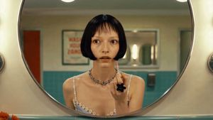 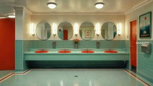

왼쪽부터: **정본 캐릭터(identity_ref)** · **배경 플레이트(plate)** — §3 시딩으로 DB에 등록되어 20샷 전체가 공유한다.

모든 경로는 이 문서 기준 상대경로(로그·소스는 리포 루트 기준 표기).

| 재료 | 경로 | 비고 |
|---|---|---|
| writer 산출 20샷 | [../2026-07-23_full-copy-bundle/assets/arm-base/shots.json](../2026-07-23_full-copy-bundle/assets/arm-base/shots.json) | **재사용, 재실행 없음** — FRAMEFIX 팔과 동일 재료를 써야 비교가 성립. 20샷 · 총 74초 |
| writer 참조 지정 실측 | `logs/2026-07-23_14-25-51_bzb8/14_v5_renderPrompts.json` (리포 루트 기준) | `shots[].t2i.reference_assets` — 샷별 canonical ID 지정의 원천. §5 각 블록에 원문 수록 |
| 정본 캐릭터 | [../2026-07-23_character-canon/assets/identity_ref.jpg](../2026-07-23_character-canon/assets/identity_ref.jpg) | 이하 "identity_ref". §3 시딩으로 girl·doppelganger의 `view_main`에 등록 |
| 배경 플레이트 | [../2026-07-23_input-format/assets/plates/src_empty_wide.jpg](../2026-07-23_input-format/assets/plates/src_empty_wide.jpg) | 빈 화장실 와이드. 이하 "plate". §3 시딩으로 새벽 공중화장실의 `wide_shot`에 등록 |
| v1 참고 썸네일 | `assets/thumbs/base_NN.jpg` | v1 무효 팔(BASE)의 T2I 산출 19장 — **이번 입력 아님**, 샷 파악용. 02는 4회 차단으로 산출 없음 |
| jobs 스키마 전례 | [../2026-07-23_full-copy-bundle/jobs.base.json](../2026-07-23_full-copy-bundle/jobs.base.json) | task `i2v_se` · image · seconds · aspect `16:9` · out |

모델·레인:

- **이미지**: 수리된 v6(`runShotImages`) 경유 — writer 지정 참조가 DB에서 잡히므로 20샷 전부 fal `openai/gpt-image-2/edit`(i2i)로 자동 라우팅 · `image_size: landscape_16_9` · 출력 png. 프롬프트는 shots.json의 `image_prompt` **원문 그대로**(제품이 쓴 프롬프트를 제품이 그대로 사용 — 실험이 손대지 않는다).
- **영상**: Seedance 2.0, **힉스필드 레인**(`dispatch.mjs --mode higgsfield`, jobType `seedance_2_0`, 720p) · task `i2v_se`(끝 프레임 없음) · seconds = `duration_seconds` 그대로. 전례: jobs.base.json이 2~7초 값으로 19/19 완주.
- **편집 없음**: 제품 정의 그대로 생성 순서·길이로 이어붙임. 트리밍·재배열·속도 조정 일절 없음.

참조 선정 주체는 **writer**다:

- renderPrompts의 `shots[].t2i.reference_assets`가 샷마다 canonical ID를 지정한다(위 로그 실측). 특기할 점 둘 — writer가 doppelganger를 오픈 캐스트로 **스스로 추가**했고(1인 2역), 암전 샷(shot_10)에도 장소 참조를 넣었다.
- 07-24판(A안)의 사람 판단 참조 표는 **전면 삭제**했다. §5 각 샷 블록에 writer 실측 원문을 그대로 수록한다.

산출 경로(실험 루트 = 이 문서가 있는 폴더):

- 시작 프레임: 제품 산출을 회수해 `assets/arm-origin/frames/NN.png`
- 클립: `assets/clips/arm-origin/NN.mp4` (jobs의 `out`은 assets 기준 `clips/arm-origin/NN.mp4`)
- 잡 파일: `jobs.origin.json` (실험 루트)

shot_2 특례: 지난번 fal T2I에서 4회 연속 content_policy_violation(422)으로 차단돼 Ⓑ 확정·제외됐던 샷. 이번엔 **포함**한다 — edit 레인 + 참조라 재시도 가치가 있다. 재차단 시 처리는 지난 규칙 유지: 동일 입력 4회 재시도 후에도 차단이면 Ⓑ 분류·제외.

---

## 5. 샷별 설계 (본체)

### 샷 01 — shot_1 · 5초 → `clips/arm-origin/01.mp4`

 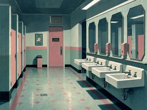

왼쪽부터: **writer 지정 참조 ① 플레이트** · (참고) v1 무효 팔이 이 샷을 T2I로 뽑았던 결과 — 이번 입력 아님, 이 샷이 무엇인지 감 잡는 용도

- **행동**: Establish the clinical, eerie atmosphere of the retro-pastel restroom at dawn.
- **카메라(writer 산출)**: `{"type":"WS","angle":"eye_level","movement":"static"}` · 구도: The vanishing point at the center of the restroom corridor. · 무드: Desaturated pastels with a cold, clinical blue undertone.

**1단계 · 시작 프레임 생성 (수리된 v6 → i2i)**

- 참조 (writer 지정, `reference_assets` 원문): `["새벽 공중화장실"]` → plate (§3 시딩 기준)
- 넣는 것: 위 참조 + 아래 프롬프트 → `openai/gpt-image-2/edit` (fal, `image_size: landscape_16_9`) — 참조는 **수리된 v6(runShotImages)가 DB에서 스스로 조회**해 첨부, 실험 도구는 개입하지 않음
- 나오는 것: 제품 산출 프레임을 회수해 `assets/arm-origin/frames/01.png` ← **이 파일이 2단계 영상의 입력이 된다**

프롬프트 원문 (`image_prompt`, 무수정):

```
A wide shot of an empty retro restroom with mint-green tiles and pink accents. Angular porcelain sinks line the wall under sharp-edged mirrors. Hard overhead fluorescent lighting creates sharp shadows. The art style is painterly retro-noir with clean lines and a palette of light steel blue and cherry blossom pink.
```

한국어 번역: 민트그린 타일과 핑크 포인트로 꾸며진 텅 빈 레트로 화장실의 와이드 샷. 날카로운 모서리의 거울들 아래로 각진 도기 세면대들이 벽을 따라 늘어서 있다. 머리 위의 강한 형광등 조명이 날카로운 그림자를 만든다. 아트 스타일은 깔끔한 선과 라이트 스틸블루·벚꽃 핑크 팔레트의 회화적 레트로 누아르.

**2단계 · ▶ 영상 API 입력** — Seedance 2.0 · 5초 · 16:9 · task `i2v_se`

- 이미지: `arm-origin/frames/01.png` **1장** (1단계 산출. 끝 프레임 없음 — 그게 이 팔의 정의)
- 텍스트 (모션 프롬프트 원문, 무수정):

```
The overhead fluorescent lights flicker subtly in the empty, silent restroom.
```

- 한국어 번역: 텅 비고 고요한 화장실에서 머리 위 형광등이 미세하게 깜빡인다.
- 산출: `clips/arm-origin/01.mp4`

<details><summary>jobs.origin.json 조각</summary>

```json
{
  "id": "origin_01",
  "task": "i2v_se",
  "prompt": "The overhead fluorescent lights flicker subtly in the empty, silent restroom.",
  "image": "arm-origin/frames/01.png",
  "seconds": 5,
  "aspect": "16:9",
  "out": "clips/arm-origin/01.mp4"
}
```
</details>

### 샷 02 — shot_2 · 4초 → `clips/arm-origin/02.mp4`

 

왼쪽부터: **writer 지정 참조 ① 정본(girl)** · **writer 지정 참조 ② 플레이트** (v1 산출 없음 — 4회 차단됐던 샷)

- **행동**: Introduce the protagonist into the sterile environment, emphasizing her isolation.
- **카메라(writer 산출)**: `{"type":"MFS","angle":"eye_level","movement":"static"}` · 구도: The girl as she enters the frame. · 무드: Maintain the cold dawn light, highlighting the pale blue of the dress.
- **특례**: 지난번 fal T2I에서 4회 연속 차단(422 content_policy_violation)돼 제외됐던 샷. 이번엔 edit 레인 + 참조로 재시도. 재차단 시 동일 입력 4회 재시도 후 Ⓑ 분류·제외(지난 규칙 유지).

**1단계 · 시작 프레임 생성 (수리된 v6 → i2i)**

- 참조 (writer 지정, `reference_assets` 원문): `["girl","새벽 공중화장실"]` → identity_ref + plate (§3 시딩 기준)
- 넣는 것: 위 참조 + 아래 프롬프트 → `openai/gpt-image-2/edit` (fal, `image_size: landscape_16_9`) — 참조는 **수리된 v6(runShotImages)가 DB에서 스스로 조회**해 첨부, 실험 도구는 개입하지 않음
- 나오는 것: 제품 산출 프레임을 회수해 `assets/arm-origin/frames/02.png` ← **이 파일이 2단계 영상의 입력이 된다**

프롬프트 원문 (`image_prompt`, 무수정):

```
A medium full shot of a young woman with a black bob entering a mint-tiled restroom. She wears a pale blue satin slip dress and white socks. The lighting is hard and top-down, casting sharp shadows on the angular floor tiles. Her expression is calm and indifferent.
```

한국어 번역: 검은 단발머리의 젊은 여자가 민트 타일 화장실로 들어서는 미디엄 풀 샷. 그녀는 연한 파란색 새틴 슬립 드레스와 흰 양말을 착용하고 있다. 조명은 강하고 위에서 수직으로 내리꽂혀 각진 바닥 타일 위에 날카로운 그림자를 드리운다. 표정은 차분하고 무심하다.

**2단계 · ▶ 영상 API 입력** — Seedance 2.0 · 4초 · 16:9 · task `i2v_se`

- 이미지: `arm-origin/frames/02.png` **1장** (1단계 산출. 끝 프레임 없음 — 그게 이 팔의 정의)
- 텍스트 (모션 프롬프트 원문, 무수정):

```
The girl walks steadily across the tile floor toward the sinks.
```

- 한국어 번역: 소녀가 타일 바닥을 가로질러 세면대 쪽으로 일정한 걸음으로 걸어간다.
- 산출: `clips/arm-origin/02.mp4`

<details><summary>jobs.origin.json 조각</summary>

```json
{
  "id": "origin_02",
  "task": "i2v_se",
  "prompt": "The girl walks steadily across the tile floor toward the sinks.",
  "image": "arm-origin/frames/02.png",
  "seconds": 4,
  "aspect": "16:9",
  "out": "clips/arm-origin/02.mp4"
}
```
</details>

### 샷 03 — shot_3 · 7초 → `clips/arm-origin/03.mp4`

  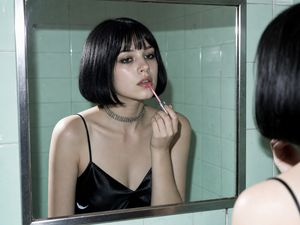

왼쪽부터: **writer 지정 참조 ① 정본(girl)** · **writer 지정 참조 ② 플레이트** · (참고) v1 무효 팔이 이 샷을 T2I로 뽑았던 결과 — 이번 입력 아님, 이 샷이 무엇인지 감 잡는 용도

- **행동**: Create suspense by showing the girl's ignorance of the ghostly whisper coming from below.
- **카메라(writer 산출)**: `{"type":"MCU","angle":"eye_level","movement":"static"}` · 구도: The girl's eyes in the mirror reflection. · 무드: Focus on the pink of the lip gloss and the pale blue of her dress reflection.

**1단계 · 시작 프레임 생성 (수리된 v6 → i2i)**

- 참조 (writer 지정, `reference_assets` 원문): `["girl","새벽 공중화장실"]` → identity_ref + plate (§3 시딩 기준)
- 넣는 것: 위 참조 + 아래 프롬프트 → `openai/gpt-image-2/edit` (fal, `image_size: landscape_16_9`) — 참조는 **수리된 v6(runShotImages)가 DB에서 스스로 조회**해 첨부, 실험 도구는 개입하지 않음
- 나오는 것: 제품 산출 프레임을 회수해 `assets/arm-origin/frames/03.png` ← **이 파일이 2단계 영상의 입력이 된다**

프롬프트 원문 (`image_prompt`, 무수정):

```
A medium close-up of the girl's reflection in a rectangular mirror. She is applying pink lip gloss. Her black bob is neat, and she wears a silver choker. The background reflection shows the mint-tiled wall. The lighting is harsh, highlighting her pale skin and the satin texture of her dress.
```

한국어 번역: 직사각형 거울에 비친 소녀의 반영을 담은 미디엄 클로즈업. 그녀는 핑크색 립글로스를 바르고 있다. 검은 단발은 단정하고, 은색 초커를 착용하고 있다. 배경 반영에는 민트 타일 벽이 보인다. 조명은 거칠어 그녀의 창백한 피부와 드레스의 새틴 질감을 도드라지게 한다.

**2단계 · ▶ 영상 API 입력** — Seedance 2.0 · 7초 · 16:9 · task `i2v_se`

- 이미지: `arm-origin/frames/03.png` **1장** (1단계 산출. 끝 프레임 없음 — 그게 이 팔의 정의)
- 텍스트 (모션 프롬프트 원문, 무수정):

```
The girl slowly applies lip gloss to her lips while staring blankly at her reflection.
```

- 한국어 번역: 소녀가 자신의 반영을 멍하니 응시하며 천천히 입술에 립글로스를 바른다.
- 산출: `clips/arm-origin/03.mp4`

<details><summary>jobs.origin.json 조각</summary>

```json
{
  "id": "origin_03",
  "task": "i2v_se",
  "prompt": "The girl slowly applies lip gloss to her lips while staring blankly at her reflection.",
  "image": "arm-origin/frames/03.png",
  "seconds": 7,
  "aspect": "16:9",
  "out": "clips/arm-origin/03.mp4"
}
```
</details>

### 샷 04 — shot_4 · 3초 → `clips/arm-origin/04.mp4`

 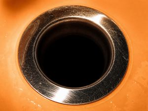

왼쪽부터: **writer 지정 참조 ① 플레이트** · (참고) v1 무효 팔이 이 샷을 T2I로 뽑았던 결과 — 이번 입력 아님, 이 샷이 무엇인지 감 잡는 용도

- **행동**: Identify the source of the whisper, grounding the horror in a physical object.
- **카메라(writer 산출)**: `{"type":"ECU","angle":"high_angle","movement":"static"}` · 구도: The center of the drain hole. · 무드: High contrast between the bright sink and the absolute black of the drain.

**1단계 · 시작 프레임 생성 (수리된 v6 → i2i)**

- 참조 (writer 지정, `reference_assets` 원문): `["새벽 공중화장실"]` → plate (§3 시딩 기준)
- 넣는 것: 위 참조 + 아래 프롬프트 → `openai/gpt-image-2/edit` (fal, `image_size: landscape_16_9`) — 참조는 **수리된 v6(runShotImages)가 DB에서 스스로 조회**해 첨부, 실험 도구는 개입하지 않음
- 나오는 것: 제품 산출 프레임을 회수해 `assets/arm-origin/frames/04.png` ← **이 파일이 2단계 영상의 입력이 된다**

프롬프트 원문 (`image_prompt`, 무수정):

```
An extreme close-up of a circular chrome sink drain set in an orange-tinted porcelain basin. The dark hole of the drain is at the center, appearing as an abyss. Harsh light reflects off the metallic rim, creating a stark contrast with the shadow inside.
```

한국어 번역: 주황빛이 도는 도기 세면볼에 박힌 원형 크롬 배수구의 익스트림 클로즈업. 배수구의 어두운 구멍이 화면 중앙에 있어 심연처럼 보인다. 강한 빛이 금속 테두리에 반사되어 내부의 그림자와 극명한 대비를 이룬다.

**2단계 · ▶ 영상 API 입력** — Seedance 2.0 · 3초 · 16:9 · task `i2v_se`

- 이미지: `arm-origin/frames/04.png` **1장** (1단계 산출. 끝 프레임 없음 — 그게 이 팔의 정의)
- 텍스트 (모션 프롬프트 원문, 무수정):

```
The camera remains perfectly still on the dark, yawning hole of the drain.
```

- 한국어 번역: 카메라는 어둡게 입을 벌린 배수구 구멍 위에 완벽하게 정지해 있다.
- 산출: `clips/arm-origin/04.mp4`

<details><summary>jobs.origin.json 조각</summary>

```json
{
  "id": "origin_04",
  "task": "i2v_se",
  "prompt": "The camera remains perfectly still on the dark, yawning hole of the drain.",
  "image": "arm-origin/frames/04.png",
  "seconds": 3,
  "aspect": "16:9",
  "out": "clips/arm-origin/04.mp4"
}
```
</details>

### 샷 05 — shot_5 · 4초 → `clips/arm-origin/05.mp4`

  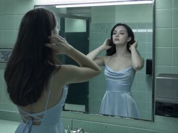

왼쪽부터: **writer 지정 참조 ① 정본(girl)** · **writer 지정 참조 ② 플레이트** · (참고) v1 무효 팔이 이 샷을 T2I로 뽑았던 결과 — 이번 입력 아님, 이 샷이 무엇인지 감 잡는 용도

- **행동**: Conclude the scene with the girl's unsettling normalcy, leaving the audience in dread.
- **카메라(writer 산출)**: `{"type":"MS","angle":"eye_level","movement":"static"}` · 구도: The girl's face. · 무드: A slightly colder, more clinical blue tone to end the scene.

**1단계 · 시작 프레임 생성 (수리된 v6 → i2i)**

- 참조 (writer 지정, `reference_assets` 원문): `["girl","새벽 공중화장실"]` → identity_ref + plate (§3 시딩 기준)
- 넣는 것: 위 참조 + 아래 프롬프트 → `openai/gpt-image-2/edit` (fal, `image_size: landscape_16_9`) — 참조는 **수리된 v6(runShotImages)가 DB에서 스스로 조회**해 첨부, 실험 도구는 개입하지 않음
- 나오는 것: 제품 산출 프레임을 회수해 `assets/arm-origin/frames/05.png` ← **이 파일이 2단계 영상의 입력이 된다**

프롬프트 원문 (`image_prompt`, 무수정):

```
A medium shot of the girl in the mint-tiled restroom. She has finished applying her lip gloss and is now calmly adjusting her hair in the mirror. Her expression is vacant and serene. The hard overhead light casts a cold glow over her pale blue satin dress.
```

한국어 번역: 민트 타일 화장실 안 소녀의 미디엄 샷. 립글로스를 다 바른 그녀가 이제 거울 앞에서 차분히 머리를 매만지고 있다. 표정은 공허하고 평온하다. 머리 위의 강한 조명이 연한 파란색 새틴 드레스 위로 차가운 빛을 드리운다.

**2단계 · ▶ 영상 API 입력** — Seedance 2.0 · 4초 · 16:9 · task `i2v_se`

- 이미지: `arm-origin/frames/05.png` **1장** (1단계 산출. 끝 프레임 없음 — 그게 이 팔의 정의)
- 텍스트 (모션 프롬프트 원문, 무수정):

```
The girl adjusts her hair with a blank expression before the scene fades.
```

- 한국어 번역: 장면이 어두워지기 전까지 소녀가 무표정하게 머리를 매만진다.
- 산출: `clips/arm-origin/05.mp4`

<details><summary>jobs.origin.json 조각</summary>

```json
{
  "id": "origin_05",
  "task": "i2v_se",
  "prompt": "The girl adjusts her hair with a blank expression before the scene fades.",
  "image": "arm-origin/frames/05.png",
  "seconds": 4,
  "aspect": "16:9",
  "out": "clips/arm-origin/05.mp4"
}
```
</details>

### 샷 06 — shot_6 · 4초 → `clips/arm-origin/06.mp4`

  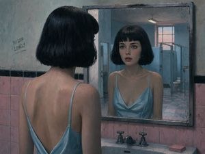

왼쪽부터: **writer 지정 참조 ① 정본(girl)** · **writer 지정 참조 ② 플레이트** · (참고) v1 무효 팔이 이 샷을 T2I로 뽑았던 결과 — 이번 입력 아님, 이 샷이 무엇인지 감 잡는 용도

- **행동**: Visualize the girl's sudden isolation and the eerie realization of an uncanny presence in the empty space.
- **카메라(writer 산출)**: `{"type":"MCU","angle":"eye_level","movement":"static"}` · 구도: The girl's eyes in the mirror reflection. · 무드: Cool dawn tones with a hint of retro pastel blue to enhance the quiet dread.

**1단계 · 시작 프레임 생성 (수리된 v6 → i2i)**

- 참조 (writer 지정, `reference_assets` 원문): `["girl","새벽 공중화장실"]` → identity_ref + plate (§3 시딩 기준)
- 넣는 것: 위 참조 + 아래 프롬프트 → `openai/gpt-image-2/edit` (fal, `image_size: landscape_16_9`) — 참조는 **수리된 v6(runShotImages)가 DB에서 스스로 조회**해 첨부, 실험 도구는 개입하지 않음
- 나오는 것: 제품 산출 프레임을 회수해 `assets/arm-origin/frames/06.png` ← **이 파일이 2단계 영상의 입력이 된다**

프롬프트 원문 (`image_prompt`, 무수정):

```
A medium close-up of a young woman with a sharp black bob, frozen in front of a rectangular mirror in a retro-noir restroom. She wears a pale blue satin slip dress. Her reflection shows a startled, still expression. In the background, empty ceramic stalls are bathed in soft, cool dawn light. The texture is painterly with subtle grime on the tiles. Palette of pale blue and soft pink.
```

한국어 번역: 레트로 누아르 화장실의 직사각형 거울 앞에 얼어붙은, 날렵한 검은 단발의 젊은 여자를 담은 미디엄 클로즈업. 연한 파란색 새틴 슬립 드레스를 입고 있다. 거울 속 반영에는 흠칫 놀라 굳은 표정이 보인다. 배경에는 텅 빈 도기 칸막이들이 부드럽고 차가운 새벽빛에 잠겨 있다. 질감은 회화적이며 타일에는 은은한 얼룩이 있다. 연한 파랑과 부드러운 핑크의 팔레트.

**2단계 · ▶ 영상 API 입력** — Seedance 2.0 · 4초 · 16:9 · task `i2v_se`

- 이미지: `arm-origin/frames/06.png` **1장** (1단계 산출. 끝 프레임 없음 — 그게 이 팔의 정의)
- 텍스트 (모션 프롬프트 원문, 무수정):

```
The girl remains completely frozen, her eyes subtly shifting to scan the reflection of the empty stalls.
```

- 한국어 번역: 소녀는 완전히 얼어붙은 채, 텅 빈 칸막이들의 반영을 살피듯 눈동자만 미세하게 움직인다.
- 산출: `clips/arm-origin/06.mp4`

<details><summary>jobs.origin.json 조각</summary>

```json
{
  "id": "origin_06",
  "task": "i2v_se",
  "prompt": "The girl remains completely frozen, her eyes subtly shifting to scan the reflection of the empty stalls.",
  "image": "arm-origin/frames/06.png",
  "seconds": 4,
  "aspect": "16:9",
  "out": "clips/arm-origin/06.mp4"
}
```
</details>

### 샷 07 — shot_7 · 3초 → `clips/arm-origin/07.mp4`

 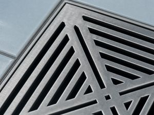

왼쪽부터: **writer 지정 참조 ① 플레이트** · (참고) v1 무효 팔이 이 샷을 T2I로 뽑았던 결과 — 이번 입력 아님, 이 샷이 무엇인지 감 잡는 용도

- **행동**: Clearly identify the source of the whisper, transforming a vague feeling into a specific, localized threat.
- **카메라(writer 산출)**: `{"type":"ECU","angle":"high_angle","movement":"static"}` · 구도: The center of the drain grating. · 무드: High contrast to emphasize the darkness within the drain.

**1단계 · 시작 프레임 생성 (수리된 v6 → i2i)**

- 참조 (writer 지정, `reference_assets` 원문): `["새벽 공중화장실"]` → plate (§3 시딩 기준)
- 넣는 것: 위 참조 + 아래 프롬프트 → `openai/gpt-image-2/edit` (fal, `image_size: landscape_16_9`) — 참조는 **수리된 v6(runShotImages)가 DB에서 스스로 조회**해 첨부, 실험 도구는 개입하지 않음
- 나오는 것: 제품 산출 프레임을 회수해 `assets/arm-origin/frames/07.png` ← **이 파일이 2단계 영상의 입력이 된다**

프롬프트 원문 (`image_prompt`, 무수정):

```
An extreme close-up of an angular, geometric floor drain grating. Dark shadows lurk within the holes of the metal. The surrounding ceramic tiles are a muted pale blue with sharp edges. Soft, cool lighting emphasizes the metallic texture and the dark void beneath the grate.
```

한국어 번역: 각지고 기하학적인 바닥 배수구 그레이팅의 익스트림 클로즈업. 금속의 구멍들 안에 어두운 그림자가 도사리고 있다. 주변의 도기 타일은 채도 낮은 연한 파란색이며 모서리가 날카롭다. 부드럽고 차가운 조명이 금속 질감과 그레이팅 아래의 어두운 공동을 강조한다.

**2단계 · ▶ 영상 API 입력** — Seedance 2.0 · 3초 · 16:9 · task `i2v_se`

- 이미지: `arm-origin/frames/07.png` **1장** (1단계 산출. 끝 프레임 없음 — 그게 이 팔의 정의)
- 텍스트 (모션 프롬프트 원문, 무수정):

```
A static shot focusing on the dark void of the drain as the shadows within seem to pulse.
```

- 한국어 번역: 배수구의 어두운 공동에 고정된 정적 샷. 그 안의 그림자들이 맥동하는 듯 보인다.
- 산출: `clips/arm-origin/07.mp4`

<details><summary>jobs.origin.json 조각</summary>

```json
{
  "id": "origin_07",
  "task": "i2v_se",
  "prompt": "A static shot focusing on the dark void of the drain as the shadows within seem to pulse.",
  "image": "arm-origin/frames/07.png",
  "seconds": 3,
  "aspect": "16:9",
  "out": "clips/arm-origin/07.mp4"
}
```
</details>

### 샷 08 — shot_8 · 5초 → `clips/arm-origin/08.mp4`

  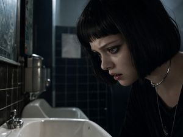

왼쪽부터: **writer 지정 참조 ① 정본(girl)** · **writer 지정 참조 ② 플레이트** · (참고) v1 무효 팔이 이 샷을 T2I로 뽑았던 결과 — 이번 입력 아님, 이 샷이 무엇인지 감 잡는 용도

- **행동**: Escalate suspense by showing the character's fatal curiosity as she draws closer to the source of the voice.
- **카메라(writer 산출)**: `{"type":"CU","angle":"low_angle","movement":"dolly_in"}` · 구도: The girl's ear and her wide, anxious eye. · 무드: Deepen the cool blues while introducing a faint magenta glow in the shadows.

**1단계 · 시작 프레임 생성 (수리된 v6 → i2i)**

- 참조 (writer 지정, `reference_assets` 원문): `["girl","새벽 공중화장실"]` → identity_ref + plate (§3 시딩 기준)
- 넣는 것: 위 참조 + 아래 프롬프트 → `openai/gpt-image-2/edit` (fal, `image_size: landscape_16_9`) — 참조는 **수리된 v6(runShotImages)가 DB에서 스스로 조회**해 첨부, 실험 도구는 개입하지 않음
- 나오는 것: 제품 산출 프레임을 회수해 `assets/arm-origin/frames/08.png` ← **이 파일이 2단계 영상의 입력이 된다**

프롬프트 원문 (`image_prompt`, 무수정):

```
A close-up of the girl's face, her expression one of intense focus and dread. She is positioned in the right third of the frame, leaning toward a porcelain sink. The background shows the angular lines of the restroom. Soft light hits the side of her face, highlighting her silver choker and black bob.
```

한국어 번역: 강렬한 집중과 공포가 담긴 표정의 소녀 얼굴 클로즈업. 그녀는 화면 오른쪽 3분의 1 지점에서 도기 세면대 쪽으로 몸을 기울이고 있다. 배경에는 화장실의 각진 선들이 보인다. 부드러운 빛이 얼굴 옆면에 닿아 은색 초커와 검은 단발을 도드라지게 한다.

**2단계 · ▶ 영상 API 입력** — Seedance 2.0 · 5초 · 16:9 · task `i2v_se`

- 이미지: `arm-origin/frames/08.png` **1장** (1단계 산출. 끝 프레임 없음 — 그게 이 팔의 정의)
- 텍스트 (모션 프롬프트 원문, 무수정):

```
The camera slowly dollys in as the girl leans her head down toward the sink, bringing her ear closer to the drain.
```

- 한국어 번역: 소녀가 세면대 쪽으로 고개를 숙여 귀를 배수구에 가까이 가져가는 동안 카메라가 천천히 달리 인 한다.
- 산출: `clips/arm-origin/08.mp4`

<details><summary>jobs.origin.json 조각</summary>

```json
{
  "id": "origin_08",
  "task": "i2v_se",
  "prompt": "The camera slowly dollys in as the girl leans her head down toward the sink, bringing her ear closer to the drain.",
  "image": "arm-origin/frames/08.png",
  "seconds": 5,
  "aspect": "16:9",
  "out": "clips/arm-origin/08.mp4"
}
```
</details>

### 샷 09 — shot_9 · 3초 → `clips/arm-origin/09.mp4`

  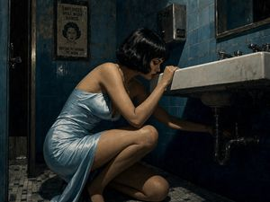

왼쪽부터: **writer 지정 참조 ① 정본(girl)** · **writer 지정 참조 ② 플레이트** · (참고) v1 무효 팔이 이 샷을 T2I로 뽑았던 결과 — 이번 입력 아님, 이 샷이 무엇인지 감 잡는 용도

- **행동**: Capture the peak of the girl's curiosity and tension as she investigates the source of the sound.
- **카메라(writer 산출)**: `{"type":"MS","angle":"low_angle","movement":"handheld_drift"}` · 구도: The girl's hands near the pipes · 무드: Cold dawn blue tones with high contrast shadows.

**1단계 · 시작 프레임 생성 (수리된 v6 → i2i)**

- 참조 (writer 지정, `reference_assets` 원문): `["girl","새벽 공중화장실"]` → identity_ref + plate (§3 시딩 기준)
- 넣는 것: 위 참조 + 아래 프롬프트 → `openai/gpt-image-2/edit` (fal, `image_size: landscape_16_9`) — 참조는 **수리된 v6(runShotImages)가 DB에서 스스로 조회**해 첨부, 실험 도구는 개입하지 않음
- 나오는 것: 제품 산출 프레임을 회수해 `assets/arm-origin/frames/09.png` ← **이 파일이 2단계 영상의 입력이 된다**

프롬프트 원문 (`image_prompt`, 무수정):

```
A medium shot of a young woman with a black bob, wearing a pale blue satin slip dress, leaning down toward the dark plumbing under a rectangular porcelain sink. Retro-noir public restroom with angular steel blue tiles. Hard lighting from above creates sharp shadows. Painterly texture philosophy with subtle grime on the walls.
```

한국어 번역: 검은 단발에 연한 파란색 새틴 슬립 드레스를 입은 젊은 여자가 직사각형 도기 세면대 아래의 어두운 배관 쪽으로 몸을 숙이는 미디엄 샷. 각진 스틸블루 타일의 레트로 누아르 공중화장실. 위에서 내리꽂는 강한 조명이 날카로운 그림자를 만든다. 벽에 은은한 얼룩이 있는 회화적 질감 철학.

**2단계 · ▶ 영상 API 입력** — Seedance 2.0 · 3초 · 16:9 · task `i2v_se`

- 이미지: `arm-origin/frames/09.png` **1장** (1단계 산출. 끝 프레임 없음 — 그게 이 팔의 정의)
- 텍스트 (모션 프롬프트 원문, 무수정):

```
The girl leans deeper into the shadows while the camera drifts slightly forward.
```

- 한국어 번역: 카메라가 살짝 앞으로 흘러가는 동안 소녀는 그림자 속으로 더 깊이 몸을 기울인다.
- 산출: `clips/arm-origin/09.mp4`

<details><summary>jobs.origin.json 조각</summary>

```json
{
  "id": "origin_09",
  "task": "i2v_se",
  "prompt": "The girl leans deeper into the shadows while the camera drifts slightly forward.",
  "image": "arm-origin/frames/09.png",
  "seconds": 3,
  "aspect": "16:9",
  "out": "clips/arm-origin/09.mp4"
}
```
</details>

### 샷 10 — shot_10 · 2초 → `clips/arm-origin/10.mp4`

 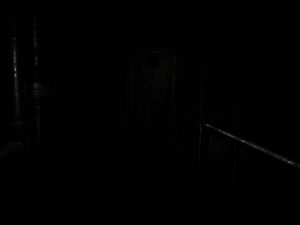

왼쪽부터: **writer 지정 참조 ① 플레이트** · (참고) v1 무효 팔이 이 샷을 T2I로 뽑았던 결과 — 이번 입력 아님, 이 샷이 무엇인지 감 잡는 용도

- **행동**: Shock the audience with a sensory blackout and a brief flash of violence.
- **카메라(writer 산출)**: `{"type":"POV","angle":"eye_level","movement":"static"}` · 구도: The center of the frame · 무드: Pitch black interrupted by an aggressive, saturated magenta burst.

**1단계 · 시작 프레임 생성 (수리된 v6 → i2i)**

- 참조 (writer 지정, `reference_assets` 원문): `["새벽 공중화장실"]` → plate (§3 시딩 기준)
- 특기: writer는 이 완전 암전 샷에도 장소 참조를 지정했다. 제품 결정을 그대로 따르는 것이 이 팔의 정의다. (07-24판의 "참조가 암전을 깨뜨릴 위험 → 무참조 T2I 유지" 사람 판단은 B안 전환으로 폐기)
- 넣는 것: 위 참조 + 아래 프롬프트 → `openai/gpt-image-2/edit` (fal, `image_size: landscape_16_9`) — 참조는 **수리된 v6(runShotImages)가 DB에서 스스로 조회**해 첨부, 실험 도구는 개입하지 않음
- 나오는 것: 제품 산출 프레임을 회수해 `assets/arm-origin/frames/10.png` ← **이 파일이 2단계 영상의 입력이 된다**

프롬프트 원문 (`image_prompt`, 무수정):

```
A POV shot in total darkness. The frame is pitch black with faint metallic textures. The atmosphere is heavy and silent before the scream. Retro-noir aesthetic with sharp-edged shadow logic.
```

한국어 번역: 완전한 어둠 속의 POV 샷. 프레임은 희미한 금속 질감만 남긴 채 칠흑같이 어둡다. 비명 직전의 무겁고 고요한 공기. 날카로운 모서리의 그림자 논리를 지닌 레트로 누아르 미학.

**2단계 · ▶ 영상 API 입력** — Seedance 2.0 · 2초 · 16:9 · task `i2v_se`

- 이미지: `arm-origin/frames/10.png` **1장** (1단계 산출. 끝 프레임 없음 — 그게 이 팔의 정의)
- 텍스트 (모션 프롬프트 원문, 무수정):

```
A sharp magenta flash bursts across the screen then fades into darkness.
```

- 한국어 번역: 선명한 마젠타 섬광이 화면을 가로질러 터진 뒤 어둠 속으로 사라진다.
- 산출: `clips/arm-origin/10.mp4`

<details><summary>jobs.origin.json 조각</summary>

```json
{
  "id": "origin_10",
  "task": "i2v_se",
  "prompt": "A sharp magenta flash bursts across the screen then fades into darkness.",
  "image": "arm-origin/frames/10.png",
  "seconds": 2,
  "aspect": "16:9",
  "out": "clips/arm-origin/10.mp4"
}
```
</details>

### 샷 11 — shot_11 · 4초 → `clips/arm-origin/11.mp4`

  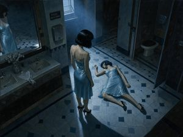

왼쪽부터: **writer 지정 참조 ① 정본(girl·doppelganger — 동일 시딩)** · **writer 지정 참조 ② 플레이트** · (참고) v1 무효 팔이 이 샷을 T2I로 뽑았던 결과 — 이번 입력 아님, 이 샷이 무엇인지 감 잡는 용도

- **행동**: Establish the uncanny presence of the doppelganger and the girl's defeat.
- **카메라(writer 산출)**: `{"type":"WS","angle":"high_angle","movement":"handheld_drift"}` · 구도: The doppelganger's standing figure · 무드: Desaturated, clinical dawn light with deep blue shadows.

**1단계 · 시작 프레임 생성 (수리된 v6 → i2i)**

- 참조 (writer 지정, `reference_assets` 원문): `["girl","doppelganger","새벽 공중화장실"]` → identity_ref(두 ID 모두 동일 시딩, 1인 2역) + plate (§3 시딩 기준)
- 넣는 것: 위 참조 + 아래 프롬프트 → `openai/gpt-image-2/edit` (fal, `image_size: landscape_16_9`) — 참조는 **수리된 v6(runShotImages)가 DB에서 스스로 조회**해 첨부, 실험 도구는 개입하지 않음
- 나오는 것: 제품 산출 프레임을 회수해 `assets/arm-origin/frames/11.png` ← **이 파일이 2단계 영상의 입력이 된다**

프롬프트 원문 (`image_prompt`, 무수정):

```
A high-angle wide shot of a public restroom with angular ceramic tiles. A girl in a pale blue satin slip dress lies unconscious on the floor. Standing over her is an identical doppelganger in the same dress and black bob. The lighting is cold dawn blue, casting long, hard shadows. Retro-noir painterly texture.
```

한국어 번역: 각진 도기 타일 공중화장실의 하이앵글 와이드 샷. 연한 파란색 새틴 슬립 드레스의 소녀가 의식을 잃은 채 바닥에 누워 있다. 그 위에는 같은 드레스와 검은 단발의 똑같이 생긴 도플갱어가 서 있다. 조명은 차가운 새벽 파랑으로 길고 단단한 그림자를 드리운다. 레트로 누아르 회화적 질감.

**2단계 · ▶ 영상 API 입력** — Seedance 2.0 · 4초 · 16:9 · task `i2v_se`

- 이미지: `arm-origin/frames/11.png` **1장** (1단계 산출. 끝 프레임 없음 — 그게 이 팔의 정의)
- 텍스트 (모션 프롬프트 원문, 무수정):

```
The doppelganger stands perfectly still while the camera breathes with a handheld drift.
```

- 한국어 번역: 카메라가 핸드헬드 드리프트로 숨 쉬는 동안 도플갱어는 완벽하게 정지해 서 있다.
- 산출: `clips/arm-origin/11.mp4`

<details><summary>jobs.origin.json 조각</summary>

```json
{
  "id": "origin_11",
  "task": "i2v_se",
  "prompt": "The doppelganger stands perfectly still while the camera breathes with a handheld drift.",
  "image": "arm-origin/frames/11.png",
  "seconds": 4,
  "aspect": "16:9",
  "out": "clips/arm-origin/11.mp4"
}
```
</details>

### 샷 12 — shot_12 · 5초 → `clips/arm-origin/12.mp4`

  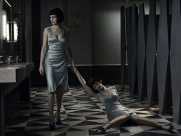

왼쪽부터: **writer 지정 참조 ① 정본(girl·doppelganger — 동일 시딩)** · **writer 지정 참조 ② 플레이트** · (참고) v1 무효 팔이 이 샷을 T2I로 뽑았던 결과 — 이번 입력 아님, 이 샷이 무엇인지 감 잡는 용도

- **행동**: Demonstrate the doppelganger's cold, mechanical efficiency in disposing of the original.
- **카메라(writer 산출)**: `{"type":"MFS","angle":"eye_level","movement":"handheld_drift"}` · 구도: The doppelganger's hand on the girl's arm · 무드: Clinical, muted tones to match the emotionless action.

**1단계 · 시작 프레임 생성 (수리된 v6 → i2i)**

- 참조 (writer 지정, `reference_assets` 원문): `["girl","doppelganger","새벽 공중화장실"]` → identity_ref(두 ID 모두 동일 시딩, 1인 2역) + plate (§3 시딩 기준)
- 넣는 것: 위 참조 + 아래 프롬프트 → `openai/gpt-image-2/edit` (fal, `image_size: landscape_16_9`) — 참조는 **수리된 v6(runShotImages)가 DB에서 스스로 조회**해 첨부, 실험 도구는 개입하지 않음
- 나오는 것: 제품 산출 프레임을 회수해 `assets/arm-origin/frames/12.png` ← **이 파일이 2단계 영상의 입력이 된다**

프롬프트 원문 (`image_prompt`, 무수정):

```
A medium full shot of the doppelganger dragging the unconscious girl by the arm across a geometric tile floor. Both wear pale blue satin dresses and black bobs. The background features angular bathroom stalls in a retro-noir style. Harsh, cold lighting from the side creates deep shadows.
```

한국어 번역: 도플갱어가 의식 잃은 소녀의 팔을 잡고 기하학적 타일 바닥을 가로질러 끌고 가는 미디엄 풀 샷. 둘 다 연한 파란색 새틴 드레스에 검은 단발이다. 배경에는 레트로 누아르 스타일의 각진 화장실 칸막이들이 있다. 옆에서 비추는 거칠고 차가운 조명이 짙은 그림자를 만든다.

**2단계 · ▶ 영상 API 입력** — Seedance 2.0 · 5초 · 16:9 · task `i2v_se`

- 이미지: `arm-origin/frames/12.png` **1장** (1단계 산출. 끝 프레임 없음 — 그게 이 팔의 정의)
- 텍스트 (모션 프롬프트 원문, 무수정):

```
The doppelganger slowly drags the limp body across the floor toward the left.
```

- 한국어 번역: 도플갱어가 축 늘어진 몸을 바닥 위로 천천히 왼쪽을 향해 끌고 간다.
- 산출: `clips/arm-origin/12.mp4`

<details><summary>jobs.origin.json 조각</summary>

```json
{
  "id": "origin_12",
  "task": "i2v_se",
  "prompt": "The doppelganger slowly drags the limp body across the floor toward the left.",
  "image": "arm-origin/frames/12.png",
  "seconds": 5,
  "aspect": "16:9",
  "out": "clips/arm-origin/12.mp4"
}
```
</details>

### 샷 13 — shot_13 · 4초 → `clips/arm-origin/13.mp4`

  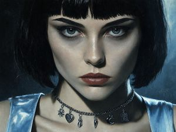

왼쪽부터: **writer 지정 참조 ① 정본(doppelganger)** · **writer 지정 참조 ② 플레이트** · (참고) v1 무효 팔이 이 샷을 T2I로 뽑았던 결과 — 이번 입력 아님, 이 샷이 무엇인지 감 잡는 용도

- **행동**: Final reveal of the doppelganger's perfect, terrifying lack of emotion.
- **카메라(writer 산출)**: `{"type":"CU","angle":"eye_level","movement":"handheld_drift"}` · 구도: Doppelganger's eyes · 무드: High contrast, emphasizing the pale skin and dark hair.

**1단계 · 시작 프레임 생성 (수리된 v6 → i2i)**

- 참조 (writer 지정, `reference_assets` 원문): `["doppelganger","새벽 공중화장실"]` → identity_ref(doppelganger) + plate (§3 시딩 기준. 07-24판 사람 표는 "정본만"이었으나 writer는 장소 참조도 지정 — writer 실측을 따름)
- 넣는 것: 위 참조 + 아래 프롬프트 → `openai/gpt-image-2/edit` (fal, `image_size: landscape_16_9`) — 참조는 **수리된 v6(runShotImages)가 DB에서 스스로 조회**해 첨부, 실험 도구는 개입하지 않음
- 나오는 것: 제품 산출 프레임을 회수해 `assets/arm-origin/frames/13.png` ← **이 파일이 2단계 영상의 입력이 된다**

프롬프트 원문 (`image_prompt`, 무수정):

```
An extreme close-up of the doppelganger’s face. She has a black bob and wears a silver charm choker. Her expression is completely blank and emotionless, staring directly into the lens. Hard lighting highlights the angular jaw and the pale blue satin of her dress. Retro-noir painterly style.
```

한국어 번역: 도플갱어 얼굴의 익스트림 클로즈업. 검은 단발에 은색 참 초커를 착용하고 있다. 표정은 완전히 공허하고 무감정하며, 렌즈를 정면으로 응시하고 있다. 강한 조명이 각진 턱선과 드레스의 연한 파란색 새틴을 강조한다. 레트로 누아르 회화 스타일.

**2단계 · ▶ 영상 API 입력** — Seedance 2.0 · 4초 · 16:9 · task `i2v_se`

- 이미지: `arm-origin/frames/13.png` **1장** (1단계 산출. 끝 프레임 없음 — 그게 이 팔의 정의)
- 텍스트 (모션 프롬프트 원문, 무수정):

```
The doppelganger stares into the camera with absolute stillness and no blinking.
```

- 한국어 번역: 도플갱어가 눈 한 번 깜빡이지 않는 절대적인 정지 상태로 카메라를 응시한다.
- 산출: `clips/arm-origin/13.mp4`

<details><summary>jobs.origin.json 조각</summary>

```json
{
  "id": "origin_13",
  "task": "i2v_se",
  "prompt": "The doppelganger stares into the camera with absolute stillness and no blinking.",
  "image": "arm-origin/frames/13.png",
  "seconds": 4,
  "aspect": "16:9",
  "out": "clips/arm-origin/13.mp4"
}
```
</details>

### 샷 14 — shot_14 · 3초 → `clips/arm-origin/14.mp4`

  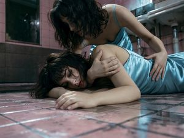

왼쪽부터: **writer 지정 참조 ① 정본(doppelganger·girl — 동일 시딩)** · **writer 지정 참조 ② 플레이트** · (참고) v1 무효 팔이 이 샷을 T2I로 뽑았던 결과 — 이번 입력 아님, 이 샷이 무엇인지 감 잡는 용도

- **행동**: To emphasize the physical weight and total lack of life in the victim's body through a grounding floor-level perspective.
- **카메라(writer 산출)**: `{"type":"FS","angle":"low_angle","movement":"handheld_drift"}` · 구도: The point of contact between the girl's shoulder and the floor. · 무드: Cold, clinical dawn light with harsh magenta shadows in the corners.

**1단계 · 시작 프레임 생성 (수리된 v6 → i2i)**

- 참조 (writer 지정, `reference_assets` 원문): `["doppelganger","girl","새벽 공중화장실"]` → identity_ref(두 ID 모두 동일 시딩, 1인 2역) + plate (§3 시딩 기준)
- 넣는 것: 위 참조 + 아래 프롬프트 → `openai/gpt-image-2/edit` (fal, `image_size: landscape_16_9`) — 참조는 **수리된 v6(runShotImages)가 DB에서 스스로 조회**해 첨부, 실험 도구는 개입하지 않음
- 나오는 것: 제품 산출 프레임을 회수해 `assets/arm-origin/frames/14.png` ← **이 파일이 2단계 영상의 입력이 된다**

프롬프트 원문 (`image_prompt`, 무수정):

```
Low angle floor level shot in a retro-noir restroom. A doppelganger in a pale blue satin slip dress is laying a limp, identical girl onto cold, angular pink ceramic tiles. The lighting is harsh and clinical 6500K. Painterly textures of water stains and grime on the floor. 50mm lens, sharp focus on the contact point.
```

한국어 번역: 레트로 누아르 화장실의 로우앵글 바닥 높이 샷. 연한 파란색 새틴 슬립 드레스의 도플갱어가 자신과 똑같이 생긴 축 늘어진 소녀를 차갑고 각진 핑크 도기 타일 위에 내려놓고 있다. 조명은 거칠고 임상적인 6500K. 바닥에는 물때와 얼룩의 회화적 질감. 50mm 렌즈, 접촉 지점에 선명한 초점.

**2단계 · ▶ 영상 API 입력** — Seedance 2.0 · 3초 · 16:9 · task `i2v_se`

- 이미지: `arm-origin/frames/14.png` **1장** (1단계 산출. 끝 프레임 없음 — 그게 이 팔의 정의)
- 텍스트 (모션 프롬프트 원문, 무수정):

```
The doppelganger slowly lowers the limp body of the girl onto the tiles with a heavy, physical weight.
```

- 한국어 번역: 도플갱어가 묵직한 물리적 무게감으로 소녀의 축 늘어진 몸을 타일 위에 천천히 내려놓는다.
- 산출: `clips/arm-origin/14.mp4`

<details><summary>jobs.origin.json 조각</summary>

```json
{
  "id": "origin_14",
  "task": "i2v_se",
  "prompt": "The doppelganger slowly lowers the limp body of the girl onto the tiles with a heavy, physical weight.",
  "image": "arm-origin/frames/14.png",
  "seconds": 3,
  "aspect": "16:9",
  "out": "clips/arm-origin/14.mp4"
}
```
</details>

### 샷 15 — shot_15 · 2초 → `clips/arm-origin/15.mp4`

  

왼쪽부터: **writer 지정 참조 ① 정본(doppelganger)** · **writer 지정 참조 ② 플레이트** · (참고) v1 무효 팔이 이 샷을 T2I로 뽑았던 결과 — 이번 입력 아님, 이 샷이 무엇인지 감 잡는 용도

- **행동**: Highlight the uncanny and fetishistic detachment of the antagonist through a close-up of a stolen personal item.
- **카메라(writer 산출)**: `{"type":"ECU","angle":"eye_level","movement":"handheld_drift"}` · 구도: The angular toe of the black Mary Jane heel. · 무드: High contrast with magenta highlights reflecting off the black leather.

**1단계 · 시작 프레임 생성 (수리된 v6 → i2i)**

- 참조 (writer 지정, `reference_assets` 원문): `["doppelganger","새벽 공중화장실"]` → identity_ref(doppelganger) + plate (§3 시딩 기준. 07-24판 사람 표는 "정본만"이었으나 writer는 장소 참조도 지정 — writer 실측을 따름)
- 넣는 것: 위 참조 + 아래 프롬프트 → `openai/gpt-image-2/edit` (fal, `image_size: landscape_16_9`) — 참조는 **수리된 v6(runShotImages)가 DB에서 스스로 조회**해 첨부, 실험 도구는 개입하지 않음
- 나오는 것: 제품 산출 프레임을 회수해 `assets/arm-origin/frames/15.png` ← **이 파일이 2단계 영상의 입력이 된다**

프롬프트 원문 (`image_prompt`, 무수정):

```
Extreme close-up of a pale hand holding a black patent leather Mary Jane heel with an angular toe. Harsh fluorescent light creates sharp highlights on the leather. The background is a blurred pale blue satin. Retro-pastel noir aesthetic with painterly textures.
```

한국어 번역: 각진 앞코의 검은 페이턴트 가죽 메리제인 힐을 쥔 창백한 손의 익스트림 클로즈업. 강한 형광등 빛이 가죽 위에 날카로운 하이라이트를 만든다. 배경은 흐릿하게 처리된 연한 파란색 새틴이다. 회화적 질감의 레트로 파스텔 누아르 미학.

**2단계 · ▶ 영상 API 입력** — Seedance 2.0 · 2초 · 16:9 · task `i2v_se`

- 이미지: `arm-origin/frames/15.png` **1장** (1단계 산출. 끝 프레임 없음 — 그게 이 팔의 정의)
- 텍스트 (모션 프롬프트 원문, 무수정):

```
The hand subtly tightens its grip on the shoe while the camera drifts slightly forward.
```

- 한국어 번역: 카메라가 살짝 앞으로 흘러가는 동안 손이 구두를 쥔 힘을 미묘하게 조인다.
- 산출: `clips/arm-origin/15.mp4`

<details><summary>jobs.origin.json 조각</summary>

```json
{
  "id": "origin_15",
  "task": "i2v_se",
  "prompt": "The hand subtly tightens its grip on the shoe while the camera drifts slightly forward.",
  "image": "arm-origin/frames/15.png",
  "seconds": 2,
  "aspect": "16:9",
  "out": "clips/arm-origin/15.mp4"
}
```
</details>

### 샷 16 — shot_16 · 4초 → `clips/arm-origin/16.mp4`

  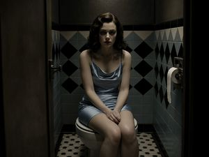

왼쪽부터: **writer 지정 참조 ① 정본(doppelganger)** · **writer 지정 참조 ② 플레이트** · (참고) v1 무효 팔이 이 샷을 T2I로 뽑았던 결과 — 이번 입력 아님, 이 샷이 무엇인지 감 잡는 용도

- **행동**: To build dread through a prolonged moment of unnatural stillness and psychological void.
- **카메라(writer 산출)**: `{"type":"MS","angle":"eye_level","movement":"handheld_drift"}` · 구도: The doppelganger's eyes. · 무드: Desaturated blues and pinks with deep, oppressive shadows.

**1단계 · 시작 프레임 생성 (수리된 v6 → i2i)**

- 참조 (writer 지정, `reference_assets` 원문): `["doppelganger","새벽 공중화장실"]` → identity_ref(doppelganger) + plate (§3 시딩 기준)
- 넣는 것: 위 참조 + 아래 프롬프트 → `openai/gpt-image-2/edit` (fal, `image_size: landscape_16_9`) — 참조는 **수리된 v6(runShotImages)가 DB에서 스스로 조회**해 첨부, 실험 도구는 개입하지 않음
- 나오는 것: 제품 산출 프레임을 회수해 `assets/arm-origin/frames/16.png` ← **이 파일이 2단계 영상의 입력이 된다**

프롬프트 원문 (`image_prompt`, 무수정):

```
Medium shot of the doppelganger sitting motionless on a closed toilet lid in a dim restroom stall. She wears a pale blue satin slip dress and has a vacant expression. Harsh top-down lighting creates deep shadows under her eyes. Retro-noir style with angular tiles in the background.
```

한국어 번역: 어둑한 화장실 칸 안, 닫힌 변기 뚜껑 위에 미동 없이 앉아 있는 도플갱어의 미디엄 샷. 연한 파란색 새틴 슬립 드레스를 입고 공허한 표정을 짓고 있다. 위에서 내리꽂는 강한 조명이 눈 밑에 깊은 그림자를 만든다. 배경에 각진 타일이 있는 레트로 누아르 스타일.

**2단계 · ▶ 영상 API 입력** — Seedance 2.0 · 4초 · 16:9 · task `i2v_se`

- 이미지: `arm-origin/frames/16.png` **1장** (1단계 산출. 끝 프레임 없음 — 그게 이 팔의 정의)
- 텍스트 (모션 프롬프트 원문, 무수정):

```
The doppelganger remains unnervingly still, staring blankly as the camera drifts with a subtle handheld breathing.
```

- 한국어 번역: 카메라가 미세한 핸드헬드 호흡으로 흘러가는 동안 도플갱어는 섬뜩하리만치 미동도 없이 멍하니 응시한다.
- 산출: `clips/arm-origin/16.mp4`

<details><summary>jobs.origin.json 조각</summary>

```json
{
  "id": "origin_16",
  "task": "i2v_se",
  "prompt": "The doppelganger remains unnervingly still, staring blankly as the camera drifts with a subtle handheld breathing.",
  "image": "arm-origin/frames/16.png",
  "seconds": 4,
  "aspect": "16:9",
  "out": "clips/arm-origin/16.mp4"
}
```
</details>

### 샷 17 — shot_17 · 3초 → `clips/arm-origin/17.mp4`

  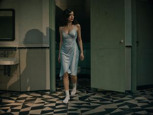

왼쪽부터: **writer 지정 참조 ① 정본(doppelganger)** · **writer 지정 참조 ② 플레이트** · (참고) v1 무효 팔이 이 샷을 T2I로 뽑았던 결과 — 이번 입력 아님, 이 샷이 무엇인지 감 잡는 용도

- **행동**: To signify the completion of the 'replacement' and the abandonment of the original girl.
- **카메라(writer 산출)**: `{"type":"MFS","angle":"eye_level","movement":"tracking"}` · 구도: The doppelganger's back as she walks away. · 무드: Cold blue dominance with a final flash of magenta from the overhead lights.

**1단계 · 시작 프레임 생성 (수리된 v6 → i2i)**

- 참조 (writer 지정, `reference_assets` 원문): `["doppelganger","새벽 공중화장실"]` → identity_ref(doppelganger) + plate (§3 시딩 기준)
- 넣는 것: 위 참조 + 아래 프롬프트 → `openai/gpt-image-2/edit` (fal, `image_size: landscape_16_9`) — 참조는 **수리된 v6(runShotImages)가 DB에서 스스로 조회**해 첨부, 실험 도구는 개입하지 않음
- 나오는 것: 제품 산출 프레임을 회수해 `assets/arm-origin/frames/17.png` ← **이 파일이 2단계 영상의 입력이 된다**

프롬프트 원문 (`image_prompt`, 무수정):

```
Medium full shot in a retro-noir restroom. The doppelganger stands up from the toilet and walks out of the stall. She is wearing a pale blue satin dress and white socks. The stall door swings slowly. Harsh lighting creates long shadows on the angular tiled floor. 50mm lens.
```

한국어 번역: 레트로 누아르 화장실의 미디엄 풀 샷. 도플갱어가 변기에서 일어나 칸 밖으로 걸어 나온다. 연한 파란색 새틴 드레스와 흰 양말 차림이다. 칸막이 문이 천천히 흔들린다. 강한 조명이 각진 타일 바닥에 긴 그림자를 만든다. 50mm 렌즈.

**2단계 · ▶ 영상 API 입력** — Seedance 2.0 · 3초 · 16:9 · task `i2v_se`

- 이미지: `arm-origin/frames/17.png` **1장** (1단계 산출. 끝 프레임 없음 — 그게 이 팔의 정의)
- 텍스트 (모션 프롬프트 원문, 무수정):

```
The doppelganger walks away with a cold, steady pace as the stall door swings shut behind her.
```

- 한국어 번역: 도플갱어가 차갑고 일정한 걸음으로 걸어 나가고, 그 뒤로 칸막이 문이 흔들리며 닫힌다.
- 산출: `clips/arm-origin/17.mp4`

<details><summary>jobs.origin.json 조각</summary>

```json
{
  "id": "origin_17",
  "task": "i2v_se",
  "prompt": "The doppelganger walks away with a cold, steady pace as the stall door swings shut behind her.",
  "image": "arm-origin/frames/17.png",
  "seconds": 3,
  "aspect": "16:9",
  "out": "clips/arm-origin/17.mp4"
}
```
</details>

### 샷 18 — shot_18 · 2.5초 → `clips/arm-origin/18.mp4`

  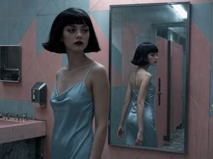

왼쪽부터: **writer 지정 참조 ① 정본(doppelganger)** · **writer 지정 참조 ② 플레이트** · (참고) v1 무효 팔이 이 샷을 T2I로 뽑았던 결과 — 이번 입력 아님, 이 샷이 무엇인지 감 잡는 용도

- **행동**: To convey a sense of uncanny detachment by showing the doppelganger's mechanical and indifferent movement as she replaces the original girl.
- **카메라(writer 산출)**: `{"type":"MS","angle":"eye_level","movement":"static"}` · 구도: The doppelganger's face · 무드: Cool and clinical, emphasizing the pale blue tones to match the dawn light.

**1단계 · 시작 프레임 생성 (수리된 v6 → i2i)**

- 참조 (writer 지정, `reference_assets` 원문): `["doppelganger","새벽 공중화장실"]` → identity_ref(doppelganger) + plate (§3 시딩 기준)
- 넣는 것: 위 참조 + 아래 프롬프트 → `openai/gpt-image-2/edit` (fal, `image_size: landscape_16_9`) — 참조는 **수리된 v6(runShotImages)가 DB에서 스스로 조회**해 첨부, 실험 도구는 개입하지 않음
- 나오는 것: 제품 산출 프레임을 회수해 `assets/arm-origin/frames/18.png` ← **이 파일이 2단계 영상의 입력이 된다**

프롬프트 원문 (`image_prompt`, 무수정):

```
Medium shot in a retro-noir restroom. The doppelganger, a girl with a black bob and pale blue satin slip dress, walks past a sharp-edged rectangular mirror. Her expression is perfectly void of emotion. The walls are covered in angular ceramic tiles with subtle painterly grime. Soft 6500K light from above creates a cool, clinical atmosphere. Palette of pale blue and soft pink dominates.
```

한국어 번역: 레트로 누아르 화장실의 미디엄 샷. 검은 단발에 연한 파란색 새틴 슬립 드레스를 입은 소녀인 도플갱어가 날카로운 모서리의 직사각형 거울 앞을 지나 걸어간다. 표정은 완벽하게 감정이 비어 있다. 벽은 은은한 회화적 얼룩이 있는 각진 도기 타일로 덮여 있다. 위에서 비추는 부드러운 6500K 빛이 차갑고 임상적인 분위기를 만든다. 연한 파랑과 부드러운 핑크의 팔레트가 지배적이다.

**2단계 · ▶ 영상 API 입력** — Seedance 2.0 · 2.5초 · 16:9 · task `i2v_se`

- 이미지: `arm-origin/frames/18.png` **1장** (1단계 산출. 끝 프레임 없음 — 그게 이 팔의 정의)
- 텍스트 (모션 프롬프트 원문, 무수정):

```
The doppelganger walks steadily across the frame with mechanical indifference, exiting the shot.
```

- 한국어 번역: 도플갱어가 기계적인 무심함으로 화면을 가로질러 일정하게 걸어가 프레임 밖으로 나간다.
- 산출: `clips/arm-origin/18.mp4`

<details><summary>jobs.origin.json 조각</summary>

```json
{
  "id": "origin_18",
  "task": "i2v_se",
  "prompt": "The doppelganger walks steadily across the frame with mechanical indifference, exiting the shot.",
  "image": "arm-origin/frames/18.png",
  "seconds": 2.5,
  "aspect": "16:9",
  "out": "clips/arm-origin/18.mp4"
}
```
</details>

### 샷 19 — shot_19 · 2.5초 → `clips/arm-origin/19.mp4`

 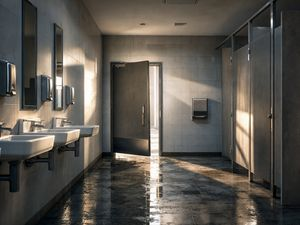

왼쪽부터: **writer 지정 참조 ① 플레이트** · (참고) v1 무효 팔이 이 샷을 T2I로 뽑았던 결과 — 이번 입력 아님, 이 샷이 무엇인지 감 잡는 용도

- **행동**: To create a vacuum of sound and presence, heightening the dread through the sudden emptiness of the space.
- **카메라(writer 산출)**: `{"type":"WS","angle":"eye_level","movement":"static"}` · 구도: The closing door · 무드: Desaturated and hollow, emphasizing the lack of life in the room.

**1단계 · 시작 프레임 생성 (수리된 v6 → i2i)**

- 참조 (writer 지정, `reference_assets` 원문): `["새벽 공중화장실"]` → plate (§3 시딩 기준)
- 넣는 것: 위 참조 + 아래 프롬프트 → `openai/gpt-image-2/edit` (fal, `image_size: landscape_16_9`) — 참조는 **수리된 v6(runShotImages)가 DB에서 스스로 조회**해 첨부, 실험 도구는 개입하지 않음
- 나오는 것: 제품 산출 프레임을 회수해 `assets/arm-origin/frames/19.png` ← **이 파일이 2단계 영상의 입력이 된다**

프롬프트 원문 (`image_prompt`, 무수정):

```
Wide shot of the empty, angular restroom. A heavy door is in the process of swinging shut. The space is filled with hollow silence and sharp shadows. Porcelain sinks and silver soap dispensers reflect the cool dawn light. The color temperature is slightly warmer at 6000K. The floor tiles are wet with a painterly texture.
```

한국어 번역: 텅 빈 각진 화장실의 와이드 샷. 묵직한 문이 닫히는 중이다. 공간은 공허한 정적과 날카로운 그림자로 가득하다. 도기 세면대와 은색 비누 디스펜서가 차가운 새벽빛을 반사한다. 색온도는 6000K로 약간 더 따뜻하다. 바닥 타일은 회화적 질감으로 젖어 있다.

**2단계 · ▶ 영상 API 입력** — Seedance 2.0 · 2.5초 · 16:9 · task `i2v_se`

- 이미지: `arm-origin/frames/19.png` **1장** (1단계 산출. 끝 프레임 없음 — 그게 이 팔의 정의)
- 텍스트 (모션 프롬프트 원문, 무수정):

```
The restroom door swings shut slowly, clicking into place, leaving the room completely still.
```

- 한국어 번역: 화장실 문이 천천히 닫히며 딸깍 잠기고, 방은 완전한 정적에 잠긴다.
- 산출: `clips/arm-origin/19.mp4`

<details><summary>jobs.origin.json 조각</summary>

```json
{
  "id": "origin_19",
  "task": "i2v_se",
  "prompt": "The restroom door swings shut slowly, clicking into place, leaving the room completely still.",
  "image": "arm-origin/frames/19.png",
  "seconds": 2.5,
  "aspect": "16:9",
  "out": "clips/arm-origin/19.mp4"
}
```
</details>

### 샷 20 — shot_20 · 4초 → `clips/arm-origin/20.mp4`

  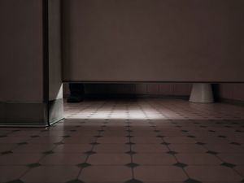

왼쪽부터: **writer 지정 참조 ① 정본(girl)** · **writer 지정 참조 ② 플레이트** · (참고) v1 무효 팔이 이 샷을 T2I로 뽑았던 결과 — 이번 입력 아님, 이 샷이 무엇인지 감 잡는 용도

- **행동**: To deliver the final chilling revelation that the original girl is still there, discarded and forgotten.
- **카메라(writer 산출)**: `{"type":"CU","angle":"low_angle","movement":"dolly_in"}` · 구도: The white crew socks and black Mary Jane heels · 무드: The warmest but most ominous tone, with deep shadows creeping from the stall.

**1단계 · 시작 프레임 생성 (수리된 v6 → i2i)**

- 참조 (writer 지정, `reference_assets` 원문): `["girl","새벽 공중화장실"]` → identity_ref + plate (§3 시딩 기준. 07-24판 사람 표는 "플레이트만"이었으나 writer는 girl을 지정 — 구도의 양말·구두와 정합, writer 실측을 따름)
- 넣는 것: 위 참조 + 아래 프롬프트 → `openai/gpt-image-2/edit` (fal, `image_size: landscape_16_9`) — 참조는 **수리된 v6(runShotImages)가 DB에서 스스로 조회**해 첨부, 실험 도구는 개입하지 않음
- 나오는 것: 제품 산출 프레임을 회수해 `assets/arm-origin/frames/20.png` ← **이 파일이 2단계 영상의 입력이 된다**

프롬프트 원문 (`image_prompt`, 무수정):

```
Close-up, low-angle shot focusing on the narrow gap beneath a bathroom stall door. The floor is tiled in a geometric pattern with a subtle pinkish hue. The lighting is soft and dim at 5600K, casting long shadows. The edges of the stall door are sharp and clean. The atmosphere is thick with dread.
```

한국어 번역: 화장실 칸막이 문 아래의 좁은 틈에 초점을 맞춘 로우앵글 클로즈업. 바닥은 은은한 분홍빛이 도는 기하학적 패턴의 타일이다. 조명은 5600K로 부드럽고 어둑하며 긴 그림자를 드리운다. 칸막이 문의 모서리는 날카롭고 깔끔하다. 공기는 공포로 짙게 가라앉아 있다.

**2단계 · ▶ 영상 API 입력** — Seedance 2.0 · 4초 · 16:9 · task `i2v_se`

- 이미지: `arm-origin/frames/20.png` **1장** (1단계 산출. 끝 프레임 없음 — 그게 이 팔의 정의)
- 텍스트 (모션 프롬프트 원문, 무수정):

```
The camera slowly dollies forward toward the stall gap, revealing the motionless white-socked feet of the original girl.
```

- 한국어 번역: 카메라가 칸막이 아래 틈을 향해 천천히 달리 인 하며, 미동 없는 원래 소녀의 흰 양말 신은 발을 드러낸다.
- 산출: `clips/arm-origin/20.mp4`

<details><summary>jobs.origin.json 조각</summary>

```json
{
  "id": "origin_20",
  "task": "i2v_se",
  "prompt": "The camera slowly dollies forward toward the stall gap, revealing the motionless white-socked feet of the original girl.",
  "image": "arm-origin/frames/20.png",
  "seconds": 4,
  "aspect": "16:9",
  "out": "clips/arm-origin/20.mp4"
}
```
</details>

---

## 6. 실행 스펙

### 6-1. 실행 절차 (B안)

07-24판(A안)의 모조 스테이징 도구 사양(tools/stage_origin.mjs)은 **폐기**한다. 실행은 다음 4단계다:

1. **선행 수리** — §2(I9) 구현: `v6_images.ts` 매니페스트 로드를 DB 조립 + 레거시 폴백으로 교체 (제품 코드 수정).
2. **정본 시딩** — §3: `tools/seed_canon.mjs`로 girl/doppelganger `view_main` = identity_ref, 새벽 공중화장실 `wide_shot` = plate 등록 (upsert, 멱등).
3. **이미지 스테이지 재실행** — 기존 vitest 하네스 패턴(전례: [../2026-07-23_full-copy-bundle/tools/run-writer-base.test.ts](../2026-07-23_full-copy-bundle/tools/run-writer-base.test.ts))으로 `runShotImages`만 재호출. projectId `2026-07-23_14-25-51_bzb8` 고정 — writer 파이프라인은 resume 캐시라 **LLM 재호출 없음**, 이미지 스테이지만 돈다.
4. **프레임 회수 → 영상 발사** — 제품 산출 프레임 20장을 `assets/arm-origin/frames/NN.png`로 회수하고 `jobs.origin.json`을 생성한 뒤, QC 게이트(§7) 통과 후 디스패처 발사(아래 6-3).

**배선 검증 포인트**: 3단계 실행 로그의 model이 `openai/gpt-image-2/edit`로 찍히면 수리 성공이다. (무효 BASE 실행 때는 T2I `openai/gpt-image-2`로 찍혔다 — 이 로그 한 줄이 두 팔의 배선 차이를 증명한다.)

재시도 규칙: 콘텐츠 차단(422 content_policy_violation)은 동일 입력 최대 4회, 그 외 오류는 2회. 4회 차단 시 Ⓑ 분류·해당 샷 제외 후 계속 (shot_2 특례 — §4).

### 6-2. jobs.origin.json 스키마

실험 루트의 `jobs.origin.json`은 §5의 20개 조각의 배열이다(전례: [../2026-07-23_full-copy-bundle/jobs.base.json](../2026-07-23_full-copy-bundle/jobs.base.json)). 필드:

| 필드 | 값 | 설명 |
|---|---|---|
| `id` | `origin_01` ~ `origin_20` | 팔 접두사 + 샷 번호 |
| `task` | `"i2v_se"` | 시작 프레임 I2V. `end_image` 미지정 = 끝 프레임 없음 |
| `prompt` | video_prompt 원문 | shots.json에서 무수정 복사 |
| `image` | `arm-origin/frames/NN.png` | `--assets` 디렉토리 기준 상대경로 |
| `seconds` | `duration_seconds` 그대로 | 2 ~ 7 (아래 클램프 주의 참조) |
| `aspect` | `"16:9"` | 전 샷 공통 |
| `out` | `clips/arm-origin/NN.mp4` | `--assets` 디렉토리 기준 상대경로 |

seconds 클램프 주의: 힉스필드 레인 디스패처(`utils/tools/gen/providers/higgsfield.mjs`)는 `i2v_se`에서 duration을 `min 4 · max 15 · 반올림`으로 클램프한다. 즉 4초 미만 9개 샷(04·07·09·10·14·15·17·18·19)은 실제로 4초 클립으로 돌아온다. 이는 BASE 팔(19/19 완주)과 동일한 처리라 팔 간 비교에는 영향이 없고, 편집 없음 원칙에 따라 반환 길이 그대로 이어붙인다.

### 6-3. 영상 디스패치 커맨드

프레임 20장이 QC 게이트(§7)를 통과한 뒤 발사:

```bash
node research/experiments/utils/tools/gen/dispatch.mjs \
  --jobs research/experiments/continuity-copy/2026-07-24_full-copy-v2/jobs.origin.json \
  --assets research/experiments/continuity-copy/2026-07-24_full-copy-v2/assets \
  --mode higgsfield --hf-concurrency 4 --hf-cap 80
```

### 6-4. 예산 추정

| 항목 | 추정 | 근거 |
|---|---|---|
| 영상 (힉스필드) | 74초 × 4.6크레딧/초 ≈ **340크레딧** | 총 duration_seconds 74초 기준 |
| 영상 상한 (클램프 반영) | 최대 86초 ≈ **396크레딧** | 4초 미만 9개 샷이 4초로 클램프될 경우의 생성 초수 상한 |
| 이미지 (수리된 v6 경유, fal 별도 과금) | **20콜 + 재시도 여유** (상한 40콜) | i2i 20 (writer 지정 참조로 전 샷 edit 레인), shot_2 최대 4회 재시도 + QC 재생성 여유 |

---

## 7. QC 게이트 — 발사 전 프레임 검수

영상 디스패치 전, 프레임 20장 전수 검수. 4항목:

1. **신원 정본 대조** — writer가 인물 참조(girl/doppelganger)를 지정한 15개 샷에서, 프레임에 나타난 인물의 얼굴·검은 단발·은색 초커·연파랑 새틴 드레스·흰 양말을 identity_ref와 대조. 2인 샷(11·12·14)은 두 인물 모두.
2. **시선 방향** — composition·character_action이 지정한 응시 방향(거울 응시, 렌즈 정면 응시, 배수구 하향 등)과 프레임의 실제 시선 일치 여부.
3. **소품 접촉** — 립글로스·메리제인 힐·팔 붙잡기 등 프롬프트가 명시한 손·신체와 소품의 접촉 상태가 프레임에서 성립하는지.
4. **구도** — camera(type·angle)와 composition 필드 대비 실제 프레임 구도(WS/MS/CU/ECU 스케일, 하이/로우 앵글, 프레임 내 배치) 일치 여부.

### ORIGIN 팔의 QC 원칙 (측정 오염 방지)

ORIGIN은 "제품 자생" 실력 측정이다. 따라서 QC 탈락 시 허용되는 조치는 **동일 입력 재생성(같은 프롬프트 + 같은 참조 = 동일 이미지 스테이지 재실행)뿐이다.** 프롬프트 수기 보정·참조 추가/교체·수동 리터치는 전면 금지 — 사람 손이 한 번이라도 들어가면 측정 대상이 "제품"에서 "제품+사람"으로 바뀌어 측정이 오염된다. (§3 정본 시딩은 artist 산출 대행이므로 예외 — 제품 정의 안의 입력이다.) 재생성 반복 후에도 탈락이면 마지막 산출을 그대로 쓰고 결함을 결과 문서에 기록한다 — 제품의 실패도 이 팔에서는 데이터다.

---

## 열린 결정 (오너 확인 대기)

1. **QC 재생성 상한**: 샷당 재생성 횟수 상한(제안: 2회, 콜 상한 40 내). 초과 시 마지막 산출 채택 + 결함 기록.

(07-24판의 열린 결정이었던 shot_10 프레임 재사용·shot_20 참조 선정은 B안 전환으로 **소멸** — 참조 선택이 제품(writer + 수리된 v6) 몫이 되어 사람이 결정할 대상이 아니다.)
