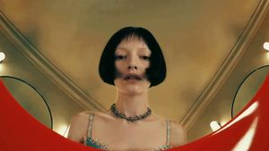
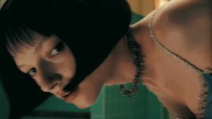
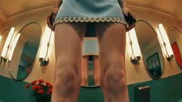
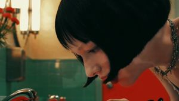
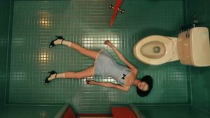
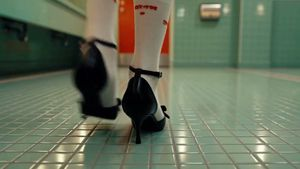
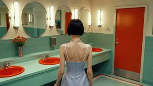
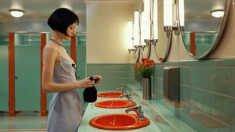

# 도입 몽타주 실험 — 빨리감기는 생성인가 편집인가

> **한 줄**: 원본 도입 0~5.8초는 1초 안팎 플래시 컷 8개의 **빨리감기 몽타주**다. 컷별 생성→편집
> 재현은 v1에서 붕괴가 확인됐고(무효 사유 ②), v2 BKM2는 도입 전용 생성을 제거했다(오너 확정
> 2026-07-24). 남은 질문 하나를 여기서 잰다: **몽타주를 통째로 만드는 세 경로(편집 배속 /
> 원샷 몽타주 생성 / 멀티샷 파라미터) 중 어느 것이 원본 질감에 닿는가.**
>
> 설계일 2026-07-24 · 선행: [full-copy-v2](../2026-07-24_full-copy-v2/design.md) ·
> v1 β-프로브(멀티샷 정찰, 미실행)의 승격 · 상태: **오너 확인 대기**

## 1. 왜 별개 실험인가

- **질문이 다르다.** BKM2의 질문은 "사람 연출 지시가 컷별 재현에서 제품을 이기는가"이고, 이
  실험의 질문은 "**모델이 컷 전환(몽타주)을 한 번의 생성으로 만들 수 있는가**"다. 질문이 다르면
  폴더를 쪼갠다(CONVENTIONS 규칙 3).
- **관찰 근거**: 오너 관찰(2026-07-24) — "초반 빨리감기 부분은 영상 생성으로 모방이 힘들다."
  v1은 플래시 컷마다 독립 테이크를 생성해 도입이 붕괴했고, v2 BKM2는 후반 테이크 재사용으로
  4컷(s01·s02·s04·s05)만 채운다. 나머지 4컷(s03·s06·s07·s08)은 입장 장면이 도입에만 존재해
  후반 재료로 못 채우는 **슬롯**으로 남았다 — 이 실험의 산출이 그 슬롯을 채운다.

## 2. 대상 구간 — 원본 도입 8컷 (0~5.77초)

   

   

왼쪽 위부터 s01~s08 원본 시작 프레임 (분석·판정 대조용 — **생성 입력 아님**):

| 컷 | 구간(s) | 길이 | 내용 |
|---|---|---|---|
| s01 | 0.00~0.37 | 0.4 | 세면대 림 너머 얼굴 CU (광각, 위에서) |
| s02 | 0.37~0.63 | 0.3 | 몸 숙인 얼굴 로우앵글 CU |
| s03 | 0.63~1.20 | 0.6 | 거울벽 앞 하반신 — 치맛단 들어올리는 손 (어안, 정강이 높이) |
| s04 | 1.20~1.50 | 0.3 | 세면대 위로 숙인 얼굴 측면 CU |
| s05 | 1.50~1.63 | 0.1 | **변기 옆 쓰러진 소녀 탑뷰** (s28 프리뷰 플래시) |
| s06 | 1.63~2.73 | 1.1 | 타일 바닥 걷는 구두 CU |
| s07 | 2.73~3.87 | 1.1 | 거울벽 뒷모습 미디엄 (문 보임) |
| s08 | 3.87~5.77 | 1.9 | 카운터 옆 전신 프로필 — 립글로스 파우치 개봉 |

특징: 하드 컷 8회, 컷 내부 모션은 배속(빨리감기) 질감, s05는 결말의 0.1초 플래시 프리뷰.

## 3. 팔 구성 (3경로)

| 팔 | 정의 | 생성 콜 |
|---|---|---|
| **M-A 편집 배속** | BKM2 테이크 재료를 2~4배속 + 플래시 컷으로 도입 리듬 재현. "빨리감기 = 편집 효과" 가설의 눈금. 커버 불가 4컷은 결손인 채 둔다(그 결손 크기가 이 팔의 측정값) | **0** |
| **M-B 원샷 몽타주** | 시작 프레임 1장 + "하드 컷 8연속 몽타주" 프롬프트 → Seedance 2.0 1콜 6초. 프롬프트만으로 컷 전환을 만들 수 있는지 | i2v 1 (+i2i 최대 1) |
| **M-C 멀티샷 파라미터** | Seedance 멀티샷 모드(`multi_shots`, v1 설계에서 실측 존재 확인)에 8컷 지시 목록 투입. 모델이 컷 편집을 네이티브 기능으로 지원하는지 | i2v 1~2 |

## 4. 페이로드

### 4-1. 공통 — 8컷 지시 원문 (M-B 프롬프트 본체 · M-C 컷 목록 공용)

```
A rapid flash-cut opening montage, edited like fast-forwarded footage: eight very short hard-cut shots, each well under one second, no transitions, no morphing between shots — every cut is an instant switch to a new camera setup in the same retro pastel restroom. Shot order: (1) ultra-wide extreme close-up of her face from inside the orange sink looking up over the rim; (2) low-angle close-up of her face as she bends forward; (3) knee-height wide of her legs and skirt hem in front of the mirror wall, her hands lifting the hem; (4) side close-up of her face leaning over the sink toward the faucet; (5) a single-instant top-down flash of the same girl lying motionless beside a toilet; (6) close-up of black mary-jane heels walking across the tile floor; (7) medium shot of her back at the mirror wall, the entrance door visible in the mirror; (8) full-body profile beside the counter as she takes out a small lip-gloss pouch. All motion inside each shot slightly sped up, like fast-forwarded morning-routine footage. Hard cuts only.
Context: An opening montage previewing her restroom routine — with one wrong frame that does not belong (the lying girl).
Continuity bible (LOCKED): the same young woman (black lip-length bob with wispy bangs, layered silver charm choker, pale blue satin slip dress with white daisy lace trim, white crew socks, black mary-jane heels); wardrobe and hairstyle never change. Location: retro pastel public restroom — mint-green tiles, orange-red round sinks on a mint counter, large round mirrors with vertical tube lights, red-orange stall doors. Light: warm fluorescent from above the mirrors, constant, same time of day. Signature props: small lip-gloss wand; chrome drain. Genre mood: quiet thriller — calm, uncanny stillness.
Never: wardrobe or hairstyle change, shadow direction flip, day/night jump, extra people beyond those specified, duplicate faces beyond those specified, plastic skin, morphing hands, on-screen text, watermark.
```

한국어 번역: *빨리감기 푸티지처럼 편집된 급속 플래시 컷 오프닝 몽타주: 각각 1초를 훨씬 밑도는
하드 컷 샷 8개, 트랜지션 없음, 샷 사이 모핑 없음 — 모든 컷은 같은 레트로 파스텔 화장실 안에서
새 카메라 셋업으로의 순간 전환이다. 샷 순서: (1) 주황 세면대 안에서 림 너머로 올려다본 얼굴의
초광각 익스트림 클로즈업 (2) 몸을 앞으로 숙이는 얼굴의 로우앵글 클로즈업 (3) 거울벽 앞 다리와
치맛단의 무릎 높이 와이드, 치맛단을 들어올리는 손 (4) 수전 쪽으로 세면대 위로 숙인 얼굴 측면
클로즈업 (5) 변기 옆에 미동 없이 누워 있는 같은 소녀의 탑다운 한순간 플래시 (6) 타일 바닥을
걷는 검은 메리제인 힐 클로즈업 (7) 거울벽 앞 뒷모습 미디엄, 거울에 입구 문이 보임 (8) 카운터
옆 전신 프로필, 작은 립글로스 파우치를 꺼낸다. 모든 샷 내부 모션은 빨리감기한 아침 루틴
푸티지처럼 약간 배속. 하드 컷만. / 맥락: 그녀의 화장실 루틴을 미리 보여주는 오프닝 몽타주 —
어울리지 않는 잘못된 프레임 하나(누운 소녀)와 함께. / 연속성 바이블(잠금): 동일한 젊은 여성
(검은 턱선 단발·잔머리, 은색 참 레이어드 초커, 흰 데이지 레이스 트림의 페일블루 새틴 슬립
드레스, 흰 크루 양말, 검은 메리제인 힐); 의상·헤어 불변. 장소: 레트로 파스텔 공중화장실 —
민트그린 타일, 민트 카운터 위 주황-빨강 원형 세면대, 세로 튜브 조명의 큰 원형 거울, 주홍
칸막이 문. 조명: 거울 위 웜톤 형광, 일정, 같은 시각. 시그니처 소품: 작은 립글로스 완드, 크롬
배수구. 장르 무드: 조용한 스릴러 — 차분하고 섬뜩한 정적. / 금지: 의상·헤어 변경, 그림자 방향
반전, 낮밤 점프, 지정 외 인물 추가, 지정 외 얼굴 복제, 플라스틱 피부, 뭉개지는 손, 화면 내
텍스트, 워터마크.*

(주: 공통 네거티브에서 "지시 외 카메라 무브 금지" 항목은 **의도적으로 제외** — 컷 전환 자체가
이 실험의 측정 대상이라 넣으면 자기모순.)

### 4-2. M-B 시작 프레임

기본: **BKM2 T05 시작 프레임 재사용** (`../2026-07-24_full-copy-v2/assets/arm-bkm2/frames/T05_start.jpg`,
s13=s01 동일 구도 확인됨 — BKM2 스테이징 후 실행 시 추가 콜 0).
BKM2보다 먼저 실행할 경우 대안: 정본+플레이트 i2i 1콜로 s01 구도(위 8컷 지시의 (1)번 구도 문장
그대로) 프레임을 자체 생성.

### 4-3. 잡 정의

```json
[
  { "id": "mb_montage", "task": "i2v", "prompt": "<§4-1 전문>", "image": "frames/mb_start.jpg", "seconds": 6, "aspect": "16:9", "out": "clips/mb_montage.mp4" }
]
```

M-C는 힉스필드 Seedance의 `multi_shots` 파라미터 스키마를 **실측 후** 잡 형식 확정
(공용 디스패처가 미지원이면 힉스필드 CLI 직접 호출 — 실측 결과를 이 문서에 추가하고 확정).
컷 지시 내용은 §4-1의 8컷 목록을 그대로 옮긴다.

M-A는 생성 없음 — BKM2 클립 완성 후 ffmpeg 배속(setpts)+컷 편집. 재료 의존성: BKM2 스테이징·생성 완료.

## 5. 판정 (사전 고정)

오너 육안 — 원본 도입(0~5.77초)과 나란히, 팔별 3항목:

1. **컷 전환 성립** — 하드 컷이 실제로 발생하는가, 모핑/디졸브로 뭉개지는가 (M-B·M-C의 본질 질문)
2. **빨리감기 질감** — 배속 모션 느낌이 재현되는가
3. **세계관·신원 유지** — 8컷이 같은 화장실·같은 인물로 보이는가 (v1 붕괴 원인의 재검)

**합류 규약**: 합격 팔의 산출을 [full-copy-v2](../2026-07-24_full-copy-v2/design.md) BKM2 조립본의
도입 슬롯(s03·s06·s07·s08 결손 4.7초 또는 도입 전체 0~5.8초)에 삽입한다. 전 팔 불합격이면
BKM2 도입은 재사용 4컷+결손으로 판정에 들어가고, 도입 구간 순위는 그 상태를 명시하고 매긴다.

## 6. 예산

| 팔 | 콜 | 크레딧 |
|---|---|---|
| M-A | 0 | 0 |
| M-B | i2v 6s ×1 (+i2i 1, fal 별도) | ~28 |
| M-C | i2v 6s ×1~2 | ~28~55 |
| **합계** | | **~85 미만** |

## 7. 순서

BKM2 스테이징 완료(T05 프레임 확보) → M-B·M-C 발사 → BKM2 클립 완성 후 M-A 편집 →
3팔 vs 원본 도입 나란히 판정 → 합격 산출 BKM2 조립 합류.
