# E11 — 이미지 생성기에 줄 렌더 문장, 한국어가 나은가 영어가 나은가

> **한 줄 결론: 블라인드로 채점한 그림 10쌍 중 영어가 6승으로 방향성 있게 우세했다.** 그런데 이보다
> 더 중요한 사실이 실험 준비 중에 드러났다 — 지금은 어느 언어를 쓸지 아예 정해두지 않아서, 같은
> 파이프라인이 실행마다 다른 언어를 골라 쓰고 있다는 것이다. 영어를 정본으로 못박는 쪽을 권고하되,
> 최종 판정은 제품 오너 몫으로 남긴다.
>
> 실행일 2026-07-21 · ✅ 판정(2026-07-22 밤): **영어 정본 채택** — 렌더 문장 생성 언어를 영어로 명시
> 고정(집행). 표시용 한국어 파생 역전은 후속 검토. 기술 재현 정보는 맨 아래 부록.

## 1. 무엇이 궁금했나

writer 파이프라인의 마지막 단계들은 한 샷마다 "렌더 문장" — 이미지 생성기에 그대로 넘길 장면 묘사
문장 — 을 만든다. 이 문장을 한국어로 쓸지 영어로 쓸지는 지금 명세돼 있지 않다. 알고 싶었던 것은
단순하다: **똑같은 장면 설명을 한국어로 준 그림과 영어로 준 그림 중, 어느 쪽이 원래 의도한 장면에
더 충실하게 나오는가?**

만약 한쪽이 명백히 낫다면 그 언어를 파이프라인의 정본으로 못박아야 하고, 비슷하다면 다른 기준(속도,
비용)으로 골라도 된다.

## 2. 무엇을 넣었나 — 입력 원문

브랜드 광고(러너가 새벽 골목을 달리는 30초 영상)의 샷 10개짜리 렌더 문장을 그대로 썼다. 실험 준비
중 확인해보니 이 문장들은 **이미 영어로 만들어져 있었다** — 그래서 이 영어 원문을 기준으로, 뜻을
그대로 살린 한국어 역번역을 한 쌍씩 만들어 비교했다(같은 명세를 언어만 바꿔 비교하는 것이 목적이라,
"자연발생 한국어 프롬프트"와는 다를 수 있다는 점은 각주로 남긴다).

**1번 샷 — 영어 원문**

> A vertical 9:16 cinematic shot of a narrow, empty urban alleyway at dawn. The ground is wet
> asphalt reflecting a single flickering amber streetlight. The atmosphere is humid and dark,
> dominated by deep slate blue tones. The walls are aged stone, and the overall mood is quiet
> and isolated, following a photorealistic cinematic realism style.

**1번 샷 — 한국어 역번역**

> 세로 9:16 비율의 시네마틱 샷. 새벽의 좁고 텅 빈 도심 골목. 바닥은 젖은 아스팔트로 깜빡이는
> 하나의 호박색 가로등 불빛을 반사한다. 분위기는 습하고 어두우며, 짙은 슬레이트 블루 톤이 지배적이다.
> 벽은 오래된 석재이며, 전체적인 무드는 고요하고 고립된 느낌으로, 포토리얼리즘 시네마틱 리얼리즘
> 스타일을 따른다.

## 3. 어떻게 실험했나

- 10개 샷 × 2언어 = **정확히 20장**을 실제 이미지 생성 서비스로 만들었다(실패 0장). 영상용 생성은
  이번 1차 실험에서는 제외했다.
- **블라인드 쌍대 판정**: 판정자는 그림 두 장이 각각 X, Y로만 표시된 상태로 받는다 — 어느 것이
  한국어산이고 어느 것이 영어산인지 채점이 끝날 때까지 모른다. 채점이 다 끝난 뒤에야 X/Y가 실제로
  어느 언어였는지 공개한다(뒤바꿔 채점하는 편향을 막기 위한 절차).
- **채점 기준은 실행 전에 고정**: (a) 명세 충실도 1~5점 + (b) 이미지 품질 1~5점을 더해 합계(최대
  10점)를 낸다. 합계가 높은 쪽이 승, 같으면 무승부.

## 4. 무엇이 나왔나 — 출력 원문

**샷별 판정표** (합계 = 명세 충실도 + 이미지 품질, 각 최대 5점씩)

| 샷 | 한국어 합계 | 영어 합계 | 승자 |
|---|---|---|---|
| 1 | 9 (충실도4+품질5) | 10 (충실도5+품질5) | 영어 |
| 2 | 10 (충실도5+품질5) | 9 (충실도4+품질5) | 한국어 |
| 3 | 9 (충실도4+품질5) | 8 (충실도3+품질5) | 한국어 |
| 4 | 9 (충실도4+품질5) | 10 (충실도5+품질5) | 영어 |
| 5 | 8 (충실도4+품질4) | 9 (충실도4+품질5) | 영어 |
| 6 | 9 (충실도4+품질5) | 9 (충실도4+품질5) | 무승부 |
| 7 | 9 (충실도4+품질5) | 10 (충실도5+품질5) | 영어 |
| 8 | 9 (충실도4+품질5) | 10 (충실도5+품질5) | 영어 |
| 9 | 9 (충실도5+품질4) | 9 (충실도4+품질5) | 무승부 |
| 10 | 9 (충실도4+품질5) | 10 (충실도5+품질5) | 영어 |

**합계: 영어 6승 · 한국어 2승 · 무승부 2** — 표본 10쌍 기준으로 방향성 있는 우위이나 압승은 아니다.
영어가 이긴 샷들의 공통점은 배경 흐림·고대비 조명·표정 지시 같은 문자적 디테일이 더 정확히
반영됐다는 것. 한국어가 이긴 2건은 색감 재현이 더 낫게 나온 경우로, 생성 자체의 무작위성 영향으로
보인다.

| 샷 | 한국어산 | 영어산 | 승자 |
|---|---|---|---|
| 1 |  | 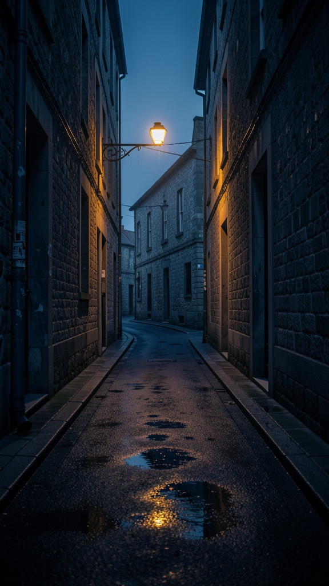 | 영어 |
| 2 | 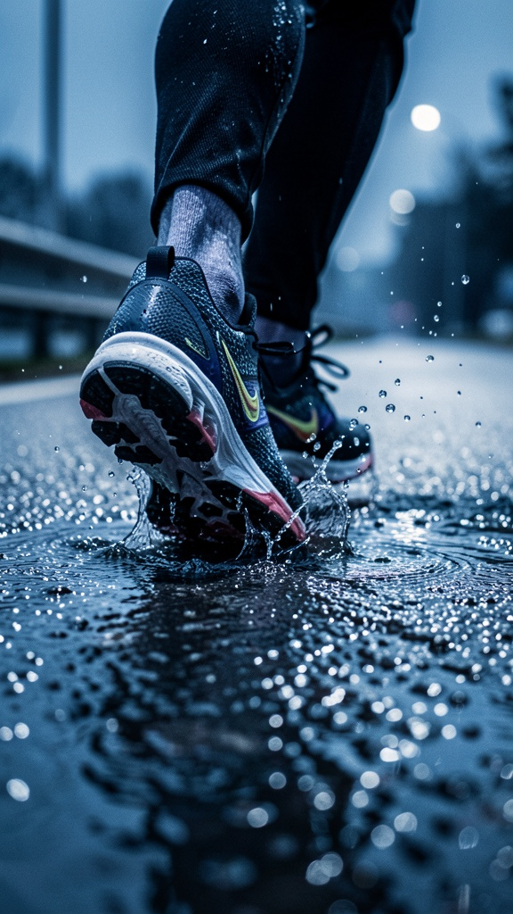 | 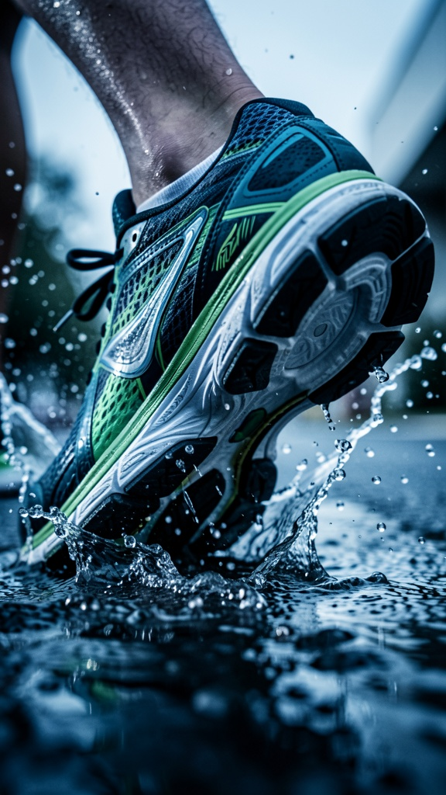 | 한국어 |
| 3 | 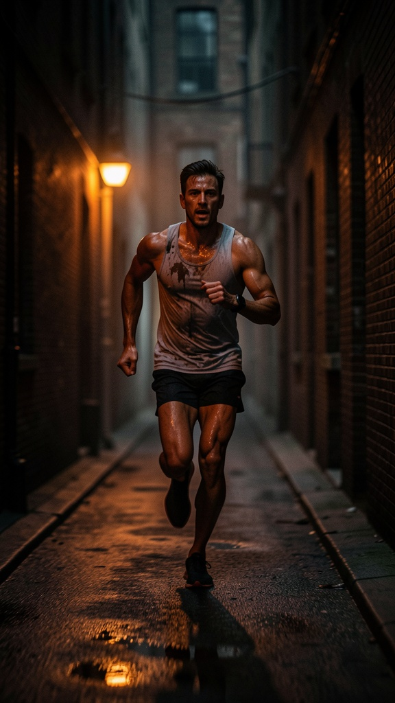 |  | 한국어 |
| 4 | 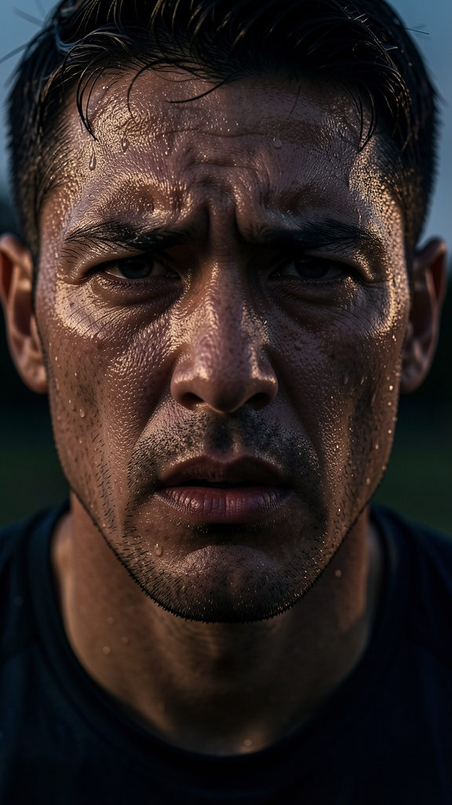 | 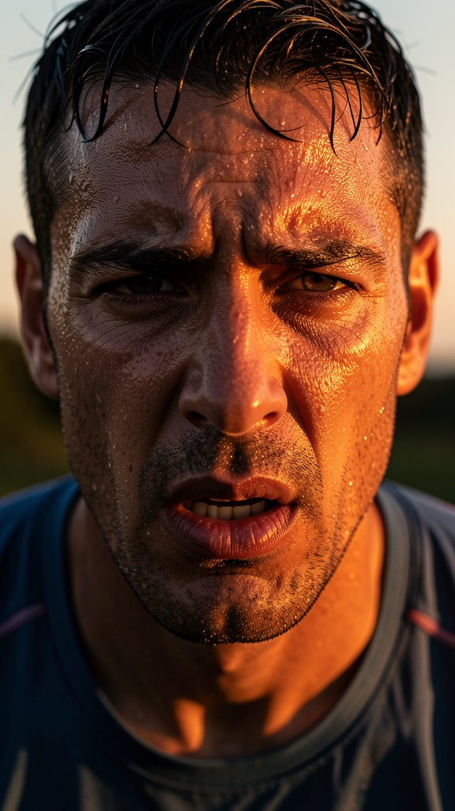 | 영어 |
| 5 | 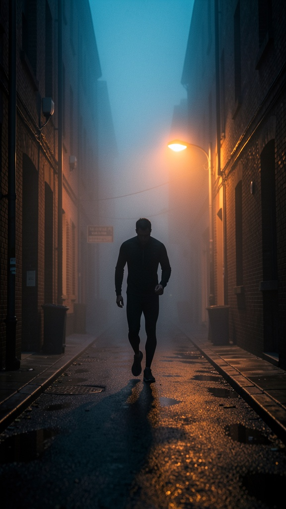 |  | 영어 |
| 6 | 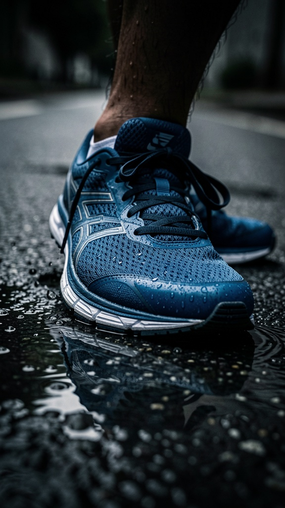 | 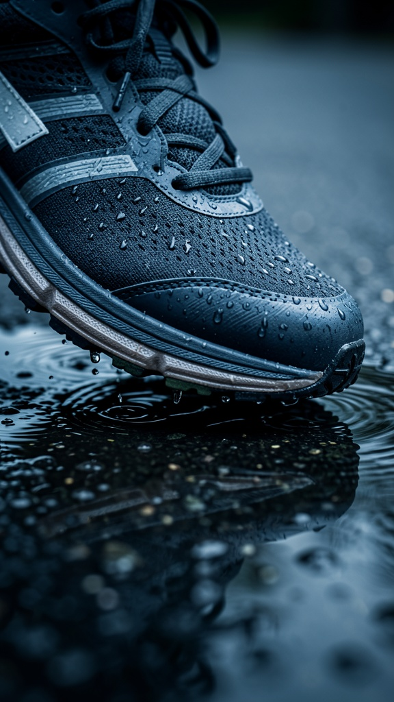 | 무승부 |
| 7 |  |  | 영어 |
| 8 | 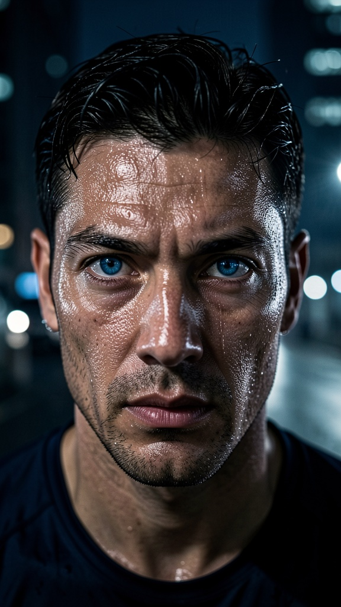 | 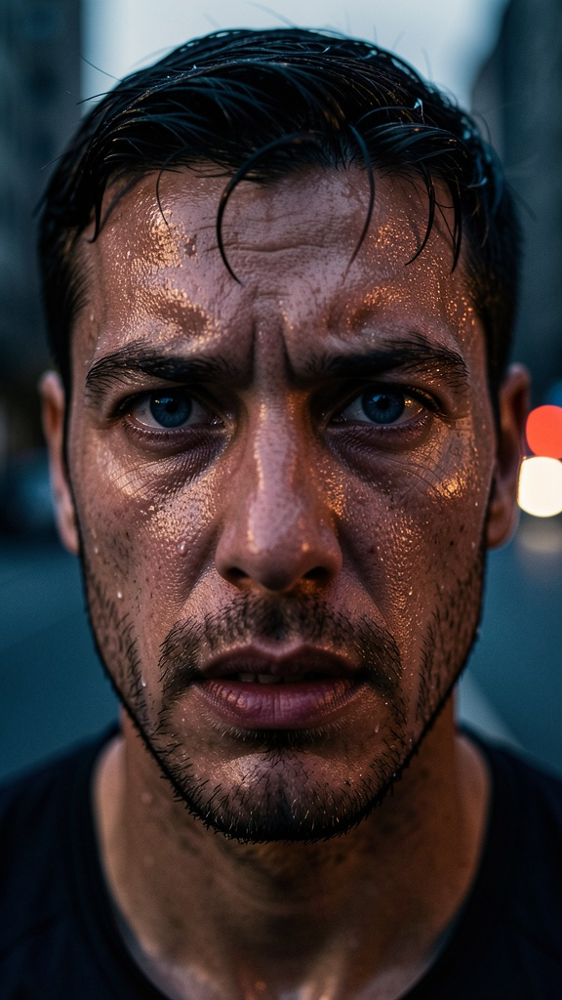 | 영어 |
| 9 |  |  | 무승부 |
| 10 |  |  | 영어 |

이미지 갤러리는 `assets/` 폴더에 있다. 파일명 규칙은 `shot{번호}_en.jpg` /
`shot{번호}_ko.jpg`(예: `shot1_en.jpg`, `shot1_ko.jpg`)다.

### 부수 발견 (이번 실험의 최대 소득)

렌더 문장을 준비하다가, 실제 운영 산출물(광고 프리셋의 검수 단계 로그)을 들여다보니 이미 다음이
확인됐다.

- 10개 샷의 렌더 문장(`composition_prompt` 필드) **10/10이 이미 영어**로 나와 있었다. 예:
  `"A vertical 9:16 cinematic shot of a narrow, empty urban alleyway at dawn..."`
- 그런데 같은 산출물의 다른 필드(`character_action` — 인물이 씬에서 하는 행동 요약)는 샷마다
  한국어/영어가 뒤섞여 있었다. 실제 값을 보면 1~4번 샷은 영어(`"Sets the mood of isolation and the
  'quiet before the storm' of the workout."`), 5번 샷부터는 한국어(`"공간의 고립감과 캐릭터의
  육체적 한계를 시각화"`)로 같은 실행 안에서 언어가 바뀌었다.
- 렌더 문장을 만드는 코드(샷 설계 단계) 안에는 "이 필드는 영어로 써라" 같은 언어 지시가 아예 없다는
  것도 코드에서 직접 확인했다(검색 결과 0건).

즉 지금 상태는 "언어를 한국어에서 영어로 바꿀까"의 문제가 아니라, **"언어가 아예 무통제 상태" —
같은 입력을 넣어도 실행마다 모델이 알아서 언어를 고르고 있다**는 것이 실태다. 렌더 품질을 비교하기
전에, 어느 언어를 쓰든 그 선택을 명시적으로 지시하는 것 자체가 먼저 필요한 결함이다.

## 5. 결론과 권고 (판정은 보류)

**영어를 정본으로 채택하는 쪽을 권고한다.** 근거는 세 가지가 겹친다.

1. 블라인드 채점 6:2:2 — 방향성 있는 우위.
2. 운영 실태가 이미 사실상 영어로 굳어져 있음(부수 발견).
3. 표시용 한국어를 영어에서 파생시키는 방향으로 뒤집으면, 지금 저장 단계에서 한국어 파생을 만들기
   위해 걸리는 추가 호출(40~60초)을 줄일 수 있음.

채택 시 바뀌어야 할 것: 샷 설계·렌더 문장 생성 단계에 "출력은 영어로" 명시 지시를 추가하고, 표시용
한국어는 영어에서 파생되는 쪽으로 방향을 뒤집는다(지금은 반대 방향으로 설계돼 있음).

**어느 쪽으로 판정이 나든 상관없이 즉시 필요한 것 하나**: 지금의 언어 무통제 상태 자체는 결정론
결함이다(같은 입력의 산출 언어가 실행마다 달라질 수 있음) — 이건 이번 판정과 독립적으로 고쳐야
한다. 방치하면 나중에 이미지 생성 모델을 바꿀 때 언어가 조용히 바뀌어버릴 위험이 있다.

---

## 기술 부록 (재현용)

- 이미지 생성: `fal-ai/flux-2/klein/9b`(제품 실배선 T2I) × 광고 프리셋 10샷 × 한/영 = 20장, 실패 0
- 실행: 서브에이전트(Sonnet, fal 실생성 + 비전 블라인드 판정) / 셋업: Claude(Fable)
- 판정: 무작위 라벨 블라인드 쌍대(판정 종료 후 매핑 공개), 루브릭 고정 기록(명세 충실도 1~5 + 품질 1~5)
- 관련 코드: 렌더 문장 생성(`v4_shots.ts`, `v5_prompts`), 언어 무통제 근거 로그:
  `logs/writer-stage-exp/ad__shotCheck__e12bF1.json`(샷 검수 단계, c_application_2)
- 원시: `research/experiments/render-language/2026-07-21_ko-vs-en/assets/`(프롬프트 `prompts.json`, 판정
  `verdicts.json`, 블라인드 매핑 `mapping.json`, 생성 로그 `generation_log.json`, 이미지 20장)
- 독트린 연결: 언어 무통제는 결정론 결함 계열(P2) — 판정과 독립적으로 즉시 수정 후보
