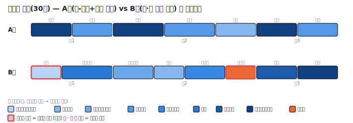
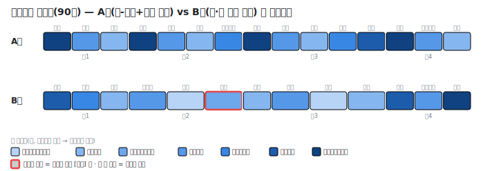
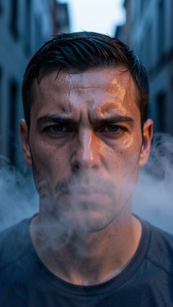
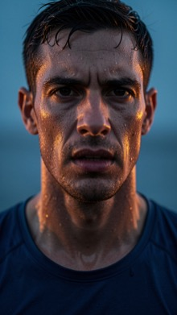
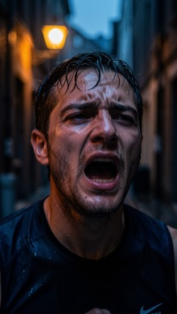
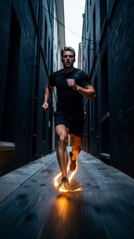
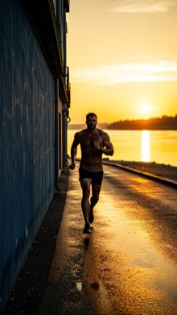

# E9b — 씬을 두껍게 쓰고 샷은 기계가 집행할까, 씬과 샷을 한 번에 그릴까

> **한 줄 결론: 목표 분량·샷 수·샷 길이 세 가지 최우선 지표에서 두 방식은 사실상 동률이다(둘 다 완벽에 가깝다).**
> **갈림길은 딴 데 있다 — "기계 집행"은 러닝타임·샷 수를 코드가 100% 보증하고 더 빠르지만 화면이 단조롭고,**
> **"한 번에 그리기"는 샷마다 연출 의도가 살아 있어 화면이 풍부한 대신 그 통제를 모델의 선의에 맡긴다.**
>
> 실행일 2026-07-22 · 🟠 판정 보류 + 재실험 파생 · 기술 재현 정보는 맨 아래 부록.
>
> **오너 확인 (2026-07-22 밤)**: 이 실험의 A안("샷 집행을 코드가")은 오너의 구상과 달랐다 — 구상은
> "씬 설계를 **더 좋은 모델**로 두껍게 쓰고, 샷 생성은 현행급 AI가 집행"(B안도 상위 모델 전제)이었다.
> 모델 티어를 반영한 재실험 **E9c**로 이어지며, "샷들이 컷 편집 수준으로 뚝뚝 끊긴다"는 연출 연속성
> 문제는 별도 실험 **E9d**로 분리됐다.

## 1. 무엇이 궁금했나

짧은 영상 하나를 만들 때 writer는 "이 이야기를 몇 개의 장면으로 나눌지" 정한 다음, 각 장면을 "몇 개의
샷으로 어떻게 찍을지" 정한다. 이 장면↔샷 접합부를 어떻게 설계하느냐를 두고 두 철학이 맞붙었다.

- **A안 (씬이 권위를 가진다)**: 장면을 아주 두껍게 쓴다 — 각 장면이 자기 촬영 계획(몇 샷으로 찍을지,
  샷 평균 길이, 리듬)까지 스스로 확정한다. 그다음 샷을 실제로 벌리는 일은 **AI가 아니라 코드**가 한다.
  장면이 "이 씬은 3샷"이라고 정하면 코드가 정확히 3샷을 만든다. AI의 자유재량이 0이다.
- **B안 (씬과 샷을 거의 같은 순간에)**: 장면을 확정하는 즉시, 그 장면의 샷을 **의도까지 붙여서** 한
  호흡에 함께 그린다. "이 샷은 왜 필요한가"라는 연출 노트가 샷마다 딸려 나온다.

이 비교가 필요한 이유는 직전 실험(E9)의 발견 때문이다. 지금 파이프라인은 "촬영 계획이 샷 수 목표를
정하고, 샷 나누기가 그걸 따른다"는 서사로 돌아가는데, 실측에서 **샷 나누기가 그 목표를 4번 중 4번 모두
초과**했다(목표 8샷인데 실제 11샷 식으로). 목표를 힌트로만 취급한 것이다. 그래서 A안은 이 새는 구멍을
아예 코드로 막아버리는 설계고, B안은 목표라는 개념 없이 처음부터 샷을 함께 그려버리는 설계다.

가장 중요한 질문은 오너가 지정했다: **어느 쪽이 목표 분량(러닝타임)·샷 수·샷 길이를 더 잘 지키는가.**

## 2. 무엇을 넣었나 — 입력 원문

짧은 영상 두 종류를 넣었다. 둘 다 이야기의 형태가 서로 다르다(하나는 갈등이 있는 선형, 하나는 갈등이
없는 기승전결) — 방식이 이야기 형태에 휘둘리지 않는지 보려는 것이다.

**입력 ① 브랜드 광고 (30초)**

> 새 러닝화를 신은 러너가 아직 어두운 새벽 도시를 가른다. 숨이 턱까지 차오르는 순간, 신발 밑창이
> 은은히 빛나며 그를 한 발 더 멀리 밀어준다. 골목을 빠져나오자 강변 끝에서 해가 떠오르고, 그는
> 결승선 대신 그 빛을 향해 달린다.

**입력 ② 갈등 없는 슬라이스오브라이프 (기승전결 프로브, 90초)**

> 할머니가 매일 아침 골목의 낡은 화분들에 물을 준다. 어느 날, 화분 하나에 처음 보는 작은 새가 앉아
> 있다. 할머니는 물뿌리개를 조용히 내려놓고 가만히 새를 바라본다. 한참 뒤 새가 포르르 날아가고,
> 할머니는 다시 천천히 물을 준다. 그날따라 골목이 조금 더 환해 보인다. 갈등도, 악당도, 해결할
> 문제도 없다.

## 3. 어떻게 실험했나

- **A팔**: 이야기 구조를 먼저 잡은 뒤 → 장면+촬영계획을 한 번에 쓰게 하고(AI 1회) → 그 계획대로 코드가
  샷을 벌린다(AI 0회, 순수 계산). 샷 길이는 "장면이 배정받은 초를 샷 수로 나눠 2~8초 안에 클램프"하는
  결정론 규칙이다.
- **B팔**: 이야기 구조를 먼저 잡은 뒤 → 장면과 그 장면의 샷을 의도까지 붙여 한 번에 그리게 한다(AI 1회).
- 두 입력 × 두 방식 × **각 3번** 실행 = 12회. 반복하는 이유는 AI 출력이 매번 조금씩 달라져서다.
- 추가로 **품질 서브셋**: 각 방식·각 입력에서 1번만, 산출된 샷 계획을 실제 샷 설계 단계까지 밀어
  최종 화면 설계의 질을 눈으로 본다(보조 지표 — 1회뿐이라 분산이 크다).

**판정 기준은 실행 전에 정해뒀다** (오너·아키텍트 설계 확정본):

- **B 우세**: B가 (러닝타임 편차 ≤ A) 그리고 (샷 길이 이탈 ≤ A) 그리고 (샷 수가 기대대역 안)을
  두 입력·3/3회에서 만족.
- **A 우세**: A가 샷 수 통제에서 엄격히 우월(즉 B가 대역을 벗어나거나 초과)할 때. 단 병합 콜과 결정론
  코드를 유지하는 비용을 명시.
- **동률**: 품질 서브셋으로 타이브레이크.
- 채택/미채택 최종 판정은 내리지 않는다 — 권고와 판정 보류로만 남긴다.

## 4. 무엇이 나왔나 — 출력 원문

**12회 측정 + 4회 품질 서브셋 전부 에러·잘림 없이 성공.** 두 방식 모두 이야기 형태를 정확히 읽었다
(광고 → 3막 선형, 할머니 → 기승전결 4막).

### 4-1. 최우선 세 지표 — 사실상 동률, 둘 다 거의 완벽

| 무엇을 봤나 | A: 씬-권위(기계 집행) | B: 씬·샷 근접 생성 |
|---|---|---|
| **러닝타임 충족** (목표 대비 편차) | 광고 0.0% · 할머니 0.4%(한 회 1.1%) | 광고 0.0% · 할머니 0.0% |
| **샷 수** (기대대역 안인가) | 두 입력 모두 3/3회 대역 안 | 두 입력 모두 3/3회 대역 안 |
| **샷 길이 규율** (2~8초 이탈) | **0건 / 전 회** (정의상 불가능) | **0건 / 전 회** |
| 샷 수 평균 | 광고 7.7 · 할머니 14.0 | 광고 8.3 · 할머니 13.7 |
| 목표 준수 검산(코드) | **6/6회 정확히 일치** (정한 샷 수 = 만든 샷 수) | (목표 개념 없음) |

> 같은 이야기를 두 방식이 실제로 벌린 샷 — 폭=샷 길이(초), 색=샷 사이즈, 라벨=카메라 무빙.

세 최우선 지표는 **어느 쪽도 상대를 이기지 못한다.** 러닝타임은 둘 다 목표를 정확히 맞췄고(A의 0.4%는
샷 길이를 정수로 반올림·클램프하면서 생긴 1초 오차), 샷 수는 둘 다 물리적으로 말이 되는 대역 안에
들어왔으며, 샷 길이 이탈은 둘 다 전 회 0건이다.

이건 그 자체로 중요한 발견이다. E9에서 B와 같은 계열(한 번에 결정하는 방식)은 **샷 수를 24% 초과**하고
**1.5초짜리 규율 위반 샷**까지 냈었다. 이번엔 두 방식 모두 그 문제가 사라졌다 — A는 코드가 강제해서
구조적으로 불가능하고, B는 예산 규칙을 프롬프트에 같이 넣어주자 초과·위반이 잡혔다.

### 4-2. 그럼 차이는 어디 있나 — 세 갈래로 갈린다

동률인 최우선 지표 아래에서, 두 방식은 세 가지 트레이드오프로 뚜렷이 갈린다.

**① 통제의 확실성 — A 압승.** A는 장면이 "이 씬은 3샷"이라고 정하면 코드가 정확히 3샷을 만든다.
6번 실행 모두 "정한 샷 수 = 만든 샷 수"가 정확히 일치했다. 반면 B는 모델이 매번 스스로 판단하므로
통제가 모델의 선의에 달려 있다(이번엔 잘 지켰지만 보증은 아니다).

**② 속도 — A 우세.** 장면→샷 구간의 실행 시간이 A는 광고 8.9초·할머니 12.7초, B는 광고 15.2초·할머니
18.0초였다. 둘 다 AI 호출은 1회로 같지만, A의 호출은 샷을 인라인으로 뱉지 않아 더 가볍고 뒤이은 집행이
0초(순수 계산)라 **약 30~40% 빠르다**. (참고로 두 방식 다 지금 파이프라인의 3단계 호출을 한 번으로
접은 것이라, 둘 중 뭘 고르든 현행보다 크게 줄어든다.)

**③ 연출의 풍부함 — B 압승.** 여기서 A의 결정론이 대가를 치른다. B의 샷에는 샷마다 살아 있는 연출
노트가 붙는다. 광고 2번째 장면에서 B가 실제로 뽑은 샷들:

> - [파생/지속] 미디엄클로즈업 4초: "한계에 다다른 인간의 모습을 보여줘 혁신의 필요를 만든다"
> - [분할/강조] 클로즈업 3초: "신발의 독특한 기술적 부스트를 시각적으로 폭로한다"
> - [분할/가속] 미디엄풀샷 4초: "제품의 기능적 이점(에너지 리턴)을 전달한다"
> - [**추가**/전개] 시점샷 3초: "속도와 초월의 영화적 감각을 강화한다"

마지막 줄의 **[추가]** 샷이 핵심이다 — 이야기 원문에 없던 시점샷을 감독이 리듬을 위해 끼워 넣은 것으로,
이게 바로 "뇌가 아픈 밋밋한 영상"의 해독제다. B는 이런 추가 샷을 전체의 20~24% 배치했다. 할머니
영상에서도 B는 "평화롭고 느린 아침의 톤을 세운다", "시간이 멈춘 듯한 정적을 만든다", "주제인 '환함'을
시각화한다" 같은 설정·쉼·주제 샷을 스스로 지어냈다.

반면 A가 같은 장면에서 만든 샷은 이렇다(의도가 코드로 찍어낸 틀):

> - [파생/설정] 익스트림와이드 5초: "러너의 페이스가 무너지며 숨을 헐떡인다…" | 의도="결정론 집행 — 씬 목표 3샷 중 1번"
> - [파생/전개] 미디엄샷 5초: "신발 밑창이 은은한 첨단 빛을 낸다…" | 의도="결정론 집행 — 씬 목표 3샷 중 2번"
> - [파생/쉼] 클로즈업 4초: "러너가 갑자기 가속하며 자세를 편다…" | 의도="결정론 집행 — 씬 목표 3샷 중 3번"

샷이 담는 내용(장면 액션 텍스트)은 진짜지만, "왜 이 샷인가"라는 연출 판단은 없다. 코드가 장면 액션을
순서대로 샷에 배분했을 뿐 **추가 샷이 0개**다 — 설정샷·반응샷·인서트 같은 감독의 craft가 통째로 빠진다.

### 4-3. 품질 서브셋 (보조 지표 — 각 1회, 분산 큼)

산출된 샷 계획을 실제 샷 설계까지 밀었을 때, 이 차이가 화면으로 굳어진다. 광고에서:

> - A의 카메라 움직임: 정적 · 정적 · 정적 · 정적 · 정적 · 정적 · 정적 (**전부 정적, 100%**)
> - B의 카메라 움직임: 정적 · 핸드헬드 · 핸드헬드 · 정적 · 달리인 · 달리인 · 정적 · 정적 (**동기 있는 무빙 혼재**)

A는 샷 사이즈도 3종(익스트림와이드/미디엄/클로즈업)만 반복했고 카메라는 전부 정적이었다 — A의 집행
코드가 카메라 의도를 "정적"으로 고정하기 때문이다. B는 샷 사이즈 8종에 핸드헬드·달리인 같은 동기 있는
무빙을 섞었다. 세 축 루브릭(각 1~5점, 5=최상) 스팟 판정:

| 축 | A 광고 | B 광고 | A 할머니 | B 할머니 |
|---|---|---|---|---|
| 리듬 다양성 (사이즈·무빙·템포 변주) | 2 | 5 | 3 | 4 |
| 규율 일관 (렌즈·축·길이 일관) | 5 | 4 | 5 | 4 |
| 디테일 질 (첫 프레임·모션 묘사 풍부) | 4 | 4 | 4 | 4 |

주의: A의 "규율 일관 5점"은 양날이다 — 결정론이라 완벽히 일관되지만, 그 일관이 곧 단조로움이다.
디테일 질은 두 방식 모두 첫 프레임 묘사가 풍부해(260~450자) 대등했다. 리듬 다양성만 B가 뚜렷이 앞선다.

**A팔 첫 프레임 (기계 집행 — 전부 정적)**

      

순서대로: 1 익스트림와이드 4초 · 2 미디엄 4초 · 3 익스트림와이드 5초 · 4 미디엄 5초 · 5 클로즈업 4초 · 6 익스트림와이드 4초 · 7 미디엄 4초

**B팔 첫 프레임 (근접 생성 — 무빙·사이즈 변주)**

       

순서대로: 1 익스트림클로즈업 3초 · 2 풀샷 5초 · 3 미디엄클로즈업 4초 · 4 클로즈업 3초 · 5 미디엄풀샷 4초 · 6 시점샷 3초 · 7 와이드 4초 · 8 익스트림와이드 4초

> 위 이미지는 판정 보조용이며, T2I(`fal-ai/flux-2/klein/9b`) 1회 생성이라 무작위성이 있다 — 화면의
> 절대 품질이 아니라 두 팔의 샷 사이즈·구도 변주 폭을 비교하는 참고 자료로만 본다.

## 5. 결론과 권고 (판정은 보류)

**최우선 세 지표는 동률이므로, 사전 기준상 품질 서브셋으로 타이브레이크한다 — 그런데 그 타이브레이크가
한 방향으로 깔끔히 기울지 않고 "무엇을 더 원하느냐"로 갈린다.** 그래서 채택은 오너 판정으로 남긴다.

정리하면:

- **러닝타임·샷 수·샷 길이(오너 최우선 지표)**: 두 방식 다 거의 완벽하고 서로 못 이긴다. E9의 초과·위반
  문제는 **양쪽 다 사라졌다** — A는 코드 강제로, B는 예산 규칙 주입으로.
- **A(씬-권위+기계 집행)를 고른다면**: 러닝타임·샷 수를 코드가 100% 보증하고(E9의 4/4회 초과가
  구조적으로 불가능), 30~40% 더 빠르며, 출력이 예측 가능하고 감사가 쉽다. **대가**는 화면의 단조로움 —
  카메라가 전부 정적이고 샷 사이즈 변주가 좁으며 감독의 추가 샷(설정·반응·인서트)이 0개다. 유지비로는
  병합 프롬프트 1개 + 결정론 집행 코드를 안고 가야 한다.
- **B(씬·샷 근접 생성)를 고른다면**: 샷마다 연출 의도가 살아 있고, 추가 샷·다양한 사이즈·동기 있는
  카메라 무빙으로 화면이 풍부하다. **대가**는 통제가 모델의 선의에 달려 있다는 점(이번엔 잘 지켰지만
  보증은 아니다)과, 융합 출력이 커서 긴 영상에선 JSON 잘림 위험이 있다는 점(이번 짧은 프리셋에선
  발현 안 됨 — 그래서 짧은 프리셋으로 한정했다).

**한 줄 권고**: 최우선 지표가 동률인 이상, 선택은 "통제·속도(A)"와 "연출 풍부함(B)"의 교환이다. 러닝타임
정합이 절대 명제이고 화면 품질은 뒤 단계(샷 설계)에서 살릴 수 있다고 보면 A가, 장면↔샷 접합부에서부터
감독의 판단이 살아 있어야 한다고 보면 B가 맞다. 두 방식 다 현행 3단계를 1단계로 접으므로 어느 쪽을
골라도 호출 수·시간은 크게 준다.

**설계 요체 확인**: A안 집행자는 계획대로 **AI 호출 0회 순수 결정론 코드**로 구현됐고(6/6회 실행 모두
0콜·실행 1ms), "정한 샷 수 = 만든 샷 수"가 6/6회 정확히 일치해 E9의 목표 초과 구멍이 막혔음을 검산으로
확인했다.

---

## 기술 부록 (재현용)

- 실행 모델: `gemini-3-flash-preview`. 셋업·집행: 하네스 STAGE_FN(프로덕션 `src/` 변경 0).
- **신규 STAGE_FN 3종** (`tests/pipeline/writer_stage_experiment.test.ts`):
  - `sceneAbsorbedPlan` (A, LLM 1콜): `runScenes`(s3) + `runSceneCinematography`(v3) 시스템프롬프트의 기계적
    결합. 각 씬이 `scene_actions`·`estimated_seconds`와 함께 `shot_count_target`·`avg_shot_seconds`·
    `rhythm_profile`·`coverage_pattern`을 동봉. `computeSceneBudget`/`renderBudgetBlock`(budget.ts) 주입.
  - `decoupageExecutorA` (A, **LLM 0콜 — 순수 결정론**): `e9bBuildDecoupageFromScenes`가 `shot_count_target`개
    샷으로 `DecoupagePlan` 조립. 샷 duration = 씬 `estimated_seconds`를 target으로 배분(2~8s 클램프,
    `SHOT_PHYSICS` 상수), `beat_summary`/`source_beats` = `scene_actions` 순환 매핑. 전역 shot_id 재인덱싱은
    production `runDecoupage`와 동일.
  - `sceneShotCoGen` (B, LLM 1콜): `runScenes`(s3) + `decoupage`(샷 나누기) 시스템프롬프트의 기계적 결합.
    각 씬 breakdown + 그 씬의 intent-동봉 샷 리스트(`dramatic_purpose`·`rhythm_role` 포함). 산출은
    `e9bNormalizeCoGen`으로 `DecoupagePlan` 정규화(채점·하류 주입용).
- 상류 체인: 두 팔 모두 `narrativeStructure`(실 `runNarrativeStructure`)가 선행 — 병합 콜은 S3·V3(A) 또는
  S3·decoupage(B)만 결합하고 구조 결정은 상류라, **예산표가 진짜 막 수를 안다**(광고 3막·할머니 4막).
  이는 E13식 "막 수 미인지" 병합과 다른 지점 — 예상 함정 중 하나가 이 설계에선 발현되지 않았다.
- 품질 서브셋: 각 팔·각 프리셋 1 run에 기존 `shotDesign`(`runShotDesign`, Compact 모드·결정론 DecoupagePlan
  주입) 체인 append. shotDesign은 데쿠파주 확정 모드로 A의 결정론 구조(operation·source_beats·shot_function·
  rhythm_role)를 그대로 보존함을 로그에서 확인.
- 실행 매트릭스: A/B × ad/kishoten × 3 run(run1은 shotDesign 서브셋 겸용). 로그 run-id: `e9bA1..3`/`e9bB1..3`.
- 입력 정의: `PRESETS`의 `ad`, `kishoten`.
- 원시 로그: `logs/writer-stage-exp/{ad,kishoten}__{narrativeStructure,sceneAbsorbedPlan,decoupageExecutorA,
  sceneShotCoGen,shotDesign}__e9b{A,B}{1,2,3}.json`.
- 채점 스크립트: `tools/e9b_score.mjs` (결정론). runtime 목표는 프리셋 정의값 하드코딩(ad=30·kishoten=90),
  기대대역 = runtime/8 ~ runtime/2(물리 정합), 명목 = runtime/5.
- 지표 매핑(계획 §5): 러닝타임 편차=M1 계열, 샷 duration 규율=M3, 레이턴시=M7, 품질 루브릭=M8.
- 독트린 연결: P6(암산은 코드가) — A의 결정론 집행이 P6의 극단 실현. B는 예산 규칙 주입으로 P6를 프롬프트로 강제.

### 품질 루브릭 판정 프롬프트 (고정 기록 — 재현성)

> 다음은 한 짧은 영상의 샷 설계 산출물이다. 아래 세 축을 각각 1~5점으로 평가하라(5=최상). 각 점수의
> 근거를 한 줄로 적어라.
> ① **리듬 다양성**: 샷 사이즈·카메라 움직임·컷 템포가 단조롭지 않고 감정 곡선에 맞게 변주되는가.
>    (모든 샷이 같은 사이즈·같은 정적 카메라면 낮음. 설정→전개→강조→쉼의 변주가 있으면 높음.)
> ② **규율 일관**: 렌즈 어휘·180°축·샷 길이(2~8초)가 씬 내에서 일관되게 유지되는가.
> ③ **디테일 질**: 첫 프레임 묘사·모션 묘사가 구체적이고 생성 가능한 수준으로 풍부한가.
>
> 판정 방식: 이번엔 각 팔·프리셋 1 run만 있어 분산이 크므로 **보조 지표로만** 쓴다(최우선 3지표를
> 뒤집지 않는다). 판정자는 산출 로그의 shot_type·camera_motion.type·lens_mm·first_frame_prompt를 직접 집계.

<!-- 작성 규칙 준수: 본문은 사람 언어·코드 식별자 없음, 실제 입력·출력 원문 blockquote 인용, 코드명·env·지표ID는 부록에만. -->
