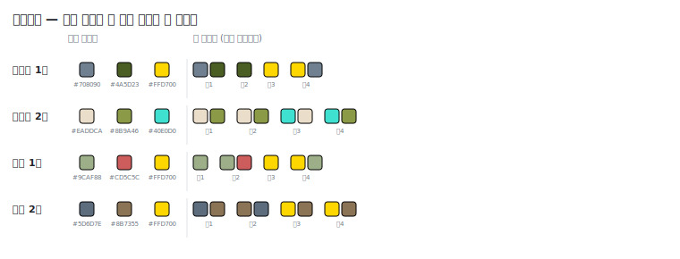
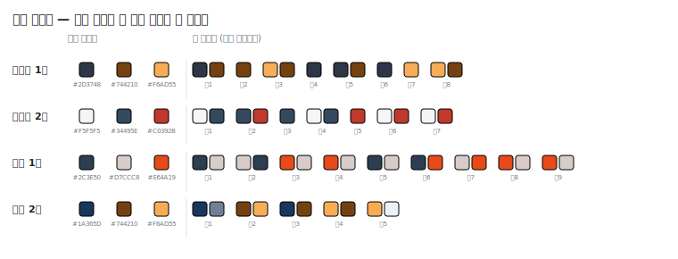
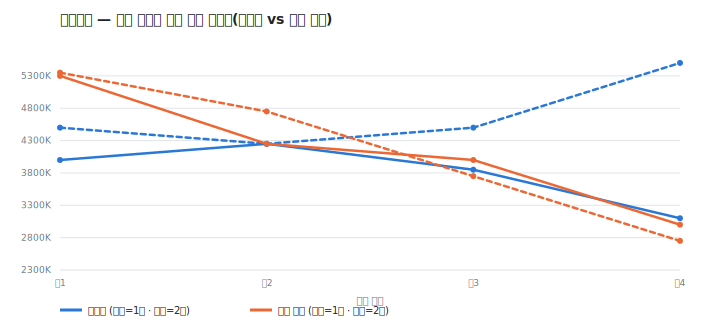
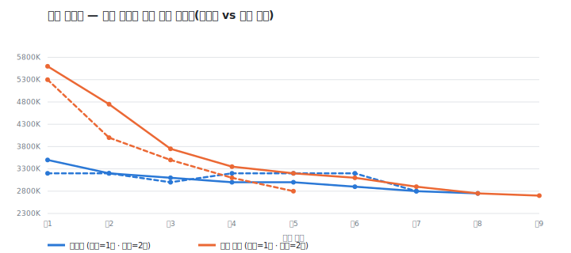

# E8b — 막별 배선을 이으면 화면 색이 작품 팔레트를 벗어나는지 검사

> **한 줄 결론: 이번 8회 실행에서는 벗어난 색이 한 건도 없었다 — 다만 그 이유의 절반은 "배선이
> 안전해서"가 아니라 "무배선 쪽도 이미 세계 팔레트를 알고 있어서"였다.** 이탈률 기준(10% 이하)은
> 가뿐히 통과했지만, E8이 보였던 "색 다양성이 늘어난다"는 효과는 진짜 세계 팔레트가 들어오자 거의
> 사라졌다 — 그래서 이번 결과를 "배선을 이어도 안전하다"는 뜻으로만 읽으면 절반만 맞는다. 최종
> 판정은 제품 오너 몫으로 남긴다.
>
> 실행일 2026-07-22 · 🟡 측정 완료 — 판정 대기 · 기술 재현 정보는 맨 아래 부록.

## 1. 무엇이 궁금했나

이전 실험(E8)에서 막마다 화면의 색·조명이 어떻게 바뀌어야 하는지 설계하는 단계(막별 비주얼 아크)의
결과물을, 지금까지 버려지던 것을 실제로 다음 단계(씬 촬영 계획)에 이어줬더니 장면마다 쓰는 색의
종류가 3가지에서 6~11가지로 훨씬 다양해졌다. 겉보기엔 좋은 신호였지만, 그 실험엔 구멍이 하나 있었다
— 작품 전체가 지켜야 할 "세계 팔레트"가 그때는 진짜로 만들어지지 않고 고정된 가짜 3색 대역으로
단순화돼 있었다. 그래서 "색이 늘어난 것"이 정말 세계 팔레트 안에서의 자연스러운 변주인지, 아니면
팔레트를 무시하고 제멋대로 색을 늘린 것인지를 그때는 가릴 수 없었다.

이번 실험은 그 구멍을 메운다: 실제로 세계 팔레트를 만드는 단계(월드 비주얼 디자인, v2)를 체인에
진짜로 연결하고, 그 실제 산출물을 기준으로 "씬마다 강조한 색이 세계 팔레트에서 너무 멀리 벗어났는가"
를 직접 잰다.

## 2. 판정 기준 — 실행 전에 정한 것

측정에 들어가기 전에 아래 두 기준과 그 조작화 방식을 먼저 고정했다.

**① 팔레트 준수(일관성).** 씬이 강조한 색 하나하나의 색상(색조, 빨강·파랑 같은 "어느 색 계열인가")을
세계 팔레트에 있는 색들과 비교한다. 세계 팔레트 색 중 가장 가까운 색과 색상 차이가 30도 이내이면
"팔레트 안에서의 변주", 30도를 넘으면 "이탈"로 판정한다. 채도가 낮아 거의 무채색(회색·베이지처럼
색감이 옅은 색)인 씬 강조색은 준수·이탈 어느 쪽도 아닌 "중립"으로 따로 센다 — 무채색은 색상 자체가
불안정해서 어느 계열이라고 판정하는 게 무의미하기 때문이다.

이때 하나 판단해야 했던 것: 세계 팔레트 자체의 기준색(주색·보조색·강조색) 중에도 채도가 낮은 색이
섞여 있을 수 있다. 이 경우는 반대로 처리했다 — 완전한 무채색(회색·흰색처럼 색상 정보가 전혀 없는
경우)만 비교 기준에서 제외하고, 채도가 낮더라도 색상 정보가 남아 있으면(예: 슬레이트빛 청회색) 그대로
비교 기준으로 살렸다. 세계 팔레트가 일부러 고른 차분한 톤을 "무채색이라 무효"로 지워버리면 비교
기준이 오히려 왜곡되기 때문이다. 이 비대칭 처리는 실행 전 기준 문구에 명시돼 있지 않던 세부 판단이라
아래 부록에 밝혀둔다.

색을 어떤 형식으로 비교할지도 실행 전엔 확정하지 못했다 — 세계 팔레트 산출물이 `#RRGGBB` 형태의 값으로
나올지, "슬레이트 블루"처럼 색 이름 서술로 나올지 실측 전엔 알 수 없었기 때문이다. 실제로 돌려보니
세계 팔레트와 씬 강조색 모두 `#RRGGBB` 형태의 값으로 일관되게 나왔다 — 색 이름 서술 대비표를 따로
만들 필요는 없었다.

**② 변주(진행) 유지.** E8에서 확인된 효과 — 막이 바뀔 때 조명 색온도가 벌어지는 정도, 그리고 장면
전체에서 쓰이는 색의 다양성 — 가 무배선 쪽보다 우세하게 유지되는지를 함께 확인한다.

## 3. 어떻게 실험했나

"기승전결(起承轉結) 프로브"와 "가족 드라마" 두 소재를 썼다(둘 다 4막 구조가 뚜렷해서 막별 변화가
가장 잘 드러난다 — E8과 같은 소재). 각 소재를 "무배선(현행 — 막별 설계는 만들어지지만 씬 촬영
계획에 직접 전달되지 않음)"과 "배선 주입(막별 설계를 씬 촬영 계획에 실제로 넣어줌)"으로 나눠 각
2번씩 돌렸다 — 총 8회.

E8과 다른 점 하나: 이번엔 두 조건 모두에서 월드 비주얼 디자인(세계 팔레트) 단계를 실제로 실행해서
그 진짜 산출물을 씬 촬영 계획에 넘겼다. E8은 이 단계를 고정된 가짜 3색으로 대체해뒀었다. 무배선
조건도 이 실제 팔레트를 받는다 — "무배선"이 의미하는 것은 막별 설계를 씬 촬영 계획에 직접 얹어주지
않는다는 것일 뿐, 세계 팔레트 자체는 두 조건 다 동일하게 실제로 만들어 넘긴다(이 부분은 원래
설계·현행 동작과 같다).

사전 판정 기준: 배선 주입 쪽의 이탈률이 10% 이하이고 ②(진행 효과)도 유지되면 "배선 복원 최종
권고(기준 충족)"로, 이탈률이 10%를 넘으면 "복원하되 씬 촬영 계획에 전역 팔레트 준수 지시를 추가해야
함"으로 기록하기로 미리 정했다. **이 기준을 어느 쪽으로 적용할지의 최종 판단(채택 여부)은 내리지
않고, 아래 4절의 실측 결과와 그 해석만 정직하게 남긴다.**

## 4. 무엇이 나왔나 — 출력 원문

**8회 전부 오류 없이 끝났다. 팔레트를 벗어난 색은 무배선·배선 주입 양쪽 다 0건이었다.**

| 소재·조건 | 세계 팔레트 실산출(주색/보조색/강조색) | 씬 강조색 판정(준수/이탈/중립) | 막간 색온도 격차 |
|---|---|---|---|
| 기승전결 · 무배선 1회 | `#708090` / `#4A5D23` / `#FFD700` | 4 / 0 / 2 | 1150K |
| 기승전결 · 무배선 2회 | `#EADDCA` / `#8B9A46` / `#40E0D0` | 8 / 0 / 0 | 1250K |
| 기승전결 · 배선 1회 | `#9CAF88` / `#CD5C5C` / `#FFD700` | 6 / 0 / 0 | 2300K |
| 기승전결 · 배선 2회 | `#5D6D7E` / `#8B7355` / `#FFD700` | 8 / 0 / 0 | 2600K |
| 가족 드라마 · 무배선 1회 | `#2D3748` / `#744210` / `#F6AD55` | 12 / 0 / 0 | 575K |
| 가족 드라마 · 무배선 2회 | `#F5F5F5` / `#34495E` / `#C0392B` | 8 / 0 / 4 | 400K |
| 가족 드라마 · 배선 1회 | `#2C3E50` / `#D7CCC8` / `#E64A19` | 18 / 0 / 0 | 2450K |
| 가족 드라마 · 배선 2회 | `#1A365D` / `#744210` / `#F6AD55` | 9 / 0 / 1 | 2500K |

> 위=세계 팔레트, 아래=각 장면이 실제로 쓴 강조색 — 대부분 동일 값 복사임이 눈으로 보인다.

**이탈률 종합(8회 합산):** 무배선 팔 — 준수 32건, 이탈 0건, 중립 6건 → **이탈률 0.0%**. 배선 주입
팔 — 준수 41건, 이탈 0건, 중립 1건 → **이탈률 0.0%**. 사전 기준(10% 이하)은 양쪽 다 통과했다.

### ②(진행 효과) — 색온도는 확실히 유지·증폭, 색 다양성은 거의 사라짐

막간 색온도 격차는 E8과 같은 방향으로, 오히려 더 크게 재현됐다. 기승전결 소재는 무배선 평균
1200K에서 배선 주입 평균 2450K로 약 2배, 가족 드라마 소재는 무배선 평균 488K에서 배선 주입 평균
2475K로 약 5배까지 벌어졌다. 실제로 무배선 쪽(가족 드라마 2회차)의 조명은 장면 내내 2800~3200K
사이에서만 오르내렸고, 배선 주입 쪽(가족 드라마 2회차)은 첫 장면 5300K에서 마지막 장면 2800K까지
뚜렷하게 떨어졌다.

> 파랑=무배선, 주황=배선 주입(실선=1회차·점선=2회차) — 배선 주입 쪽이 장면이 진행될수록 색온도를
> 훨씬 크게 벌린다.

반면 E8에서 가장 두드러졌던 "장면에서 쓰이는 색의 종류가 늘어난다"는 효과는 이번엔 거의 나타나지
않았다. 기승전결 소재는 무배선·배선 주입 양쪽 모두 전체 고유 색 수가 3가지로 완전히 같았고, 가족
드라마 소재도 무배선 3가지 대비 배선 주입 3~5가지로 소폭 늘었을 뿐이다(E8에서 관찰된 "3가지 →
6~11가지"의 폭과는 규모가 다르다). 이유는 뒤 5절에서 다룬다.

### 이탈이 0건인 이유를 뜯어보면 — "안전해서"보다 "그대로 베껴서"가 더 크다

8회·강조색 79개 인스턴스 중, 세계 팔레트 색과 정확히 같은 값이 아니면서도 30도 이내로 "진짜 변주"에
해당하는 경우는 **딱 1건**이었다. 가족 드라마 배선 주입 2회차의 마지막 장면(結, 여운)에서 강조색으로
쓰인 `#EDF2F7`(아주 옅은 하늘빛)이 세계 팔레트의 주색 `#1A365D`(짙은 남색)과 색상 차이 4.9도로
거의 같은 계열의 옅은 톤이었다. 그 장면의 의도 설명은 다음과 같았다:

> "부드럽게 퍼지는 온광과 넓은 화각을 통해 식사가 가져온 평화와 화해의 여운을 유지"

이 장면은 세계 팔레트의 남색을 그대로 쓰지 않고 그 남색 계열의 아주 밝은 톤을 새로 골라 썼다 — 이
실험이 원래 찾고자 했던 "팔레트 안에서의 변주"의 정확한 사례다. 하지만 나머지 78건은 전부 세계
팔레트의 `#RRGGBB` 값을 한 글자도 바꾸지 않고 그대로 복사해서 강조색으로 썼다. 예를 들어 기승전결
무배선 1회차의 씬 촬영 계획은 이렇게 나왔다(세계 팔레트: 주색 `#708090`, 보조색 `#4A5D23`,
강조색 `#FFD700`):

> 도입 장면 강조색 `["#708090", "#4A5D23"]` → 전개 장면 `["#4A5D23"]` → 전환 장면 `["#FFD700"]` →
> 결말 장면 `["#FFD700", "#708090"]`

세계 팔레트의 세 색을 그대로 재조합해서 순서만 바꿔 배치한 것이다. 이건 "±30도 이내인지"를 판정할
필요조차 없이 항상 준수로 떨어진다. 즉 이번 8회에서 관측된 이탈률 0%는 "±30도 허용 범위를 넉넉히
지키며 다양하게 변주했다"는 뜻이 아니라, **"애초에 그 허용 범위 자체가 거의 시험되지 않았다"**는
뜻에 더 가깝다.

여기에 더해, 무배선 쪽도 이탈률이 0%인 이유를 밝혀둘 필요가 있다. 무배선이라는 이름은 "막별 설계를
씬 촬영 계획에 직접 얹어주지 않는다"는 뜻일 뿐이다 — 씬 촬영 계획은 배선 여부와 무관하게 애초부터
세계 팔레트 자체를 참고 자료로 이미 받고 있다(3절에서 밝힌 대로 이번 실험은 두 조건 모두에 실제
세계 팔레트를 연결했고, 이건 원래 현행 동작과 같다). 그러니 무배선 쪽이 팔레트를 안 벗어난 것은
이번에 새로 검증한 "배선의 안전성" 때문이 아니라, 원래부터 있던 별개의 경로(세계 팔레트 자체 전달)
덕분이라고 보는 게 더 정확하다. 요컨대 이 실험의 이탈률 지표는 무배선과 배선 주입 두 조건을
가르지 못했다 — 둘 다 같은 이유(세계 팔레트 값을 그대로 복사하는 습성 + 세계 팔레트가 애초에 양쪽에
전달됨)로 0%가 나왔다.

## 5. 결론 (판정은 보류)

**사전에 정한 이탈률 기준(10% 이하)은 통과했다.** 하지만 그 통과가 "배선을 이어도 팔레트를 벗어날
위험이 낮다"를 얼마나 증명하는지는 회의적으로 봐야 한다 — 위에서 밝힌 대로 세계 팔레트를 벗어날
"기회" 자체가 이번 8회 실행에선 거의 주어지지 않았다(강조색을 세계 팔레트 값 그대로 복사하는 경향이
압도적이었다). 그리고 E8이 채택 전에 확인해보라고 남긴 질문 — "색 다양성이 늘어난 게 팔레트 안에서의
변주인지" — 에 대한 답은 이번 실측에서 "다양성 증가 자체가 진짜 세계 팔레트 앞에서는 거의 사라졌다"
로 나왔다. 다양성이 사라진 이유는 팔레트를 벗어나서가 아니라, 정해진 3색을 그대로 재사용하는 쪽으로
행동이 수렴했기 때문이다.

정리하면 이번 실측은 두 가지를 같이 보여준다: ① 팔레트 이탈이라는 위험은 사전 기준으로 봤을 때
낮다(0%, 다만 그 근거가 약하다는 단서와 함께) — ② 배선을 이었을 때의 진짜 효과는 "색이 다양해진다"
보다는 "막이 지날수록 조명 색온도가 뚜렷하게, 심지어 E8보다 더 크게 벌어진다"쪽에 남아 있다. 배선
복원을 판단할 때 내세울 근거로는 색 다양성보다 색온도 진행 효과 쪽이 이번 실측에서 더 튼튼하다.
사전에 정한 두 갈래("기준 충족 → 최종 권고" / "기준 미달 → 팔레트 준수 지시 추가 필요") 중 어느
쪽으로 단정하기보다, 이 사실 패턴을 그대로 제품 오너에게 넘긴다 — 특히 "다양성 효과가 사라진 것"을
어떻게 볼지(문제로 볼지, 오히려 더 안전해진 것으로 볼지)는 기술적으로 가를 수 없는 제품 판단이다.

---

## 기술 부록 (재현용)

- 모델: `gemini-3-flash-preview` · 실행: 서브에이전트(Sonnet) / 셋업: Claude(Fable)
- 실행 스테이지 체인(코드명): `narrativeStructure`(s1) → `scenes`(s3) → `visualIdentity`(v0) →
  `actVisualArc`(v1) → `v2Design`(v2) → `sceneCinematography`(v3). 주입 게이트 `WRITER_V3_ARC=1`
  (arc 팔만 설정, ctl 팔은 미설정) — v1 산출을 V3에 직접 얹는지 여부만 다르고, v2Design은 두 팔
  모두 v1의 실제 산출(`actVisualArc`)을 상속해 실행(프로덕션 배선과 동일).
- 하네스 변경: `tests/pipeline/writer_stage_experiment.test.ts`에 `v2Design` 스테이지를 신규
  등록하고, `sceneCinematography` 레지스트리 항목이 (실행됐다면) 그 실제 `worldVisual`을 쓰도록
  변경했다(미실행 시 기존 스텁으로 자동 폴백 — 다른 실험 회귀 없음). `src/lib/writer/pipeline/`
  프로덕션 코드는 수정하지 않았다(이미 `runV2Design`이 실 스테이지로 존재 — 하네스에서 호출 배선만
  추가). 변경 후 `npx tsc --noEmit` 클린 확인.
- 방법: 4막 기승전결 프리셋(`kishoten`, `family-jjigae`) × {ctl(무배선) vs arc(V3에 v1 주입)} × 2회
- 원시 로그: `logs/writer-stage-exp/{kishoten,family-jjigae}__{narrativeStructure,scenes,
  visualIdentity,actVisualArc,v2Design,sceneCinematography}__e8b{ctl,arc}{1,2}.json`
- 채점 스크립트: `tools/e8b_score.mjs` — hex(`#RRGGBB`) → HSL 변환 후 원형 색상각 최소거리로
  최근접 세계 팔레트 색을 찾고, 30도 이내면 준수(conform)/초과면 이탈(deviate)로 분류. 씬 강조색은
  채도 <15%면 무채색(neutral)으로 별도 집계(사전 기준 그대로). 세계 팔레트 자체의 기준색(anchor)은
  완전 무채색(채도=0, RGB 세 채널이 정확히 동일)일 때만 비교 대상에서 제외 — 씬 색과 달리 15% 문턱을
  적용하지 않은 것은 실행 중 판단(본문 2절 참조): 세계 팔레트가 의도적으로 고른 저채도 무드톤(예:
  `#708090` 슬레이트, 채도 12.6%)까지 앵커에서 빠지면 최근접 비교 자체가 왜곡되기 때문. 색 이름
  서술 대비표는 실측 결과가 전부 hex였으므로 구현하지 않았다(사전 기준의 조건분기 중 미해당 분기).
  이탈률은 (이탈 건수) / (준수+이탈 건수)로 계산 — 중립·미판정은 분모에서 제외.
- 판정 배경: 세션 리밋 해제 후 재개 지시(오케스트레이터 확인)에 따라 위 8회 실행분을 그대로 채점해
  본 문서를 작성함.
