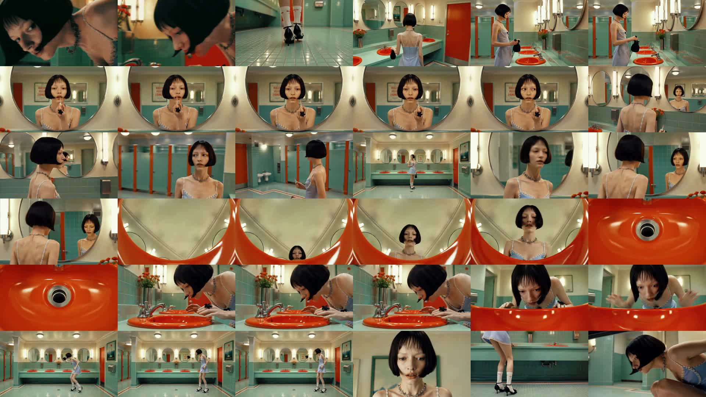
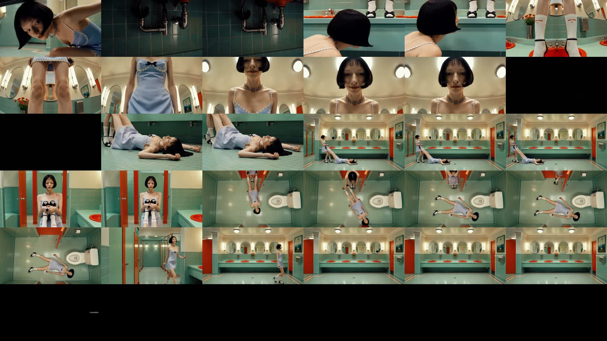
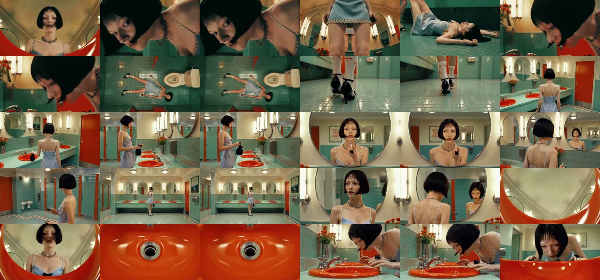
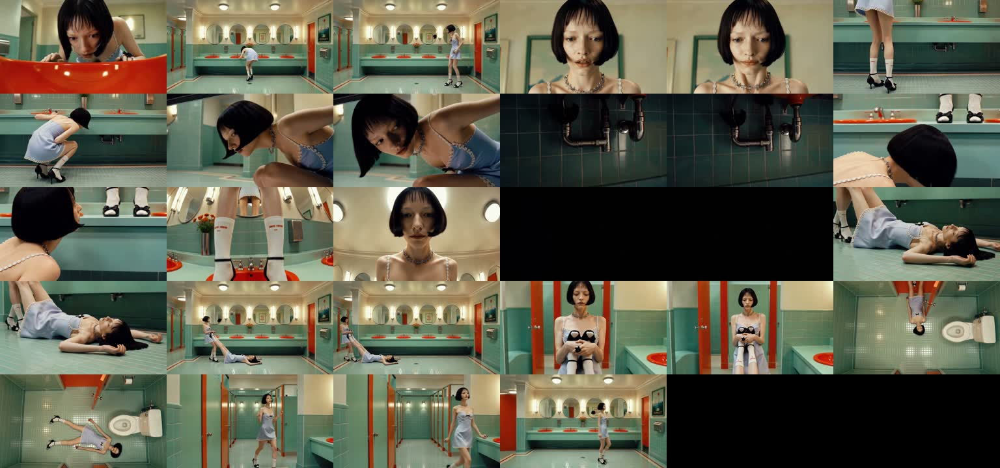

# 레퍼런스 해석 — "거울 앞의 소녀" (컷 편집인데 왜 연속으로 느껴지는가)

> **한 줄 결론: 이 영상의 연속성은 "샷을 길게 찍어서"가 아니라 "여러 샷이 같은 사건·같은 공간·같은
> 동작을 나눠 갖게 해서" 만들어진다.** 67초에 컷이 약 30개 — 우리 파이프라인보다 컷이 결코 적지 않다.
> 차이는 컷 수가 아니라, **사건 하나당 샷 수**다: 이 영상은 사건 8~9개를 샷 30개로 찍었고(사건당 3~4샷),
> 우리 파이프라인은 사건 1개당 샷 1개가 기본이라 모든 컷이 "새 사건으로의 점프"가 된다. 그게 "뚝뚝
> 끊기는" 느낌의 정체다.
>
> 해석일 2026-07-22 · 원본: `~/Downloads/ref/video_girls_in_mirror.mp4` (67초, 1280×720, 30fps) ·
> 방법: ffmpeg 컷 검출(약 30개) + 1초 간격 전체 시트 + 컷 경계 전후 프레임 쌍 판독

## 0. 영상 개요

파스텔 민트색 공중 화장실(주황 세면대·둥근 거울·대칭 구도, 웨스 앤더슨풍) 안에서 검은 단발의 소녀가
입장 → 거울 앞 립 바르기 → 공간 둘러보기 → 세면대에 몸 숙이기 → 바닥에 눕기 → 변기에 앉기(탑뷰) →
칸막이 사이로 퇴장 — **처음부터 끝까지 한 공간, 한 인물, 한 의상, 한 조명**이다.

전체 흐름 (1초 간격, 좌→우·상→하):

컷 경계 전후 프레임 쌍 (왼쪽=컷 직전, 오른쪽=컷 직후가 번갈아 배열):

## 1. 연속성이 만들어지는 다섯 가지 장치 (프레임 근거)

**① 불변 앵커 — 공간·의상·조명이 절대 안 바뀐다.**
모든 프레임이 같은 민트 타일, 같은 주황 세면대, 같은 꽃병, 같은 색온도다. 컷이 아무리 세게 튀어도
뇌가 0.1초 만에 "같은 장소, 같은 순간"으로 재고정한다. 연속성의 바닥은 편집이 아니라 **미술·조명의
일관성**이다. (우리 파이프라인에선 세계 팔레트(v2)와 막별 색·조명(v1)이 정확히 이 역할이다 — E8b에서
색이 팔레트 값 그대로 복사되던 것이 이 관점에서는 오히려 순기능.)

**② 사건 하나를 여러 샷이 나눠 갖는다 (사건당 3~4샷).**
"립 바르기" 하나가 [거울 정면 미디엄 → 입술 클로즈업 → 뒤통수 너머 거울 반사 → 옆얼굴]로 이어진다.
새 사건이 아니라 **같은 사건의 다른 앵글**이라서, 컷이 나가도 이야기가 점프하지 않는다. 이 영상의
컷 30개 중 "정말 새 사건으로 넘어가는 컷"은 8~9개뿐이고 나머지는 전부 같은 사건 안에서의 앵글 이동이다.

**③ 동작 이어받기 (매치 온 액션).**
컷 경계 시트를 보면, 컷 직전 프레임에서 시작된 동작(몸을 숙인다, 쪼그린다, 손을 뻗는다)이 컷 직후
프레임에서 **같은 동작의 다음 위상 + 다른 앵글**로 이어진다. 예: 세면대로 몸을 숙이는 미디엄 샷 →
세면대 테두리 너머로 내려다보는 얼굴 클로즈업. 동작이 컷을 "관통"하기 때문에 편집이 보이지 않는다.
중요한 것: **프레임이 일치하는 게 아니라 동작의 위상이 이어지고, 앵글은 반드시 크게 바뀐다**(같은
앵글에서 프레임만 이으면 컷이 아니라 점프컷처럼 보인다).

**④ 마스터 샷 후렴구 — 같은 넓은 구도로 주기적으로 복귀.**
화장실 전체가 보이는 대칭 와이드 샷이 영상 내내 4~5번 반복해서 돌아온다. 클로즈업·탑뷰로 아무리
돌아다녀도 이 "후렴 구도"가 공간 지도를 리셋해 주니까 관객이 길을 잃지 않는다.

**⑤ 정적 인서트는 쉼표로 쓰인다 — 정적인 게 문제가 아니라 자리가 문제다.**
배수구 클로즈업, 세면대 배관, 타일 위 구두 같은 완전 정지 샷들이 사건과 사건 사이에 박자 조절용으로
들어간다. 같은 공간의 디테일이라 연속성을 깨지 않으면서 호흡을 만든다. — 즉 "정적 샷이 많아서
끊긴다"가 아니라, **모든 샷이 저마다 다른 사건을 하나씩 들고 있어서** 끊기는 것이다.

**⑥ (보너스) 컷 리듬의 형태.**
도입 1.6초에 컷 5개(얼굴·구두·타일 플래시 몽타주 훅) → 본편은 2~3.5초 간격 → 넓은 대칭 구도나 바닥에
눕는 장면에서만 5초 이상 길게 끈다. 롱테이크는 30샷 중 4개뿐 — "한 호흡"의 느낌조차 롱테이크가 아니라
리듬 배치로 만든다.

## 2. 파이프라인으로의 번역 (E9d 설계 입력)

| 레퍼런스의 장치 | 지금 파이프라인 상태 | 필요한 것 |
|---|---|---|
| 사건당 3~4샷 (앵글 커버리지) | 사건(비트)당 샷 1개가 기본 — 모든 컷이 새 사건 | 샷 나누기가 **"연속 샷 클러스터"**(같은 사건을 나눠 갖는 샷 묶음)를 설계하게 |
| 동작 이어받기 | 샷마다 독립된 동작 서술 — 컷을 관통하는 동작 없음 | 클러스터 안에서 샷 N의 끝 동작 위상 = 샷 N+1의 시작 위상 (앵글은 강제 변화) |
| 불변 앵커(미술·조명) | 세계 팔레트·막별 아크 이미 존재 (E8b: 팔레트 복사 성향) | 유지 — 이미 강점 |
| 마스터 샷 후렴 | 없음 | 씬당 마스터 구도 1개 지정, 주기 복귀 |
| 정적 인서트 = 쉼표 | 정적 샷이 사건 자리에 옴 | 인서트를 사건 사이 박자로 배치 (E9b B팔의 "추가 샷"이 이미 이 방향) |

**오너가 낸 3안과의 대조**: ① "샷 합쳐서 길게 생성"은 레퍼런스에선 소수(30샷 중 4개 홀드)에만 해당 —
전면 적용보다 클러스터 안 하이라이트용. ② "샷1 엔드 프레임 = 샷2 스타트 프레임"은 방향이 맞는데
레퍼런스가 보여주는 정답은 **프레임 일치가 아니라 동작 위상 연결 + 앵글 점프**다(프레임을 그대로
이으면서 앵글이 같으면 점프컷이 됨). ③ "원테이크 용어"는 이 레퍼런스와는 결이 다르다 — 이 영상은
롱테이크 없이 컷 편집만으로 연속감을 만든 사례라서, ③보다 ①②(+저작 문법)가 우선순위가 높아 보인다.

**따라서 E9d의 제안 구조**: 1단계(저작) — 샷 나누기/설계가 연속 샷 클러스터·동작 이어받기·마스터
후렴·인서트 배치를 산출하게 하는 문법 실험(텍스트, 저비용). 2단계(생성) — 클러스터 내부를 ②동작
이어받기 체이닝 vs ①묶음 롱 생성으로 실제 클립 비교(영상 생성 비용, 오너 확인 후).

---

## 기술 부록

- 추출: ffmpeg 컷 검출 `select='gt(scene,0.30)'` → 29개 지점 / 1fps 전체 프레임 67장 → 6×6 타일 시트 2장 /
  컷 경계 t−0.14s·t+0.07s 프레임 쌍 58장 → 6×5 타일 시트 2장
- 원본 프레임·시트: 세션 스크래치패드 생성 후 `assets/girls-in-mirror/`로 복사 (시트 4장만 보존)
- 컷 지점(초): 0.37, 0.63, 1.2, 1.5, 1.63, 2.73, 3.87, 5.77, 11.3, 14.73, 16.17, 19.47, 23.1, 24.67,
  27.73, 29.5, 33.03, 34.07, 35.47, 37.17, 38.67, 41.47, 46.97, 48.77, 50.77, 53.5, 55.9, 60.9, 61.8
- 한계: 오디오 미청취(컷-비트 정합은 미확인), scene 검출 임계 0.30 기준이라 아주 부드러운 디졸브형
  전환은 누락 가능. 교차검증(영상 해석 API)은 승인돼 있으나 이번 1차 해석에는 미사용 — E9d 설계
  확정 시 샷 경계 검증용으로 사용 예정
- 관련: E9d 카드(`../experiments/utils/campaign-2607/plan.md` Phase 5), 오너 피드백 메모리
  (연출 품질 최우선)
