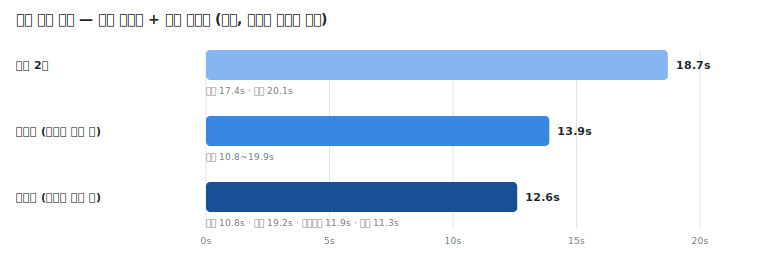

# E13b — 구조 정하기와 장면 나누기 병합, 정식으로 만들어 다시 검사

> **한 줄 결론: 정식판이 근사 실험에서 났던 장소 오염을 뒷정리 코드로 되돌려 열한 번 전부 깨끗했고,
> 접합부 오류 0·구조 프로브 전부 정답·시간 약 3분의 1 절감이 유지됐다 — 사전 기준 네 항목을 모두
> 충족해 채택을 상신 권고한다(판정은 제품 오너).**
>
> 실행일 2026-07-22 · 🟡 측정 완료 — 판정 대기(판정은 제품 오너) · 기술 재현 정보는 맨 아래 부록.

## 1. 무엇이 궁금했나

writer는 이야기를 받으면 먼저 **구조 결정**(3막극인지·기승전결인지·순환형인지, 그리고 그 구조를
이루는 막이 몇 개고 각각 무슨 역할인지)을 하고, 곧이어 **장면 나누기**가 그 막들을 실제 장면
목록으로 쪼갠다. 두 일은 항상 붙어 실행되고 장면 나누기는 늘 방금 정한 막을 참조한다 — 같은
판단의 연장인데 지금은 AI에게 두 번 따로 시킨다.

앞선 근사 실험에서, 이 두 지시를 하나로 합쳐 **한 번에** 시키면 접합부 오류(구조가 만든 막을
장면이 하나도 안 쓰고 빠뜨리는 일)가 여덟 번 실행 모두에서 사라지고 시간도 약 4분의 1 줄었다.
다만 그 근사 실험은 프롬프트만 합친 것이라, 정식 장면 나누기 코드가 하던 **뒷정리**(장소 표기를
올바른 이름으로 되돌리기, 시간 예산 맞추기 같은 것)를 아직 옮기지 않은 상태였다. 그래서 근사판은
한 군데에서 장소 이름이 오염된 채로 새어나왔다.

이번 실험의 질문은 셋이다. **첫째**, 그 뒷정리까지 전부 옮겨 정식으로 만들면 근사판에서 났던 장소
오염이 정말 사라지는가(뒷정리 이관이 됐다는 증명). **둘째**, 접합부 오류 0과 시간 절감이 정식판에서도
유지되는가. **셋째**, 근사 실험에서 딱 한 번 관측됐던 "광고 소재가 3막극 대신 다른 구조를 고르는"
흔들림이 병합 고유의 문제인지 — 표본을 늘려 분포를 본다.

## 2. 무엇을 넣었나 — 입력 원문

네 가지 소재를 썼다. 그중 둘을 인용한다.

**입력 ① 브랜드 광고 (30초)** — 구조 선택 분포를 보려고 다섯 번 반복한 소재.

> 새 러닝화를 신은 러너가 아직 어두운 새벽 도시를 가른다. 숨이 턱까지 차오르는 순간, 신발 밑창이
> 은은히 빛나며 그를 한 발 더 멀리 밀어준다. 골목을 빠져나오자 강변 끝에서 해가 떠오르고, 그는
> 결승선 대신 그 빛을 향해 달린다.

**입력 ② 순환 프로브 (물방울 루프, 15초)** — 근사 실험에서 장소 오염이 실제로 났던 바로 그 소재.

> 물방울 하나가 수면에 떨어져 파문이 퍼진다. 파문의 동심원이 유리창의 빗방울 무늬로 번지고,
> 빗방울이 유리를 타고 흘러내리다 창틀 끝에 맺혀 다시 처음의 물방울로 떨어진다. 끝 프레임이 첫
> 프레임과 정확히 이어지는 무한 루프 영상.

②는 "끝이 처음으로 다시 이어져야만 성립"하는 이야기라 순환 구조가 정답이고, 이 소재의 유일한
장소는 이름이 "창가의 수면"이지만 내부 식별자는 따로 있다 — 근사 실험에서 AI가 그 장소를
`창가의 수면`이라는 표시명과 식별자를 붙여 통째로 베껴 오염이 났던 함정 지점이다. 나머지 두 소재는
원장 밀도 프로브(고정 소품·고정 결말·인물 남발 감시)와 저깊이 기승전결 프로브다.

## 3. 어떻게 실험했나

**병합 정식팔**: 근사 실험에서 실측한 "현행 구조 결정·장면 나누기 지시문의 기계적 결합" 프롬프트를
**그대로** 쓰되(재현성), 근사판이 빠뜨렸던 장면 나누기의 뒷정리 코드를 전부 정식 스테이지로 옮겼다 —
장소 정규화, 장소 표기 오염 복원, 막 커버리지 교정, 시간 예산 검증·교정, 대표 스토리보드 여부 표시.
정식 통합에 필요한 최소 수정만 가했고, 무엇을 바꿨는지는 아래 "정식화하며 바꾼 것"에 전부 적었다.
프로덕션 기본 경로는 손대지 않았다 — 병합은 스위치 뒤에서만 켜지고, 스위치를 끄면 지금과 똑같이
두 번에 나눠 실행한다.

**참조치**: 근사 실험의 여덟 번(장소 오염이 났던 그 데이터)과, 현행 두 번 나눠 실행하는 방식의 기존
저장 데이터를 나란히 놓고 대조했다.

**반복 횟수**: 네 소재 × 각 2회(=8) + 광고 소재만 구조 선택 분포를 보려고 3회 더(광고 총 5회).

**정식화하며 바꾼 것 (임의 개선 아님 — 정식 통합에 필요한 최소 수정)**:
1. **뒷정리 이관** — 근사판엔 없던 장면 나누기 코드의 뒷정리를 전부 옮겼다(이번 실험의 핵심).
   특히 장소 정규화는, 현행 코드가 "식별자를 표시명으로 바꿔 쓴 경우"는 되돌리지만 "식별자와
   표시명을 괄호로 붙여 통째로 베낀 경우"(근사 실험에서 실제로 났던 오염)는 못 되돌리는 잠복
   구멍이 있었다. 그래서 병합 스테이지에는 그 괄호 표기까지 원래 식별자로 되돌리는 한 겹을 더 얹었다.
   (이 잠복 구멍은 현행 두 번 실행 방식에도 그대로 있다 — 별도 개선 후보로 기록.)
2. **교정은 구조를 고정하고 장면만** — 막 누락이나 예산 위반으로 다시 시킬 때, 이미 정한 구조는
   그대로 두고 장면만 다시 배분하게 했다(구조 재결정 금지). 이는 현행 장면 나누기 교정이 구조를
   고정하는 것과 같은 방식이다.
3. **예산표는 막 수를 모른 채 계산** — 병합은 구조와 장면을 한 번에 내므로 계산 시점엔 막 수를 아직
   모른다. 근사 실험과 똑같이 막 하한 없이 예산을 계산하고, 막 하한은 프롬프트의 커버리지 규칙으로
   대체했다. (현행 두 번 방식은 이미 정해진 실제 막 수를 쓴다.)

**체크포인트를 어떻게 다시 설계했나 (근거)**: 병합은 한 번의 호출로 구조와 장면을 함께 낳는데,
파이프라인의 나머지와 재실행 단위는 여전히 "구조 저장분"과 "장면 저장분"이 각각 따로 있다고
전제한다. 그래서 병합 스테이지는 한 번에 받은 결과를 **두 저장 슬롯에 모두** 기록하도록 했다 —
구조 저장분에 구조를, 장면 저장분에 장면을 넣는다. 이렇게 하면 하류 단계(밑그림·비주얼·샷)는 병합이
켜졌는지 전혀 몰라도 예전과 똑같이 두 슬롯을 읽어가고, 중간에 실패해 재개할 때도 "구조는 있고 장면만
없는" 어정쩡한 상태가 생기지 않는다(둘은 늘 함께 쓰이고 함께 저장되므로). 병합이 켜지면 장면 나누기
단계는 이미 채워진 걸 보고 조용히 건너뛰므로 재실행 단위가 하나로 굵어지고, 이는 근사 실험이 지적한
"저장 단위가 굵어지는 트레이드오프"를 의도적으로 받아들인 설계다 — 두 판단이 원래 한 판단이었기
때문에 함께 실패하고 함께 다시 하는 것이 오히려 정합적이다.

**사전 판정 기준 (실행 전에 확정 — 아래는 실행 전 기록)**:
- 접합부 오류(막을 빠뜨림)가 여덟 번 배터리 전부 0이고,
- 장소 표기 오염이 여덟 번 배터리 전부 0이고(뒷정리 이관 증명),
- 구조 프로브(기승전결·순환)의 구조 선택이 전부 정답이고,
- 시간 절감(근사 실험의 약 4분의 1)이 유지되면
→ **"채택 상신" 권고**. 넷 중 하나라도 미달이면 미달 항목과 원인 분석을 기록하고 **권고 보류**.
채택·미채택 판정은 내리지 않는다(제품 오너의 몫). 나머지 지표(총 러닝타임 오차·장면 시간배정
비례성·인물 남발·광고 구조 분포)는 "합쳐서 품질이 나빠지지 않았는가"를 보는 보조 지표다.

## 4. 무엇이 나왔나 — 출력 원문

**열한 번 실행 전부 에러 없이 성공.** 사전에 정한 판정 기준 네 항목이 모두 충족됐다.

| 무엇을 봤나 | 병합 정식판 | 근사 실험(뒷정리 없음) | 현행 두 번 나눠 실행 | 해석 |
|---|---|---|---|---|
| 접합부 오류(막을 빠뜨림) | **0 / 8** | 0 / 8 | 0 | 병합의 구조적 이점 유지 |
| 장소 표기 오염 | **0 / 8** | 순환 프로브 양 회차 오염 | 0 | **뒷정리 이관 증명 — 근사판 오염이 정식판에서 사라짐** |
| 구조 프로브 정답(기승전결·순환) | **4 / 4** | 4 / 4 | 참조상 정답 | 병합이 구조 선택을 꺾지 않음 |
| 총 러닝타임 오차 | 전부 0.0% | 0.0% | 0.0% | 동등 |
| 장면 시간배정 비례성(중앙값) | 0.38~0.92 | — | 0.58~0.92 | 동등 대역(순환 프로브 0.38은 15초 루프 특성, 근사 실험과 동일 설명) |
| 인물 남발(원장 프로브 새 인물 수) | **0** | 0 | 0 | 동등 — 고정 캐스트로 완결 |
| 실행 시간(평균) | **약 12.6초** | 약 13.9초 | 약 18.7초 | **약 3분의 1 절감 유지(뒷정리를 얹고도 느려지지 않음)** |

> 현행 두 번 나눠 실행 → 근사판(뒷정리 이관 전) → 정식판(뒷정리 이관 후) 순으로 평균 실행 시간이
> 줄어든다.

**장소 오염이 사라진 것을 실제 출력으로 본다 — 이번 실험의 핵심.** 순환 프로브(물방울 루프)를
병합 정식판으로 돌렸을 때, 모델이 **한 번의 응답에서 내놓은 날것 그대로**는 근사 실험과 똑같이
오염돼 있었다:

> 모델 원출력(장면 세 개의 장소): `"location (창가의 수면)"`, `"location (창가의 수면)"`, `"location (창가의 수면)"`

즉 오염은 병합이라는 아이디어의 결함이 아니라 모델이 로케이션 목록 표기를 통째로 베끼는 버릇에서
온 것이라, 근사판이든 정식판이든 **모델 출력 단계에선 똑같이 발생한다**. 차이는 그다음이다. 정식판에는
장면 나누기의 뒷정리(장소 정규화 + 이번에 얹은 괄호 오염 복원)가 붙어 있어, 같은 실행의 최종 산출은
깨끗한 식별자로 되돌아왔다:

> 정식판 최종 산출(장면 세 개의 장소): `location`, `location`, `location` — 세 장면 모두 원래 식별자로 복원.
> (추가 재호출 없이 코드 후처리로 복원 — 이 실행의 LLM 호출은 1회뿐.)

같은 응답 안에서 구조와 장면이 함께 나온 모습도 그대로 확인된다. 이 회차는 순환(circular) 구조로 막
셋 — 시작(파문의 발생) → 변형(수면에서 유리창으로) → 되돌림(다시 떨어져 루프 재시작) — 을 정하고,
곧바로 이어지는 장면 셋이 그 막을 하나씩 정확히 참조한다(빠지는 막 0). 두 판단이 분리될 여지 없이 한
응답으로 묶여 나오는 것이 접합부 오류가 구조적으로 사라지는 이유다.

**시간**: 병합 정식판은 소재별로 광고 약 10.8초, 원장 약 19.2초, 기승전결 프로브 약 11.9초, 순환
프로브 약 11.3초로, 열한 번 평균 약 12.6초였다. 현행 두 번 나눠 실행하는 방식의 참조치(광고 약
17.4초·원장 약 20.1초, 전체 평균 약 18.7초)와 견주면 약 3분의 1이 줄었다. 중요한 점은, 이번엔
뒷정리(장소 복원·커버리지·예산 검증)를 전부 얹었는데도 **막 커버리지 교정이나 예산 교정 재호출이 열한
번 중 한 번도 발동하지 않아**(전부 단일 호출), 뒷정리가 시간을 갉아먹지 않았다는 것이다. 근사 실험의
절감이 정식판에서 그대로 유지됐다.

### 발견·주의 1건

- **[관찰] 광고 소재의 구조 선택 흔들림 — 표본 확대 결과**: 구조 분포를 보려고 광고를 다섯 번 돌린
  결과 네 번은 3막극, 한 번은 영웅의 여정으로 나왔다(5분의 1). 근사 실험에선 두 번 중 한 번이
  영웅의 여정이었고, 현행 두 번 방식의 기존 세 번은 전부 3막극이었다. 광고 소재는 "한계를 넘어 빛을
  향해 달리는" 이야기라 영웅의 여정으로도 읽힐 여지가 있어(정답이 하나로 정해진 프로브가 아니다)
  명백한 오류로 보긴 어렵지만, 병합 쪽에서 이 변주가 조금 더 자주 보이는 경향은 남는다. 정답이 분명한
  구조 프로브(기승전결·순환)는 네 번 전부 정답이었으므로, 병합이 구조 판단 자체를 망가뜨리는 것은
  아니다. 계속 지켜볼 지점으로 남긴다(근사 실험의 주의사항과 동일 결).

## 5. 결론과 권고 (판정은 보류)

**사전에 정한 네 기준을 모두 충족했다.** ① 접합부 오류가 여덟 번 배터리 전부 0, ② 장소 표기 오염이
여덟 번 배터리 전부 0(근사 실험에서 났던 오염이 뒷정리 이관으로 사라짐을 같은 실행의 날것 출력↔최종
산출 대조로 실증), ③ 구조 프로브가 네 번 전부 정답, ④ 시간 절감(약 3분의 1)이 뒷정리를 얹고도
유지됐다(교정 재호출 0회). 따라서 사전 기준에 따라 **"채택 상신"을 권고한다.**

다만 **채택·미채택 판정은 제품 오너의 몫**이며 여기서는 내리지 않는다. 판정 시 함께 고려할 참고 사항:

- **광고 구조 변주**(§4 발견): 병합 쪽에서 광고가 3막극 대신 영웅의 여정을 고르는 빈도가 다섯 번 중 한
  번 관측됐다. 정답이 정해진 프로브는 전부 정답이라 병합 고유의 결함으로 단정할 수 없으나, 소프트
  소재의 구조 안정성은 계속 관찰할 지점이다.
- **잠복 구멍 발견**(부록): 현행 장소 정규화가 "식별자(표시명)" 괄호 통째 복사를 못 되돌리는 구멍은
  현행 두 번 실행 경로에도 그대로 있다. 병합 정식판은 이 구멍을 메우는 한 겹을 더 얹었지만, 현행
  경로의 같은 구멍은 별도 개선 후보로 남는다(개선 백로그).
- **체크포인트 트레이드오프**: 병합은 구조·장면을 한 저장 단위로 묶어 재실행 비용이 굵어진다(§3
  체크포인트 근거). 두 판단이 원래 한 판단이라 함께 실패·재실행하는 것이 정합적이라고 봤으나, 이
  트레이드오프의 수용 여부도 판정에 포함될 사항이다.

채택된다면 스위치(기본 off)를 기본 경로로 승격하고, 현행 두 번 실행하는 코드 경로를 정리하는 후속
작업이 따른다.

---

## 기술 부록 (재현용)

- 실행/셋업: 서브에이전트(Executor) · 모델 gemini-3-flash-preview
- 병합 정식 스테이지: `src/lib/writer/pipeline/stages/s1s3_merged.ts` (`runStructureScenesMerged`) —
  현행 `s1_structure`/`s3_scenes` 시스템프롬프트의 기계적 결합 프롬프트 + `s3_scenes` 후처리 이관
  (`normalizeSceneLocations`·`uncoveredActs` export 재사용 + 괄호 오염 복원 `normalizeLocationParentheticals`
  + `validateSceneBudget` 교정 + `coverage_mode`). 예산 주입·검증은 `computeSceneBudget(genre, 1)`.
- 체크포인트 배선: `src/lib/writer/pipeline/steps.ts` `narrativeStructure` step 에 env 게이트
  `WRITER_MERGE_S1S3=1` — 병합 1콜 산출을 `narrativeStructure`/`scenes` 두 슬롯에 기록,
  `scenes` step 은 `has()=true` 로 투명 skip. 기본(게이트 off)은 현행 2콜 그대로.
  (부수: 게이트 on 이면 `scenes` step 이 skip 되어 진행률이 총 단위−1 로 표시됨 — 게이트 실험 경로 한정.)
- 하네스 스테이지: `tests/pipeline/writer_stage_experiment.test.ts` `structureScenesMergedFormal`
  (실 함수 호출) — run-id 접미사 `WRITER_RUN_ID` 추가(로그 파일 구분).
- 실행 커맨드(예): `set -a && source .env.local && set +a && RUN_WRITER_STAGE=1 WRITER_INPUT=<preset>
  WRITER_STAGES=structureScenesMergedFormal WRITER_RUN_ID=e13b<r> npx vitest run
  tests/pipeline/writer_stage_experiment.test.ts --disable-console-intercept`
- 원시 로그: `logs/writer-stage-exp/<preset>__structureScenesMergedFormal__e13b{1..}.json`
- 참조 로그: 근사판 `*__structureScenesMerged__e13m{1,2}.json` · 현행 2콜 `*__{narrativeStructure,scenes}__e1A{1..3}.json`(광고·원장) / `*__narrativeStructure__run{1..3}.json`(프로브)
- 채점 스크립트: `research/writer/experiments/tools/e13b_score.mjs` — 지표 ①막 커버리지 ②장소 오염
  ③구조 정확 ④M1(runtime 편차) ⑤인물 남발 ⑥시간 ⑦구조 분포를 원시 로그에서 재계산.
- 독트린 연결: P6(암산 위임 제거 — 예산 검증 이관) · 아키텍처 §3(모델은 제안, 검증은 제품 — 장소
  정규화) · §5(빌드 독립·합류는 하류 — 체크포인트 두 슬롯 기록)
- 발견: 현행 장소 정규화가 "식별자(표시명)" 괄호 통째 복사를 못 되돌리는 잠복 구멍 — 현행 2콜
  경로에도 존재. 개선 후보로 기록(I5 계열).

<!-- 작성 규칙: 본문에 코드 식별자·스크립트명·지표 ID·env 변수 금지(전부 부록). 실제 입력/출력 원문 인용. -->
